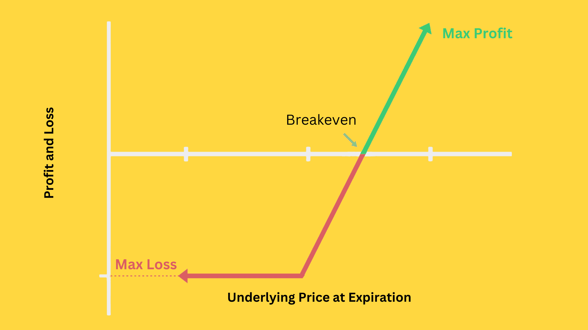

## Table of Contents

## What is a fiduciary call?

A fiduciary call is a type of financial agreement where one person, called a fiduciary, manages money or assets for someone else. The fiduciary has a legal duty to act in the best interest of the person they are helping, called the beneficiary. This means they must be careful and honest in how they handle the money or assets.

In a fiduciary call, the fiduciary might be asked to make decisions about investments or other financial matters. They need to make sure these decisions help the beneficiary and do not benefit themselves. This trust is important because the beneficiary relies on the fiduciary to look after their interests.

## How does a fiduciary call work?

A fiduciary call works when someone, called a fiduciary, is given the job to take care of another person's money or property. This other person is called the beneficiary. The fiduciary has a big responsibility to always do what is best for the beneficiary. They need to be very careful and honest in all their decisions. For example, if the beneficiary's money is invested, the fiduciary must choose investments that are good for the beneficiary, not for themselves.

When a fiduciary call is set up, the fiduciary might have to make many different decisions. They could be choosing where to invest money, paying bills, or even selling property. No matter what they do, they must always think about what is best for the beneficiary. If they do not follow these rules, they can get in big trouble. The whole point of a fiduciary call is to make sure the beneficiary's money and property are safe and used wisely.

## What are the key components of a fiduciary call?

A fiduciary call involves a few important parts. First, there is the fiduciary, who is the person in charge of managing someone else's money or property. They have to be very careful and always do what is best for the person they are helping, called the beneficiary. The fiduciary has a big responsibility to be honest and to make smart choices that help the beneficiary.

The second part is the beneficiary, who trusts the fiduciary to take care of their money or property. The beneficiary relies on the fiduciary to make good decisions and to keep their interests safe. The whole idea of a fiduciary call is to make sure the beneficiary's money and property are handled well and used in a way that benefits them. If the fiduciary does not do their job properly, they can face serious consequences.

## Who typically uses fiduciary calls?

Fiduciary calls are often used by people who need help managing their money or property. This can include older people who might need someone to take care of their finances because they can't do it themselves anymore. It can also be used by people who are very busy or who just want to make sure their money is being handled the right way. For example, if someone inherits a lot of money, they might use a fiduciary to help manage it.

Sometimes, fiduciary calls are used by people who have a disability or illness that makes it hard for them to manage their own money. In these cases, a family member or a professional might be chosen to be the fiduciary. This helps make sure the person's money is safe and used in a way that helps them. No matter who uses a fiduciary call, it's all about making sure the beneficiary's interests are taken care of by someone they can trust.

## What are the benefits of using a fiduciary call?

Using a fiduciary call has many benefits. It helps people who can't manage their own money or property because they are too old, sick, or busy. A fiduciary can take care of all the financial decisions for them. This means the person does not have to worry about making mistakes with their money. The fiduciary is there to make sure everything is done right and in the best way for the person they are helping.

Another benefit is that a fiduciary has to be very careful and honest. They have a big responsibility to always think about what is best for the person they are helping. This gives the person peace of mind knowing that their money and property are in good hands. If something goes wrong, the fiduciary can be held responsible, which adds an extra layer of protection for the person's finances.

## What are the potential risks associated with fiduciary calls?

One risk of using a fiduciary call is that the fiduciary might not always do what is best for the person they are helping. Even though they are supposed to be honest and careful, sometimes fiduciaries can make bad choices or even try to use the money for themselves. This can lead to big problems for the person who trusted them with their money.

Another risk is that the person might not know if the fiduciary is doing a good job. It can be hard to keep track of all the decisions the fiduciary makes, especially if the person is not able to check on things themselves. If the fiduciary is not doing their job right, it might take a long time to find out, and by then, some of the money might be gone.

## How does a fiduciary call differ from a regular call option?

A fiduciary call is not the same as a regular call option. A fiduciary call is when someone, called a fiduciary, is in charge of managing another person's money or property. The fiduciary has to be very careful and always do what is best for the person they are helping, called the beneficiary. They need to make sure all decisions help the beneficiary and not themselves. This is important because the beneficiary trusts the fiduciary to look after their interests.

A regular call option, on the other hand, is a type of financial agreement used in the stock market. It gives the person who buys it the right, but not the obligation, to buy a certain stock at a set price before a certain time. It is a way to bet on whether a stock's price will go up or down. Unlike a fiduciary call, a regular call option does not involve managing someone else's money or property; it's just a financial tool used for trading.

## Can you provide an example of a fiduciary call in action?

Imagine an older person named Sarah who is having a hard time managing her money because she is getting older. Sarah decides to set up a fiduciary call with her son, John. John becomes the fiduciary and is now in charge of taking care of Sarah's money. He pays her bills, makes sure her investments are doing well, and even helps her with her taxes. John always tries to do what is best for Sarah and never uses her money for himself. This helps Sarah feel safe and taken care of because she knows John is looking out for her.

In another example, there is a young man named Mike who got a big inheritance but doesn't know how to handle it. Mike hires a professional fiduciary named Lisa to help him. Lisa takes over managing Mike's money and makes sure it is invested wisely. She also helps Mike plan for his future and teaches him about money management. Mike feels relieved because he knows Lisa is working hard to make sure his money is safe and growing. Lisa always keeps Mike's best interests in mind and never makes decisions that would only benefit herself.

## What are the legal and regulatory considerations for fiduciary calls?

When it comes to fiduciary calls, there are important legal and regulatory rules that must be followed. The main rule is that the fiduciary has to act in the best interest of the beneficiary. This is called a fiduciary duty. There are laws that say the fiduciary cannot use the beneficiary's money for themselves and must be very careful with all decisions they make. If the fiduciary does not follow these rules, they can be in big trouble. They might have to pay back any money they used wrongly, and they could even face legal action.

Different places might have different rules about how fiduciary calls work. Some states or countries have special laws that say how fiduciaries should behave and what they need to do to keep the beneficiary's money safe. These laws might require the fiduciary to keep good records, report regularly to the beneficiary or a court, and sometimes get approval for big decisions. It's important for both the fiduciary and the beneficiary to know these rules so they can make sure everything is done right and the beneficiary's money is protected.

## How do fiduciary calls fit into broader financial planning strategies?

Fiduciary calls are an important part of financial planning because they help people manage their money when they can't do it themselves. If someone is too old, sick, or busy, a fiduciary can step in to take care of their finances. This means the fiduciary will pay bills, handle investments, and make other money decisions for the person. By using a fiduciary, the person can feel safe knowing their money is being looked after by someone who has to do what is best for them.

Including a fiduciary call in a financial plan can also help protect the person's money for the future. The fiduciary can help plan for things like retirement, buying a house, or saving for emergencies. They can make sure the money is invested in a way that will grow over time and help the person reach their goals. This way, the person can focus on other things in their life, knowing their financial future is in good hands.

## What advanced strategies can be employed with fiduciary calls?

Advanced strategies with fiduciary calls can help people make the most of their money. One strategy is to use the fiduciary to set up a diversified investment portfolio. This means the fiduciary can spread the money across different types of investments, like stocks, bonds, and real estate. By doing this, the fiduciary can help lower the risk and increase the chances of making more money over time. The fiduciary can also keep an eye on the investments and make changes when needed to keep the portfolio strong.

Another strategy is to use the fiduciary for tax planning. The fiduciary can look at the person's money and find ways to save on taxes. They might move money around or choose certain investments that have tax benefits. This can help the person keep more of their money and use it for other important things. By working with the fiduciary on tax planning, the person can make sure their money is being used in the smartest way possible.

## How do market conditions affect the effectiveness of fiduciary calls?

Market conditions can change how well fiduciary calls work. When the market is doing well, the fiduciary can make more money for the person they are helping. They can invest in things like stocks or real estate that might grow in value. This can help the person reach their financial goals faster. But if the market is not doing well, the fiduciary might have a harder time making money. They might need to be more careful with the investments and maybe even sell some things to keep the money safe. This can make it harder for the person to reach their goals.

The fiduciary needs to watch the market closely and make changes when needed. If they see that the market is going up, they might decide to invest more money. But if they see the market going down, they might decide to wait or move money to safer places. This way, they can try to protect the person's money no matter what the market is doing. By being smart and careful, the fiduciary can help the person through good times and bad times in the market.

## What is a Fiduciary Call?

A fiduciary call is a strategic variation of the traditional call option strategy. It involves investing an amount equivalent to the present value of the strike price in a risk-free interest-bearing account. This approach leverages the concept of time value of money to potentially reduce the overall cost associated with exercising a call option. 

### Mechanics of a Fiduciary Call

In a traditional call option, the investor pays a premium to hold the right, but not the obligation, to purchase an asset at a predetermined strike price before the expiration date. A fiduciary call adds an additional layer by involving a simultaneous investment in a risk-free asset, such as a government bond or a Treasury bill. This investment is designed to grow over time to reach the exact strike price at the option's maturity.

#### Formula Representation
Mathematically, if $V_0$ is the present value of the strike price $K$, and $r$ is the risk-free [interest rate](/wiki/interest-rate-trading-strategies), the amount to be invested at time $t = 0$ can be calculated using the formula for present value:

$$
V_0 = \frac{K}{(1 + r)^T}
$$

where $T$ is the time to maturity. This approach ensures that the investor has enough to cover the strike price upon expiration, effectively minimizing the additional funds required at option exercise.

### Cost Efficiency and Strategic Benefits

The principal advantage of employing a fiduciary call is its cost efficiency. By investing in a risk-free interest-bearing account, the investor harnesses the potential of compounded returns to offset the cost of exercising the call option. This mechanism can make the fiduciary call a financially attractive alternative to traditional options, especially in low-[volatility](/wiki/volatility-trading-strategies) markets.

### Comparison with Protective Puts

Fiduciary calls and protective puts both serve as hedging techniques but differ in operational execution. While protective puts offer downside protection by granting the owner the right to sell the underlying asset at a specified price, fiduciary calls aim to replicate a similar profit/loss profile by securing the strike price through accrued risk-free investments. This subtle difference in structure can appeal to investors seeking asymmetric risk management options.

In conclusion, fiduciary calls present a nuanced method for managing investment risk and potentially reducing the cost of options strategies through the strategic use of risk-free investments.

## References & Further Reading

[1]: Black, F., & Scholes, M. (1973). ["The Pricing of Options and Corporate Liabilities."](https://www.cs.princeton.edu/courses/archive/fall09/cos323/papers/black_scholes73.pdf) Journal of Political Economy, 81(3), 637-654.

[2]: Haugh, M. (2004). ["Algorithmic Trading and Computational Finance."](https://www.academia.edu/10430566/Algorithmic_Trading_and_Computational_Finance) Columbia University Lecture Notes.

[3]: Chan, E. (2009). ["Quantitative Trading: How to Build Your Own Algorithmic Trading Business."](https://github.com/ftvision/quant_trading_echan_book) John Wiley & Sons.

[4]: Lopez de Prado, M. (2018). ["Advances in Financial Machine Learning."](https://www.amazon.com/Advances-Financial-Machine-Learning-Marcos/dp/1119482089) John Wiley & Sons.

[5]: Hull, J. C. (2017). ["Options, Futures, and Other Derivatives."](https://www.semanticscholar.org/paper/Options%2C-Futures%2C-and-Other-Derivatives-Hull/89bdee500c8623864fc9eb7a471546aa713acc44) Pearson Education Limited.