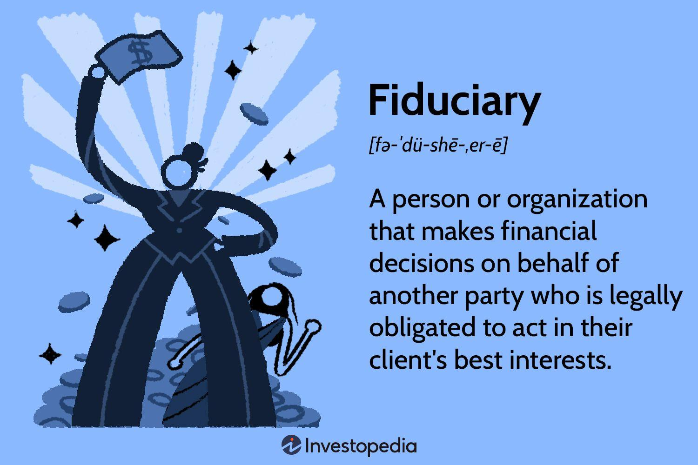

## Table of Contents

## What is fiduciary duty?

Fiduciary duty is a legal obligation where one person or entity, called a fiduciary, must act in the best interest of another person or group, known as the beneficiary. This duty is common in relationships where one party has more power or knowledge, like between a financial advisor and a client, or a trustee and a trust beneficiary. The fiduciary is expected to put the beneficiary's interests ahead of their own and avoid any conflicts of interest.

In practice, fiduciary duty means the fiduciary must be honest, transparent, and loyal. They need to make decisions that benefit the beneficiary, even if it means they might lose out personally. For example, a financial advisor with fiduciary duty must recommend investments that are best for the client, not just the ones that earn the advisor the highest fees. If a fiduciary fails to meet these obligations, they can be held legally responsible and may face penalties or lawsuits.

## Who can be considered a fiduciary?

A fiduciary can be anyone who has a special responsibility to look after someone else's interests. This often includes people like financial advisors, who help people with their money, or lawyers, who give legal advice. Trustees, who manage money or property for someone else, are also fiduciaries. Even company directors can be fiduciaries because they need to make decisions that are best for the company and its shareholders.

In everyday life, a fiduciary might be someone you trust to make decisions for you when you can't, like a guardian for a child or an executor of a will. These people have to put your needs first and make sure they are doing what's best for you. If they don't, they could get in trouble legally. So, being a fiduciary is a big responsibility, and it's important for them to always act honestly and fairly.

## What are the basic principles of fiduciary duty?

The main idea behind fiduciary duty is that the person in charge, called the fiduciary, must always think about what's best for the person they are helping, called the beneficiary. This means the fiduciary has to be honest and loyal. They can't use their position to help themselves or do things that might hurt the beneficiary. For example, if a financial advisor is a fiduciary, they must suggest investments that will help their client make more money, not just the ones that will earn the advisor more fees.

Another important part of fiduciary duty is avoiding conflicts of interest. This means the fiduciary can't be in a situation where they might make choices that help them but hurt the beneficiary. They need to be very clear and open about everything they do. If a fiduciary doesn't follow these rules, they could get in big trouble legally. So, it's really important for them to always act in a way that shows they care most about the beneficiary's well-being.

## Can you provide examples of fiduciary relationships?

One common example of a fiduciary relationship is between a financial advisor and their client. The financial advisor is a fiduciary, which means they have to suggest investments that will help their client make more money. They can't pick investments just because they will earn the advisor more fees. This is important because the advisor knows more about investing than the client, so the client trusts them to make the best choices.

Another example is a trustee and a beneficiary of a trust. A trust is like a special account where money or property is held for someone else. The trustee manages this account and has to make sure they use it in a way that helps the beneficiary. For example, if the trust is set up to pay for a child's education, the trustee must use the money to help the child go to school, not for something else.

A third example is between a company's directors and its shareholders. The directors are fiduciaries to the shareholders, which means they need to make decisions that are good for the company and its owners. They can't use their power to help themselves at the expense of the shareholders. This is important because the shareholders trust the directors to run the company well and make it successful.

## What are the different types of fiduciary duties?

Fiduciary duties can be broken down into a few main types. The first is the duty of care, which means the fiduciary has to be careful and thoughtful when making decisions for the beneficiary. They need to think about what's best for the beneficiary and make choices that are smart and well-considered. For example, a financial advisor has to research investments carefully before suggesting them to a client.

The second type is the duty of loyalty. This means the fiduciary must always put the beneficiary's interests first and can't do anything that might help themselves at the beneficiary's expense. They need to avoid conflicts of interest and be honest about any situation that might affect their decisions. For instance, a company director can't use company resources for personal gain.

The third type is the duty of obedience, which applies in certain situations like when someone is managing a trust or serving on a board. This duty means the fiduciary must follow the rules and guidelines set out for them. They can't go against the trust's instructions or the company's bylaws. This ensures that the fiduciary stays true to the purpose they were appointed for.

## How does fiduciary duty apply to financial advisors?

Fiduciary duty for financial advisors means they have to always think about what's best for their clients. They can't just pick investments that will make them more money. Instead, they need to choose options that will help their clients make more money or reach their financial goals. This is important because clients trust their advisors to know more about investing and to use that knowledge to help them.

Financial advisors also have to be honest and clear about everything they do. They can't have any conflicts of interest where they might make choices that help themselves but hurt their clients. If an advisor doesn't follow these rules, they could get in big trouble legally. So, it's really important for them to always act in a way that shows they care most about their client's well-being.

## What are the legal consequences of breaching fiduciary duty?

If someone who is supposed to be a fiduciary doesn't follow their duties, they can get in big trouble legally. This is called breaching fiduciary duty. The person who was supposed to be helped, called the beneficiary, can sue the fiduciary. They might have to pay money to the beneficiary to make up for any harm they caused. This money is called damages. The court might also make the fiduciary do what they were supposed to do in the first place, which is called specific performance.

Sometimes, the fiduciary might have to give back any money they made by not following their duties. This is called disgorgement. They might also lose their job or not be allowed to be a fiduciary anymore. In really bad cases, they could even go to jail. All these things are to make sure that fiduciaries take their responsibilities seriously and always think about what's best for the people they are supposed to help.

## How can fiduciary duty be enforced?

Fiduciary duty can be enforced through the legal system. If someone thinks a fiduciary isn't doing their job right, they can go to court. The court will look at the situation and decide if the fiduciary broke their duty. If they did, the court can make them pay money to the person they were supposed to help, called the beneficiary. This money is to make up for any harm the fiduciary caused. The court might also tell the fiduciary to do what they were supposed to do in the first place.

Sometimes, the fiduciary might have to give back any money they made by not following their duties. This is called disgorgement. They could also lose their job or not be allowed to be a fiduciary anymore. In really bad cases, they might even go to jail. All these things help make sure that fiduciaries take their responsibilities seriously and always think about what's best for the people they are supposed to help.

## What steps can fiduciaries take to ensure they meet their duties?

Fiduciaries can make sure they meet their duties by always thinking about what's best for the people they are helping, called beneficiaries. They need to be careful and thoughtful when making decisions. This means doing a lot of research and understanding the situation well before choosing what to do. For example, a financial advisor should look at all the options and pick the ones that will help their client the most, not just the ones that will make the advisor more money.

Fiduciaries also need to be honest and clear about everything they do. They should tell the beneficiary about any situation that might affect their decisions and avoid any conflicts of interest. This means not doing anything that could help them but hurt the beneficiary. If they follow these steps, they can make sure they are doing their job right and not breaking their fiduciary duty.

## How does fiduciary duty vary across different jurisdictions?

Fiduciary duty can be different depending on where you are because each place has its own laws and rules. In the United States, for example, fiduciary duty can change from one state to another. Some states have very strict rules about what fiduciaries have to do, while others might be more relaxed. Also, different countries have their own ways of thinking about fiduciary duty. For instance, in the UK, the rules might focus more on certain duties like loyalty and care, while in Canada, the laws might put more emphasis on how fiduciaries should act in specific situations.

Even though the basic ideas of fiduciary duty are similar everywhere—like being honest, loyal, and careful—the details can be different. This means that what a fiduciary has to do in one place might not be the same in another. For example, in some places, breaking fiduciary duty might lead to big legal problems and big fines, while in other places, the consequences might not be as severe. It's important for fiduciaries to know the rules in their area so they can make sure they are doing everything right.

## What are some common challenges fiduciaries face in fulfilling their duties?

One common challenge fiduciaries face is dealing with conflicts of interest. This happens when a fiduciary might make a choice that helps them but hurts the person they are supposed to help. For example, a financial advisor might want to suggest an investment that pays them a big fee, even if it's not the best choice for their client. It's hard for fiduciaries to always avoid these situations, but they have to try their best to put their client's needs first.

Another challenge is keeping up with all the rules and laws about being a fiduciary. These rules can be different depending on where you are, and they can change over time. Fiduciaries need to stay informed and make sure they are always following the right rules. This can be a lot of work, but it's important because if they don't follow the rules, they could get in big trouble legally.

## How has the concept of fiduciary duty evolved in recent years?

In recent years, the idea of fiduciary duty has changed a bit. More people are paying attention to it, especially in the world of money and investments. For example, in the United States, there have been new rules that make it clearer what financial advisors have to do to be good fiduciaries. These rules say that advisors have to think about what's best for their clients, not just what makes them more money. This is to make sure that people can trust their advisors to help them make good choices with their money.

Another way fiduciary duty has changed is that it's now seen as important in more areas than before. For example, people are talking about how companies should think about more than just making money for their shareholders. They should also think about how their actions affect the environment and society. This is called [ESG](/wiki/esg-investing) (Environmental, Social, and Governance) investing. So, fiduciaries are now expected to consider these bigger issues when making decisions, not just what's good for the people they directly help.

## References & Further Reading

[1]: Bergstra, J., Bardenet, R., Bengio, Y., & Kégl, B. (2011). ["Algorithms for Hyper-Parameter Optimization."](https://dl.acm.org/doi/10.5555/2986459.2986743) Advances in Neural Information Processing Systems 24.

[2]: ["Advances in Financial Machine Learning"](https://www.amazon.com/Advances-Financial-Machine-Learning-Marcos/dp/1119482089) by Marcos Lopez de Prado  

[3]: ["Evidence-Based Technical Analysis: Applying the Scientific Method and Statistical Inference to Trading Signals"](https://www.amazon.com/Evidence-Based-Technical-Analysis-Scientific-Statistical/dp/0470008741) by David Aronson  

[4]: ["Machine Learning for Algorithmic Trading"](https://github.com/stefan-jansen/machine-learning-for-trading) by Stefan Jansen  

[5]: ["Quantitative Trading: How to Build Your Own Algorithmic Trading Business"](https://www.amazon.com/Quantitative-Trading-Build-Algorithmic-Business/dp/1119800064) by Ernest P. Chan  