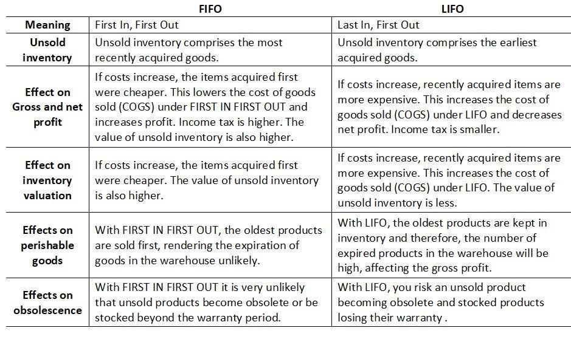

## Table of Contents

## What is inventory valuation and why is it important?

Inventory valuation is the process of figuring out how much the stuff a business has in stock is worth. This includes all the products that are ready to sell, the ones being made, and the raw materials needed to make them. Businesses need to know this value to keep their financial records straight and to make smart decisions about buying, making, and selling their products.

Knowing the value of inventory is important for a few reasons. First, it helps businesses figure out their profit. If they sell something, they need to know how much it cost them to have it in stock to see how much money they made from the sale. Second, it's important for taxes. The value of inventory affects how much a business has to pay in taxes. If the value is wrong, the business might pay too much or too little. Finally, it helps businesses plan for the future. By knowing what their inventory is worth, they can decide if they need to buy more, make less, or change their prices.

## What does FIFO stand for and how does it work?

FIFO stands for "First In, First Out." It's a way businesses keep track of their inventory by selling the oldest items first. Imagine you have a bunch of apples. You bought some apples a week ago and some new ones today. With FIFO, you would sell the apples you bought a week ago before you sell the ones you bought today.

This method makes sense for things that can go bad or get old, like food or medicine. It helps businesses make sure they're not stuck with stuff that's no good anymore. It also helps them figure out how much their inventory is worth. If prices go up over time, using FIFO can make it look like the business is making more money because they're selling the cheaper, older items first.

## What does LIFO stand for and how does it work?

LIFO stands for "Last In, First Out." It's a way businesses handle their inventory by selling the newest items they got first. Think of it like a stack of [books](/wiki/algo-trading-books). If you keep adding new books on top, with LIFO, you would take the book from the top of the stack to sell or use it before you touch the ones at the bottom.

This method can be useful when prices are going up because it means the business is selling the more expensive, newer items first. This can lower the profit on paper because the cost of goods sold is higher. But it's not always the best choice for things that can spoil or go out of date, because it might leave the old stuff sitting around for too long.

## Can you provide a simple example of how FIFO impacts the cost of goods sold (COGS)?

Imagine a small bakery that makes cakes. They buy flour in batches, and each batch costs a different amount because the price of flour changes over time. In January, they bought a batch of flour for $100. In February, they bought another batch for $120. The bakery uses the FIFO method, so they use the January batch of flour first before they start using the February batch.

Now, let's say the bakery makes and sells 10 cakes in March, and each cake uses flour from one batch. With FIFO, the cost of the flour for these 10 cakes comes from the January batch, which cost $100. So, the cost of goods sold (COGS) for these 10 cakes is $100. If they had used the LIFO method instead, the COGS would have been $120 because they would have used the more expensive February batch first. This shows how FIFO can lower the COGS when prices are going up.

## Can you provide a simple example of how LIFO impacts the cost of goods sold (COGS)?

Let's say a toy store buys toy cars. They buy 100 cars in June for $5 each, so that batch costs them $500. In July, they buy another 100 cars, but the price goes up to $6 each, making that batch cost $600. The store uses the LIFO method, so they sell the cars from the July batch before they sell any from the June batch.

In August, the store sells 100 cars. With LIFO, the cost of goods sold (COGS) for these 100 cars comes from the July batch, which cost $600. If they had used FIFO instead, the COGS would have been $500 because they would have sold the cheaper June batch first. This shows how LIFO can increase the COGS when prices are going up.

## What are the main differences between FIFO and LIFO?

FIFO and LIFO are two ways businesses can keep track of their inventory. FIFO stands for "First In, First Out," which means the business sells the oldest items first. On the other hand, LIFO stands for "Last In, First Out," which means they sell the newest items first. Imagine you have a bunch of apples. With FIFO, you'd sell the apples you bought first before selling the newer ones. With LIFO, you'd sell the apples you bought most recently before selling the older ones.

The choice between FIFO and LIFO can affect how much money a business seems to be making. When prices are going up, FIFO can make it look like the business is making more profit because they're selling the cheaper, older items first. This means the cost of goods sold (COGS) is lower. LIFO, on the other hand, can make it look like the business is making less profit because they're selling the more expensive, newer items first, which makes the COGS higher. This can be useful for tax purposes because a higher COGS can mean lower taxable income.

## How do FIFO and LIFO affect a company's financial statements?

FIFO and LIFO can make a big difference in a company's financial statements. When a company uses FIFO, it sells the oldest items first. If prices are going up, this means the cost of goods sold (COGS) will be lower because they're selling the cheaper, older stuff first. This makes the company's profit look higher on the income statement. Also, the value of the inventory on the balance sheet will be higher because it's made up of the newer, more expensive items.

On the other hand, when a company uses LIFO, it sells the newest items first. If prices are going up, this means the COGS will be higher because they're selling the more expensive, newer stuff first. This makes the company's profit look lower on the income statement. The value of the inventory on the balance sheet will be lower because it's made up of the older, cheaper items. So, choosing between FIFO and LIFO can really change how a company's financial health looks on paper.

## In what scenarios might a company choose to use FIFO over LIFO?

A company might choose to use FIFO over LIFO when they want their financial statements to show higher profits. When prices are going up, FIFO makes the cost of goods sold lower because the company sells the older, cheaper items first. This means their profit looks bigger on the income statement. Companies that want to look good to investors or lenders might pick FIFO because it makes them seem more profitable.

Another reason a company might choose FIFO is if they sell products that can go bad or get outdated quickly, like food or medicine. FIFO makes sure they sell the oldest items first, which helps prevent them from having to throw away spoiled or expired goods. This can save them money and keep their customers happy by always offering fresh products.

## In what scenarios might a company choose to use LIFO over FIFO?

A company might choose to use LIFO when they want to show lower profits on their financial statements. When prices are going up, LIFO makes the cost of goods sold higher because the company sells the newer, more expensive items first. This means their profit looks smaller on the income statement. Companies might pick LIFO if they want to pay less in taxes because lower profits mean lower taxable income. It can be a smart move for saving money on taxes.

Also, LIFO might be chosen by businesses that don't worry too much about their products going bad or getting old. For example, if a company sells things like metal or oil, which don't spoil, they might use LIFO. This way, they can match their current costs with their current sales, which can give a more accurate picture of how much it costs them to do business right now.

## What are the tax implications of using FIFO versus LIFO?

When a company uses FIFO, it sells the oldest items first. If prices are going up, this means the cost of goods sold is lower because they're selling cheaper stuff first. This makes their profit look bigger on their tax return. When a company has a bigger profit, they have to pay more in taxes. So, using FIFO can mean paying more in taxes because the profit looks higher.

On the other hand, when a company uses LIFO, it sells the newest items first. If prices are going up, this means the cost of goods sold is higher because they're selling more expensive stuff first. This makes their profit look smaller on their tax return. When a company has a smaller profit, they have to pay less in taxes. So, using LIFO can mean paying less in taxes because the profit looks lower. This is why some companies choose LIFO to save money on taxes.

## How do international accounting standards (IFRS) and U.S. GAAP differ in their treatment of FIFO and LIFO?

International Financial Reporting Standards (IFRS) and U.S. Generally Accepted Accounting Principles (GAAP) have different rules about using FIFO and LIFO. IFRS does not allow companies to use LIFO at all. They can only use FIFO or another method called the weighted average cost method. This means that companies following IFRS have to sell their oldest items first, no matter what. This can make their profits look bigger if prices are going up, and they might have to pay more in taxes because of it.

U.S. GAAP, on the other hand, allows companies to choose between FIFO and LIFO. This gives companies more options to pick the method that works best for them. If a company wants to show lower profits and pay less in taxes, they can use LIFO. But if they want to show higher profits and look good to investors, they can use FIFO. This flexibility is why some U.S. companies like using LIFO, but it's not an option for companies following IFRS.

## What are the potential impacts of inflation on FIFO and LIFO inventory valuation methods?

Inflation means prices are going up. When a company uses FIFO during inflation, they sell the older, cheaper stuff first. This makes the cost of goods sold lower because they're selling stuff that cost less money before prices went up. So, their profit looks bigger on their financial statements. This can be good for showing investors that the company is doing well, but it might also mean the company has to pay more in taxes because of the bigger profit.

On the other hand, when a company uses LIFO during inflation, they sell the newer, more expensive stuff first. This makes the cost of goods sold higher because they're selling stuff that cost more money after prices went up. So, their profit looks smaller on their financial statements. This can be good for saving money on taxes because a smaller profit means less tax to pay. But it might not look as good to investors because the company seems to be making less money.

## What are the financial implications of LIFO vs. FIFO?

The choice between LIFO (Last-In, First-Out) and FIFO (First-In, First-Out) inventory methodologies entails significant implications on a company's financial statements. These methods differ primarily in their assumptions about the order in which inventory is sold, ultimately influencing reported earnings, tax obligations, and cash flow.

During periods of inflation, the LIFO method can result in a reduced taxable income. This occurs because the method allocates the cost of the most recent, and typically more expensive, inventory items to the cost of goods sold (COGS). Higher COGS means lower gross profit and, consequently, lower taxable income. The formula for gross profit under LIFO can be represented as:

$$
\text{Gross Profit}_{LIFO} = \text{Revenue} - \text{COGS}_{LIFO},
$$

where $\text{COGS}_{LIFO}$ reflects higher recent costs. This approach can benefit firms by minimizing tax liabilities in times of rising prices, albeit at the expense of showing lower profits.

Alternatively, the FIFO method uses the cost of older, cheaper inventory goods to calculate COGS, leading to higher gross profits. The gross profit under FIFO is:

$$
\text{Gross Profit}_{FIFO} = \text{Revenue} - \text{COGS}_{FIFO},
$$

where $\text{COGS}_{FIFO}$ comprises older, lower-cost inventory. This scenario often results in a higher taxable income, which might increase the company's tax burden. Nevertheless, reporting higher profits could be advantageous for companies looking to attract investors or secure financing, as it indicates robust business performance.

When choosing between LIFO and FIFO, businesses must evaluate their financial objectives, considering variables like cash flow needs, tax strategy, and the anticipated market movement. For instance, a company in a rapidly inflating market economy might prefer LIFO to alleviate its tax expenses temporarily. However, if presenting strong financial health is crucial, the company might opt for FIFO.

The decision between these methods should [factor](/wiki/factor-investing) in not only the current economic climate but also longer-term strategic considerations. An illustrative example can be expressed through a simple code snippet analyzing the potential impacts of each method on a business’s finances over time.

```python
# Simulate financial impacts of LIFO and FIFO
def calculate_financials(prices, revenue):
    cogs_lifo = sum(prices[-5:])  # Using last five prices for LIFO
    cogs_fifo = sum(prices[:5])   # Using first five prices for FIFO
    gross_profit_lifo = revenue - cogs_lifo
    gross_profit_fifo = revenue - cogs_fifo
    return gross_profit_lifo, gross_profit_fifo

# Example prices and revenue
prices = [10, 12, 15, 18, 20, 22, 25, 28, 30, 33]  # Prices over time
revenue = 500  # Fixed revenue for simplicity

gross_profit_lifo, gross_profit_fifo = calculate_financials(prices, revenue)

print("LIFO Gross Profit:", gross_profit_lifo)
print("FIFO Gross Profit:", gross_profit_fifo)
```

In summary, the financial impacts of LIFO and FIFO are nuanced and variable, contingent upon inflation rates and economic conditions. Companies must align their choice with their overarching financial goals and strategic vision, mindful that each method carries distinct advantages and potential drawbacks.

## References & Further Reading

[1]: ["Accounting for inventories and stock control systems"](https://corporatefinanceinstitute.com/resources/accounting/inventory-accounting/) by the Institute of Chartered Accountants in England and Wales (ICAEW)

[2]: ["Inventory Valuation: FIFO, LIFO, and Weighted Average"](https://www.accountancyknowledge.com/inventory-valuation/) by CliffsNotes

[3]: ["Measuring and Managing Liquidity Risk in Algorithmic Trading"](https://onlinelibrary.wiley.com/doi/book/10.1002/9781118818466) by Laruelle, S., & Lehalle, C. A. in the book "Algorithmic and High-Frequency Trading" (2013)

[4]: ["International Accounting and Multinational Enterprises"](https://www.amazon.com/International-Accounting-Multinational-Enterprises-Radebaugh/dp/0471652695) by Lee H. Radebaugh et al.

[5]: ["Trading and Exchanges: Market Microstructure for Practitioners"](https://www.amazon.com/Trading-Exchanges-Market-Microstructure-Practitioners/dp/0195144708) by Larry Harris