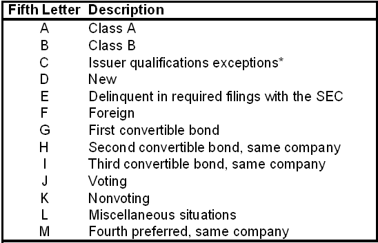

In the world of stock trading, particularly on the Nasdaq exchange, ticker symbols are essential for identifying and representing publicly traded companies and their financial instruments. These symbols, usually one to four letters long, are more than just arbitrary labels; they contain critical information about the securities they represent. Among the various elements of ticker symbols, the fifth-letter identifiers are particularly significant. These letters can convey important details about a stock's status or special conditions, such as share class distinctions or unusual trading conditions.

These identifiers are not mere add-ons but serve a functional role in refined trading strategies, especially in algorithmic trading, where the ability to quickly interpret and react to significant data is paramount. Algorithmic trading systems use pre-defined rules to make high-speed trading decisions, and incorporating fifth-letter identifiers into these systems enhances their capacity to respond intelligently to market changes. For instance, an identifier might signal a regulatory issue or a company nearing bankruptcy, prompting the algorithm to adjust the trading strategy.



Understanding these identifiers enables traders and investors to gain deeper insights into the mechanics and opportunities within the market. By recognizing how these modifiers influence trading dynamics, market participants can make more informed decisions, tailor their trading strategies more effectively, and potentially improve their trading success. As markets continue to evolve and grow in complexity, an in-depth knowledge of these nuanced details provides a competitive edge, equipping traders and investors to navigate the ever-changing landscape with greater confidence.

## Table of Contents

## Understanding Ticker Symbols and Their Structure

Ticker symbols are essential tools in the financial markets, facilitating quick and accurate identification of companies and their associated financial instruments on stock exchanges. Comprised of a series of letters, these symbols enable traders and investors to efficiently track and execute transactions involving various securities. On the Nasdaq exchange, ticker symbols typically range from one to four letters and may be augmented with suffixes or additional identifiers, which provide crucial supplementary information about the stock or the issuing company.

Nasdaq ticker symbols use a systematic structure designed for clarity and utility in trading operations. A basic ticker symbol can consist of up to four letters representing the issuing company. For example, "AAPL" stands for Apple Inc., and "GOOGL" refers to Alphabet Inc. However, the additional complexity introduced by an extra fifth-letter modifier offers a richer layer of information, revealing specific characteristics or trading conditions of the security.

The inclusion of a fifth-letter modifier in a Nasdaq ticker symbol serves distinct purposes. Such modifiers are often employed to denote different share classes, such as "A" for Class A shares or "B" for Class B shares, delineating variations in voting rights or dividend distributions. Additionally, modifiers can inform investors and traders about special trading conditions or restrictions. For instance, an "E" at the end of a ticker symbol indicates that the company is delinquent in filing required financial documents with the Securities and Exchange Commission (SEC). An "Q" might point to the issuer's involvement in bankruptcy proceedings, which could significantly affect its stock value and trading dynamics.

Through these additional identifiers, Nasdaq enhances transparency and provides a more nuanced understanding of a company's financial health and market position. This structured approach aids in maintaining an orderly marketplace by ensuring that all stakeholders have access to vital information that could impact trading decisions. Efficiently utilizing these identifiers helps traders navigate the complexities of stock trading, optimizing both decision-making processes and trade executions. Understanding these components of ticker symbols is integral for traders and investors aiming to optimize their strategies in response to the nuanced dynamics of the stock market.

## Decoding the Fifth-Letter Identifiers

The fifth-letter identifiers play a crucial role in providing specific insights into Nasdaq-listed securities. These suffixes in ticker symbols serve as indicators for various conditions or statuses affecting a stock, adding a layer of information beyond the basic representation.

Common fifth-letter identifiers include notable examples like 'Q' and 'E'. The 'Q' modifier signals that a company is undergoing bankruptcy proceedings, issuing a cautionary note to investors and traders about the financial instability of the company ([source](https://www.nasdaq.com)). Similarly, the 'E' identifier is used for companies that are delinquent in filing key documents with the Securities and Exchange Commission (SEC), often pointing toward regulatory concerns that could affect stock performance and investor confidence.

These identifiers are vital for traders and investors, as they convey essential information that can impact decision-making processes. For example, the presence of a 'Q' or 'E' may influence a trader to adopt a more cautious approach or adjust their strategy accordingly. Understanding these suffixes allows market participants to interpret potential red flags and incorporate this knowledge into their trading frameworks.

A comprehensive list of such modifiers helps guide traders in accurately reading and reacting to these symbols. The Nasdaq and other financial resources regularly publish updates about these identifiers, providing clarity on what each letter represents and any associated implications. This information must be constantly monitored by traders to stay informed about any changes in the structural or operational status of companies they are analyzing or investing in.

Traders rely on real-time updates and data analytics to understand the dynamic nature of fifth-letter identifiers. Implementing strategies that account for this information can optimize both trading and risk management. Overall, these identifiers form an integral part of the stock analysis toolkit, facilitating informed decision-making in the fast-paced environment of the Nasdaq exchange.

## The Role of Fifth-Letter Identifiers in Algorithmic Trading

Algorithmic trading relies heavily on computational algorithms that use pre-defined rules and statistical models to execute trades with efficiency and precision. At its core, this form of trading seeks to capitalize on market opportunities by processing vast amounts of data at speeds that are impossible for human traders to match.

One critical enhancement to [algorithmic trading](/wiki/algorithmic-trading) is the integration of fifth-letter identifiers found in Nasdaq ticker symbols. These identifiers provide specific, timely insights into the conditions or characteristics of securities, which can be crucial for decision-making processes. By incorporating these identifiers, algorithms can be trained to recognize and respond to particular market signals, thereby optimizing trading strategies.

For instance, consider the scenario where an algorithm encounters a fifth-letter identifier 'Q', which signifies that a company has filed for bankruptcy. Recognizing such a signal, the algorithm might instantly flag the stock for review or automatically exclude it from the trading portfolio to avoid potential losses. This automated response system is an example of how algorithms leverage fifth-letter identifiers to manage risk effectively.

The utility of these identifiers extends into diverse risk management and opportunity-seeking strategies. Algorithms can be customized to detect various identifiers, each representing different circumstances, such as 'E' for securities that have overdue SEC filings, or 'D' which might indicate a new issue. Such real-time adjustments can minimize exposure to high-risk stocks and allocate resources more efficiently, thereby enhancing safety and profitability prospects in trading operations.

Incorporating fifth-letter identifiers into trading algorithms also supports a dynamic approach to market fluctuations and anomalies. By interpreting these modifiers accurately, algorithms can adapt trading strategies according to market changes, ensuring that trading operations remain not only efficient but also strategically robust. This intricate approach harnesses the synergy between technology and market data, facilitating informed and strategic trading executions.

## Challenges and Limitations in Using Fifth-Letter Identifiers

Fifth-letter identifiers in Nasdaq ticker symbols, though informative, present multifaceted challenges that can impact the efficacy of trading decisions. Their complex and conditional nature means that accurate interpretation is critical—misinterpretation can lead to erroneous trading decisions or missed opportunities. Traders must have a keen understanding of these identifiers and remain vigilant about any updates or changes in their meanings and implications. This is particularly relevant given that financial markets are dynamic, and the conditions represented by these identifiers can evolve rapidly.

Moreover, the sheer [volume](/wiki/volume-trading-strategy) of data associated with Nasdaq-listed securities can be overwhelming. Traders are required to process this information efficiently to maintain competitiveness in the market. This challenge is exacerbated by the need to monitor and interpret the fifth-letter identifiers accurately. As such, robust algorithmic strategies become essential in parsing vast datasets and integrating identifier insights into trading models. For example, using [machine learning](/wiki/machine-learning) algorithms to categorize and flag identifiers can help automate the decision-making process, reducing the likelihood of human error.

Consider a simple Python script that could help in monitoring these identifiers:

```python
import pandas as pd

def fetch_ticker_data():
    # Placeholder for the function that fetches ticker data
    # Assume it returns a DataFrame with columns 'ticker' and 'identifier'
    pass

def analyze_identifiers(stock_data):
    risky_identifiers = ['Q', 'E']  # Example identifiers
    stock_data['is_risky'] = stock_data['identifier'].apply(lambda x: x in risky_identifiers)
    return stock_data

stock_data = fetch_ticker_data()
analyzed_data = analyze_identifiers(stock_data)
print(analyzed_data[analyzed_data['is_risky']])
```

Despite these challenges, a well-informed use of fifth-letter identifiers can significantly enhance trading outcomes. When traders accurately incorporate these identifiers into their strategies, they can better manage risks and identify potential market opportunities. This involves not just understanding the current significance of each identifier but also adapting to changes in market conditions that may affect these interpretations. Ultimately, the strategic use of fifth-letter identifiers, when executed thoughtfully, serves as a powerful tool in navigating the complexities of financial markets.

## Conclusion

Fifth-letter identifiers in Nasdaq ticker symbols are a pivotal component in both manual and algorithmic trading strategies. These modifiers act as a key to unlock a wealth of information about the specific conditions and characteristics of securities. By understanding and decoding these identifiers, traders gain access to a robust toolkit that assists in making informed and strategic decisions. 

The integration of fifth-letter identifiers into trading algorithms can substantially enhance the efficiency and success of trading operations. Algorithms capable of recognizing and responding to these identifiers are more adept at navigating the complexities of the financial markets. For instance, an algorithm may be designed to adjust its strategy automatically when encountering a ticker symbol with a specific fifth-letter modifier that indicates a significant market event, such as bankruptcy proceedings marked by 'Q'.

The financial markets are dynamic and continuously evolving, making it essential for traders to remain informed about such nuanced details. This continuous education and adaptation to changes can considerably fortify a trader's ability to anticipate market movements and capitalize on emerging opportunities. As these intricacies are embraced and understood, they can empower traders and investors alike, facilitating a more nuanced and informed approach to navigating the ever-changing landscape of the market. Such a depth of understanding is invaluable for those looking to maintain a competitive edge in trading.

## References & Further Reading

[1]: Bergstra, J., Bardenet, R., Bengio, Y., & Kégl, B. (2011). ["Algorithms for Hyper-Parameter Optimization."](https://papers.nips.cc/paper/4443-algorithms-for-hyper-parameter-optimization) Advances in Neural Information Processing Systems 24.

[2]: ["Advances in Financial Machine Learning"](https://www.amazon.com/Advances-Financial-Machine-Learning-Marcos/dp/1119482089) by Marcos Lopez de Prado

[3]: ["Evidence-Based Technical Analysis: Applying the Scientific Method and Statistical Inference to Trading Signals"](https://www.amazon.com/Evidence-Based-Technical-Analysis-Scientific-Statistical/dp/0470008741) by David Aronson

[4]: ["Machine Learning for Algorithmic Trading"](https://github.com/stefan-jansen/machine-learning-for-trading) by Stefan Jansen

[5]: ["Quantitative Trading: How to Build Your Own Algorithmic Trading Business"](https://www.amazon.com/Quantitative-Trading-Build-Algorithmic-Business/dp/1119800064) by Ernest P. Chan