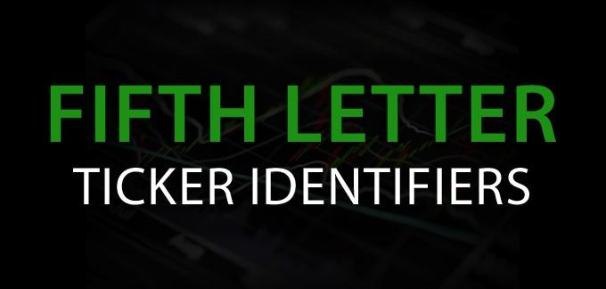

## Table of Contents

## What is a Fifth-Letter Identifier on Nasdaq?

A Fifth-Letter Identifier on Nasdaq is an extra letter added to the end of a stock's symbol. This letter gives more information about the stock. For example, it can show if the stock is a new issue, a type of share, or if it trades on a different market.

These identifiers help investors and traders quickly understand important details about a stock. For instance, a stock symbol ending in 'Q' means the company is in bankruptcy proceedings. Knowing these codes can make it easier to make smart investment choices.

## Why does Nasdaq use Fifth-Letter Identifiers?

Nasdaq uses Fifth-Letter Identifiers to give more information about a stock quickly and easily. When you see a stock symbol, the extra letter at the end tells you something special about that stock. For example, it can show if the stock is a new issue, a different type of share, or if it's trading on a different market. This helps investors and traders understand important details without having to look up more information.

These identifiers make it simpler for people to make smart choices about their investments. For instance, if a stock symbol ends in 'Q', it means the company is in bankruptcy. Knowing this can help investors decide if they want to buy, sell, or hold the stock. By using these codes, Nasdaq makes it easier for everyone to get the information they need fast.

## How are Fifth-Letter Identifiers assigned to stocks?

Fifth-Letter Identifiers are given to stocks by Nasdaq based on certain rules. When a company lists its stock on Nasdaq, the exchange looks at the company's situation and decides which letter to add to the stock symbol. This letter tells investors something important about the stock, like if it's a new issue or if the company is in bankruptcy.

For example, if a company is in bankruptcy, Nasdaq will add the letter 'Q' to the end of its stock symbol. This helps investors know right away that the company is having financial trouble. By using these identifiers, Nasdaq makes it easier for people to understand what's going on with a stock without having to do a lot of research.

## Can you give examples of common Fifth-Letter Identifiers and what they signify?

Fifth-Letter Identifiers are letters added to the end of a stock symbol on Nasdaq. They tell you important things about the stock. For example, if you see a 'Q' at the end of a stock symbol, it means the company is in bankruptcy. This is useful because it warns investors that the company might be in financial trouble. Another common identifier is 'R', which means the company has missed its filings with the Securities and Exchange Commission (SEC). This can signal that the company is having problems with its reporting.

There are also other identifiers like 'D', which shows that the stock is a new issue. This can be helpful for investors looking for fresh opportunities. The letter 'K' at the end of a stock symbol means the stock doesn't fit into any other category. It's a catch-all identifier for stocks that don't have a specific reason for a different letter. By using these simple codes, Nasdaq helps investors quickly understand important details about a stock.

## What is the difference between a stock symbol and a Fifth-Letter Identifier?

A stock symbol is a short code, usually made of letters, that represents a company's stock on a stock exchange. For example, 'AAPL' is the stock symbol for Apple Inc. on Nasdaq. This symbol is what people use to buy, sell, or track the stock. It's like a nickname for the company's shares, making it easy to find and trade them.

A Fifth-Letter Identifier is an extra letter added to the end of a stock symbol on Nasdaq. This extra letter gives more information about the stock. For instance, if you see 'AAPLQ', the 'Q' at the end means the company is in bankruptcy. The Fifth-Letter Identifier helps investors quickly understand important details about the stock without needing to do more research.

## How do Fifth-Letter Identifiers affect stock trading and investment decisions?

Fifth-Letter Identifiers can make a big difference in how people trade and invest in stocks. When someone sees a letter like 'Q' at the end of a stock symbol, it tells them the company is in bankruptcy. This can make investors think twice before buying the stock because it's a sign of financial trouble. Knowing this, they might decide to sell their shares or avoid buying new ones. This extra information helps people make smarter choices based on the company's situation.

These identifiers also help traders and investors understand other important details quickly. For example, if a stock symbol ends in 'D', it means the stock is a new issue. This can be exciting for investors looking for fresh opportunities. On the other hand, a 'R' at the end shows the company has missed its filings with the SEC, which might make investors wary. By giving this information in a simple way, Fifth-Letter Identifiers help people make better decisions without needing to do a lot of extra research.

## Are there any historical changes to the use of Fifth-Letter Identifiers on Nasdaq?

Over time, Nasdaq has changed how it uses Fifth-Letter Identifiers. In the past, these identifiers were not as common, but as the stock market grew, Nasdaq needed a way to give more information about stocks quickly. They started using these extra letters more to help investors understand important details about a company's situation. This made it easier for people to make smart choices about buying and selling stocks.

One big change happened in 2007 when Nasdaq started using the letter 'Q' to show that a company was in bankruptcy. Before this, there were fewer identifiers, and the system was not as detailed. The addition of new identifiers like 'Q' helped make the information clearer and more useful for investors. These changes show how Nasdaq keeps updating its rules to help people trade and invest more easily.

## How do Fifth-Letter Identifiers impact the visibility and categorization of companies on Nasdaq?

Fifth-Letter Identifiers help make it easier for people to see and understand important information about companies on Nasdaq. When a stock symbol has an extra letter at the end, it tells investors something special about the company. For example, if a stock ends in 'Q', it means the company is in bankruptcy. This makes it quick for investors to know if a company is having financial problems without needing to do more research. By using these identifiers, Nasdaq helps investors see the big picture and make smarter choices about which stocks to buy or sell.

These identifiers also help categorize companies in a clear way. When a stock has a letter like 'D' at the end, it shows that the stock is a new issue. This helps investors looking for new opportunities find them easily. On the other hand, a 'R' at the end tells investors that the company has missed its filings with the SEC, which might make them think twice before investing. By using these simple codes, Nasdaq makes it easier for people to understand what kind of company they are looking at and how it fits into different categories.

## What are the regulatory requirements or guidelines for using Fifth-Letter Identifiers?

Nasdaq has rules about using Fifth-Letter Identifiers. These rules help make sure that everyone knows what the extra letters mean. For example, if a company is in bankruptcy, Nasdaq adds a 'Q' to the end of the stock symbol. This rule helps investors see right away that the company is having money problems. Nasdaq follows these rules to keep the stock market fair and clear for everyone.

The rules also say when to use other letters. If a company misses its filings with the SEC, Nasdaq adds an 'R' to the stock symbol. This tells investors that the company might be having trouble with its reports. By following these rules, Nasdaq makes sure that the extra letters give important and correct information to investors. This helps people make better choices about buying and selling stocks.

## How do Fifth-Letter Identifiers integrate with other financial data systems and platforms?

Fifth-Letter Identifiers work well with other financial data systems and platforms. When you see a stock symbol with an extra letter at the end, like 'Q' for bankruptcy, this information is shared across different systems. This means that when you use a trading app or a financial website, the Fifth-Letter Identifier will show up there too. This helps everyone see the same important details about a stock, no matter which platform they use.

These identifiers make it easier for financial data systems to organize and show information about stocks. For example, if a stock has a 'D' at the end, showing it's a new issue, this information can be used by platforms to group similar stocks together. This helps investors find and compare new stocks quickly. By using Fifth-Letter Identifiers, different financial platforms can give clear and useful information to help people make smart investment choices.

## What advanced strategies can traders employ using knowledge of Fifth-Letter Identifiers?

Traders can use Fifth-Letter Identifiers to spot special opportunities or risks. For example, if a stock ends in 'Q', it means the company is in bankruptcy. Some traders might see this as a chance to buy the stock at a low price, hoping it will go up later. Others might see it as a warning sign and decide to sell their shares or avoid buying the stock altogether. By watching these identifiers, traders can make quick decisions based on the company's situation.

Another strategy involves looking for stocks with a 'D' at the end, which means they are new issues. Traders might focus on these stocks because they could offer big gains if the company does well. On the other hand, if a stock has an 'R' at the end, showing the company missed its SEC filings, traders might be more careful. They could see this as a sign of trouble and choose to stay away from the stock. By understanding what these letters mean, traders can better plan their moves in the market.

## How might future changes in market regulations or technology affect the use of Fifth-Letter Identifiers?

Future changes in market regulations could change how Fifth-Letter Identifiers are used. If new rules come out about what information needs to be shared with investors, Nasdaq might need to add new letters or change what the current letters mean. For example, if there's a new rule about how to show if a company is doing something good for the environment, Nasdaq might add a new letter to show that. These changes would help keep the stock market fair and clear for everyone.

Technology could also affect Fifth-Letter Identifiers. As computers and trading systems get better, they might be able to show more information about stocks in new ways. Maybe instead of just adding a letter, the systems could use colors or symbols to show what's going on with a company. This would make it even easier for investors to see important details quickly. But no matter how technology changes, the goal would still be to help people make smart choices about their investments.

## References & Further Reading

[1]: Bergstra, J., Bardenet, R., Bengio, Y., & Kégl, B. (2011). ["Algorithms for Hyper-Parameter Optimization."](https://papers.nips.cc/paper/4443-algorithms-for-hyper-parameter-optimization) Advances in Neural Information Processing Systems 24.

[2]: ["Advances in Financial Machine Learning"](https://www.amazon.com/Advances-Financial-Machine-Learning-Marcos/dp/1119482089) by Marcos Lopez de Prado

[3]: ["Evidence-Based Technical Analysis: Applying the Scientific Method and Statistical Inference to Trading Signals"](https://www.amazon.com/Evidence-Based-Technical-Analysis-Scientific-Statistical/dp/0470008741) by David Aronson

[4]: ["Machine Learning for Algorithmic Trading"](https://github.com/stefan-jansen/machine-learning-for-trading) by Stefan Jansen

[5]: ["Quantitative Trading: How to Build Your Own Algorithmic Trading Business"](https://www.amazon.com/Quantitative-Trading-Build-Algorithmic-Business/dp/1119800064) by Ernest P. Chan