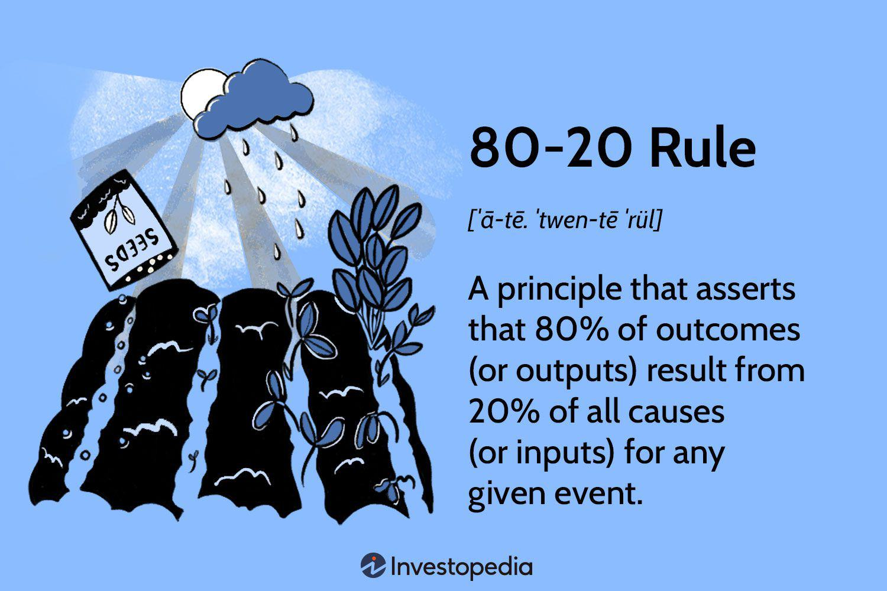

Understanding market corrections is essential for making informed decisions in trading and investing. Among the various concepts employed by traders, the Fifty Percent Principle stands out as a noteworthy guide. This principle forecasts the potential depreciation of a stock or asset during a correction phase following a period of rapid gains. The core idea is that an asset might experience a retracement that sheds approximately 50% to 67% of its previous increase before stabilizing and possibly resuming its upward trajectory.

In this article, the focus will be on the Fifty Percent Principle, examining its mechanics and its implementation in algorithmic trading. The principle's influence on short-term trading strategies is also significant, offering traders insights into market dynamics. By mastering this concept, traders can pinpoint favorable entry points and refine their trading strategies for better outcomes.



Through exploring this principle, traders can hone their abilities to navigate market volatility and capitalize on potential profit opportunities that arise during correction phases. Understanding the Fifty Percent Principle can serve as a valuable tool in the trader's toolkit, aiding in the identification of optimal market entry points and enhancing overall trading efficacy.

## Table of Contents

## What is the Fifty Percent Principle?

The Fifty Percent Principle is a guideline predominantly utilized in technical analysis, aiming to forecast the magnitude of a technical correction in the prices of stocks or other assets. This principle posits that following a swift upward movement in price, an asset is likely to experience a decline that retraces at least 50% to 67% of its recent gains before any significant upward movement resumes. 

Traders make use of this principle to estimate potential support levels in the market, assisting them in identifying lucrative opportunities as prices stabilize and begin to rise again. By anticipating where a declining asset will cease its downward trajectory, traders can strategically position themselves to buy at lower prices, thereby optimizing their profit potential during subsequent rebounds. 

The Fifty Percent Principle offers traders a practical tool for navigating the complexities of market corrections, providing a framework for timing their market entries more effectively. The rule taps into the inherent market psychology that often causes investors to pull back around the halfway mark of a previous advance, thus creating a temporary support that savvy traders can leverage.

## Understanding the Mechanism

The Fifty Percent Principle is grounded in the notion that investor psychology significantly influences market behavior. This principle serves as a predictive tool for traders who aim to identify optimal entry points for asset acquisition, maximizing profit potential upon the asset's return to an upward trajectory. At the heart of this mechanism is the assumption that once an asset price undergoes a substantial increase, a subsequent correction phase will entail a retracement of approximately 50% of the prior gains. This assertion, rooted in behavioral finance, suggests a natural ebb and flow driven by emotions such as fear and greed within market participants.

One way traders enhance their predictive accuracy is through pattern analysis, which involves identifying chart patterns that signify potential reversals or support levels during market corrections. Common patterns include head and shoulders, triangles, and double tops or bottoms, which, once identified, can suggest possible zones where the principle is likely to play out.

Additionally, the incorporation of Fibonacci retracement levels provides further analytical depth. Fibonacci ratios, derived from the mathematical sequence introduced by Leonardo Fibonacci, are widely utilized in trading to ascertain potential support and resistance levels. Key Fibonacci levels—23.6%, 38.2%, 50%, 61.8%, and 100%—are associated with psychological retracement levels in the market. Of particular interest within the context of the Fifty Percent Principle is the 50% Fibonacci retracement level, which aligns with the principle's fundamental prediction. By analyzing these ratios on asset charts, traders can enhance their ability to predict where price corrections might halt and reverse, corresponding with historical market patterns.

The Fifty Percent Principle is predominantly applied in short-term trading scenarios. This focus is due to the inherent [volatility](/wiki/volatility-trading-strategies) and unpredictability of long-term market dynamics, where larger economic and geopolitical factors can obscure traditional technical analysis signals. For short-term traders, the principle presents a structured approach to navigating temporary market fluctuations. Its application requires continuous monitoring of market conditions and responsiveness to emerging patterns, ensuring alignment with the principle's guidelines.

In summary, the Fifty Percent Principle leverages investor psychology to inform traders' strategies concerning market corrections. The integration of pattern recognition and Fibonacci analysis further refines these strategies, particularly in short-term trading contexts where both precision and adaptability are crucial.

## Application Examples in Algorithmic Trading

Algorithmic traders frequently integrate the Fifty Percent Principle into their trading algorithms to automate entry and [exit](/wiki/exit-strategy) strategies effectively. This approach is particularly advantageous as it allows traders to respond swiftly to changes in market conditions by relying on pre-set rules derived from this principle.

For illustration, consider a scenario where a stock’s value surges from $100 to $150. According to the Fifty Percent Principle, a correction might see the stock fall to about $125-117 before resuming its upward trajectory. Algorithmic trading systems can capitalize on this by placing automated buy orders within this anticipated correction range. This ensures that trades are executed at potentially optimal price points without the need for continuous manual monitoring.

The implementation of such strategies can be achieved through the utilization of historical price data and trading patterns. Algorithms analyze past market corrections to identify patterns and set parameters for future trades. This data-driven approach enables the system to predict the likelihood of certain market behaviors, thereby optimizing trade outcomes and enhancing return potentials.

For practical implementation, Python serves as an excellent tool for developing such algorithms due to its powerful libraries like Pandas for data manipulation and NumPy for numerical computations. Here is a simple Python example of how an algorithm might be designed to identify the Fifty Percent Principle entry point:

```python
import pandas as pd

# Sample data: A stock’s price change from $100 to $150
price_history = pd.Series([100, 110, 120, 130, 140, 150])

def fifty_percent_principle_buy(price_history):
    peak = price_history.max()
    correction_min = peak - 0.33 * (peak - price_history.min())
    correction_max = peak - 0.5 * (peak - price_history.min())
    return correction_max, correction_min

entry_points = fifty_percent_principle_buy(price_history)
print(f"Set buy orders between ${entry_points[0]:.2f} and ${entry_points[1]:.2f}")
```

This script computes the potential buy range based on the principle, allowing traders to place orders accordingly. By automating this process, traders can ensure timely execution and potentially capture profitable entry points amid market corrections.

Incorporating the Fifty Percent Principle in [algorithmic trading](/wiki/algorithmic-trading) strategies streamlines trading operations and leverages the efficiency of automated systems. This not only eliminates human error but also enhances the capability to manage trades across diverse market scenarios, ultimately optimizing the trading strategy's overall performance.

## Special Considerations and Limitations

The Fifty Percent Principle, while a valuable tool for predicting price corrections and identifying entry points, comes with notable considerations and limitations that traders need to be aware of. Primarily, this principle is most effective in stable market conditions and can falter during periods of significant economic upheaval or extreme market volatility. Significant economic events, such as financial crises, geopolitical tensions, or unprecedented market crashes, can lead to prolonged downturns or erratic price movements that defy the anticipated 50% correction.

During such periods, markets exhibit behaviors that are difficult to predict using historical patterns and traditional technical indicators. As the Fifty Percent Principle relies on the assumption that markets eventually revert to a mean or encounter predictable correction levels, its reliability diminishes when faced with anomalies that disrupt typical market cycles.

To mitigate these risks, traders should incorporate comprehensive market analysis and remain adaptable in their trading strategies. This involves acknowledging that prolonged downturns or unexpected market behavior might extend beyond the predicted 50% retracement level. A flexible trading approach, encompassing diverse tools and strategies, can help offset the potential for inaccurate predictions based on the Fifty Percent Principle alone.

Moreover, implementing risk management techniques, such as setting stop-loss orders and maintaining diversified portfolios, can safeguard investments from substantial losses during volatile periods. Understanding the larger market context, such as macroeconomic indicators and global events, also plays a crucial role in assessing when it might be prudent to rely on the Fifty Percent Principle and when to modify trading strategies accordingly.

In essence, while the Fifty Percent Principle can be a beneficial component of short-term trading strategies under normal conditions, traders must exercise caution and adaptability to navigate the complexities introduced by volatile markets and economic disruptions.

## Conclusion

The Fifty Percent Principle offers traders a reliable framework for anticipating market corrections and pinpointing potential entry points. By predicting likely retracement levels, traders can better anticipate the natural ebb and flow of asset prices, allowing for more calculated investment decisions. When integrated into algorithmic trading, this principle enhances operational efficiency by utilizing historical price data and automated execution strategies. Such algorithms can be programmed to identify favourable conditions for buying or selling, activating trades based on predefined criteria reflective of this retracement principle.

Despite its usefulness, traders must recognize the limitations inherent in relying solely on the Fifty Percent Principle. Fluctuations driven by macroeconomic shifts or substantial geopolitical events may cause deviations from expected retracement levels, necessitating adaptive strategies. As such, traders should supplement this principle with a broader analysis of market conditions. This approach ensures a comprehensive risk management strategy that aligns with current market dynamics.

In conclusion, the Fifty Percent Principle, when embraced as part of a holistic trading strategy, can significantly enhance decision-making processes and contribute to trading success. It provides a structured method for understanding price corrections, though its efficacy is maximized when applied alongside other analytical tools and strategic flexibility.

## References & Further Reading

[1]: Murphy, J.J. (1999). ["Technical Analysis of the Financial Markets: A Comprehensive Guide to Trading Methods and Applications."](https://archive.org/details/technicalanalysi0000murp) New York Institute of Finance.

[2]: Lopez de Prado, M. (2018). ["Advances in Financial Machine Learning."](https://www.amazon.com/Advances-Financial-Machine-Learning-Marcos/dp/1119482089) Wiley.

[3]: Aronson, D.R. (2007). ["Evidence-Based Technical Analysis: Applying the Scientific Method and Statistical Inference to Trading Signals."](https://www.amazon.com/Evidence-Based-Technical-Analysis-Scientific-Statistical/dp/0470008741) Wiley.

[4]: Chan, E.P. (2009). ["Quantitative Trading: How to Build Your Own Algorithmic Trading Business."](https://github.com/ftvision/quant_trading_echan_book) Wiley.

[5]: Pring, M. (2002). ["Technical Analysis Explained: The Successful Investor's Guide to Spotting Investment Trends and Turning Points."](https://www.amazon.com/Technical-Analysis-Explained-Fifth-Successful/dp/0071825177) McGraw-Hill.