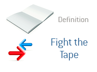

## Table of Contents

## What does 'Fighting the Tape' mean in the context of trading?

'Fighting the Tape' is a term used in trading that means going against the current market trend. When traders see that the market is moving in a certain direction, they might feel tempted to do the opposite. For example, if the market is going up, a trader might decide to sell, thinking the market will soon go down. This is called fighting the tape because they are fighting against what the market is showing.

This strategy can be risky. The market trend often continues in the same direction for a while, so fighting it can lead to losses. Traders who fight the tape need to be very sure about their reasons for going against the trend. It's like swimming against a strong current; it takes a lot of effort and skill to succeed. Many experienced traders advise against fighting the tape unless you have strong evidence that the trend will change soon.

## How can beginners identify when they might be fighting the tape?

Beginners can identify when they might be fighting the tape by paying attention to the overall direction of the market. If they see that stock prices are generally going up, but they decide to sell their stocks because they think the market will soon go down, they are fighting the tape. It's like noticing that everyone is walking in one direction, but you choose to walk the other way. This can be risky because the market trend often keeps going the same way for a while.

Another way to spot fighting the tape is by watching the news and market reports. If most news and reports suggest the market is bullish (going up) and you decide to bet on it going down, you're fighting the tape. It's important for beginners to be aware of these signs and think carefully before going against the trend. Sometimes, it might be better to follow the trend until you gain more experience and confidence in your trading decisions.

## What are the common signs that the market is moving against your position?

When the market is moving against your position, you'll see the price of what you bought going down, or the price of what you sold going up. For example, if you bought a stock hoping it would go up, but it keeps going down, that's a sign the market is moving against you. You might also see the stock moving in the opposite direction of what you expected after you made your trade.

Another sign is when the overall market trend is different from what you thought it would be. If everyone else seems to be making money while you're losing it, the market might be moving against you. This can be frustrating, but it's important to watch these signs and think about what to do next, like maybe changing your plan or waiting for a better time to trade.

## Can you explain the psychological aspects of fighting the tape?

Fighting the tape can be tough on your mind. When you go against what the market is doing, it can make you feel stressed and worried. You might start to doubt yourself and feel like you made a mistake. This can be hard because the market keeps moving, and if it keeps going the other way, it can make you feel even worse. It's like trying to swim upstream; it takes a lot of effort, and you might feel like giving up.

Sometimes, people fight the tape because they think they know something others don't. They might feel confident at first, but if the market keeps going against them, they can start to feel frustrated and anxious. It's important to think about how you feel when you're fighting the tape. If it's making you too stressed or upset, it might be better to follow the market trend instead of fighting it. Listening to your feelings can help you make better trading decisions.

## What are some basic strategies to avoid fighting the tape?

One basic strategy to avoid fighting the tape is to follow the trend. When you see the market going up, think about buying instead of selling. This means you're going with the flow and not trying to guess when the market will change direction. It's like riding a bike downhill instead of uphill; it's easier and less tiring. By following the trend, you can avoid the stress and worry that come with fighting the tape.

Another strategy is to use stop-loss orders. A stop-loss order is like a safety net that helps you limit your losses. If you buy a stock and it starts to go down, the stop-loss order can automatically sell it for you before you lose too much money. This way, you don't have to fight the tape by holding onto a losing position hoping it will turn around. It's a smart way to protect yourself and stay calm while trading.

## How does market sentiment influence the concept of fighting the tape?

Market sentiment is like the general mood of people who are trading. If most people feel good about the market and think prices will go up, that's called bullish sentiment. If they feel bad and think prices will go down, that's bearish sentiment. When you're fighting the tape, you're going against what most people are feeling and doing. So, if everyone is feeling bullish and buying stocks, but you decide to sell, you're fighting the tape because you're going against the general mood.

Understanding market sentiment can help you avoid fighting the tape. If you see that most people are feeling a certain way about the market, it might be safer to go along with them instead of betting against them. For example, if news reports and other traders are saying the market will go up, it might be better to buy stocks instead of selling them. By paying attention to how others feel about the market, you can make smarter choices and avoid the stress of going against the flow.

## What technical indicators can traders use to detect when they are fighting the tape?

Traders can use technical indicators like moving averages to see if they are fighting the tape. A moving average is a line on a chart that shows the average price of a stock over a certain time. If the price of a stock is going up and it's above the moving average, it means the trend is up. If you're selling in this situation, you're fighting the tape because you're going against the upward trend. On the other hand, if the price is below the moving average and going down, it's a downward trend. Buying in this case would mean you're fighting the tape.

Another useful indicator is the Relative Strength Index (RSI). The RSI shows if a stock is overbought or oversold. If the RSI is over 70, it means the stock might be overbought and could go down soon. If you're buying in this situation, you're fighting the tape because you're going against the signal that the stock might drop. If the RSI is below 30, it means the stock might be oversold and could go up. Selling in this case would mean you're fighting the tape. By watching these indicators, traders can better understand the market trend and avoid going against it.

## How do experienced traders adjust their strategies when they realize they are fighting the tape?

When experienced traders realize they are fighting the tape, they often take a step back to reassess their strategy. They look at the market trends and their own positions to see if they should change what they're doing. If they see that the market is clearly going in one direction and they're betting on the opposite, they might decide to close their position to avoid bigger losses. This means they sell what they bought or buy back what they sold to stop losing more money. They might also set tighter stop-loss orders to limit their losses if the market keeps moving against them.

After closing their position, experienced traders might wait for the market to change direction before they start trading again. They keep watching the market and use technical indicators like moving averages and the Relative Strength Index (RSI) to see when the trend might be shifting. Once they see signs that the market could be turning around, they might enter new trades that go along with the new trend. This way, they avoid fighting the tape and can make better trading decisions based on what the market is actually doing.

## Can you provide real-life examples of traders fighting the tape and the outcomes?

One real-life example of a trader fighting the tape happened during the dot-com bubble in the late 1990s. Many traders saw that internet stocks were going up and up, but some thought it was a bubble and decided to sell their stocks, betting that the prices would soon crash. These traders were fighting the tape because they were going against the strong upward trend. Unfortunately for them, the market kept going up for a while longer, and those who sold too early missed out on even bigger gains. When the bubble finally burst in 2000, those who held on until the peak made a lot of money, but the ones who fought the tape by selling early lost out.

Another example comes from the 2008 financial crisis. As the housing market started to collapse, some traders believed the overall stock market would follow and began short-selling stocks, betting that prices would go down. They were fighting the tape because, at the time, the market was still showing some signs of strength and many investors were still buying. These traders faced huge losses as the market continued to fluctuate before finally crashing. Those who shorted too early lost money because they fought the tape, while those who waited until the market clearly turned bearish made profits. These examples show how risky it can be to go against the market trend without strong evidence that it will change soon.

## What are the long-term effects on a trader's portfolio when consistently fighting the tape?

When a trader keeps fighting the tape, their portfolio can suffer in the long run. This means they often go against what the market is doing, which can lead to big losses. If the market is going up and they keep selling, they miss out on gains. If the market is going down and they keep buying, they lose money as prices drop. Over time, these losses can add up and make their portfolio smaller. It's like trying to run against the wind all the time; it's hard to keep going and you don't get very far.

The stress and frustration of fighting the tape can also affect a trader's decisions. When they see their portfolio losing value, they might start to make quick, risky trades to try and make up for the losses. This can lead to even more problems and bigger losses. In the long term, it's better for a trader to follow the market trend and avoid the constant battle of fighting the tape. This way, they can grow their portfolio more steadily and feel less stressed about their trading choices.

## How does fighting the tape differ in various financial markets like stocks, forex, and commodities?

Fighting the tape means going against what the market is doing. In the stock market, if most stocks are going up but you decide to sell, you're fighting the tape. This can be risky because stocks often keep going up for a while. In the [forex](/wiki/forex-system) market, where people trade currencies, fighting the tape happens when you bet that a currency will go down when it's actually going up. The forex market can be even trickier because currencies move a lot and quickly, so fighting the tape can lead to big losses fast. In the commodities market, like trading oil or gold, fighting the tape means selling when prices are going up or buying when they're going down. Commodities can be affected by things like weather or politics, so the market can change suddenly, making it hard to fight the tape without losing money.

Even though fighting the tape looks different in each market, the main idea is the same: it's risky to go against the trend. In stocks, you might miss out on gains if you sell too early. In forex, you could lose a lot of money if the currency keeps moving against you. And in commodities, sudden changes can make your losses even bigger if you're not careful. No matter which market you're in, it's usually better to follow the trend instead of fighting it. This way, you can avoid big losses and make smarter trading choices.

## What advanced techniques can expert traders use to turn fighting the tape to their advantage?

Expert traders sometimes use advanced techniques to turn fighting the tape to their advantage. They do this by looking for signs that the market trend might be about to change. They use technical indicators like the Relative Strength Index (RSI) and moving averages to spot when a stock or market might be overbought or oversold. If they see that the RSI is very high, it might mean the market is due for a drop, so they might start selling even though the market is still going up. They also look at news and events that could change the market's direction. By carefully watching these signs, they can make smart bets against the trend at the right time.

Another technique expert traders use is called hedging. Hedging is like buying insurance for their trades. If they think the market might go down soon, they can buy options or other financial tools that will make money if the market does drop. This way, even if they're fighting the tape and the market keeps going up for a bit, they won't lose as much money because their hedge will protect them. It's a way to take a calculated risk against the trend without risking too much of their portfolio. By using these advanced techniques, expert traders can sometimes make fighting the tape work in their favor.

## References & Further Reading

[1]: ["Contrarian Investment Strategies: The Psychological Edge"](https://www.amazon.com/Contrarian-Investment-Strategies-Psychological-Edge/dp/0743297962) by David Dreman

[2]: Shiller, R. J. (2003). ["From Efficient Markets Theory to Behavioral Finance."](https://www.aeaweb.org/articles?id=10.1257/089533003321164967) Journal of Economic Perspectives, 17(1), 83-104.

[3]: De Bondt, W. F. M., & Thaler, R. (1985). ["Does the Stock Market Overreact?"](https://onlinelibrary.wiley.com/doi/full/10.1111/j.1540-6261.1985.tb05004.x) The Journal of Finance, 40(3), 793-805.

[4]: ["A Non-Random Walk Down Wall Street"](https://www.amazon.com/Non-Random-Walk-Down-Wall-Street/dp/0691092567) by Andrew W. Lo and A. Craig MacKinlay

[5]: ["Algorithmic Trading and DMA: An introduction to direct access trading strategies"](https://www.amazon.com/Algorithmic-Trading-DMA-introduction-strategies/dp/0956399207) by Barry Johnson

[6]: Templeton, J. M., & Phillips, J. K. (2008). ["The Templeton Touch: The Way to Invest Like the World's Greatest Contrarian."](https://www.amazon.com/Investing-Templeton-Way-Market-Beating-Strategies/dp/0071545638)