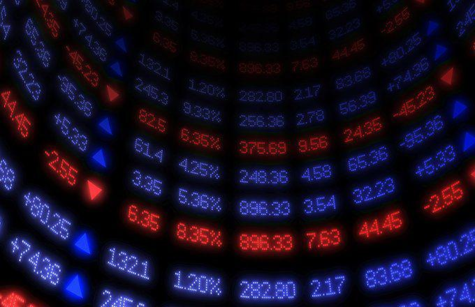

The stock market is a dynamic and complex space, influenced by multifaceted factors including investor sentiment and macroeconomic conditions. Participant behavior and external economic indicators continuously shape market movements, necessitating a variety of trading strategies to navigate these fluctuations. Among these strategies, "fighting the tape" stands out due to its contrarian nature. This approach involves trading against prevailing market trends, betting that current price directions will reverse. 

In traditional trading, investors typically follow trends, assuming that price movements will continue in their current direction. Fighting the tape, however, involves anticipating a change, which inherently presents higher risk and potential for reward. This contrarian strategy requires robust analysis and a strong conviction of market mispricing or reversal. 



This article explores fighting the tape by examining its place within the broader trading universe, particularly its integration into algorithmic trading where automated systems can rapidly execute contrarian strategies. The goal is to provide insights and considerations for traders and investors who aim to enhance their understanding of market dynamics, equipping them to make informed decisions even when market indicators suggest going against the tide.

## Table of Contents

## Understanding 'Fighting the Tape'

"Fighting the tape" is a stock market trading strategy characterized by its contrarian nature. It involves making trading decisions that go against prevailing market trends or sentiment. The term "fighting the tape" originates from the era of ticker tape machines, which were used to transmit stock price information in real-time. Ticker tapes would provide a continuous stream of stock prices, which traders relied upon to make informed decisions. In this historical context, "the tape" represented the market's direction and sentiment as depicted by immediate price changes. Fighting the tape implied opposing the trend indicated by the ticker tape, regardless of market sentiment or the prevailing consensus.

This approach has evolved significantly with the advent of modern electronic trading technologies. Today, traders no longer depend on ticker tapes to access real-time data, as electronic terminals and sophisticated software offer not only immediate price updates but also analytical tools to assess market trends. Despite technological advancements, the essence of fighting the tape remains the same: acting contrary to prevalent market directions.

Fighting the tape is a form of contrarian trading, which involves betting against the crowd or the prevailing market trends. Contrarian traders believe that markets can be driven by irrational behaviors, leading to mispricing of assets. By taking a contrarian stance, traders aim to capitalize on market corrections when the irrational exuberance or pessimism fades, and asset prices realign with fundamental values.

The strategy is associated with high risk and potential high reward. Going against the crowd can lead to significant gains if the trader's assessment of market trends proves accurate. For instance, if a stock is undervalued due to negative market sentiment and a contrarian trader buys the stock anticipating a rebound, the trader can realize substantial profits if the market correction occurs. Conversely, the risk is evident when market trends continue contrary to the trader's expectations, potentially leading to substantial losses.

The high-risk, high-reward dynamic makes fighting the tape a strategy suited for experienced traders who have a comprehensive understanding of market mechanics and are comfortable with potential [volatility](/wiki/volatility-trading-strategies). Traders must carefully evaluate their risk tolerance and possess strong market analysis skills to engage successfully in this approach. 

In summary, fighting the tape involves contrarian trading tactics rooted in historical practices that have transformed with technological advancements. While it offers considerable potential for profit, it also requires a cautious approach due to its inherent risks.

## How Fighting the Tape Works

Fighting the tape is a contrarian trading strategy where traders take positions opposite to prevailing market trends. This approach relies heavily on the psychology of contrarianism which emphasizes acting against the herd mentality. Traditional trading strategies often align with market [momentum](/wiki/momentum) and trends, seeking to capitalize on established price movements supported by current market sentiment and news. In contrast, contrarian strategies, such as fighting the tape, posit that the market or certain stocks are mispriced and anticipates a reversal when general market beliefs are overly optimistic or pessimistic.

Psychologically, contrarian traders are driven by the belief that crowd behavior leads to exaggerated market responses, either in terms of price increases or decreases. They aim to exploit anomalies presented by overreaction or underreaction, essentially banking on a return to intrinsic value. This perspective draws from behavioral finance, which identifies biases that lead investors to make irrational decisions due to fear, greed, or herd instincts.

Investors deciding to fight the tape are significantly influenced by their investment strategies and risk tolerance levels. High-risk tolerance investors are more inclined towards contrarian strategies because of the potential for substantial rewards, although they must also be prepared to incur significant losses. Risk tolerance dictates the degree to which an investor might attempt to resist market trends—those with a lower risk appetite often prefer strategies aligned with market momentum due to their typically steadier returns.

Additionally, investors' goals and financial positions play a crucial role in the decision to adopt fighting the tape strategies. An investor with a long-term growth objective might be more patient with temporary losses, expecting a market correction that aligns prices with intrinsic value. Conversely, traders focused on short-term gains might find fighting the tape attractive, aiming to capitalize on volatile swings caused by market overreactions.

In summary, fighting the tape is a contrarian strategy rooted in behavioral psychology, with its adoption heavily influenced by individual risk strategies, tolerance levels, and specific financial goals.

## Algorithmic Trading: Enhancing Fighting the Tape

Algorithmic trading has become a significant component of modern financial markets, utilizing complex algorithms to automate trading decisions and executions. These systems analyze massive datasets to identify trading opportunities and execute orders with speed and precision unmatched by human traders. This technological advancement is increasingly playing a pivotal role in executing contrarian strategies like 'fighting the tape'.

'Fighting the tape' is synonymous with taking a contrarian position, essentially betting against prevailing market trends. Algorithmic trading systems can be programmed to identify conditions that are ripe for contrarian positions. For example, an algorithm might be designed to detect overbought or oversold conditions using indicators such as the Relative Strength Index (RSI) or moving average crossovers. Upon identifying such scenarios, the system can execute trades that oppose the current market direction.

The integration of fighting the tape strategies within [algorithmic trading](/wiki/algorithmic-trading) offers several benefits. One significant advantage is the ability to process and analyze large quantities of market data in real-time. Algorithms can quickly spot patterns or anomalies that may signify an opportunity to fight the tape. Additionally, algorithmic trading eliminates human emotions from the trading process, which is particularly important for contrarian strategies that require a high degree of discipline and objectivity.

Implementing contrarian trades via algorithms can also facilitate rapid trade execution, which is crucial when taking positions against market momentum. These systems can enter or [exit](/wiki/exit-strategy) trades almost instantaneously, reducing the slippage and costs associated with manual trading.

However, using algorithms to execute fighting the tape strategies also poses challenges. One of the main challenges is ensuring the algorithm's reliability and robustness across varying market conditions. Financial markets are inherently unpredictable, and a strategy that works well in one market environment might fail in another. Therefore, these algorithms require constant monitoring and updating to remain effective.

Moreover, contrarian strategies can incur significant risks, particularly if market conditions do not promptly correct in the manner anticipated by the algorithm. This is why extensive [backtesting](/wiki/backtesting) and scenario analysis are essential to ensure that the algorithm is prepared for different market dynamics.

In summary, algorithmic trading enhances the execution of fighting the tape strategies by offering speed, data processing capabilities, and emotional neutrality. Nonetheless, traders must remain cautious and continuously optimize their algorithms to navigate the uncertainties of the stock market effectively.

## Examples and Case Studies

Case studies of traders who successfully employed "fighting the tape" strategies highlight the nuanced approach required to succeed with this contrarian method. One prominent example is the legendary investor John Templeton. Known for his contrarian investments, Templeton famously bought shares during periods of extreme pessimism, including during the Great Depression. His approach often involved selecting undervalued stocks that were unpopular or out of favor, suggesting that fighting the tape can yield lucrative outcomes when executed with insight and patience.

Conversely, there are instances where fighting the tape has led to substantial losses. The most notable example may be the [hedge fund](/wiki/hedge-fund-trading-strategies) Long-Term Capital Management (LTCM), which collapsed in 1998. Despite the considerable expertise of its founders and reliance on sophisticated mathematical models, LTCM faced significant challenges when market conditions unexpectedly deviated from historical patterns. This is a poignant illustration of how even well-formulated contrarian strategies can meet with failure if market forecasts are inaccurate or misaligned with broader economic events.

Analyzing market conditions that favor fighting the tape provides invaluable insights for traders. Typically, contrarian strategies perform well during periods of excessive market euphoria or unwarranted pessimism. For instance, when markets are overwhelmingly bullish, valuations can become overstretched, making short positions (a form of fighting the tape) appealing. Similarly, in bear markets, when stocks are deeply undervalued due to widespread fear, buying against the trend may offer substantial gains as market conditions normalize.

These examples underscore essential considerations: the critical need for precise market analysis and the inherent risks of deviating from market trends. Techniques such as thorough valuation analysis and leveraging historical market data can aid traders in making informed contrarian trades. Here is a basic Python snippet that illustrates how historical price-to-earnings (P/E) ratios can inform contrarian investment decisions:

```python
import pandas as pd
import numpy as np

# Load historical P/E ratio data
data = pd.read_csv('pe_ratios.csv')
threshold = data['P/E'].mean() + data['P/E'].std()

# Identify contrarian investment opportunities
contrarian_opportunities = data[data['P/E'] > threshold]

print("Contrarian Investment Opportunities:")
print(contrarian_opportunities)
```

In conclusion, while fighting the tape can result in substantial returns, such strategies demand careful analysis and a willingness to oppose prevailing market sentiments. Success hinges not just on the accuracy of market predictions, but also on a trader's capacity to endure the inherent volatility and risks associated with contrarian positions.

## Ethical Considerations in Fighting the Tape

Trading strategies, particularly contrarian ones like "fighting the tape," can present unique ethical challenges, especially when managing other people’s capital. This involves critical considerations surrounding the responsibility of making potentially high-risk decisions on behalf of clients or shareholders.

### Considerations for Individual Investors vs. Institutional Traders

Individual investors, when choosing to adopt a contrarian strategy, primarily risk their own capital. The ethical implications here are often centered on personal responsibility and the investor's ability to manage risk effectively. However, for institutional traders, the stakes can be markedly different due to the use of clients' funds. 

Institutional traders have a fiduciary duty to act in the best interests of their clients, which requires an adherence to higher ethical standards. This entails not only striving for profitable trades but also ensuring that the level of risk is aligned with clients' expectations and investment goals. Any deviation from the anticipated strategy, particularly by taking a contrarian position, necessitates transparency with clients to maintain trust and uphold ethical standards.

### When Contrarian Positions May Be Deemed Unethical

Taking a contrarian position can be deemed unethical in scenarios where traders deliberately manipulate market perceptions for personal gain or misrepresent the level of risk involved to investors. For instance, if a trader acts on non-public information or intentionally spreads misinformation to profit from a contrarian bet, such actions would breach ethical norms and legal regulations.

Additionally, contrarian trading may become ethically questionable when there is inadequate disclosure of the strategy’s potential risks. Institutional investors, for instance, should provide clear communication about the high-risk, high-reward nature of "fighting the tape" to ensure that investors are making informed decisions about their involvement. 

In summary, the ethics surrounding "fighting the tape" necessitate a balance between seeking profit and maintaining transparency, honesty, and respect for client objectives and risk tolerance. It is an approach that requires careful consideration and commitment to ethical standards, especially in managing other people's capital.

## Tips for Traders Utilizing Fighting the Tape

Traders seeking to adopt the fighting the tape strategy can benefit from a comprehensive plan that focuses on risk management, informed decision-making, and leveraging appropriate tools and resources. Here are several practical tips for traders considering this contrarian approach:

1. **Risk Management**: Effective risk management is crucial when fighting the tape. Traders should set clear stop-loss limits to minimize potential losses if the market trend continues against their position. Diversifying investment across various sectors or asset classes can mitigate risk by not putting all capital into one basket. Additionally, utilizing position sizing techniques ensures that no single trade can have a catastrophic impact on the portfolio.

2. **Market Research and Economic Indicators**: Keeping abreast of market trends and economic indicators can provide a foundation for informed contrarian positions. Traders should regularly analyze macroeconomic data such as GDP growth rates, unemployment figures, and central bank policies, as these factors often influence market sentiment and can signal potential reversals. Being aware of corporate earnings reports and sector-specific news is also essential for identifying opportunities where market perception may diverge from fundamental values.

3. **Tools and Resources**: Traders can enhance their contrarian trading strategies by using various analytical tools and platforms. Technical analysis tools, such as moving averages, Bollinger Bands, and relative strength index (RSI), can aid in identifying market entry and exit points. Advanced charting platforms that offer backtesting capabilities allow traders to simulate their strategies against historical data before committing real capital. Additionally, sentiment analysis tools can help gauge investor sentiment and identify areas where market consensus may be incorrect.

4. **Regular Strategy Evaluation**: It is important for traders to review and adjust their strategies regularly. This includes analyzing past trades to identify what worked well and what did not, allowing for continuous improvement. Traders should also remain adaptable to changing market conditions, as strategies that are successful in one type of market environment may not work in another.

5. **Continuous Learning**: Engaging in continuous learning and staying informed about new developments in trading strategies is beneficial. Participating in online forums, attending webinars, and reviewing academic and industry research can help traders stay ahead of the curve.

By implementing these practices, traders can better position themselves to capitalize on the potential opportunities associated with fighting the tape, while also managing the inherent risks of contrarian trading.

## Conclusion

Fighting the tape as a trading strategy encapsulates significant potential for both rewards and risks. As a contrarian approach, it inherently challenges prevailing market trends and capitalizes on the potential mispricing of assets. One of the principal advantages of this strategy is the opportunity for substantial returns; contrarian traders can position themselves ahead of market corrections or reversals, accruing profits when their predictions come to fruition. However, this potential is accompanied by considerable risks. Fighting the tape often involves forecasting against market consensus, which can lead to substantial losses if the anticipated market reversal does not occur.

Traders adopting this approach must critically assess their risk tolerance and market understanding. An essential step is accurately gauging one's capacity to endure potential financial setbacks. Traders should consider the volatility of the assets involved and how their trading capital might sustain such volatility. Evaluating the historical behavior of similar contrarian trades can provide insights into the potential pitfalls and advantages, aiding in more informed decision-making.

Moreover, in the constantly evolving landscape of the stock market, traders are encouraged to continuously expand their knowledge and adaptability. Market conditions, influenced by macroeconomic factors and investor sentiment, necessitate that traders remain vigilant and informed. Continuous learning and adaptation are vital, as they ensure that traders can effectively respond to new information and adjust their strategies accordingly. Utilizing tools like financial news platforms, economic indicators, and algorithmic trading systems can enhance a trader's ability to refine contrarian strategies efficiently.

By carefully balancing these factors—understanding the pros and cons, assessing risk tolerance, and committing to continuous learning—traders can potentially harness the benefits of fighting the tape while mitigating its inherent drawbacks.

## References & Further Reading

[1]: ["Contrarian Investment Strategies: The Psychological Edge"](https://www.amazon.com/Contrarian-Investment-Strategies-Psychological-Edge/dp/0743297962) by David Dreman

[2]: Shiller, R. J. (2003). ["From Efficient Markets Theory to Behavioral Finance."](https://www.aeaweb.org/articles?id=10.1257/089533003321164967) Journal of Economic Perspectives, 17(1), 83-104.

[3]: De Bondt, W. F. M., & Thaler, R. (1985). ["Does the Stock Market Overreact?"](https://onlinelibrary.wiley.com/doi/full/10.1111/j.1540-6261.1985.tb05004.x) The Journal of Finance, 40(3), 793-805.

[4]: ["A Non-Random Walk Down Wall Street"](https://www.amazon.com/Non-Random-Walk-Down-Wall-Street/dp/0691092567) by Andrew W. Lo and A. Craig MacKinlay

[5]: ["Algorithmic Trading and DMA: An introduction to direct access trading strategies"](https://www.amazon.com/Algorithmic-Trading-DMA-introduction-strategies/dp/0956399207) by Barry Johnson

[6]: Templeton, J. M., & Phillips, J. K. (2008). ["The Templeton Touch: The Way to Invest Like the World's Greatest Contrarian."](https://www.amazon.com/Investing-Templeton-Way-Market-Beating-Strategies/dp/0071545638)