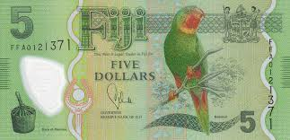

## Table of Contents

## What is the Fijian Dollar?

The Fijian Dollar is the official currency of Fiji, a country in the South Pacific. It is used every day by people in Fiji to buy things like food, clothes, and other goods. The symbol for the Fijian Dollar is $, and sometimes it is written as FJ$ to show it is different from other dollars. One Fijian Dollar is made up of 100 cents.

The Fijian Dollar started being used in 1969, after Fiji stopped using the Fijian pound. The Reserve Bank of Fiji is in charge of the Fijian Dollar. They make sure there is enough money and that it stays valuable. You can find Fijian Dollars in coins and banknotes. The coins come in different sizes, and the banknotes have pictures of important people and places from Fiji.

## When was the Fijian Dollar introduced?

The Fijian Dollar was introduced in 1969. Before that, people in Fiji used the Fijian pound. The switch to the Fijian Dollar happened because Fiji wanted its own money that was easier to use and understand.

The Reserve Bank of Fiji is the group that takes care of the Fijian Dollar. They make sure there is enough money for everyone and that it keeps its value. You can find Fijian Dollars in coins and paper money, with different sizes and pictures on them.

## What is the currency code and symbol for the Fijian Dollar?

The currency code for the Fijian Dollar is FJD. This code is used when people need to talk about or write about the Fijian Dollar in a way that is clear and easy to understand, especially in places like banks or when doing business.

The symbol for the Fijian Dollar is $. To make sure it's not mixed up with other dollars, like the US Dollar, people often write it as FJ$. This symbol is used every day in Fiji when people buy things or talk about money.

## How is the Fijian Dollar abbreviated?

The Fijian Dollar is abbreviated as FJD. This is the official currency code used around the world to talk about the Fijian Dollar. It helps people know which dollar they are talking about, because many countries use dollars.

The symbol for the Fijian Dollar is $. But to make sure it's not confused with other dollars, like the US Dollar, people often write it as FJ$. This way, everyone knows it's the Fijian Dollar they are talking about.

## What are the denominations of Fijian Dollar banknotes and coins?

Fijian Dollar banknotes come in different sizes. You can find them in 5, 10, 20, 50, and 100 dollar notes. Each note has special pictures on it. The 5 dollar note shows a man named Ratu Sir Lala Sukuna, who was an important leader in Fiji. The 10 dollar note has a picture of a woman named Lady Davuilevu, who was also a leader. The 20 dollar note shows a man named Ratu Sir Josefa Lalabalavu Vanayaliyali Sukuna, another important leader. The 50 dollar note has a picture of a man named Ratu Sir George Cakobau, who was a chief. The 100 dollar note shows a picture of a man named Ratu Sir Kamisese Mara, who was the first prime minister of Fiji.

Fijian Dollar coins come in different sizes too. You can find them in 5, 10, 20, and 50 cent coins, as well as 1 and 2 dollar coins. The 5 cent coin is the smallest and shows a turtle. The 10 cent coin shows a prawn. The 20 cent coin has a picture of a fish called a mackerel. The 50 cent coin shows a picture of a fish called a snapper. The 1 dollar coin has a picture of a man named Ratu Sir Lala Sukuna, the same leader on the 5 dollar note. The 2 dollar coin shows a picture of a man named Ratu Sir Penaia Ganilau, who was the first president of Fiji.

## Who issues the Fijian Dollar?

The Fijian Dollar is issued by the Reserve Bank of Fiji. This bank is like the money manager for the whole country. It makes sure there is enough Fijian Dollars for everyone to use and that the money stays valuable. The Reserve Bank of Fiji is very important because it helps keep the economy of Fiji running smoothly.

The Reserve Bank of Fiji decides how many Fijian Dollars to make and when to make them. They also take care of the designs on the banknotes and coins. This includes choosing the pictures of important people and animals that go on the money. By doing all these things, the Reserve Bank of Fiji helps everyone in Fiji use their money easily and trust that it will be worth something.

## What is the exchange rate of the Fijian Dollar to major currencies like the USD and EUR?

The exchange rate of the Fijian Dollar (FJD) to the US Dollar (USD) changes every day. As of now, 1 Fijian Dollar is about 0.45 US Dollars. This means if you have 1 Fijian Dollar, you can get around 45 cents in US money. The exchange rate can go up or down because of many things like how the economy is doing in Fiji and the US, and what people think will happen in the future.

The exchange rate of the Fijian Dollar to the Euro (EUR) also changes daily. Right now, 1 Fijian Dollar is about 0.41 Euros. So, if you have 1 Fijian Dollar, you can get around 41 cents in Euros. Like with the US Dollar, the rate between the Fijian Dollar and the Euro can change because of the economy and what people expect to happen.

## How has the value of the Fijian Dollar changed over the past decade?

Over the past decade, the value of the Fijian Dollar has gone up and down compared to major currencies like the US Dollar and the Euro. At the start of the decade, around 2013, 1 Fijian Dollar was worth about 0.55 US Dollars. By 2023, the value had dropped to around 0.45 US Dollars. This means that over the years, the Fijian Dollar became less valuable compared to the US Dollar. The changes in value were influenced by things like Fiji's economy, tourism, and global events like the COVID-19 pandemic.

When looking at the Euro, the Fijian Dollar also saw changes over the decade. In 2013, 1 Fijian Dollar was worth about 0.42 Euros. By 2023, this had dropped to around 0.41 Euros. The change was not as big as with the US Dollar, but it still shows that the Fijian Dollar lost a bit of its value against the Euro. Factors like trade, inflation, and economic policies in both Fiji and Europe played a role in these changes.

## What factors influence the value of the Fijian Dollar?

The value of the Fijian Dollar changes because of many things. One big reason is how well Fiji's economy is doing. If Fiji makes a lot of money from things like tourism and selling sugar, the Fijian Dollar can become more valuable. But if the economy is not doing well, the Fijian Dollar might lose value. Another reason is what other countries think about Fiji's money. If people believe that Fiji's economy will do well in the future, they might want to buy more Fijian Dollars, which makes it more valuable.

Global events also play a big role in the value of the Fijian Dollar. Things like the COVID-19 pandemic can hurt tourism, which is very important for Fiji's economy. When fewer people come to visit, the Fijian Dollar can lose value. Also, changes in the world's economy, like how much other countries are trading or what their interest rates are, can affect the Fijian Dollar. The Reserve Bank of Fiji tries to manage all these things to keep the Fijian Dollar stable, but it's not always easy.

## How does the Fijian Dollar's performance compare to other Pacific Island currencies?

The Fijian Dollar's performance compared to other Pacific Island currencies can be different over time. For example, compared to the Samoan Tala, the Fijian Dollar has been stronger in recent years. One Fijian Dollar can buy more Samoan Tala now than it could a few years ago. This is because Fiji's economy is bigger and more people visit Fiji for tourism, which helps make the Fijian Dollar more valuable. On the other hand, the Tongan Pa'anga has been a bit weaker than the Fijian Dollar. This means if you have one Fijian Dollar, you can get more Tongan Pa'anga than before. The differences in these values come from how well each country's economy is doing and how much money people are spending there.

The Papua New Guinean Kina is another currency that the Fijian Dollar is compared to. The Fijian Dollar has been doing better than the Kina in recent times. This is because Papua New Guinea's economy has had some problems, like lower prices for the things they sell, like oil and gas. When a country's economy is not doing well, its money can lose value. The Fijian Dollar, however, has been more stable because Fiji has a strong tourism industry and gets money from other countries. All these things show that the Fijian Dollar's value can change a lot compared to other Pacific Island currencies, depending on what is happening in each country's economy.

## What are the economic policies affecting the Fijian Dollar?

The Fijian Dollar is affected by many economic policies set by the Reserve Bank of Fiji. One big policy is how the bank controls the amount of money in the country. If the bank thinks there is too much money, it can take steps to slow down how fast money is made. This can help keep the Fijian Dollar strong. Another policy is setting interest rates. When the Reserve Bank of Fiji changes the interest rates, it can make people want to save more or spend more. If interest rates go up, people might save more money, which can make the Fijian Dollar stronger. If interest rates go down, people might spend more, which can make the Fijian Dollar weaker.

The government of Fiji also has policies that affect the Fijian Dollar. For example, the government can decide to spend more money on things like building roads or schools. When the government spends more, it can help the economy grow, but it might also make the Fijian Dollar weaker if people think there is too much money being spent. The government can also make rules about trading with other countries. If Fiji sells more things to other countries, it can make the Fijian Dollar stronger. But if Fiji buys more things from other countries, it can make the Fijian Dollar weaker. All these policies work together to try and keep the Fijian Dollar stable and help the economy grow.

## How does the tourism industry impact the Fijian Dollar?

The tourism industry is very important for the Fijian Dollar. When lots of people visit Fiji for holidays, they spend money on things like hotels, food, and activities. This money helps make the Fijian economy stronger. When the economy is doing well because of tourism, the Fijian Dollar can become more valuable. More people want to buy Fijian Dollars to spend in Fiji, which makes the currency stronger.

But if fewer people come to Fiji, it can hurt the Fijian Dollar. If there is a big event like a global health crisis or a natural disaster, fewer tourists might visit. When this happens, less money comes into the country, and the Fijian Dollar can lose value. The government and the Reserve Bank of Fiji try to help by making rules and policies to keep the economy and the Fijian Dollar stable, even when tourism goes down.

## References & Further Reading

[1]: ["Advances in Financial Machine Learning"](https://www.amazon.com/Advances-Financial-Machine-Learning-Marcos/dp/1119482089) by Marcos Lopez de Prado

[2]: ["Evidence-Based Technical Analysis: Applying the Scientific Method and Statistical Inference to Trading Signals"](https://www.amazon.com/Evidence-Based-Technical-Analysis-Scientific-Statistical/dp/0470008741) by David Aronson

[3]: ["Machine Learning for Algorithmic Trading"](https://github.com/stefan-jansen/machine-learning-for-trading) by Stefan Jansen

[4]: ["Quantitative Trading: How to Build Your Own Algorithmic Trading Business"](https://www.amazon.com/Quantitative-Trading-Build-Algorithmic-Business/dp/1119800064) by Ernest P. Chan

[5]: Wang, C., & Chao, H. C. (2018). ["A Survey of Recent Advances in Currency Trading Strategies Using Machine Learning."](https://www.researchgate.net/profile/Wen-Hung-Chao/publication/330286674_Using_Augmented_Reality_to_Enhance_and_Engage_Students_in_Learning_Mathematics/links/5ca32826a6fdccab2f67d8b2/Using-Augmented-Reality-to-Enhance-and-Engage-Students-in-Learning-Mathematics.pdf) IEEE Access, 6, 65568-65579. doi:10.1109/ACCESS.2018.2858488