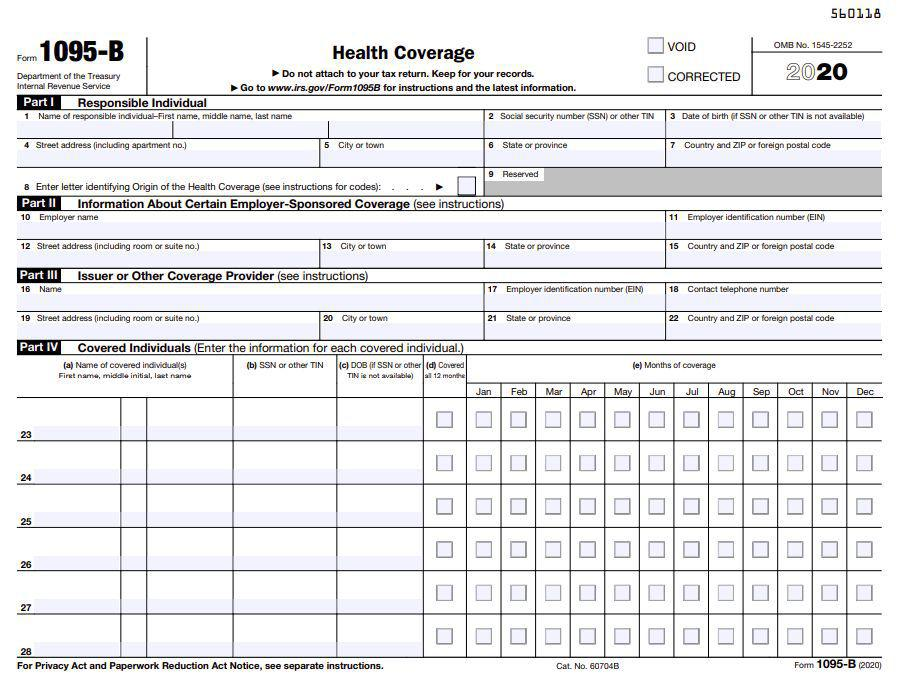

The insurance industry operates within a multifaceted regulatory framework that aims to harmonize the needs of insurance companies with the interests of consumers. This intricate balancing act is achieved through the implementation of specific regulations, rating systems, file-and-use laws, and the emerging influence of algorithmic trading. Insurance regulation involves a variety of practices across different states, each crafting their own approach to monitoring the activities of insurance providers. The core objective is to safeguard consumer interests while ensuring insurers' financial stability. This is crucial for sustaining public trust and ensuring a competitive marketplace.

Insurance rating systems are vital in determining policy premiums, and the file-and-use regulatory structure adds an additional layer of complexity. Under file-and-use laws, companies can apply new rates without immediate state approval, allowing them to remain responsive to market conditions. This flexibility comes with oversight, as unjustifiable rates can be subsequently rejected by regulators. Thus, these laws embody a delicate equilibrium between responsiveness to market demands and consumer protection.

Furthermore, algorithmic trading is gaining traction in the insurance industry. While traditionally associated with financial markets, this method, utilizing powerful algorithms, is beginning to reshape investment strategies and pricing models within the insurance sector. This development presents both opportunities and challenges, as it can enhance operational efficiency yet pose risks to market stability.

The dynamics of regulation, insurance rating, file-and-use laws, and algorithmic trading collectively frame the insurance market's regulatory landscape. Understanding these interconnections is essential in ensuring fairness and stability. As we advance further into the digital age, continuous evolution of the regulatory framework will be necessary to safeguard consumer interests and uphold market integrity.

## Table of Contents

## Understanding Insurance Regulation

Insurance regulation is predominantly managed at the state level across the United States, with each state applying its own tailored methodologies to oversee insurance activities. This decentralized approach stems from the McCarran-Ferguson Act of 1945, which granted states the primary authority to regulate and tax insurance, with limited federal intervention. The diversity in regulatory frameworks allows states to address the specific needs and conditions of their insurance markets.

The primary objectives of insurance regulation include consumer protection, the assurance of fair pricing policies, and the preservation of insurance company solvency. Consumer protection is a paramount concern, ensuring that policyholders receive the benefits they are promised and are treated fairly by insurers. This involves regulations that require clear disclosure of policy terms and conditions, as well as mechanisms for addressing consumer complaints and disputes.

Fair pricing policies are another critical focus. Insurance regulators are tasked with ensuring that the rates charged by insurance companies are neither excessively high nor unfairly discriminatory. This involves evaluating factors such as risk assessments, loss predictions, and administrative costs that contribute to the determination of premiums. Regulators utilize various methods to ensure fairness, including prior approval of rate changes, rate review processes, and public hearings.

Maintaining the solvency of insurance companies is crucial for market stability and consumer confidence. Regulatory bodies monitor the financial health of insurers through requirements for financial reporting, asset-liability matching, and risk-based capital standards. This oversight helps to prevent the failure of insurers, which could result in significant financial losses for policyholders and wider economic repercussions.

Regulatory bodies, such as state insurance departments, play a vital role in overseeing insurance practices. They are responsible for approving rate changes, licensing insurers and [agents](/wiki/agents), and conducting examinations to ensure compliance with laws and regulations. Their actions help to prevent abusive practices and ensure that the insurance market operates smoothly and fairly.

In addition to consumer protection, fair pricing, and solvency, insurance regulations also aim to promote competition within the industry. Competitive markets benefit consumers through more choices, better services, and lower prices. By fostering a competitive environment, regulations encourage innovation and efficiency among insurers while safeguarding consumer interests.

The dynamic nature of the insurance industry, driven by technological advancements and market changes, demands that regulatory frameworks continuously adapt. Regulators must be vigilant and flexible to effectively manage the complexities of the modern insurance landscape, ensuring that the market remains fair, competitive, and stable.

## Insurance Rating and File-and-Use Laws

Insurance rating is the systematic process by which insurance companies establish the premiums charged for insurance policies. This process requires a meticulous assessment of risk factors associated with the insured entity, taking into account elements such as historical claims data, statistical analyses, and potential future risks. The objective is to align premium rates with the anticipated risk and cost of claims, ensuring the financial viability of the insurer while providing a fair price for the insured.

File-and-use laws are a regulatory mechanism that permits insurance companies to apply new rate changes immediately, without waiting for prior approval from state regulators. Under these laws, insurers can adapt rapidly to dynamic market conditions such as shifts in risk patterns or financial market fluctuations. However, this expedited implementation is monitored under stipulations that allow regulatory authorities to later review, and if necessary, reject changes deemed unjustifiable or excessive. This post-facto scrutiny ensures that consumer interests are safeguarded from potential exploitation or unfair rate practices.

File-and-use laws offer a degree of flexibility beneficial to both insurers seeking timely adjustments to pricing models and consumers preferring responsive insurance products. Conversely, other regulatory models adopt varying degrees of restrictiveness. For instance, prior approval laws require insurers to obtain regulatory consent before implementing any rate changes. This approach emphasizes consumer protection by preempting any potential for unreasonable pricing, albeit at the cost of delayed responsiveness to market conditions. Use-and-file laws, meanwhile, allow insurers to deploy new rates immediately but mandate subsequent filing for regulatory review, striking a middle ground between adaptability and oversight.

Flex-rating introduces another layer of complexity, establishing thresholds (maximum and minimum percentages) within which insurers can adjust rates without prior approval. This method provides a compromise by permitting insurers some leeway to modify rates in response to modest market variations, while still invoking regulatory scrutiny for more significant rate changes. Each of these frameworks exemplifies the diverse methodologies employed by states to regulate insurance pricing, reflecting a balance between fostering a competitive insurance market and protecting consumer rights.

## Algorithmic Trading in Insurance

Algorithmic trading, characterized by the utilization of intricate algorithms to conduct trades at rapid speeds, is increasingly influential in the insurance industry. Although it is traditionally linked with financial markets, [algorithmic trading](/wiki/algorithmic-trading) also impacts insurance pricing models and investment strategies significantly, enabling insurers to evaluate vast amounts of data to forecast future trends. This computational approach allows insurers to optimize their portfolios, ensuring they maintain adequate capital while hedging against potential risks.

Algorithmic trading in insurance offers several advantages, chiefly enhancing operational efficiency. By automating trading decisions based on real-time data analysis, insurers can reduce latency in executing trades, minimize transaction costs, and capture market opportunities swiftly. For instance, algo trading algorithms might include factors such as interest rates, stock prices, and economic indicators to predict movements and make investment decisions. This automatic processing of data and subsequent execution of trades lead to considerable time savings and improved investment outcomes.

However, the incorporation of algorithmic trading into insurance also poses risks. The high-speed nature of algorithmic trading could exacerbate market [volatility](/wiki/volatility-trading-strategies), create systemic risks, and lead to flash-crash scenarios if not properly managed. Additionally, algorithmic systems operating on flawed assumptions or inadequate data can result in significant financial losses. Therefore, the algorithms used need to be thoroughly tested and continuously monitored to ensure reliability and accuracy.

From a regulatory standpoint, adapting frameworks to manage the challenges of algorithmic trading is essential. Regulators must ensure that these practices do not compromise market integrity and consumer interests. This involves fostering transparency in algorithmic processes, setting standards for algorithm testing and validation, and enforcing robust data security measures. Monitoring and auditing algo-trading systems can aid in the early detection of anomalies and prevent potential abuses, maintaining the stability of insurance markets.

Overall, the rise of algorithmic trading within the insurance industry highlights the need for a balanced approach. Leveraging its benefits and mitigating associated risks requires a continuous evolution of regulatory policies to accommodate the fast-paced changes driven by technological advancements.

## Challenges and Implications

Balancing innovation with consumer protection presents significant challenges in insurance regulation, especially in today's fast-paced technological environment. File-and-use laws are a prime example of regulatory efforts to strike this balance. These laws provide insurance companies with the agility to adapt rapidly to market changes by allowing them to implement rate changes without prior approval from regulatory authorities. However, this flexibility is tempered by regulatory oversight, as regulators retain the power to reject changes that are deemed unjustified or detrimental to consumer interests. This dual mechanism seeks to protect consumers while enabling insurers to remain competitive in a dynamic market.

The growing influence of algorithmic trading in the insurance sector underscores the need for continual updates to regulatory policies. While algorithmic trading offers opportunities for efficiency and improved pricing models, it also introduces potential risks such as market disruptions and unfair trading practices. The automation and speed intrinsic to algorithmic trading can lead to scenarios where trades are executed in milliseconds, possibly resulting in market volatility. Regulators are tasked with crafting appropriate frameworks that mitigate these risks to ensure market stability and integrity. They must develop and enforce policies that address the unique characteristics of algorithmic systems, encompassing aspects like data usage, decision-making transparency, and the prevention of manipulative practices.

Insurance regulators are called to be vigilant and proactive in monitoring the interplay between technological advancement and market behavior. As technology continues to evolve, the challenge for regulators is not only to respond reactively to emerging risks but also to anticipate potential disruptions and integrate foresight into regulatory strategies. Staying informed about technological trends and engaging with industry stakeholders are crucial steps in this process. This proactive stance helps maintain public trust in the insurance system by ensuring that consumer protections keep pace with innovations. Effective regulation of the insurance industry must thus blend adaptability with consumer safeguards, creating an environment where both industry innovation and consumer interests thrive harmoniously.

## Conclusion

The interaction between insurance regulation, rating systems, file-and-use laws, and algorithmic trading forms the backbone of a well-functioning insurance sector. These elements together foster an environment where innovation can flourish alongside adherence to regulatory standards. Insurance regulation ensures that consumer interests are protected, while robust rating systems and file-and-use laws allow insurers the flexibility needed to adapt to market changes swiftly.

However, this confluence of elements also poses challenges. The evolving landscape of technology and financial practices, particularly with the rise of algorithmic trading, introduces complexities that demand vigilant regulatory oversight. Algorithmic trading offers potential for increased efficiencies and enhancements in pricing accuracy, yet it also introduces risks like market volatility and trading malpractices that regulators must address.

Ensuring a fair, competitive, and stable insurance industry requires a nuanced understanding of these dynamics. Regulators play a pivotal role in this system by crafting policies that balance innovation with consumer protection. Specialists equipped with this understanding can anticipate and mitigate potential risks before they disrupt market stability.

As technology and market conditions continue to advance, maintaining an effective regulatory framework is imperative. Such a framework must be agile enough to incorporate technological advancements while steadfast in its goal of protecting consumers and maintaining market integrity. By doing so, regulators not only safeguard the interests of policyholders but also ensure the long-term stability and competitiveness of the insurance industry.

## References & Further Reading

[1]: Witt, Robert C., and Randall S. Cummins. ["Insurance Operations, Regulation, and Statutory Accounting."](https://archive.org/details/isbn_9780894633515_3ed) (2004).

[2]: Harrington, Scott E., and Greg Niehaus. ["Risk Management and Insurance."](https://books.google.com/books/about/Risk_Management_and_Insurance.html?id=qibvQQAACAAJ) McGraw-Hill Education, 2003.

[3]: ["The McCarran-Ferguson Act: A Primer."](https://en.wikipedia.org/wiki/McCarran%E2%80%93Ferguson_Act) Congressional Research Service, 2018.

[4]: ["Algorithmic and High-Frequency Trading"](https://www.amazon.com/Algorithmic-High-Frequency-Trading-Mathematics-Finance/dp/1107091144) by Álvaro Cartea, Sebastian Jaimungal, and José Penalva

[5]: ["Lloyd's Emerging Risks Report - Algorithmic and High-Frequency Trading"](https://assets.lloyds.com/assets/pdf-emerging-risks-report-2015/1/pdf-emerging-risks-report-2015) by Lloyd's of London

[6]: Cummins, J. David, and Mary A. Weiss. ["Systemic Risk and the U.S. Insurance Sector."](https://www.jstor.org/stable/24548080) National Bureau of Economic Research, 2011.