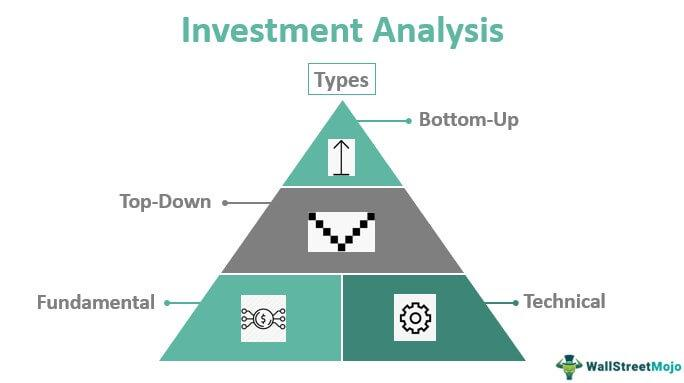

In the fast-paced world of investing, trade execution and algorithmic trading have transformed how financial transactions are conducted. The digital age has introduced technologies that allow trades to be executed with unprecedented speed and precision, reshaping the financial markets. Trade execution involves the process of completing a buy or sell order for securities or commodities once it is placed on a trading platform. This process is integral to investing, as it ensures that the intention to transact is fulfilled in the market.

Algorithmic trading, commonly known as algo trading, plays a pivotal role in modern trading environments by utilizing sophisticated computer programs to execute trades according to predetermined criteria. Algorithms systematically assess vast amounts of market data to make informed decisions, executing trades at speeds and frequencies far beyond human capability. This technological advancement not only increases efficiency but also minimizes emotional biases and human errors that often affect trading outcomes.



Understanding the dynamics of trade execution and algorithmic trading is crucial for investors who want to maintain a competitive edge. These concepts influence the way investors approach the market, making them an essential component of any investing strategy. Enhanced execution methods and the strategic application of algorithms can lead to better returns, reduced transaction costs, and optimized investment processes.

In this article, we will explore how trade executions are carried out, the intricacies of fill orders, and the expanding role of algorithmic trading in the financial industry. By gaining insight into these elements, investors can better navigate the complexities of the modern market landscape, ensuring that they remain at the forefront of investment innovation.

## Table of Contents

## Understanding Trade Execution and Fills

Trade execution is the process of completing a buy or sell order for a security or commodity in the financial market. This crucial component of trading signifies the actual transaction taking place when a buyer and seller agree on a price and quantity. The process of trade execution involves several vital aspects, including order types, execution strategies, and detailed reporting for the assessment of their effectiveness.

A "fill" occurs when an order is executed. It details the price at which the trade was completed and the volume of the transaction. The fill reflects the market conditions at the time of execution and represents the culmination of the order process. Orders can be partially or fully filled, depending on market [liquidity](/wiki/liquidity-risk-premium) and order specifications.

Different types of fill orders play a significant role in trade execution. These include:

1. **Market Orders:** These orders are executed immediately at the current market price. They guarantee execution but not the price, making them ideal for trades requiring immediacy but introducing the risk of slippage – the difference between the expected and actual execution price.

2. **Limit Orders:** Here, a trade executes only at a specified price or better. These orders offer price control and prevent the trader from buying higher or selling lower than desired. However, they do not guarantee execution, especially in rapidly changing markets.

3. **Stop Orders:** These become market orders once a specific price level, the stop price, is reached. Stop orders help manage risk by limiting losses or protecting profits in volatile markets.

Execution strategies are essential in ensuring success in trading. They involve decision-making processes and tools that optimize the parameters around how, when, and where trades are executed. An effective execution strategy often employs algorithms and sophisticated technology to minimize market impact and costs while maximizing execution quality.

Trade reporting is a critical component of the execution process, providing traders and regulatory bodies with necessary information about trade completion. Reports typically include data on fill prices, timestamps, and the [volume](/wiki/volume-trading-strategy) of trades executed. This information is vital for traders to assess execution performance, analyze market behavior, and refine their trading strategies.

Overall, understanding and utilizing appropriate order types, execution strategies, and precise trade reporting are fundamental to effective trade execution. This knowledge enables traders to navigate the complexities of financial markets, ensuring decisions are executed optimally to meet their investment objectives.

## What Is Algorithmic Trading?

Algorithmic trading, often referred to as algo trading, involves the use of computer programs designed to execute trades based on predefined parameters. These parameters can include specific financial models, rules for trade entry and [exit](/wiki/exit-strategy), or other algorithmic strategies designed to capitalize on market inefficiencies.

Unlike traditional trading, which relies heavily on human judgment and can be influenced by emotional factors, [algorithmic trading](/wiki/algorithmic-trading) operates at speeds and frequencies beyond the capability of human traders. Algorithms are capable of analyzing multiple market conditions simultaneously and making decisions based on pre-configured rules. This automated approach allows for a more systematic trading process, minimizing human errors and biases.

Algo trading typically involves the use of complex mathematical models and quantitative analysis to determine the best possible trading strategies. The process involves several key components, often beginning with coding algorithms in programming languages such as Python. The following is a simple illustration of how an algorithmic trade might be prepared and executed:

```python
# Simple Example of a Moving Average Crossover Strategy
import pandas as pd

# Assume 'data' is a DataFrame containing market price data
data['short_ma'] = data['price'].rolling(window=10).mean()
data['long_ma'] = data['price'].rolling(window=50).mean()

def trading_strategy(data):
    signals = []
    for i in range(1, len(data)):
        if data['short_ma'].iloc[i] > data['long_ma'].iloc[i] and data['short_ma'].iloc[i-1] <= data['long_ma'].iloc[i-1]:
            signals.append('Buy')
        elif data['short_ma'].iloc[i] < data['long_ma'].iloc[i] and data['short_ma'].iloc[i-1] >= data['long_ma'].iloc[i-1]:
            signals.append('Sell')
        else:
            signals.append('Hold')
    return signals

data['signal'] = trading_strategy(data)
```

This simple moving average crossover strategy demonstrates the principle behind algorithmic trading: creating systematic rules based on quantitative analysis that dictate trade actions.

Moreover, algorithmic trading leverages the advantages of speed and precision in trading operations. Since it is executed by automated systems, it can respond to market changes and execute trades within milliseconds. This is particularly advantageous in high-frequency trading, where even minute price movements can be exploited for profit. 

Overall, algorithmic trading provides a robust framework for executing trades that leverage market trends, enhance efficiency, and offer a level of consistency that is difficult to achieve through manual trading processes.

## How Algorithmic Trading Works

Algorithmic trading operates by utilizing pre-defined criteria to automatically execute trades. These criteria often include technical indicators such as moving averages, Relative Strength Index (RSI), or other financial metrics. For example, a simple moving average (SMA) strategy might involve executing a buy order when a short-term SMA crosses above a long-term SMA, signaling a potential upward trend.

A core advantage of algorithmic trading is its capability to execute across multiple markets simultaneously. Sophisticated algorithms are designed not only to identify opportunities within a single market but also to optimize execution by arbitraging price differences across various markets, ensuring optimal pricing and minimal latency.

High-frequency trading ([HFT](/wiki/high-frequency-trading-strategies)) is a subset of algorithmic trading, characterized by rapid trade execution and the analysis of vast data sets. HFT algorithms exploit market inefficiencies by making numerous trades in fractions of a second. They utilize complex mathematical models and statistical analyses to predict market movements. For instance, if an imbalance in the supply and demand of a stock is detected, an HFT algorithm might quickly execute trades to capitalize on the anticipated price correction.

These algorithms are built to process large volumes of historical and real-time data, requiring sophisticated data handling and computational power. The underlying code might be implemented in Python, C++, or Java, with Python being particularly popular for its rich ecosystem of libraries suited for financial analysis.

Here's a simple Python example illustrating a basic moving average crossover strategy:

```python
import numpy as np
import pandas as pd

# Assuming 'data' is a pandas DataFrame with a 'Close' column for closing prices
short_window = 40
long_window = 100

# Generate the moving averages
data['Short_MA'] = data['Close'].rolling(window=short_window, min_periods=1).mean()
data['Long_MA'] = data['Close'].rolling(window=long_window, min_periods=1).mean()

# Create signals
data['Signal'] = 0
data.loc[data['Short_MA'] > data['Long_MA'], 'Signal'] = 1
data.loc[data['Short_MA'] <= data['Long_MA'], 'Signal'] = -1
```

In this example, the algorithm generates buy signals when the short-term moving average exceeds the long-term moving average, and sell signals when the opposite is true. This illustrates how predefined mathematical models can drive trading decisions without human intervention, providing a systematic and efficient approach to trading.

## Advantages and Disadvantages of Algo Trading

Algorithmic trading (algo trading) offers a range of benefits that have revolutionized the financial markets. One of the primary advantages is improved efficiency. Algorithms can process complex calculations and execute trades at speeds and volumes that are unattainable by human traders. This computational ability enables traders to capitalize on fleeting market opportunities, leading to enhanced execution speed.

Another significant benefit is the reduction in transaction costs. Algorithms can execute trades with precision, minimizing the market impact that often comes with large orders. This precision reduces slippage and other costs associated with manual trading. Additionally, algo trading systems can be optimized to choose the best trading venues and times, further reducing costs.

Algo trading also mitigates human error and emotional decision-making. Human traders are prone to emotional biases that can lead to poor trading decisions. Algorithms, by contrast, execute trades based on pre-set parameters, ensuring that trading decisions are logical and consistent. This systematic approach reduces the chances of making impulsive trades based on market [volatility](/wiki/volatility-trading-strategies) or other psychological factors.

However, algorithmic trading is not without its drawbacks. It heavily relies on technology, which means that system failures can have significant consequences. A technical malfunction could result in missed trading opportunities or erroneous trades. Moreover, the reliance on technology raises concerns about cybersecurity risks and the potential for unauthorized access to trading systems.

Another disadvantage is the risk of market manipulation. Sophisticated algorithms might engage in practices like spoofing, where false orders are placed to manipulate market prices. This practice can lead to market instability and is a significant concern for regulators.

In summary, while algorithmic trading enhances efficiency, speed, and cost-effectiveness, it also introduces challenges related to technological reliance and ethical trading practices. Understanding these advantages and disadvantages is essential for anyone considering the adoption of algorithmic trading strategies.

## Types of Algorithmic Trading Strategies

Algorithmic trading employs various strategies to capitalize on financial market opportunities. These strategies can be broadly categorized based on their underlying principles and goals.

Trend-following strategies are among the most common in algorithmic trading. These strategies aim to capitalize on the [momentum](/wiki/momentum) of market trends, allowing traders to buy and sell based on expected price movements due to historical data patterns. A typical trend-following strategy may use technical indicators like moving averages, such as the Exponential Moving Average (EMA). An algorithm might implement a moving average crossover strategy, where a short-term EMA crossing above a long-term EMA signals a buy order, while the reverse signals a sell order. Python code for a simple moving average crossover might look like this:

```python
import pandas as pd

# Assume df is a DataFrame with a 'Close' column for prices
short_window = 40
long_window = 100

df['short_mavg'] = df['Close'].rolling(window=short_window, min_periods=1, center=False).mean()
df['long_mavg'] = df['Close'].rolling(window=long_window, min_periods=1, center=False).mean()

df['signals'] = 0
df['signals'][short_window:] = np.where(df['short_mavg'][short_window:] > df['long_mavg'][short_window:], 1.0, -1.0)
```

Arbitrage opportunities present another class of algorithmic trading strategies, focusing on exploiting price inefficiencies across different markets or instruments. Arbitrageurs look to profit from price discrepancies by simultaneously buying and selling equivalent assets in different markets. For instance, statistical [arbitrage](/wiki/arbitrage) strategies use mathematical models to identify and exploit small price differences in similar or correlated securities.

Index fund rebalancing strategies involve algorithmic trades that adjust portfolio weights to match a desired benchmark index. This ensures the portfolio remains aligned with a particular index by buying and selling assets based on the changes in the index constituents.

Volume Weighted Average Price (VWAP) and Time Weighted Average Price (TWAP) strategies aim to execute large orders with minimal market impact. VWAP strategies execute trades across a day to ensure the average price is near the VWAP, minimizing the trader's impact on the market. TWAP, on the other hand, spreads the trade evenly over a specified time to avoid detection by other market participants, reducing price slippage.

Each of these strategies operates based on specific rules and desired outcomes, allowing traders to approach varying market conditions with tailored methodologies. The choice of strategy depends on the market environment, asset class, and the trader's objectives, each aiming to maximize returns while controlling risk.

## Technological Requirements for Algo Trading

Successful algorithmic trading relies heavily on technological resources and infrastructure to function effectively. One of the key requirements is advanced computing capabilities. This involves powerful hardware that can process vast amounts of data rapidly. High-performance processors, sufficient RAM, and fast storage solutions are essential to handle complex calculations and execute trades at high speeds without delay. Moreover, parallel processing capabilities can enhance performance by leveraging multiple cores to handle different tasks simultaneously, crucial for high-frequency trading strategies.

Reliable network connectivity is another essential [factor](/wiki/factor-investing) for algo trading. A stable and fast internet connection is necessary to ensure that trading algorithms receive and process real-time market data promptly. This minimizes latency and ensures that trades are executed at the intended times, thereby reducing slippage, which can adversely affect the profitability of a trade.

Traders must access both historical and real-time market data to make informed trading decisions. Historical data is used extensively for [backtesting](/wiki/backtesting), where algorithms are tested against past market conditions to evaluate their performance. This requires comprehensive datasets that include price movements, volume, and other market indicators. Real-time data, on the other hand, is crucial for live trading, enabling algorithms to adapt to current market conditions and execute trades dynamically. Data vendors like Bloomberg, Reuters, and others offer comprehensive feeds that can be integrated into trading systems to provide the necessary market information.

Programming skills are indispensable for developing and maintaining algorithmic trading systems. Knowledge of programming languages such as Python, C++, or Java is crucial as these languages are commonly used in algorithm development. Here is a simple Python example that demonstrates a moving average crossover strategy using financial data:

```python
import pandas as pd
import numpy as np

# Sample market data
data = pd.DataFrame({
    'Price': [105, 107, 108, 110, 108, 109, 110, 112, 113, 115]
})

# Calculate simple moving averages
data['Short_MA'] = data['Price'].rolling(window=3).mean()
data['Long_MA'] = data['Price'].rolling(window=5).mean()

# Generate buy/sell signals
data['Signal'] = 0
data.loc[data['Short_MA'] > data['Long_MA'], 'Signal'] = 1
data.loc[data['Short_MA'] < data['Long_MA'], 'Signal'] = -1

print(data)
```

This code snippet calculates short-term and long-term moving averages and generates buy or sell signals based on the crossover of these averages.

In addition to programming, algorithmic traders need competencies in [statistics](/wiki/bayesian-statistics) and data analysis to develop strategies based on quantitative models. The ability to adjust algorithms in response to market changes and new insights is vital for maintaining an edge in competitive markets.

In conclusion, successful algorithmic trading requires a robust technological foundation, including powerful computing hardware, reliable connectivity, comprehensive market data, and proficient programming skills. These technological requirements form the backbone of effective and efficient trading system development and execution.

## Conclusion

Trade execution, fills, and algorithmic trading are integral components of modern investing, providing investors with the tools to navigate dynamic financial markets effectively. These elements, driven by technological advancements, empower traders to execute orders with precision and speed, essential for maintaining a competitive edge. By leveraging algorithmic trading, investors can perform complex transactions efficiently, reducing the time and costs traditionally associated with manual trading.

Algorithmic trading, in particular, offers a systematic approach to trading, minimizing the influence of human emotion and error. Through the use of sophisticated algorithms, traders can capitalize on market trends and execute high-frequency trades at speeds unattainable by human traders. This capability not only enhances execution speed but also improves overall decision-making processes, allowing for more informed and strategic investments.

Understanding the intricacies of trade execution and fills is crucial for investors seeking to harness these opportunities. Each aspect, from realizing different types of fill orders to deploying effective execution strategies, contributes to the overall success of investment strategies. The knowledge of algorithmic trading further allows investors to adapt to varying market conditions swiftly, providing a framework for decision-making that integrates historical data and real-time analysis.

In conclusion, the convergence of trade execution, fills, and algorithmic trading underpins a robust platform for modern investors. Mastery of these components ensures that investors remain agile and responsive to market changes, optimizing their investment outcomes. Embracing the complexities of these processes fosters a proactive approach to investing, crucial for thriving in today's ever-evolving financial landscape.

## References & Further Reading

[1]: Bergstra, J., Bardenet, R., Bengio, Y., & Kégl, B. (2011). ["Algorithms for Hyper-Parameter Optimization."](https://papers.nips.cc/paper/4443-algorithms-for-hyper-parameter-optimization) Advances in Neural Information Processing Systems 24.

[2]: ["Advances in Financial Machine Learning"](https://www.amazon.com/Advances-Financial-Machine-Learning-Marcos/dp/1119482089) by Marcos Lopez de Prado

[3]: ["Evidence-Based Technical Analysis: Applying the Scientific Method and Statistical Inference to Trading Signals"](https://books.google.com/books/about/Evidence_Based_Technical_Analysis.html?id=MeoJAQAAMAAJ) by David Aronson

[4]: ["Machine Learning for Algorithmic Trading"](https://github.com/stefan-jansen/machine-learning-for-trading) by Stefan Jansen

[5]: ["Quantitative Trading: How to Build Your Own Algorithmic Trading Business"](https://www.amazon.com/Quantitative-Trading-Build-Algorithmic-Business/dp/1119800064) by Ernest P. Chan