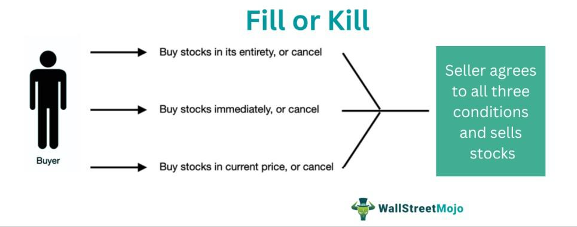

The stock market is a multifaceted arena where precision and timing are paramount, particularly for active traders. A myriad of order types exists to offer varying degrees of control over trade execution, each designed to meet specific strategic needs. Among these, the Fill or Kill (FOK) order stands out as a unique tool that caters to traders who require immediate and complete fulfillment of their trades. The Fill or Kill order is particularly relevant in scenarios where partial execution is not an option and certainty in trade execution is crucial. 

This article will explore FOK orders, examining their application in stock trading and their integration into algorithmic trading systems. Algorithmic trading, which relies on automated systems to execute trades under predefined conditions, can leverage FOK orders to capitalize on fleeting market opportunities with precise execution requirements. For traders, both human and algorithmic, understanding the nuances of FOK orders can prove invaluable in enhancing their strategic approach to trading. By engaging with this content, readers will gain insight into the nature of FOK orders and their strategic benefits, paving the way for more effective trade planning and execution.



## Table of Contents

## What is a Fill or Kill (FOK) Order?

A Fill or Kill (FOK) order is a distinctive trading order type used within financial markets, demanding that an entire order be executed immediately and entirely, or not at all. This order type is specifically designed to prevent the partial execution of trades, which can be critical in scenarios involving large transactions where partial fills might result in significant discrepancies in execution prices. 

In practice, when a trader places an FOK order, they are signaling to the broker that full execution is non-negotiable. This means if the broker cannot immediately match the order with available buyers or sellers in the market, the order is canceled outright. This characteristic makes FOK orders particularly useful in volatile and illiquid markets where price movements are rapid and unpredictable.

The functionality of FOK orders within stock trading can be understood by considering the execution dynamics it enforces. For instance, in a typical stock exchange environment, when an FOK order is placed, it is directed to the market order book. The order book aggregates buy and sell orders at various price levels, and the FOK order must be matched in its entirety with the existing orders within a very brief time frame. If the market cannot provide the exact quantity needed, the order is immediately rescinded. 

This all-or-nothing approach ensures traders either fully capitalize on their trading strategy or not at all, avoiding the risks and costs associated with partial fills. FOK orders are frequently employed by institutional investors and large-scale traders who manage significant volumes and require stringent control over trade execution to maintain the effectiveness of their investment strategies.

FOK orders are distinguished by their immediate requirement for execution, which contrasts with other order types that might allow multiple execution attempts or partial fills over time. This immediacy is grounded in their core objective: to allow traders to capitalize on specific market conditions or trading strategies that necessitate wholesale execution to achieve their intended outcomes. 

In summary, FOK orders serve a crucial role in the trading strategies of those requiring guaranteed execution conditions, providing a tool designed to mitigate the risks associated with adverse price movements and ensuring operational efficiency in high-stakes trading environments.

## Mechanics of FOK Orders

A Fill or Kill (FOK) order is a directive in trading that requires immediate and full execution of an order; failing which, the order is canceled. This mechanism is essential for traders who need to ensure the certainty of an execution price or the completion of a trade without any partial fulfillment. FOK orders are designed to manage the risks associated with partial fills, which can result in exposure to unwanted price changes.

### Execution Process

When a FOK order is placed, a broker or algorithm evaluates the current market conditions to determine whether the entire order can be fulfilled at the desired price. This is executed in a very short time frame, typically within seconds or even milliseconds in electronic trading environments. If the total [volume](/wiki/volume-trading-strategy) of the order is available at the specified price, the trade is executed in its entirety. If not, the order is immediately canceled. This binary outcome—complete execution or none—makes FOK orders unique.

### Application in Market Systems

In different trading systems and markets, FOK orders serve distinct purposes:

1. **Stock Exchanges**: In highly volatile markets, such as stock exchanges where prices fluctuate rapidly, FOK orders are particularly useful. They protect traders from partial fills that may occur at suboptimal prices, thereby ensuring price stability and trade finality. For example, a trader looking to acquire a large block of shares without affecting the market price could use a FOK order.

2. **Fixed Income and Forex Markets**: In these markets, liquidity can vary significantly, and large trades may not always find immediate counterparts. FOK orders can help institutional traders either execute substantial trades instantly or withdraw them without incurring losses due to partial executions.

3. **Electronic Trading Platforms**: Algorithmic trading platforms often integrate FOK functionality to automate trading strategies that rely on precise timing and full quantity fulfillment. Here, algorithms quickly assess the market and execute or cancel FOK orders based on predefined criteria. The speed of execution in digital platforms makes FOK orders practical for strategy-driven trading, where execution timing is critical.

### Technical Implementation

In [algorithmic trading](/wiki/algorithmic-trading), the logic for executing a FOK order could be implemented as follows in Python:

```python
def execute_fok_order(order_book, trade_order):
    # Check if the total available volume at the order price or better is sufficient
    available_volume = sum(volume for price, volume in order_book.items() if price <= trade_order['price'])

    # Evaluate if the available volume meets or exceeds the order's volume
    if available_volume >= trade_order['volume']:
        # Execute the order
        print("Order executed: Full fill")
        # Remove volumes from the order book (simple illustration)
        for price in sorted(order_book.keys()):
            if trade_order['volume'] > 0 and price <= trade_order['price']:
                if order_book[price] >= trade_order['volume']:
                    order_book[price] -= trade_order['volume']
                    trade_order['volume'] = 0
                else:
                    trade_order['volume'] -= order_book[price]
                    order_book[price] = 0
    else:
        # Cancel the order
        print("Order canceled: No full fill")
```

This logic evaluates if the entire order volume is available at the desired price level or better. If so, the order is executed, and the volumes are updated in the [order book](/wiki/order-book-trading-strategies). If not, the order is canceled, ensuring no partial trade occurs.

### Practical Considerations

While FOK orders provide certainty and simplicity, they come with limitations. Since they require complete fulfillment, they might not always execute, especially in markets with low [liquidity](/wiki/liquidity-risk-premium) or high [volatility](/wiki/volatility-trading-strategies). This necessitates a thorough understanding of market conditions and strategic considerations when choosing to use FOK orders. Understanding these mechanics aids traders in mitigating risks associated with market fluctuations and achieving their trading objectives with greater precision.

## Comparison with Other Order Types

Fill or Kill (FOK) orders, Immediate or Cancel (IOC) orders, and All or None (AON) orders are specialized trading directives, each offering distinct mechanisms that cater to different trading needs. Understanding the nuances of these order types is crucial for traders striving to orchestrate precise execution strategies.

### Fill or Kill (FOK) Order

An FOK order mandates that the entire order size be executed immediately; if it cannot be fulfilled in full at the time of placement, it is canceled outright. This characteristic makes FOK orders appealing for traders prioritizing complete execution without delay over the potential for price slippage. These orders are particularly useful in large transactions where market impact is a concern.

### Immediate or Cancel (IOC) Order

IOC orders, while similar to FOK orders, provide more flexibility. They allow for immediate execution of any available portion of the order, with the rest being canceled if not instantly executable. This means even partial fills can occur, making IOC orders advantageous for traders willing to accept partial satisfaction of their order to capture fleeting market opportunities.

### All or None (AON) Order

AON orders require the entire order to be filled but do not demand immediate execution. These orders patiently sit in the market until they are fully matchable, or they expire unexecuted. AON orders can be limited by the availability of matching opposite orders, yet they remain relevant when complete execution without urgency is desired.

### Strategic Implications

Choosing between FOK, IOC, and AON orders involves analyzing trade-off dynamics. FOK orders are employed when total execution is critical, rendering them suitable for large institutional trades or when avoiding partial fills is essential. In contrast, IOC orders appeal to traders seeking to exploit immediate, albeit partial, market opportunities without leaving residual orders vulnerable to price changes. Conversely, AON orders serve traders focused on full execution without immediate time constraints, often in less liquid market conditions.

### Leveraging Differences

Traders adeptly leverage these order types to optimize trading strategies:

- **Volatility Management**: FOK orders are strategic when volatility might prevent full execution, as they eliminate uncertainty about partial fills.

- **Liquidity Seekers**: IOC orders are preferred in rapidly changing markets where any execution, even partial, is better than none, facilitating liquidity capture.

- **Liquidity Providers and Consumers**: AON orders are suitable for those providing liquidity, ensuring full trade execution at specified prices across fluctuating conditions.

By intricately understanding and applying these order types, traders can construct robust strategies aligned with their market expectations and risk tolerance, thus enhancing their tactical positioning within the market.

## Real-World Application of FOK Orders

Fill or Kill (FOK) orders are a specialized tool used by professional traders and institutions to manage substantial stock trades in a volatile market environment. These orders authorize the trader to execute a buy or sell order fully and immediately or cancel it entirely. This mechanism provides an advantageous safeguard against issues such as market volatility and slippage, as traders aim for precise control over trade execution.

One of the primary uses of FOK orders is in executing large block trades without leaving residual positions, which might otherwise impact the stock's market price adversely. For instance, institutional investors often handle trades that could move the market if not executed in full. An example could be a mutual fund purchasing a substantial number of shares in a company. If the fund cannot secure all the desired shares promptly, the order is canceled to prevent half-executed transactions, which could lead to an unfavorable average price due to slippage.

In scenarios of market volatility, where prices can vary sharply within seconds, FOK orders help traders avoid partial fills at unintended price levels. For example, during an announcement or news event that affects stock prices, a FOK order ensures that the trade happens entirely at a price level in line with the trader's strategy, or not at all.

Case studies have illustrated the effectiveness of FOK orders in preserving the desired execution quality. Consider an institutional trader who needs to purchase 500,000 shares of a stock. Using a traditional market order might result in acquiring some shares immediately at a desirable price and the remaining shares at increasingly higher prices as the demand affects the order book. By utilizing a FOK order, the trader ensures that the entire 500,000 shares are purchased at once without affecting subsequent prices or the order is voided, preventing any partial execution that could stray from their strategic intent.

Additionally, FOK orders are employed in algorithmic trading strategies, harnessing the power of technology to execute trades in milliseconds. Algorithms can be programmed to assess market conditions continuously and initiate FOK orders when specific criteria are met, optimizing trade execution in line with the defined strategy. This ensures the algorithm can capitalize on fleeting market inefficiencies while minimizing exposure to adverse price movements.

In conclusion, Fill or Kill orders are a powerful tool for ensuring exact trade execution, offering traders an essential mechanism for navigating the complexities of modern financial markets. Their ability to mitigate market volatility and avoid slippage makes them valuable in both institutional and algorithmic trading settings.

## Integrating FOK Orders with Algorithmic Trading

Algorithmic trading utilizes pre-programmed instructions to execute trades based on a variety of factors such as timing, price, and volume. FOK (Fill or Kill) orders can be seamlessly integrated into these algorithms to take advantage of fleeting market opportunities while ensuring that orders are executed in full or not at all. This feature is ideal for traders looking to avoid partial fills which can lead to increased transaction costs and undesired market exposure.

A crucial aspect of integrating FOK orders into algorithmic trading strategies involves scripting precise conditions under which these orders should be executed. For instance, consider the following simplified Python snippet using a fictional trading library that demonstrates how an algorithm might incorporate FOK orders:

```python
from trading_library import Broker, OrderType

# Initialize broker and market conditions
broker = Broker('YourBrokerAPI')

# Define market-based conditions for execution
def should_execute_order(current_price, target_price, volume):
    return current_price <= target_price and volume_available >= volume

# Trading algorithm utilizing FOK orders
def execute_fok_strategy(stock_symbol, target_price, volume):
    current_price = broker.get_market_price(stock_symbol)
    volume_available = broker.get_available_volume(stock_symbol)

    if should_execute_order(current_price, target_price, volume):
        # Create a FOK order
        fok_order = broker.create_order(stock_symbol, volume, OrderType.FILL_OR_KILL, target_price)

        # Send order to the broker
        execution_result = broker.execute_order(fok_order)

        # Evaluate execution success
        if execution_result.is_filled():
            print(f"FOK order executed successfully for {volume} shares at {target_price}.")
        else:
            print("FOK order not executed; conditions not met.")
```

Incorporating FOK orders within algorithmic trading enables strategies to swiftly respond to market changes. This ensures that algorithms utilize full liquidity when it is available and avoid the pitfalls of fragmented fills, which can be detrimental during high volatility periods. By providing an all-or-nothing approach, FOK orders help maintain the efficiency of the trading process.

Moreover, FOK orders enhance trading algorithms by ensuring trades do not execute partially and leave residual unfilled quantity, which could expose the trader to unexpected market movements. This quality makes FOK orders particularly advantageous in volatile markets or when trading illiquid securities, where sudden price changes are more likely to occur.

Algorithmic systems benefiting from FOK orders can effectively reduce slippage, mitigate risk exposure, and potentially improve profit margins. Hence, traders employing algorithmic strategies should consider incorporating FOK orders to optimize their trade execution workflow and reap the benefits of precise execution protocols.

## Conclusion

Fill or Kill (FOK) orders represent a critical element in the toolkit of modern traders, both for human decision-makers and algorithmic systems. Their ability to ensure complete and immediate execution without partial fills makes them indispensable for strategies that require precision and timing. In trading environments characterized by volatility and rapid fluctuations, FOK orders provide a guarantee of execution terms, thereby reducing the risk associated with market instability and avoiding potential slippage.

For human traders, the strategic value of FOK orders lies in their capacity to offer certainty and control within fast-paced markets. Traders executing large-volume transactions must often act swiftly to secure a favorable market position. By providing an assurance that orders are either filled completely or not at all, FOK orders eliminate the complications arising from unfilled portions of an order, which might otherwise remain vulnerable to adverse price movements.

In algorithmic trading, the utility of FOK orders is equally significant. With the growing reliance on automated trading systems, the integration of FOK orders into trading algorithms ensures that these systems can capitalize on market opportunities with utmost efficiency. Algorithms designed to execute trades based on pre-determined market conditions can employ FOK orders to protect the strategy's integrity, ensuring that trades are executed precisely as intended without the risk of partial fills affecting the model's performance.

Overall, FOK orders should be considered an essential component of any strategic trading toolkit. By leveraging their unique properties, traders—whether human or algorithmic—can achieve a higher degree of precision and control, aligning with their objectives for optimal trade execution. Embracing FOK orders can enhance the robustness and effectiveness of trading strategies in an ever-evolving market landscape, providing a competitive edge essential for success.

## References & Further Reading

[1]: Chan, E. P. (2008). ["Quantitative Trading: How to Build Your Own Algorithmic Trading Business."](https://github.com/ftvision/quant_trading_echan_book) Wiley.

[2]: Jansen, S. (2020). ["Machine Learning for Algorithmic Trading."](https://github.com/stefan-jansen/machine-learning-for-trading) Packt Publishing.

[3]: Lopez de Prado, M. (2018). ["Advances in Financial Machine Learning."](https://www.amazon.com/Advances-Financial-Machine-Learning-Marcos/dp/1119482089) Wiley.

[4]: Lehmann, B. N. (1990). ["Fads, Martingales, and Market Efficiency."](https://academic.oup.com/qje/article-abstract/105/1/1/1928416) The Quarterly Journal of Economics, 105(1), 1-28.

[5]: Harris, L. (2002). ["Trading and Exchanges: Market Microstructure for Practitioners."](https://academic.oup.com/book/52292) Oxford University Press.

[6]: Aronson, D. R. (2007). ["Evidence-Based Technical Analysis: Applying the Scientific Method and Statistical Inference to Trading Signals."](https://onlinelibrary.wiley.com/doi/book/10.1002/9781118268315) Wiley.