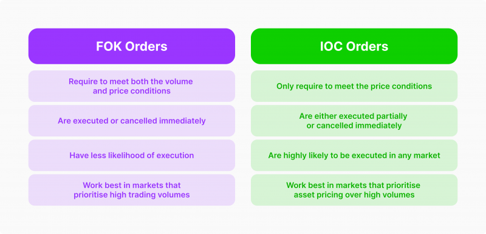

## Table of Contents

## What is a Fill or Kill (FOK) order?

A Fill or Kill (FOK) order is a type of order used in trading where you tell the broker to buy or sell a certain amount of a stock right away. If the broker can't buy or sell all of the stock at once, the order gets canceled. This means the order must be filled completely or not at all.

People use FOK orders when they need to make sure they get all of the stock they want at a specific price. It's useful if you don't want to end up with only part of your order filled. This type of order is common in fast-moving markets where prices can change quickly.

## How does a Fill or Kill order differ from other types of orders?

A Fill or Kill (FOK) order is different from other types of orders because it requires the entire order to be filled immediately or it gets canceled. With other types of orders, like a limit order, you can set a specific price to buy or sell at, but the order might only be partially filled over time. An FOK order doesn't allow for partial fills; it's all or nothing, which makes it unique.

Another type of order, called a market order, will buy or sell at the current market price, but it might also only fill part of your order if there aren't enough shares available. In contrast, an FOK order won't go through unless every share you want can be bought or sold right away. This makes FOK orders useful in situations where you need to ensure you get the full amount of stock at a set price, without waiting or risking partial fulfillment.

In summary, while other orders like limit and market orders can be partially filled and may take time to complete, a Fill or Kill order demands immediate and complete execution or cancellation. This difference makes FOK orders a specific tool for traders who need certainty and speed in their transactions.

## In what scenarios might a trader use a Fill or Kill order?

A trader might use a Fill or Kill order when they need to buy or sell a lot of a stock quickly. Imagine you know a big news event is about to happen that could change the stock price a lot. You want to make sure you get all the shares you need before the price changes. An FOK order helps you do that because it either fills your whole order right away or cancels it, so you don't end up with just some of the shares.

Another scenario is when a trader is working with a small amount of stocks that aren't traded often. If you want to buy all of these stocks at once, you might use an FOK order. This way, you avoid buying just a few shares and waiting a long time for the rest. It's all or nothing, so you know you'll either get everything you want or nothing at all, which can be important when timing is key.

## What are the advantages of using a Fill or Kill order?

One big advantage of using a Fill or Kill order is that it helps you get all the shares you want at the same time. If you need to buy or sell a lot of stock quickly, an FOK order makes sure you get everything or nothing. This is really helpful if you're worried about the price changing before you can finish your order. It's like saying, "I need all of it now, or I don't want any of it."

Another advantage is that FOK orders can save you time and hassle. If you're trying to buy stocks that don't trade often, you might have to wait a long time to get all the shares you want if you use a different kind of order. With an FOK order, you don't have to worry about that. It either fills your order right away, or it cancels it, so you know where you stand without having to keep checking.

## What are the potential disadvantages or risks associated with Fill or Kill orders?

One potential disadvantage of using a Fill or Kill order is that it might not get filled at all. If the market doesn't have enough shares available to meet your order right away, your order will be canceled. This means you could miss out on a trading opportunity because you might have to wait for the right moment to place another order.

Another risk is that FOK orders might not be the best choice in a fast-moving market. If the price of the stock is changing quickly, you might not be able to get all the shares you want at the price you want. This can be frustrating if you see the price moving away from what you were hoping for, and you end up with no shares at all.

## How does a Fill or Kill order work in practice?

When you place a Fill or Kill order, you're telling your broker that you want to buy or sell all of the shares you're asking for right away. If the broker can't find enough shares to fill your whole order immediately, the order gets canceled. It's like saying, "I need all of it now, or I don't want any of it." This means you won't end up with just some of the shares you wanted.

In practice, let's say you want to buy 1,000 shares of a company's stock at $10 each. You place a Fill or Kill order for those 1,000 shares. If there are at least 1,000 shares available at $10 right then, your order will be filled, and you'll get all the shares. But if there are only 500 shares available at that price, your order won't go through, and it will be canceled. This can be helpful if you need to make sure you get all the shares you want at a specific price without waiting or getting only part of your order filled.

## Can you explain the mechanics of executing a Fill or Kill order on an exchange?

When you place a Fill or Kill order, you're telling the exchange that you want to buy or sell all the shares you're asking for right away. If the exchange can't find enough shares to fill your whole order at the price you want, the order gets canceled. This is different from other types of orders because it won't let you buy or sell just some of the shares. It's like saying, "I need all of it now, or I don't want any of it."

Let's say you want to buy 1,000 shares of a company's stock at $10 each. You send a Fill or Kill order to the exchange for those 1,000 shares. The exchange checks if there are at least 1,000 shares available at $10 right then. If there are, your order gets filled, and you get all the shares. But if there are only 500 shares available at that price, your order won't go through, and it will be canceled. This way, you know you'll either get all the shares you want or none at all, which can be important in fast-moving markets or when you need to make sure you get the full amount at a set price.

## What are the specific conditions that must be met for a Fill or Kill order to be filled?

For a Fill or Kill order to be filled, there must be enough shares available at the price you want right away. If you want to buy 1,000 shares of a stock at $10 each, the exchange needs to find 1,000 shares that someone is willing to sell at $10 at that exact moment. If the exchange can't find all 1,000 shares at $10 right then, your order won't be filled, and it will be canceled.

This means that the whole order has to be filled completely and immediately, or it won't happen at all. It's like saying, "I need all of it now, or I don't want any of it." This is different from other types of orders where you might get some shares now and wait for the rest later. With a Fill or Kill order, you know you'll either get all the shares you want or none at all.

## How do market conditions affect the success rate of Fill or Kill orders?

Market conditions can really change how well a Fill or Kill order works. If the market is busy and lots of people are trading, it might be easier to find all the shares you need right away. But if the market is slow or if the stock you want doesn't trade often, it can be hard to fill your order. This means your Fill or Kill order might get canceled a lot because there aren't enough shares available at the price you want.

Also, if the price of the stock is moving a lot, it can make it harder to fill a Fill or Kill order. If the price is going up or down quickly, the shares you want might not be available at the price you set. This can lead to your order being canceled because the market can't meet your exact needs right away. So, the success of a Fill or Kill order depends a lot on how the market is doing at that moment.

## Are there any regulatory considerations or restrictions on using Fill or Kill orders?

There might be some rules about using Fill or Kill orders, depending on where you are trading. Different countries and stock exchanges can have their own rules. For example, some places might have special rules for how these orders work, or they might not allow them at all. It's a good idea to check with your broker or the exchange you're using to know what the rules are.

Also, some markets might treat Fill or Kill orders differently from others. This can affect how you use them and when they are useful. Knowing the rules can help you use Fill or Kill orders the right way and avoid any problems. If you're not sure, it's always best to ask someone who knows about trading in your area.

## How do different trading platforms handle Fill or Kill orders?

Different trading platforms might handle Fill or Kill orders in slightly different ways, but the basic idea stays the same. When you place a Fill or Kill order on a platform, you're telling it to buy or sell all of your shares right away or cancel the order. If the platform can't find enough shares to fill your whole order at the price you want, it will cancel your order. Some platforms might show you a message right away to let you know if your order was filled or canceled, while others might take a little longer to tell you.

The way platforms handle these orders can also depend on how busy the market is and how fast their systems work. If a platform has a lot of users and trades happening at once, it might be quicker at filling or canceling your Fill or Kill order. But if the platform is slower or less busy, it might take longer to process your order. It's a good idea to check how your trading platform works with Fill or Kill orders so you know what to expect when you use them.

## What advanced strategies can traders implement using Fill or Kill orders?

Traders can use Fill or Kill orders to take advantage of quick market changes. Imagine you hear that a company is about to release big news that could make its stock price go up or down a lot. You want to buy a lot of shares before the price changes, but you don't want to end up with just a few. By using a Fill or Kill order, you can try to get all the shares you need at once. If you can't get them all, the order cancels, and you can wait for another chance. This helps you act fast and make sure you get the full amount of stock you want.

Another strategy is using Fill or Kill orders to manage risk in trading. If you're trading stocks that don't change hands often, you might want to make sure you can buy or sell all your shares at once. A Fill or Kill order helps you avoid waiting a long time to complete your trade, which can be risky if the price moves against you. By setting a Fill or Kill order, you know you'll either get all your shares right away or none at all, which can help you plan your next move without worrying about partial fills.

## References & Further Reading

[1]: Chan, E. P. (2008). ["Quantitative Trading: How to Build Your Own Algorithmic Trading Business."](https://github.com/ftvision/quant_trading_echan_book) Wiley.

[2]: Jansen, S. (2020). ["Machine Learning for Algorithmic Trading."](https://github.com/stefan-jansen/machine-learning-for-trading) Packt Publishing.

[3]: Lopez de Prado, M. (2018). ["Advances in Financial Machine Learning."](https://www.amazon.com/Advances-Financial-Machine-Learning-Marcos/dp/1119482089) Wiley.

[4]: Lehmann, B. N. (1990). ["Fads, Martingales, and Market Efficiency."](https://academic.oup.com/qje/article-abstract/105/1/1/1928416) The Quarterly Journal of Economics, 105(1), 1-28.

[5]: Harris, L. (2002). ["Trading and Exchanges: Market Microstructure for Practitioners."](https://academic.oup.com/book/52292) Oxford University Press.

[6]: Aronson, D. R. (2007). ["Evidence-Based Technical Analysis: Applying the Scientific Method and Statistical Inference to Trading Signals."](https://onlinelibrary.wiley.com/doi/book/10.1002/9781118268315) Wiley.