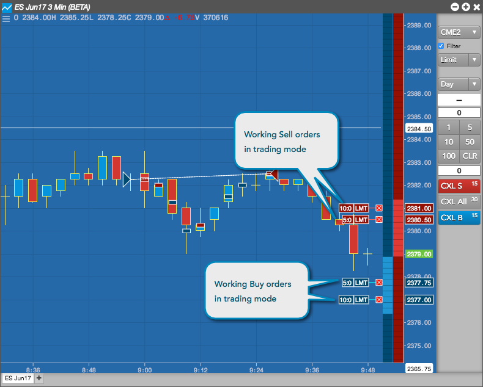

## Table of Contents

## What is fill order in trading?

Fill order in trading is when a buy or sell order is completed. When you want to buy or sell a stock, you place an order. The fill order happens when that order is matched with another order and the trade is done.

For example, if you want to buy 100 shares of a company, you place a buy order. When someone else wants to sell 100 shares of that company at the price you are willing to pay, the fill order happens. Your order is filled, and you now own the shares.

## How does the fill order process work in stock trading?

When you want to buy or sell stocks, you place an order with your broker. This order goes to the stock exchange, where it waits to be matched with another order. If you want to buy, your order will be matched with someone who wants to sell, and if you want to sell, it will be matched with someone who wants to buy. The price at which the orders match is called the fill price. This whole process of matching and completing the trade is called the fill order.

Sometimes, your entire order might not be filled at once. For example, if you want to buy 100 shares but only 50 are available at your desired price, you might get a partial fill. This means 50 shares are bought right away, and the rest of your order might wait until more shares become available at your price. You can choose to cancel the remaining part of your order or keep it open until it's fully filled. This flexibility helps traders manage their trades better.

## What are the different types of fill orders?

Fill orders can be complete or partial. A complete fill happens when your whole order is filled at once. For example, if you want to buy 100 shares and someone sells you all 100 shares at the same time, that's a complete fill. A partial fill is when only part of your order is filled. If you want to buy 100 shares but only 50 are available at your price, you might get those 50 shares first, and the rest of your order might wait for more shares to be available.

There are also different ways your order can be filled based on the type of order you place. A market order is filled at the best available price right away, so you might get a complete or partial fill quickly. A limit order is filled only at the price you set or better, so it might take longer to get filled, and you might get a partial fill if not enough shares are available at your price. A stop order turns into a market order once the stock reaches a certain price, so it can also lead to complete or partial fills depending on the market conditions when it's triggered.

## What is the difference between a market order and a limit order?

A market order is an order to buy or sell a stock right away at the best available price. When you place a market order, you want to make the trade quickly, so you're willing to accept whatever price the market is offering at that moment. This means you'll usually get your order filled fast, but the price might be a little different from what you expected because the market is always changing.

A limit order is different because it lets you set a specific price at which you want to buy or sell. If you're buying, your limit order will only be filled if the stock's price goes down to your limit price or lower. If you're selling, it will only be filled if the stock's price goes up to your limit price or higher. This gives you more control over the price, but it might take longer to get filled, or you might not get filled at all if the stock never reaches your limit price.

## How can understanding fill orders improve my trading strategy?

Understanding fill orders can help you make better trading choices. When you know how fill orders work, you can decide if you want to use a market order to buy or sell quickly, or a limit order to get a specific price. This can help you manage your trades better. For example, if you need to buy a stock fast because you think the price will go up soon, a market order might be best. But if you want to buy at a lower price and are okay with waiting, a limit order could work better.

Also, knowing about partial fills can help you plan your trades. Sometimes, you might not get all the shares you want at once. If you understand this, you can decide if you want to keep your order open until it's fully filled, or cancel it and try again later. This can help you avoid buying or selling at prices you don't want, and it can make your trading strategy more flexible and effective.

## What factors influence the speed of order fills?

The speed of order fills can be affected by many things. One big factor is the type of order you use. A market order usually gets filled faster than a limit order because it's meant to buy or sell right away at the best price available. A limit order might take longer because it only gets filled if the stock price reaches your set price. Another factor is how many people are trading the stock at that time. If lots of people are buying and selling, orders can get filled faster because there are more chances for your order to match with someone else's.

The time of day also matters. Stock markets are busiest during certain hours, like when they open and close. If you place an order during these busy times, it might get filled faster. But if you place an order when the market is less active, it might take longer. The size of your order can also affect how quickly it gets filled. A small order for a few shares might get filled faster than a big order for many shares, especially if there aren't enough shares available at your price.

## What are partial fills and how do they affect trading?

Partial fills happen when only part of your order to buy or sell a stock gets completed. For example, if you want to buy 100 shares but only 50 are available at your price, you might get those 50 shares right away. This is called a partial fill. The rest of your order might stay open until more shares become available at your price, or you might choose to cancel it.

Partial fills can affect your trading in different ways. If you're using a market order, you might get a quick partial fill, but you'll need to decide what to do with the rest of your order. If you're using a limit order, you might wait longer for the whole order to be filled, but you'll have more control over the price. Understanding partial fills can help you plan your trades better, so you know what to expect and can make smart choices about whether to keep your order open or cancel it.

## How do slippage and fill orders relate to each other?

Slippage is when the price you get for a trade is different from the price you expected. It can happen when you use a market order because the price can change fast while your order is being filled. Slippage is related to fill orders because it affects the final price you get when your order is filled. If there are a lot of orders in the market, your order might get filled at a different price than what you saw when you placed it, causing slippage.

Understanding how slippage works can help you make better choices about your trading strategy. If you want to avoid slippage, you might choose to use a limit order instead of a market order. A limit order lets you set a specific price, so you won't get filled at a worse price, but it might take longer to get filled or not get filled at all if the stock price doesn't reach your limit. Knowing about slippage and fill orders can help you decide which type of order to use and plan your trades better.

## What are the best practices for managing fill orders in volatile markets?

In volatile markets, where prices can change a lot and fast, it's smart to use limit orders instead of market orders. A limit order lets you set a specific price for buying or selling. This can help you avoid slippage, which is when you get a different price than you expected. If you use a limit order, you might have to wait longer for your order to be filled, but you'll know exactly what price you're getting. This can be really helpful in a volatile market where prices can jump around a lot.

Another good practice is to keep an eye on the market and be ready to adjust your orders. If the market is moving quickly, you might need to change your limit price to make sure your order gets filled. Also, think about how much of your order you're okay with getting filled at once. If you're okay with partial fills, you can keep your order open and wait for more shares to be available at your price. But if you need all your shares right away, you might need to use a market order and accept the risk of slippage. By being flexible and watching the market closely, you can manage your fill orders better in a volatile market.

## How do different trading platforms handle fill orders differently?

Different trading platforms can handle fill orders in their own ways. Some platforms might be faster at filling orders because they have better technology or more people using them. For example, big platforms like Robinhood or E*TRADE might fill your order quickly because they have a lot of users and good systems. Smaller platforms might take a bit longer because they don't have as many users or their technology might not be as fast.

Another difference is how platforms handle partial fills. Some platforms might let you decide if you want to keep your order open for the rest of the shares or cancel it right away. Others might automatically keep your order open until it's fully filled or until you cancel it. It's important to know how your platform works so you can plan your trades better. Checking the platform's rules and settings can help you understand how they handle fill orders and make the best choices for your trading strategy.

## What advanced techniques can be used to optimize fill order execution?

One advanced technique to optimize fill order execution is using algorithms. These are special computer programs that can help you buy or sell stocks at the best times and prices. Algorithms can look at lots of information really fast and make smart choices about when to place your order. They can also help you avoid big price changes by breaking your order into smaller pieces and spreading them out over time. This can help you get a better average price and reduce the chance of slippage.

Another technique is using different types of orders, like iceberg orders or stop-limit orders. An iceberg order lets you hide part of your big order so other people don't see it all at once. This can help you buy or sell without moving the price too much. A stop-limit order combines a stop order and a limit order. It turns into a limit order when the stock price hits a certain point, which can help you control the price you get while still reacting to big market moves. By using these advanced order types, you can manage your trades better and get filled at prices that work for you.

## How can algorithmic trading be used to enhance fill order strategies?

Algorithmic trading can help you get better fill orders by using smart computer programs. These programs can look at a lot of information very quickly and decide the best time to buy or sell your stocks. They can split your big order into smaller pieces and spread them out over time. This can help you get a better average price and avoid big price changes that might happen if you put in a big order all at once. By using algorithms, you can make sure your orders are filled at the best possible prices without causing too much movement in the market.

Another way algorithms can help is by reacting to the market faster than you can. They can watch the market all the time and make quick decisions based on what's happening. For example, if the price of a stock starts to drop fast, an algorithm can put in a buy order right away to get a good price. This can be really helpful in a fast-moving market where prices can change a lot. By using algorithmic trading, you can improve your fill order strategy and make smarter trades.

## References & Further Reading

[1]: Hasbrouck, J. (2007). ["Empirical Market Microstructure: The Institutions, Economics, and Econometrics of Securities Trading."](https://searchworks.stanford.edu/view/6759272) Oxford University Press.

[2]: Kissell, R. (2013). ["The Science of Algorithmic Trading and Portfolio Management."](https://www.sciencedirect.com/book/9780124016897/the-science-of-algorithmic-trading-and-portfolio-management) Academic Press.

[3]: Aldridge, I. (2013). ["High-Frequency Trading: A Practical Guide to Algorithmic Strategies and Trading Systems."](https://www.wiley.com/en-us/High+Frequency+Trading%3A+A+Practical+Guide+to+Algorithmic+Strategies+and+Trading+Systems-p-9780470579770) Wiley.

[4]: Narang, M. (2013). ["Inside the Black Box: A Simple Guide to Quantitative and High-Frequency Trading."](https://www.amazon.com/Inside-Black-Box-Quantitative-Frequency/dp/1118362411) Wiley.

[5]: Chincarini, M. L. (2010). ["Quantitative Equity Portfolio Management: An Active Approach to Portfolio Construction and Management."](https://www.mhebooklibrary.com/doi/book/10.1036/9781264268931) McGraw-Hill Education.