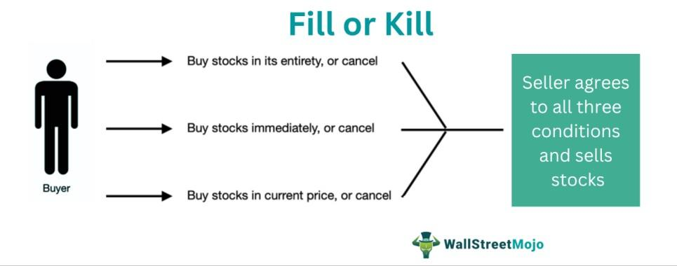

Understanding contemporary financial markets necessitates a thorough grasp of trading execution mechanisms, with 'order fill' being a pivotal element. Order fill represents the process of completing a buy or sell order on trading platforms, influenced by market liquidity and conditions. With the advent of technology, algorithmic trading, or algo trading, has significantly transformed trading practices by employing computer algorithms to execute trades under optimal conditions. This automation has enabled traders to execute orders with precision, speed, and efficiency, minimizing human intervention and emotional biases.

Algorithmic trading has revolutionized the trading landscape by allowing trades to be executed based on pre-set instructions involving specific metrics such as price, timing, and volume. The proliferation of algo trading has facilitated higher trading volumes and efficiency, directly impacting market liquidity and volatility. Markets are generally more liquid; however, the associated speed and automation can at times exacerbate volatility.



This article aims to elucidate the complexities involved in financial market order fills and the integral role played by algorithmic trading. Readers will gain insights into both the advantages and potential drawbacks of employing algorithmic strategies, such as the reduction of transaction costs and the risks of technological failures. Furthermore, it addresses how these strategies affect market dynamics and liquidity. For beginners, the article will provide foundational guidance on comprehending and engaging with algorithmic trading, including essential skills and market entry considerations.

## Table of Contents

## What is an Order Fill in Financial Markets?

An order fill in financial markets refers to the execution of a buy or sell order placed by traders on a trading platform. The successful completion of these orders is heavily reliant on market liquidity, which is the measure of how quickly an asset can be bought or sold in the market without affecting its price. Liquidity ensures that there are adequate buyers and sellers in the market to match the terms of the orders placed. Additionally, trading hours play a crucial role in order fills since they determine the windows during which trades can be executed.

There are several types of orders in financial trading, each affecting how order fills are executed. Among the most common are market orders and limit orders:

1. **Market Orders**: This type of order indicates that the trader wishes to buy or sell an asset immediately at the best available current price. The primary advantage of market orders is speed; however, traders might not always get their desired price, especially in highly volatile markets. Market orders are often filled quickly given sufficient liquidity.

2. **Limit Orders**: These are set to execute a transaction only at a specified price or better. A buy limit order can only be executed at the limit price or lower, while a sell limit order will only execute at the limit price or higher. While this provides price certainty, it may result in delayed execution or partial fills if the market does not reach the specified price.

Understanding fill conditions is integral for active traders aiming to optimize their trading strategies. Conditions dictate the environment under which an order will be executed. Among these conditions, traders often employ "all or none" (AON) conditions, which ensure that the order is only filled if it can be executed in its entirety, preventing partial fills.

For a practical illustration, consider a Python code snippet to simulate a basic market order execution using an [order book](/wiki/order-book-trading-strategies):

```python
class OrderBook:
    def __init__(self):
        self.bids = []  # List of tuples (price, quantity)
        self.asks = []  # List of tuples (price, quantity)

    def add_order(self, price, quantity, order_type='bid'):
        if order_type == 'bid':
            self.bids.append((price, quantity))
            self.bids.sort(reverse=True)  # Highest price first
        else:
            self.asks.append((price, quantity))
            self.asks.sort()  # Lowest price first

    def match_order(self, quantity, order_type='buy'):
        if order_type == 'buy':
            # Match against asks
            for i, (price, avail_quantity) in enumerate(self.asks):
                if quantity <= avail_quantity:
                    self.asks[i] = (price, avail_quantity - quantity)
                    return f'Order filled at price {price}'
        else:
            # Match against bids
            for i, (price, avail_quantity) in enumerate(self.bids):
                if quantity <= avail_quantity:
                    self.bids[i] = (price, avail_quantity - quantity)
                    return f'Order filled at price {price}'
        return 'Order could not be filled due to insufficient liquidity'

# Example usage
order_book = OrderBook()
order_book.add_order(price=100, quantity=10, order_type='ask')
print(order_book.match_order(quantity=5, order_type='buy'))  # Output: Order filled at price 100
```

In conclusion, a thorough comprehension of order fill mechanisms empowers traders to tailor their approaches to dynamic market environments, enhancing their execution strategies and improving their overall trading performance.

## Algorithmic Trading: An Overview

Algorithmic trading refers to the utilization of computer algorithms to execute trades in financial markets, aiming for enhanced speed and precision while minimizing the influence of human emotions. This approach leverages pre-programmed instructions that determine parameters such as price, quantity, and timing to orchestrate trades without manual intervention. The algorithms can swiftly analyze market conditions and execute transactions, often exploiting short-lived opportunities that human traders might miss.

By harnessing the power of technology, [algorithmic trading](/wiki/algorithmic-trading) can significantly enhance market [liquidity](/wiki/liquidity-risk-premium). Liquidity is crucial as it allows traders to buy or sell assets without causing significant price changes. Algorithms facilitate liquidity by engaging in high-frequency trading ([HFT](/wiki/high-frequency-trading-strategies)) and market-making strategies. These algorithms quickly adjust to market conditions, providing bid and ask quotes that enable smoother and faster transactions.

Moreover, algorithmic trading allows for the implementation of complex execution strategies that would be challenging to achieve manually. Whether executing large orders discreetly to minimize market impact or capitalizing on [arbitrage](/wiki/arbitrage) opportunities, algorithms operate on scales and speeds that are unfeasible for human traders. For example, an arbitrage strategy might involve algorithms simultaneously buying and selling assets across different markets to exploit price discrepancies, [earning](/wiki/earning-announcement) profits within fractions of a second.

The automation of trading strategies eliminates emotional and psychological factors that can negatively impact trading decisions. Emotions like fear and greed, which often lead to impulsive trades, are absent in algorithm-driven operations. This leads to consistent application of predefined strategies, ensuring discipline and adherence to the trading plan.

In conclusion, algorithmic trading represents a transformative approach in financial markets, leveraging the speed, accuracy, and unemotional decision-making of algorithms to enhance trading efficiency and market liquidity. Its capacity to employ complex strategies and to remain resilient to human emotional biases is pivotal, marking a significant evolution in trading methodologies.

## How Does Algorithmic Trading Work?

Algorithmic trading employs computer programs to execute trades automatically in financial markets. These automated systems operate based on predefined criteria which traders configure to optimize trading outcomes effectively and accurately.

To commence algorithmic trading, traders delineate explicit criteria that dictate how trades should be executed. These criteria typically incorporate elements such as price points, quantities, timing, and risk management strategies. Once these parameters are established, the algorithm functions autonomously, scanning the market for the right conditions to initiate trades.

A critical aspect of developing a reliable algorithmic trading system involves comprehensive testing. Prior to deployment, algorithms undergo rigorous testing using historical data to evaluate their performance under various market conditions. This process, known as [backtesting](/wiki/backtesting), helps in understanding how the strategy could have performed in the past, offering insights into its potential future performance.

By simulating trades on historical data, backtesting evaluates key performance metrics, such as cumulative returns, Sharpe ratios, and drawdowns. For instance, traders might execute:

```python
import pandas as pd
import numpy as np

# Hypothetical historical trading data
data = pd.read_csv('historical_data.csv')
initial_investment = 10000

# Example backtesting function
def backtest_strategy(data, moving_average_period):
    data['Moving_Average'] = data['Close'].rolling(window=moving_average_period).mean()
    data['Signal'] = np.where(data['Close'] > data['Moving_Average'], 1, 0)
    data['Daily_Return'] = data['Close'].pct_change()
    data['Strategy_Return'] = data['Daily_Return'] * data['Signal'].shift(1)

    performance = (1 + data['Strategy_Return']).cumprod() * initial_investment
    return performance.iloc[-1]

# Performance of a simple moving average strategy
result = backtest_strategy(data, 20)
print(f"Strategy ending value: {result}")
```

Alongside historical data, current market data feeds are crucial for ensuring that algorithms operate with precision and remain profitable. These feeds provide real-time price quotes and market updates that the trading algorithms require for optimal decision-making.

In summary, algorithmic trading integrates technology and mathematics to automate trading processes, minimizing human intervention and emotional biases. Through meticulous criteria setting, thorough testing, and utilization of live market data, these algorithms enable traders to engage with financial markets efficiently.

## Advantages and Disadvantages of Algorithmic Trading

Algorithmic trading has undeniably transformed financial markets through a number of notable advantages. One of the most significant benefits is the rapid execution of trades. Algorithms can execute orders in milliseconds, far outpacing human capabilities. This swiftness allows traders to capitalize on fleeting market opportunities that might otherwise be missed. Furthermore, algorithmic trading often reduces transaction costs. With computers handling the execution, the need for human intervention is minimized, leading to cost savings on broker fees and slippage.

Precision is another compelling advantage. Algorithms can execute trades with exactitude according to specified criteria, mitigating the errors associated with manual trading. The absence of emotion in trading is an additional benefit. Unlike human traders, who may be swayed by fear or greed, algorithms maintain objectivity, sticking strictly to the programmed parameters.

Nonetheless, algorithmic trading is not without its disadvantages. A primary concern is the system's reliance on technology. Issues such as software glitches or hardware failures can disrupt trading operations, potentially leading to significant financial losses. Moreover, algorithmic trading introduces systemic risks that can heighten market [volatility](/wiki/volatility-trading-strategies). Flash crashes, where markets plunge dramatically in a short time, are sometimes linked to algorithmic activities.

Another drawback is latency, the slight delay between the sending and execution of orders. In high-frequency trading, even microseconds can matter, and any latency could result in missed trading opportunities or suboptimal execution. Additionally, algorithms may not adapt well to unexpected or fundamental market shifts that have not been incorporated into their design. These limitations underscore that while algorithmic trading can enhance efficiency and precision, it also demands robust infrastructure and vigilant oversight.

## Types of Algorithmic Trading Strategies

Algorithmic trading encompasses a spectrum of strategies employed by traders to enhance performance and exploit market efficiencies. Among the most prevalent are trend-following, arbitrage, and market-making strategies. Each of these strategies utilizes computational methods to analyze large datasets, automate decision-making, and optimize trade execution.

### Trend-Following Strategies

Trend-following strategies are predicated on the assumption that prices tend to move in a sustained direction over time. Traders leveraging these strategies aim to capitalize on market [momentum](/wiki/momentum) by identifying and riding these trends. A moving average crossover is a typical trend-following algorithm where trades are executed when a short-term moving average crosses a long-term moving average. The logic can be expressed as follows:

```python
# Example of a simple moving average crossover strategy
def moving_average_crossover(prices, short_window, long_window):
    short_mavg = prices.rolling(window=short_window).mean()
    long_mavg = prices.rolling(window=long_window).mean()
    signals = (short_mavg > long_mavg).astype(int)
    return signals.diff()
```

### Arbitrage Strategies

Arbitrage strategies exploit price discrepancies in different markets or instruments that are theoretically equivalent. The strategy involves simultaneously buying and selling these instruments, aiming to profit from the price differential. Statistical arbitrage extends this concept by utilizing complex statistical models and [machine learning](/wiki/machine-learning) to identify and capitalize on fleeting mispricing opportunities.

### Market-Making Strategies

Market-making strategies involve providing liquidity to the market by quoting both buy and sell prices for a financial instrument and profiting from the spread. Algorithms manage the order book and adjust quotes in response to market conditions, thereby facilitating trade flow and reducing transaction costs for others. Market-makers must continuously manage inventory risks and adapt to market changes in real-time.

### Technical Trading Algorithms

Technical trading algorithms apply quantitative analysis to technical indicators in an effort to predict future price movements. Mean reversion strategies, for example, assume that asset prices will eventually return to their historical average, thereby allowing traders to profit from price deviations. The Volume-Weighted Average Price (VWAP) strategy is designed to execute trades in line with the average compositional price, ensuring minimal market impact.

```python
# Example of a mean reversion strategy
def mean_reversion(prices, window, threshold):
    mean = prices.rolling(window=window).mean()
    deviations = prices - mean
    buy_signals = deviations < -threshold
    sell_signals = deviations > threshold
    return buy_signals.astype(int) - sell_signals.astype(int)
```

### Advanced Algorithms

More sophisticated algorithms integrate machine learning models to adapt to dynamic market conditions. These models can process large volumes of data to identify patterns and make predictions without explicit programming. Techniques such as [reinforcement learning](/wiki/reinforcement-learning) enable algorithms to improve decision-making processes over time. The integration of [artificial intelligence](/wiki/ai-artificial-intelligence) in creating adaptive strategies marks a significant evolution in algorithmic trading, paving the way for innovative approaches to market analysis and trade execution. 

These diverse algorithmic trading strategies each offer unique benefits and challenges, allowing traders to tailor their approaches based on their risk tolerance, market knowledge, and technological capabilities.

## Getting Started with Algorithmic Trading

Entering the world of algorithmic trading requires a combination of technical skills, market knowledge, and strategic planning. For beginners, one of the primary skills is proficiency in programming. Languages like Python, C++, and Java are often used due to their robust libraries and support for quantitative analysis and data manipulation. These skills enable traders to develop, test, and optimize algorithms that can trade financial instruments automatically based on pre-defined criteria.

An understanding of financial markets is equally crucial. This knowledge includes familiarity with various asset classes, financial instruments, and market dynamics such as liquidity, volatility, and trading hours. Grasping these concepts is vital for designing algorithms that can navigate market conditions efficiently.

Choosing the right trading platform and tools is another significant decision for new algorithmic traders. Platforms such as MetaTrader, QuantConnect, and [Interactive Brokers](/wiki/interactive-brokers-api) provide tools for backtesting, execution, and data analysis. These platforms often support algorithmic trading by integrating APIs and offering community forums and educational resources, which are invaluable for beginners.

Backtesting is a critical process in algorithmic trading, involving testing a trading strategy on historical data to evaluate its performance. This step helps in identifying potential flaws and optimizing the algorithm before deploying it in a live trading environment. Effective backtesting requires a comprehensive dataset and a thorough understanding of statistical measures, including Sharpe ratio and drawdown metrics, to assess risk and returns.

Staying informed about market regulations is vital to prevent compliance issues. Regulations vary between jurisdictions and can impact how certain strategies can be executed. For instance, in the US, the Securities and Exchange Commission (SEC) and the Commodity Futures Trading Commission (CFTC) regulate algorithmic trading practices. Understanding these regulations helps in structuring strategies that are not only profitable but also compliant.

As technology evolves, staying updated with the latest developments in financial technologies and market trends is also beneficial. Continuous learning through online courses, webinars, and [books](/wiki/algo-trading-books) on algorithmic trading can enhance a trader’s skills and adaptability in a fast-changing trading landscape. By balancing programming expertise, market understanding, strategic use of tools, and regulatory awareness, newcomers can effectively enter and succeed in algorithmic trading.

## The Future of Algorithmic Trading

The use of AI and machine learning in trading algorithms is anticipated to significantly impact the future of financial markets. These technologies offer increased efficiency across various trading activities, enabling algorithms to undertake more complex and adaptive strategies. Machine learning, in particular, allows algorithms to extract patterns and insights from vast datasets, which can be applied to improve decision-making processes and predict market trends more accurately.

As the adoption of AI and machine learning grows, regulatory scrutiny is expected to intensify. The involvement of automated decision-making and data processing raises concerns about transparency, accountability, and ethical standards. Regulators are likely to impose stricter guidelines to ensure that the deployment of AI in algorithmic trading does not exacerbate systemic risks, such as those seen during market flash crashes. Consequently, trading firms will need to invest in compliance systems to adhere to evolving regulations, ensuring that their algorithms operate within safe and sanctioned parameters.

Despite challenges, algorithmic trading, powered by AI and machine learning, shows considerable promise in transforming modern financial markets. The ability to process and analyze data at unprecedented speeds offers significant advantages in executing trades efficiently and effectively. Moreover, the continuous improvement of machine learning models through techniques such as reinforcement learning and [deep learning](/wiki/deep-learning) provides a foundation for more sophisticated algorithmic systems capable of adapting to volatile market conditions.

Given these developments, the continued evolution of algorithmic trading appears inevitable. Traders and firms that successfully integrate AI advancements into their strategies are likely to maintain a competitive edge, capable of navigating the complex dynamics of future financial markets. As technology continues to evolve, the role of algorithmic trading will similarly expand, heralding a new era of precision and innovation in financial services.

## Conclusion

Algorithmic trading has profoundly influenced contemporary financial markets, providing a significant edge through unmatched speed and precision. Traders benefit from algorithmic strategies by capitalizing on small price differences, executing trades swiftly, and managing large volumes that would be impractical manually. Understanding the mechanics of order fills, execution strategies, and the broader market dynamics is critical to fully leveraging the advantages of algorithmic trading.

To utilize such a powerful tool effectively, traders must master the intricacies of fills, which dictate how buy and sell orders are completed on a trading platform. Execution strategies need careful selection and implementation, considering market elements like liquidity and volatility. An understanding of these aspects can optimize the outcomes of algorithmic trading significantly.

Despite its advantages, algorithmic trading presents challenges, such as reliance on sophisticated technology, the potential for technical glitches, and increased systemic risk. These challenges necessitate a well-informed approach where participants constantly update their strategies according to technological advancements and market regulations.

In conclusion, algorithmic trading offers an impressive combination of efficiency and intricacy, reshaping financial markets. Investment in learning and adapting to its demands allows informed participants to harness algorithmic trading's full potential, leading to optimized trading outcomes and strategic advantages. This emphasizes the importance of continuous learning and strategic adaptation in achieving success in today's fast-paced markets.

## References & Further Reading

[1]: Hasbrouck, J. (2007). ["Empirical Market Microstructure: The Institutions, Economics, and Econometrics of Securities Trading."](https://searchworks.stanford.edu/view/6759272) Oxford University Press.

[2]: Kissell, R. (2013). ["The Science of Algorithmic Trading and Portfolio Management."](https://www.sciencedirect.com/book/9780124016897/the-science-of-algorithmic-trading-and-portfolio-management) Academic Press.

[3]: Aldridge, I. (2013). ["High-Frequency Trading: A Practical Guide to Algorithmic Strategies and Trading Systems."](https://www.wiley.com/en-us/High+Frequency+Trading%3A+A+Practical+Guide+to+Algorithmic+Strategies+and+Trading+Systems-p-9780470579770) Wiley.

[4]: Narang, M. (2013). ["Inside the Black Box: A Simple Guide to Quantitative and High-Frequency Trading."](https://www.amazon.com/Inside-Black-Box-Quantitative-Frequency/dp/1118362411) Wiley.

[5]: Chincarini, M. L. (2010). ["Quantitative Equity Portfolio Management: An Active Approach to Portfolio Construction and Management."](https://www.mhebooklibrary.com/doi/book/10.1036/9781264268931) McGraw-Hill Education.