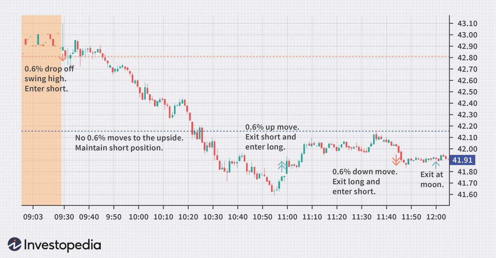

The world of trading presents a plethora of strategies and tools designed to gain an edge in the markets. Among these strategies, the filter rule stands out for its simplicity and effectiveness. The filter rule is a systematic approach that enables traders to establish objective criteria for buying and selling assets based on price variations. It operates on clear pre-set parameters that trigger trading actions once those are met. The approach focuses on capturing the essence of price trends, which serve as a fundamental aspect of technical analysis—a core component of the filter rule's effectiveness. 

As trading evolves with technological advancements, the application of the filter rule has expanded into the domain of algorithmic trading. This modern blend allows for the automation of trading decisions and executions, enhancing precision and consistency. Automated systems follow pre-defined rules that eliminate emotional biases and human errors, reinforcing the filter rule's attractiveness to traders seeking efficiency.



In this article, we will explore how the filter rule functions within the broader context of technical analysis and algorithmic trading. We will also offer practical insights into how traders can harness the power of automated systems to implement the filter rule strategy effectively. This comprehensive understanding aims to equip traders with a methodical approach to navigating the dynamic landscape of financial markets.

## Table of Contents

## Understanding the Filter Rule Strategy

The filter rule is a trading strategy based on predetermined criteria to determine when to buy or sell assets. This strategy operates on the fundamental assumption that asset prices are not entirely random but instead follow discernible trends over time. Leveraging these trends, traders aim to execute trades that profit from upward or downward movements in asset prices.

To utilize a filter rule strategy effectively, traders monitor percentage changes in an asset's price. By setting a specific percentage threshold, traders create a rule that prompts buying or selling actions when the asset's price changes by that percentage from a previous reference point. For example, a trader might decide to buy a stock if its price increases by 5% from its last observed price and sell if it decreases by the same percentage.

This method is inherently subjective due to the reliance on the trader's judgment to determine appropriate percentage change parameters. Factors influencing this decision may include the volatility of the asset, historical price data, and the trader's risk tolerance. Each trader may establish different thresholds based on their analysis and objectives, making the strategy adaptable to various market conditions. The effectiveness of the filter rule largely hinges on the trader’s ability to accurately assess and predict price movements within their chosen parameters.

## Technical Analysis and Filter Rules

Technical analysis serves as an essential component of the filter rule trading strategy, aiding traders in establishing robust parameters for implementation. By examining charts and historical price trends, traders identify optimal percentage change levels for triggering buy or sell actions. Such analysis often revolves around patterns that suggest how price movements are likely to evolve. 

For example, let's consider a trader who analyzes historical data and observes a recurring pattern: a 5% rise in stock price from a particular level often indicates an ensuing uptrend. Utilizing this insight, the trader sets a filter rule to execute a buy order whenever the stock's price surpasses a 5% increase from a predetermined base value. This level of precision ensures that decisions are made based on data-driven patterns rather than speculation.

The process of setting these parameters involves a combination of both quantitative and qualitative assessments. Traders typically use various technical indicators, such as moving averages, Relative Strength Index (RSI), and Bollinger Bands, to gauge the strength and sustainability of a price trend. For instance, a significant divergence between short-term and long-term moving averages might signal a strong trend, supporting the filter rule's parameters for action.

Successful application of the filter rule strategy is heavily dependent on a trader's ability to accurately interpret historical price movements and detect underlying patterns. This entails continuous monitoring of price charts to identify significant historical trends and adjust parameters accordingly. By leveraging past data, traders aim to forecast future price behavior, aligning their trading systems to capitalize on these predictions.

Incorporating technical analysis into the filter rule strategy provides an objective, systematic method of decision-making, minimizing emotional biases. However, the effectiveness of these rules depends on the accuracy of historical data interpretation, making it crucial for traders to remain adept with technical analysis tools and methodologies. Thus, proficiency in technical analysis not only enhances the precise execution of trades but also maximizes the potential profitability of the filter rule strategy.

## Implementing the Filter Rule in Algorithmic Trading

Automated trading systems can significantly enhance the implementation of the filter rule strategy by eliminating the reliance on manual execution, thereby increasing precision and reducing human-related errors. At the core of this implementation is the use of technical analysis software to automate trades based on predefined conditions, driven by specific percentage changes in asset prices.

### Technical Framework

To implement the filter rule strategy within an [algorithmic trading](/wiki/algorithmic-trading) system, traders must first define the criteria that will trigger buy and sell orders. These criteria are typically based on fixed percentage changes from previous price points. For example, a simple condition may be that if a stock's price deviates by a predetermined percentage, either upward or downward, a corresponding trade action is initiated.

Here's a basic example in Python using a common algorithmic trading library such as `pandas` for data manipulation and a stub for an order execution function:

```python
import pandas as pd

def execute_trade(action, asset, quantity):
    print(f"Executing {action} order for {quantity} shares of {asset}")
    # Here you would include the API call to your broker to execute the trade

def filter_rule_trading_strategy(data, asset, threshold):
    # Assuming 'data' is a pandas DataFrame with a 'Close' column for closing prices
    data['Change'] = data['Close'].pct_change()

    for i in range(1, len(data)):
        if data['Change'].iloc[i] > threshold:
            execute_trade('buy', asset, 100)
        elif data['Change'].iloc[i] < -threshold:
            execute_trade('sell', asset, 100)

# Example usage
# Stock data loaded into a pandas DataFrame (e.g., from CSV file)
data = pd.read_csv('stock_prices.csv')
filter_rule_trading_strategy(data, 'AAPL', 0.006)  # 0.6% threshold
```

### Automation Benefits

The primary advantage of using automated systems lies in the precision of execution. Human emotion, such as fear or greed, often interferes with manual trading, leading to poor decision-making. Automation ensures that trading actions are carried out strictly according to predefined rules, which is crucial for maintaining the integrity of the filter rule strategy.

### Programming and Scalability

To successfully implement filter rules in algorithmic trading, traders need to program their systems to recognize and act on specific market conditions. This programming involves establishing:

1. **Price Data Collection**: Ensure real-time or near real-time data feeds to capture and respond to market changes.
2. **Condition Checking**: Set percentage change conditions that trigger buy or sell orders, which can be dynamically adjusted based on backtesting and optimization.
3. **Order Execution**: Integrate with brokerage APIs to automate the execution of trades once the criteria are met.

Such implementations not only facilitate higher frequency trading but also allow the strategy to be scalable across multiple assets or market conditions.

### Conclusion

In summary, the deployment of the filter rule strategy within automated trading systems requires a robust technical setup to handle data acquisition, analysis, and execution efficiently. The automation thus achieved allows traders to adhere to their trading strategy with greater discipline and potentially enhanced profitability.

## Case Studies and Examples

To illustrate the application of the filter rule strategy, we present a practical example involving Apple's stock (AAPL). Consider a scenario where a trader employs a 0.6% filter rule on intraday price movements. In such a strategy, the trader would establish criteria for buying or selling based on a 0.6% deviation from a previous price point. This deviation acts as a trigger for executing trades, intending to profit from short-term price trends.

In practice, the trader monitors AAPL's price throughout the trading day, setting a rule to buy if the stock increases by 0.6% from a pre-defined baseline price and to sell if it decreases by the same percentage. This strategy is based on the assumption that minor price trends can be indicative of larger shifts. The calculation for determining when to buy or sell would be as follows:

$$
\text{Buy Price} = \text{Current Price} \times (1 + 0.006)
$$

$$
\text{Sell Price} = \text{Current Price} \times (1 - 0.006)
$$

Real-world scenarios reveal the potential outcomes this strategy could yield under varying market conditions. For instance, during a bullish market, frequent upward price adjustments might trigger multiple buy signals, potentially leading to profitable exits if the stock continues to appreciate. Conversely, a bearish environment could activate sell triggers, safeguarding the trader's position against further losses.

However, it's imperative to recognize the impact of trading costs and market dynamics on this approach. Attention to detail, such as accounting for commissions and slippage, is crucial for accurate assessments. Commissions refer to the fees charged by brokers for executing trades, which can erode profits, especially in high-frequency trading contexts. Slippage, the difference between the expected trade price and the actual executed price, can further affect the strategy's profitability, particularly in volatile markets.

For a comprehensive analysis, traders might utilize Python scripts to backtest the filter rule strategy against historical data, refining their parameters for optimal performance. The code snippet below outlines a basic framework for executing such a backtest:

```python
import pandas as pd

# Assume 'data' is a DataFrame with columns 'Date' and 'Close' (closing prices of AAPL)
data['Percentage Change'] = data['Close'].pct_change()

# Define filter rule threshold
filter_threshold = 0.006

# Initialize buy/sell signals
signals = []

for i in range(1, len(data)):
    if data['Percentage Change'].iloc[i] >= filter_threshold:
        signals.append('Buy')
    elif data['Percentage Change'].iloc[i] <= -filter_threshold:
        signals.append('Sell')
    else:
        signals.append('Hold')

data['Signals'] = signals

print(data[['Date', 'Close', 'Signals']])
```

Through meticulous application and adjustment of the filter rule strategy, traders can strive to enhance their decision-making process and optimize trade execution in diverse market scenarios.

## Potential and Limitations

The filter rule trading strategy presents a systematic methodology for navigating financial markets. Its primary strength lies in its ability to leverage market trends by setting predefined percentage thresholds for buying and selling. For instance, this strategy is particularly effective during periods of clear market trends, where price movements consistently exceed set thresholds, allowing traders to profit from sustained directional shifts.

However, the strategy's effectiveness is highly contingent on the precise analysis required to determine these parameters. Setting the threshold too low could result in frequent trades, leading to increased transaction costs and potential overtrading, reducing profitability. Conversely, a threshold too high might result in missed opportunities as fewer trading signals are generated. Adjusting these parameters is integral to maintaining effectiveness, necessitating a continuous assessment of market conditions and price [volatility](/wiki/volatility-trading-strategies).

Additionally, variable market conditions and unforeseen events pose significant challenges to the filter rule strategy. In volatile markets, rapid price fluctuations can trigger false buy or sell signals, causing potential losses. For example, unexpected economic events or geopolitical developments can lead to market instability, rendering historical data less predictive of future trends. As such, traders employing the filter rule must stay vigilant, continuously evaluating market dynamics and adjusting parameters to ensure alignment with current conditions.

Moreover, the strategy demands a proactive approach, where traders are required to regularly revise their rules to accommodate evolving market environments. This adaptability is crucial for minimizing risk and maximizing returns, ensuring that the strategy remains viable. In summary, while the filter rule strategy offers a disciplined framework for trading, the onus ultimately lies on the trader’s ability to astutely analyze market conditions and adjust their approach as needed.

## Conclusion

The filter rule trading strategy represents a powerful tool for technical traders and algorithmic systems. By focusing on price movements, traders can establish objective criteria for entering and exiting trades, minimizing subjective biases. When combined with technical analysis, such as chart pattern recognition and statistical indicators, the filter rule strategy allows for a disciplined approach to trading. Automation further enhances this approach by enabling precise and timely trade execution, which helps to mitigate risks associated with human error and emotional responses. 

The effectiveness of the filter rule strategy, however, largely depends on thorough market analysis and proactive management. Traders must conduct comprehensive research to establish effective parameters, and continuously monitor market conditions to adapt their strategies as necessary. Utilizing [backtesting](/wiki/backtesting) techniques on historical data can provide valuable insights into the strategy's potential success rates and refine the parameters for future trades. 

A successful implementation of the filter rule strategy relies on its integration with a robust trading system that is capable of rapid adjustments in response to changing market dynamics. By maintaining a vigilant and flexible approach, traders can harness the full potential of this strategy, aiming for consistent and profitable trading outcomes.

## References & Further Reading

[1]: ["Advances in Financial Machine Learning"](https://www.amazon.com/Advances-Financial-Machine-Learning-Marcos/dp/1119482089) by Marcos Lopez de Prado

[2]: ["Evidence-Based Technical Analysis: Applying the Scientific Method and Statistical Inference to Trading Signals"](https://www.amazon.com/Evidence-Based-Technical-Analysis-Scientific-Statistical/dp/0470008741) by David Aronson

[3]: ["Machine Learning for Algorithmic Trading"](https://github.com/stefan-jansen/machine-learning-for-trading) by Stefan Jansen

[4]: ["Quantitative Trading: How to Build Your Own Algorithmic Trading Business"](https://www.amazon.com/Quantitative-Trading-Build-Algorithmic-Business/dp/1119800064) by Ernest P. Chan

[5]: Brock, W., Lakonishok, J., & LeBaron, B. (1992). ["Simple Technical Trading Rules and the Stochastic Properties of Stock Returns."](https://www.jstor.org/stable/2328994) Journal of Finance, 47(5), 1731-1764.

[6]: Lo, A. W., Mamaysky, H., & Wang, J. (2000). ["Foundations of Technical Analysis: Computational Algorithms, Statistical Inference, and Empirical Implementation."](https://www.cis.upenn.edu/~mkearns/teaching/cis700/lo.pdf) Review of Financial Studies, 13(1), 171-195.