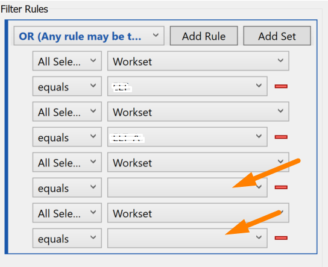

## Table of Contents

## What is a filter rule?

A filter rule is a set of instructions that tells a computer program what to do with certain information. It helps to sort, block, or allow specific data based on the rules you set. For example, in an email program, you can use filter rules to automatically move messages from a specific sender into a special folder.

Filter rules are useful in many different programs, like email clients, web browsers, and security software. They help you manage information more easily by automatically organizing or protecting your data. By setting up filter rules, you can save time and keep your digital life more organized.

## Why are filter rules important in data processing?

Filter rules are important in data processing because they help manage large amounts of information. When you have a lot of data, it can be hard to find what you need quickly. Filter rules let you set up automatic sorting and organizing. This means you can tell the computer to look for certain things in the data and do something with them, like moving them to a special place or marking them in a certain way.

Using filter rules makes data processing more efficient. Instead of going through all the data by yourself, the computer does it for you based on the rules you set. This saves time and reduces mistakes. For example, in a business, filter rules can help sort customer information, making it easier to find and use the right data for different tasks.

## What are the basic components of a filter rule?

A filter rule has a few main parts that work together to help manage data. The first part is the condition. This is what the rule looks for in the data. It could be something simple like a word in an email or something more complex like a date range. The condition tells the computer what to pay attention to.

The second part is the action. This is what the computer does when it finds data that matches the condition. The action could be moving an email to a folder, deleting a file, or marking something as important. The action part makes sure the data is handled the way you want.

The last part is sometimes called the exception or else condition. This part tells the computer what to do if the data does not match the main condition. It helps make sure that all data is handled correctly, even if it doesn't fit the main rule. Together, these parts make up a filter rule that helps you manage your data easily and efficiently.

## How do you create a simple filter rule?

To create a simple filter rule, you first need to decide what you want the rule to do. Think about what kind of data you want to sort or organize. For example, if you want to move all emails from a certain person into a special folder, that person's email address is what you will use as the condition. Open the settings or preferences in your program, find the section for creating rules or filters, and enter the condition. In this case, you would type in the email address.

Once you have set the condition, you need to tell the program what to do with the emails that match it. This is the action part of the rule. Click on the part where you can choose what to do and select "move to folder." Then, pick the folder where you want the emails to go. After setting the condition and action, save the rule. Now, any email from that person will automatically go into the folder you chose, making it easier to keep your inbox organized.

## What are common use cases for filter rules?

Filter rules are often used in email programs to help people manage their messages. For example, you can set up a rule to move all emails from your boss into a special folder. This makes it easy to find important messages quickly. Another common use is to filter out spam emails. You can tell the program to send any email with certain words or from certain addresses straight to the spam folder, keeping your main inbox clean.

In web browsers, filter rules can help block annoying ads or unsafe websites. You can create a rule that stops certain websites from showing ads, making your browsing experience better. Also, in security software, filter rules can protect your computer by blocking dangerous files or websites. For example, you can set a rule to stop any file with a certain type from being downloaded, keeping your computer safe from viruses.

In data management and analysis, filter rules help sort and organize large amounts of information. For instance, a business might use filter rules to sort customer data by location or purchase history. This makes it easier to find the right information for marketing or analysis. Filter rules can also be used in databases to automatically categorize data based on certain conditions, like date or type, making data handling more efficient.

## How can filter rules be applied in different software or systems?

Filter rules can be used in email programs to keep your inbox tidy. You can set up a rule to move emails from certain people into a special folder. This helps you find important messages fast. You can also make a rule to send spam emails to a different folder, so your main inbox stays clean. In web browsers, filter rules can block ads or unsafe websites. You can tell the browser to stop certain websites from showing ads, making your time online better. Also, in security software, filter rules can protect your computer by stopping dangerous files or websites from getting through.

In data management and analysis, filter rules help sort and organize big sets of information. For example, a business might use filter rules to sort customer data by where they live or what they have bought. This makes it easier to find the right information for marketing or to understand trends. Filter rules can also be used in databases to automatically put data into categories based on certain conditions, like date or type. This makes handling data more efficient and helps people find what they need quickly.

## What are advanced parameters that can be set in filter rules?

Advanced parameters in filter rules let you make very specific and detailed rules. You can use things like regular expressions to look for patterns in text. This means you can find emails or data that have certain words or numbers in a special order. You can also set up rules that depend on more than one condition at the same time, like moving an email only if it's from a certain person and has a specific word in the subject. This makes the rules very powerful and helps you sort your data exactly how you want.

Another advanced parameter is setting up time-based rules. For example, you can make a rule that only works during certain hours of the day or on certain days of the week. This can be useful for things like moving urgent emails to the top of your inbox only during work hours. You can also use advanced parameters to set up exceptions, which means you can tell the rule to ignore certain data even if it matches the main condition. This helps make sure your rules are as accurate and useful as possible.

## How do filter rules impact system performance?

Filter rules can make your computer or system work harder or slower. When you have a lot of filter rules, the computer has to check each one every time it gets new data. This can slow things down, especially if the rules are very detailed or if there is a lot of data coming in. For example, if you have many rules in your email program, it might take longer for new emails to show up because the computer is busy sorting them according to all those rules.

However, filter rules can also help your system work better in some ways. If you use them to sort and organize your data well, you can find what you need faster. This means you spend less time looking for things and more time doing other work. So, while filter rules might make your system a bit slower at first, they can make it more efficient in the long run if you set them up right.

## What are best practices for managing multiple filter rules?

When you have a lot of filter rules, it's good to keep them organized. Start by giving each rule a clear name that tells you what it does. This way, you can find and change rules easily. Also, try to keep the number of rules small. Too many rules can make your system slow down because it has to check all of them every time. If you find rules that do the same thing, combine them into one rule. This helps keep things simple and makes your system work faster.

It's also important to check your rules now and then. Sometimes, you might not need a rule anymore, so you can delete it. This keeps your list of rules clean and helps your system run smoothly. If a rule isn't working well, you can change it to make it better. Remember, the goal is to make your data easier to handle, so keep your rules clear and up to date.

## How can filter rules be optimized for efficiency?

To make filter rules work better and faster, you should keep them simple and clear. Use only the rules you really need, and try to combine rules that do the same thing into one rule. This way, your system doesn't have to check as many rules, which makes it run faster. Also, use simple conditions in your rules. Instead of looking for many different things, focus on what's most important. This helps the computer find and sort data quickly.

It's also a good idea to check your filter rules sometimes to see if they are still useful. If you find rules that you don't need anymore, delete them. This keeps your list of rules clean and helps your system work smoothly. If a rule isn't working well, you can change it to make it better. Remember, the goal is to make your data easier to handle, so keep your rules clear and up to date.

## What are the security implications of using filter rules?

Filter rules can help keep your computer safe by blocking dangerous files or websites. For example, you can set up a rule to stop any file with a certain type from being downloaded, which can protect your computer from viruses. Also, filter rules can help keep your personal information private by sorting emails and blocking spam. This means you are less likely to click on harmful links or give away personal information by accident.

However, filter rules can also cause problems if they are not set up correctly. If a rule is too strict, it might block important files or emails by mistake. This can make it hard to get the information you need. Also, if someone knows about your filter rules, they might try to get around them to send you harmful files or messages. So, it's important to keep your filter rules up to date and check them regularly to make sure they are working the way you want.

## How do you troubleshoot issues related to filter rules?

When you have problems with filter rules, the first thing to do is check if the rules are set up right. Look at each rule and make sure the conditions and actions are what you want. Sometimes, a rule might be too strict or not strict enough, so it's not working the way you expected. If you find a rule that's not right, change it to fix the problem. Also, see if the rules are in the right order. The order can matter because the computer checks the rules one by one, and it might stop at the first rule that matches.

If changing the rules doesn't help, you might need to test them. Send yourself test emails or create test data to see if the rules are working. If a rule isn't doing what it should, try to figure out why. Maybe the condition is too specific, or maybe there's a mistake in how you wrote it. Sometimes, looking at the logs or history of your system can show you what's happening with your data and help you find the problem. By testing and checking, you can fix issues with your filter rules and make them work better.

## What are some case studies and examples?

To illustrate the application of the filter rule strategy, we present a practical example involving Apple's stock (AAPL). Consider a scenario where a trader employs a 0.6% filter rule on intraday price movements. In such a strategy, the trader would establish criteria for buying or selling based on a 0.6% deviation from a previous price point. This deviation acts as a trigger for executing trades, intending to profit from short-term price trends.

In practice, the trader monitors AAPL's price throughout the trading day, setting a rule to buy if the stock increases by 0.6% from a pre-defined baseline price and to sell if it decreases by the same percentage. This strategy is based on the assumption that minor price trends can be indicative of larger shifts. The calculation for determining when to buy or sell would be as follows:

$$
\text{Buy Price} = \text{Current Price} \times (1 + 0.006)
$$

$$
\text{Sell Price} = \text{Current Price} \times (1 - 0.006)
$$

Real-world scenarios reveal the potential outcomes this strategy could yield under varying market conditions. For instance, during a bullish market, frequent upward price adjustments might trigger multiple buy signals, potentially leading to profitable exits if the stock continues to appreciate. Conversely, a bearish environment could activate sell triggers, safeguarding the trader's position against further losses.

However, it's imperative to recognize the impact of trading costs and market dynamics on this approach. Attention to detail, such as accounting for commissions and slippage, is crucial for accurate assessments. Commissions refer to the fees charged by brokers for executing trades, which can erode profits, especially in high-frequency trading contexts. Slippage, the difference between the expected trade price and the actual executed price, can further affect the strategy's profitability, particularly in volatile markets.

For a comprehensive analysis, traders might utilize Python scripts to backtest the filter rule strategy against historical data, refining their parameters for optimal performance. The code snippet below outlines a basic framework for executing such a backtest:

```python
import pandas as pd

# Assume 'data' is a DataFrame with columns 'Date' and 'Close' (closing prices of AAPL)
data['Percentage Change'] = data['Close'].pct_change()

# Define filter rule threshold
filter_threshold = 0.006

# Initialize buy/sell signals
signals = []

for i in range(1, len(data)):
    if data['Percentage Change'].iloc[i] >= filter_threshold:
        signals.append('Buy')
    elif data['Percentage Change'].iloc[i] <= -filter_threshold:
        signals.append('Sell')
    else:
        signals.append('Hold')

data['Signals'] = signals

print(data[['Date', 'Close', 'Signals']])
```

Through meticulous application and adjustment of the filter rule strategy, traders can strive to enhance their decision-making process and optimize trade execution in diverse market scenarios.

## References & Further Reading

[1]: ["Advances in Financial Machine Learning"](https://www.amazon.com/Advances-Financial-Machine-Learning-Marcos/dp/1119482089) by Marcos Lopez de Prado

[2]: ["Evidence-Based Technical Analysis: Applying the Scientific Method and Statistical Inference to Trading Signals"](https://www.amazon.com/Evidence-Based-Technical-Analysis-Scientific-Statistical/dp/0470008741) by David Aronson

[3]: ["Machine Learning for Algorithmic Trading"](https://github.com/stefan-jansen/machine-learning-for-trading) by Stefan Jansen

[4]: ["Quantitative Trading: How to Build Your Own Algorithmic Trading Business"](https://www.amazon.com/Quantitative-Trading-Build-Algorithmic-Business/dp/1119800064) by Ernest P. Chan

[5]: Brock, W., Lakonishok, J., & LeBaron, B. (1992). ["Simple Technical Trading Rules and the Stochastic Properties of Stock Returns."](https://www.jstor.org/stable/2328994) Journal of Finance, 47(5), 1731-1764.

[6]: Lo, A. W., Mamaysky, H., & Wang, J. (2000). ["Foundations of Technical Analysis: Computational Algorithms, Statistical Inference, and Empirical Implementation."](https://www.cis.upenn.edu/~mkearns/teaching/cis700/lo.pdf) Review of Financial Studies, 13(1), 171-195.