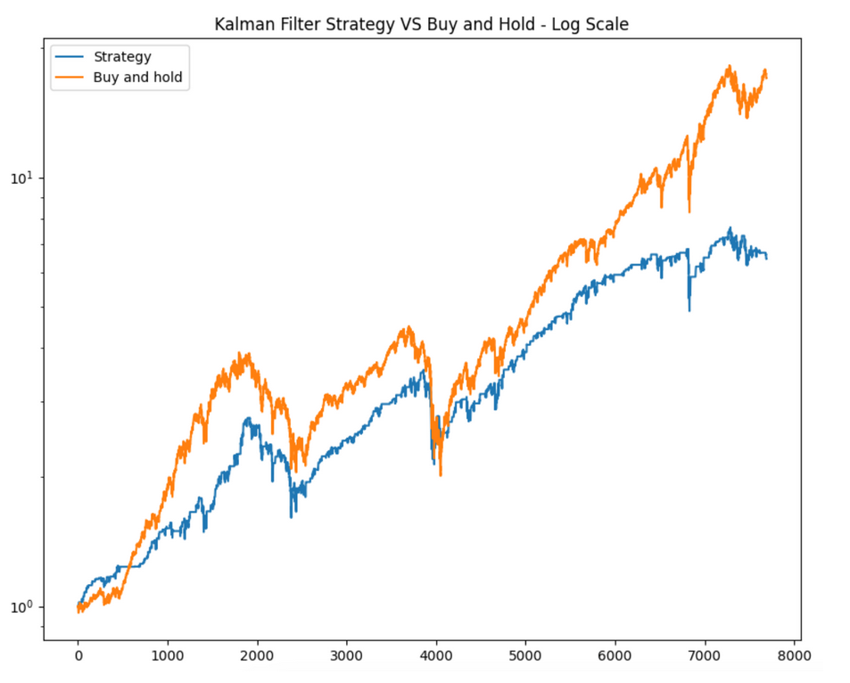

## Table of Contents

## What is a filter trading strategy?

A filter trading strategy is a way to make decisions about buying or selling stocks or other investments. It uses specific rules or "filters" to help traders decide when to take action. These filters can be based on things like price movements, technical indicators, or even news events. The idea is to set clear guidelines that help traders avoid making decisions based on emotions or gut feelings, which can lead to mistakes.

For example, a trader might use a moving average as a filter. If the price of a stock goes above its 50-day moving average, the trader might decide to buy the stock. If the price drops below the moving average, the trader might sell. This simple rule helps the trader stick to a plan and not get swayed by short-term market changes. By using filters, traders can create a more disciplined approach to trading, which can lead to better results over time.

## How does a filter trading strategy differ from other trading strategies?

A filter trading strategy is different from other trading strategies because it uses specific rules or "filters" to decide when to buy or sell. Other strategies might rely more on a trader's feelings or guesses about the market. For example, a momentum trader might buy a stock just because it's going up fast, without any set rules. But a filter trader would only buy if the stock meets certain conditions, like going above a certain price or a technical indicator.

Another way filter trading strategies differ is that they help traders stick to a plan. Many other strategies can be more flexible and might change based on what the trader feels at the moment. This can lead to mistakes because emotions can make people do things they might regret later. With a filter strategy, the rules are set ahead of time, so the trader knows exactly what to do in different situations. This can make trading less stressful and more consistent over time.

## What are the basic components of a filter trading strategy?

A filter trading strategy has a few basic parts that help traders decide when to buy or sell. The first part is the filter itself, which is a rule or set of rules that the trader follows. This could be something like a moving average, where the trader buys when the price goes above the average and sells when it goes below. Another common filter is a price level, where the trader might buy if the price goes above a certain point and sell if it drops below another point. These filters help traders make decisions based on clear rules instead of guessing or following their feelings.

The second part of a filter trading strategy is the timeframe. This means how long the trader plans to hold onto the investment. Some traders might use filters for short-term trades, holding stocks for just a few days or weeks. Others might use filters for longer-term investments, holding stocks for months or even years. The timeframe is important because it affects which filters the trader chooses. For example, a short-term trader might use a 20-day moving average, while a long-term trader might use a 200-day moving average.

The third part is the risk management rules. These are rules that help the trader protect their money. For example, a trader might set a stop-loss order, which automatically sells the stock if it drops to a certain price. This helps limit how much money the trader can lose on one trade. Another risk management rule might be to only risk a small percentage of their total money on any single trade. These rules are important because they help the trader stay safe and keep trading even if some trades don't work out.

## Can you explain the concept of filters in trading?

Filters in trading are like rules that help traders decide when to buy or sell stocks or other investments. These rules are set ahead of time, so the trader knows exactly what to do without having to guess or follow their feelings. For example, a filter might be a moving average, which is a line on a chart that shows the average price of a stock over a certain time. If the price goes above the moving average, the trader might buy the stock. If it goes below, they might sell. This helps traders make decisions based on clear rules instead of emotions.

Another way to think about filters is like a checklist. Before making a trade, the trader goes through the checklist to see if the stock meets all the rules. If it does, they trade; if not, they wait. This can help traders avoid making mistakes because they're not rushing into trades without thinking. Filters can be based on many things, like price levels, technical indicators, or even news events. The key is to pick filters that fit the trader's goals and how long they plan to hold the investment.

## What types of filters are commonly used in trading strategies?

In trading, people often use different kinds of filters to help them decide when to buy or sell. One common type of filter is a moving average. This is a line on a chart that shows the average price of a stock over a certain time, like 50 days or 200 days. Traders might buy a stock if its price goes above the moving average and sell if it goes below. Another popular filter is price levels. Traders might set a certain price and decide to buy if the stock goes above that price or sell if it goes below another price. These filters help traders stick to a plan and not make decisions based on feelings.

Other types of filters include technical indicators like the Relative Strength Index (RSI) or the Moving Average Convergence Divergence (MACD). The RSI measures how fast a stock's price is going up or down and can help traders see if a stock is overbought or oversold. The MACD looks at the difference between two moving averages and can signal when to buy or sell. Traders also use [volume](/wiki/volume-trading-strategy) filters, which look at how many shares of a stock are being traded. If the volume is high, it might mean more people are interested in the stock, and that could be a good time to buy or sell. By using these different filters, traders can make better decisions and follow a clear plan.

## How do you set up a simple filter trading strategy for beginners?

Setting up a simple filter trading strategy for beginners involves choosing a clear and easy-to-understand filter. A good starting point is using a moving average. A moving average is a line on a chart that shows the average price of a stock over a certain number of days, like 50 days. As a beginner, you can decide to buy a stock when its price goes above the 50-day moving average and sell it when the price drops below this line. This simple rule helps you make decisions without guessing or letting your emotions take over. You can use a trading platform or a charting tool to see the moving average line and track the stock's price.

Another important part of setting up your filter trading strategy is deciding how much money you're willing to risk. This is called risk management. For beginners, a good rule is to only risk a small amount of your money on each trade, like 1% or 2%. You can also set a stop-loss order, which is like a safety net that automatically sells your stock if it drops to a certain price. This helps you limit how much money you can lose on one trade. By using a moving average as your filter and following these simple risk management rules, you can start trading with a clear plan that's easy to follow.

## What are the key indicators to use in a filter trading strategy?

In a filter trading strategy, one key indicator to use is a moving average. This is a line on a chart that shows the average price of a stock over a certain time, like 50 days or 200 days. As a trader, you can buy a stock when its price goes above the moving average and sell it when the price drops below this line. This helps you make decisions based on a clear rule instead of guessing or following your feelings. Using a moving average as a filter can help you stick to a plan and avoid making emotional trades.

Another important indicator is the Relative Strength Index (RSI). The RSI measures how fast a stock's price is going up or down and can tell you if a stock is overbought or oversold. If the RSI goes above 70, it might mean the stock is overbought and could be a good time to sell. If it drops below 30, the stock might be oversold, and it could be a good time to buy. By using the RSI along with a moving average, you can get a better idea of when to trade and make more informed decisions. These two indicators together can form a solid base for a simple filter trading strategy.

## How can backtesting improve a filter trading strategy?

Backtesting can help make a filter trading strategy better by letting you see how it would have worked in the past. You can use old stock data to test your rules and see if they would have made money or lost money. This helps you find out if your filters, like moving averages or price levels, are good ones to use. If your strategy loses money in the backtest, you can change your filters or rules to try to make it better before you start trading for real. This way, you can feel more sure about your strategy because you know it has worked before.

Another way backtesting helps is by showing you what might go wrong. You can see if there are times when your strategy loses a lot of money, and then you can add rules to protect yourself. For example, you might add a stop-loss order to limit your losses. Backtesting also lets you try different time periods or different stocks to see if your strategy works well in all situations. By doing this, you can make your filter trading strategy stronger and more likely to work well when you start using it in the real market.

## What are the common pitfalls to avoid when using filter trading strategies?

One common pitfall to avoid when using filter trading strategies is over-relying on just one filter. It can be tempting to think that a single rule, like a moving average, will always work. But markets change, and what worked in the past might not work in the future. Using just one filter can lead to missing out on important information that other indicators, like the RSI or volume, can provide. It's better to use a few different filters together to get a fuller picture of what's happening with a stock.

Another pitfall is not sticking to the plan. It's easy to get scared or excited and change your rules in the middle of trading. But if you keep changing your filters or ignoring them, you'll end up making decisions based on feelings instead of a clear plan. This can lead to big losses. To avoid this, make sure to test your filters with backtesting and then stick to them when you're trading for real. Having a set of rules and following them can help you trade more calmly and consistently.

## How can advanced traders optimize their filter trading strategies?

Advanced traders can optimize their filter trading strategies by using more than one filter at the same time. Instead of just relying on a moving average, they can add other indicators like the Relative Strength Index (RSI) or volume to get a better picture of what's happening with a stock. For example, they might buy a stock when its price goes above the moving average and the RSI is below 70, showing it's not overbought. This way, they can make more informed decisions and avoid trading based on just one piece of information. Using multiple filters can help them catch more opportunities and reduce the chance of making a bad trade.

Another way advanced traders can improve their filter trading strategies is by doing more backtesting. They can test their filters on different time periods and with different stocks to see how well they work in all kinds of market situations. If they find that their strategy loses money during certain times, they can change their filters or add new rules to protect themselves. For example, they might add a stop-loss order to limit losses or change the time period of their moving average to better fit the market. By constantly testing and tweaking their strategy, advanced traders can make it stronger and more likely to succeed in the real market.

## What role does risk management play in a filter trading strategy?

Risk management is a big part of a filter trading strategy. It helps traders protect their money and keep trading even if some trades don't work out. One way to manage risk is by setting a stop-loss order. This is like a safety net that automatically sells a stock if it drops to a certain price. This way, the trader can limit how much money they lose on one trade. Another way to manage risk is by only risking a small amount of money on each trade, like 1% or 2% of their total money. This helps the trader stay safe and not lose too much if a trade goes wrong.

Using risk management rules in a filter trading strategy is important because it helps traders stick to their plan. Without risk management, a trader might get scared and sell too soon or get too excited and buy too much. This can lead to big losses. By setting clear rules for managing risk, traders can make decisions based on a plan instead of their feelings. This can make trading less stressful and help the trader do better over time.

## Can you discuss case studies or real-world examples of successful filter trading strategies?

One real-world example of a successful filter trading strategy is the use of the 200-day moving average by many institutional investors. A well-known case is the Turtle Traders, a group of traders trained by Richard Dennis and William Eckhardt in the 1980s. They used a simple filter strategy where they bought stocks when the price went above the 200-day moving average and sold when it went below. This strategy helped them make a lot of money because it allowed them to follow a clear plan and avoid making emotional decisions. By sticking to the moving average filter, the Turtle Traders were able to capture long-term trends in the market and achieve consistent profits.

Another example is the use of the Relative Strength Index (RSI) combined with moving averages by some hedge funds. A notable case is the strategy used by the [hedge fund](/wiki/hedge-fund-trading-strategies) Renaissance Technologies. They use a complex set of filters, including RSI, to find the best times to buy and sell stocks. For instance, they might buy a stock when its price goes above a short-term moving average and the RSI is below 70, indicating it's not overbought. This multi-filter approach helps them make more informed decisions and reduce the risk of bad trades. By combining different filters, Renaissance Technologies has been able to achieve high returns and manage risk effectively in the volatile stock market.

## What are the challenges and limitations?

Algorithmic trading, specifically through filter trading strategies, presents several challenges and limitations that traders must address to optimize their performance and minimize risk.

**Overfitting and Reliance on Historical Data**

Overfitting occurs when a trading strategy is excessively tailored to past data, capturing noise instead of the actual underlying market patterns. This happens when a model becomes too complex, including too many parameters that describe the historical data perfectly but fail to generalize to new data. In mathematical terms, an overfitted model does not minimize generalization error and may be represented as:

$$
E = E_{\text{training}} + E_{\text{generalization}}
$$

Where $E$ is the total error, $E_{\text{training}}$ is the error on historical data, and $E_{\text{generalization}}$ is the error on new data. Reducing $E_{\text{generalization}}$ while controlling $E_{\text{training}}$ is crucial for a robust strategy. Filter strategies, if not carefully designed, might absorb excessive historical noise, leading to ineffective decision-making in live trading scenarios.

**Impact of Market Conditions on Filter Strategies**

The efficacy of filter trading strategies is heavily dependent on current market conditions, which are inherently volatile and unpredictable. Filter strategies typically excel in specific market environments (e.g., trending or ranging markets) but may perform poorly in others. During periods of high [volatility](/wiki/volatility-trading-strategies) or sudden market shifts, the filters might fail to adapt promptly, leading to significant trading losses. The assumption that past trends and patterns will continue is a fundamental risk, as markets do not always behave consistently.

**Computational and Resource Limitations**

Implementing filter trading strategies requires substantial computational resources, particularly when processing large volumes of real-time market data and performing complex calculations for multiple assets simultaneously. The computational burden can be represented by:

$$
C = O(n \cdot m)
$$

Where $C$ is the computational cost, $n$ is the number of data points, and $m$ is the complexity of operations performed per data point. High-frequency trading necessitates low latency in execution, demanding high-performance computing systems and extensive infrastructure. Additionally, accessing historical data for strategy development and [backtesting](/wiki/backtesting) can be resource-intensive, requiring significant storage and retrieval capabilities.

Overall, while filter trading strategies offer potential advantages in clarity and risk management, traders must carefully navigate these challenges to effectively leverage them in [algorithmic trading](/wiki/algorithmic-trading). Reducing overfitting, understanding the influence of market conditions, and ensuring sufficient computational resources are critical steps in mitigating these limitations.

## Question: What makes a case study on successful implementation noteworthy?

One notable example of a successful implementation of a filter trading strategy is the case involving the moving average crossover approach utilized by hedge funds and institutional traders. This strategy leverages the concept of moving averages to filter out market noise, aiming to identify trends and potential reversal points.

### Process Followed

The moving average crossover strategy typically employs two moving averages: a short-term moving average (SMA) and a long-term moving average (LMA). The primary concept is to generate buy and sell signals based on the crossover of these moving averages. This approach simplifies decision-making by focusing on the filtered trend data over various periods.

1. **Data Preparation and Selection**: The first step in implementing this strategy is to acquire historical price data. Traders often choose widely-followed financial instruments such as stock indices or currency pairs. The data is cleaned to remove outliers and fill any missing values.

2. **Moving Average Calculation**: The short-term (e.g., 50-day) and long-term (e.g., 200-day) moving averages are computed using the historical price data. The formulas for the moving averages are given by:
$$
   \text{SMA}_{50} = \frac{1}{50} \sum_{i=0}^{49} \text{Price}_{t-i}

$$
$$
   \text{SMA}_{200} = \frac{1}{200} \sum_{i=0}^{199} \text{Price}_{t-i}

$$

3. **Signal Generation**: A buy signal is identified when the short-term moving average crosses above the long-term moving average, indicating a potential upward trend. Conversely, a sell signal is triggered when the short-term moving average crosses below the long-term moving average, suggesting a downward trend.

4. **Backtesting and Optimization**: To ensure the strategy's validity, it is backtested using historical data. This includes evaluating various parameters, such as different time windows for the moving averages, to optimize performance. Python libraries like `pandas` and `numpy` can be employed to perform these calculations efficiently, as shown below:

   ```python
   import pandas as pd

   # Assuming df contains historical price data with a 'Price' column
   df['SMA_50'] = df['Price'].rolling(window=50).mean()
   df['SMA_200'] = df['Price'].rolling(window=200).mean()

   df['Signal'] = 0
   df['Signal'][df['SMA_50'] > df['SMA_200']] = 1  # Buy signal
   df['Signal'][df['SMA_50'] < df['SMA_200']] = -1 # Sell signal
   ```

### Outcomes

Implementing the moving average crossover strategy resulted in several positive outcomes for traders. The strategy provided clear buy and sell signals, reducing the noise that often leads to decision paralysis. Profitable trends were successfully capitalized on, while false signals were minimized by choosing appropriate moving average lengths.

### Insights and Lessons Learned

Several lessons emerged from this case study:

- **Timing and Parameters**: The selection of moving average time frames significantly affects the strategy's success. Traders need to test different combinations to find the most effective settings for specific market conditions.

- **Market Conditions**: The strategy performed well during trending markets but was less effective in sideways or turbulent environments. It highlighted the importance of context awareness when applying trading strategies.

- **Risk Management**: The strategy underscored the need for a robust risk management plan to prevent significant losses during false signals or unfavorable market periods.

Overall, the moving average crossover strategy exemplifies how a simple, well-defined filter trading strategy can be effectively implemented to navigate complex financial markets, promoting clearer insights and informed decision-making.

## References & Further Reading

[1]: Bergstra, J., Bardenet, R., Bengio, Y., & Kégl, B. (2011). ["Algorithms for Hyper-Parameter Optimization."](https://papers.nips.cc/paper/4443-algorithms-for-hyper-parameter-optimization) Advances in Neural Information Processing Systems 24.

[2]: ["Advances in Financial Machine Learning"](https://www.amazon.com/Advances-Financial-Machine-Learning-Marcos/dp/1119482089) by Marcos Lopez de Prado

[3]: ["Evidence-Based Technical Analysis: Applying the Scientific Method and Statistical Inference to Trading Signals"](https://www.amazon.com/Evidence-Based-Technical-Analysis-Scientific-Statistical/dp/0470008741) by David Aronson

[4]: ["Machine Learning for Algorithmic Trading"](https://github.com/stefan-jansen/machine-learning-for-trading) by Stefan Jansen

[5]: ["Quantitative Trading: How to Build Your Own Algorithmic Trading Business"](https://books.google.com/books/about/Quantitative_Trading.html?id=j70yEAAAQBAJ) by Ernest P. Chan