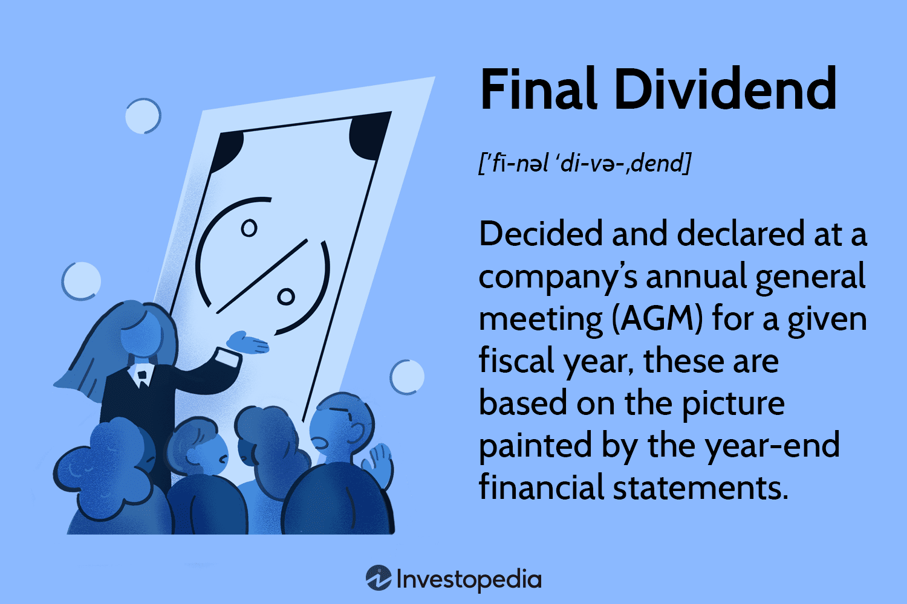

Dividends play a fundamental role in the investment strategies of individuals and institutions alike, providing a regular income stream while also contributing to long-term capital growth. As distributions of a company's earnings to its shareholders, dividends are a significant part of corporate financial policies and can influence investor sentiment and behavior. Understanding the different types of dividends, namely interim and final dividends, is essential for investors aiming to craft a robust investment strategy that balances income needs with growth objectives.

Interim dividends are payments made before a company finalizes its annual financial statements. These dividends are usually declared at various points throughout the year, reflecting the company's financial performance and liquidity position in the interim period. Final dividends, on the other hand, are declared at the Annual General Meeting (AGM) after reviewing the complete financial results for the year. They signify the culmination of the company’s yearly profit distribution plan and often depend on the firm’s annual performance metrics and future outlook.



Calculating dividends involves various financial metrics, primarily focusing on the company's profitability and its dividend payout policy. The dividend payout ratio, which is the percentage of earnings paid to shareholders in dividends, offers insight into the company's financial health and management's confidence in future earnings. Investors often use this information to estimate their expected income from dividend payments and to assess the sustainability of such returns.

In the evolving landscape of investment, algorithmic trading plays an increasingly vital role in optimizing returns from dividend investments. Algorithmic trading leverages intricate algorithms and analytical models to predict and react to market changes swiftly, often enhancing the decision-making process for investors focusing on dividend stocks. These algorithms can process large volumes of data, including historical dividends, financial statements, and prevailing market trends, enabling more accurate forecasts of future dividend payouts.

By understanding these dynamics, investors can implement more effective strategies to maximize their dividend income while aligning with their broader investment objectives. The proper integration of dividend knowledge, algorithmic enhancements, and strategic planning are key for investors aiming to achieve both stable returns and capital appreciation.

## Table of Contents

## Final vs Interim Dividends

Final dividends, typically announced during a company's Annual General Meeting (AGM), serve as a retrospective insight into the overall financial performance of the company during a specific financial year. These dividends are declared after the conclusion of the fiscal year and are based on the final audited financial results. The declaration of final dividends is often a testament to a company's profitability and financial stability, as they are distributed from the profits that remain after all other financial commitments and tax obligations have been met.

Interim dividends, in contrast, are payments made to shareholders before the annual financial statements are finalized. They represent the financial health and operational performance of a company during a part of the fiscal year, often mid-year. Interim dividends can be viewed as a signal of ongoing profitability and cash flow availability. They provide management with an opportunity to return some profits to shareholders without waiting for the full-year results.

The distinction between final and interim dividends lies not only in timing but also in financial implications and investor perceptions. Final dividends tend to be more stable and predictable, offering investors a clearer picture of the company's dividend policy and financial condition over the entire year. Interim dividends, on the other hand, might fluctuate based on short-term financial achievements or operational factors.

Understanding these differences is vital for investors evaluating a company's financial strategy. Companies with a robust interim dividend policy may signal strong cash flow management and confidence in future earnings, whereas a solid final dividend can reassure investors of consistent long-term profitability. Hence, by analyzing both interim and final dividends, investors can gauge the company's financial strategies, predict future dividend patterns, and align their own investment decisions with the company's financial health and market performance.

## Dividend Calculation

Dividend calculation is a fundamental aspect of investment analysis, as it determines the portion of a company's profits allocated to shareholders as dividends. This process involves evaluating several key financial indicators and adhering to the company's dividend policy.

### Key Factors in Dividend Calculation

1. **Profitability**: The core determinant of a company's ability to pay dividends is its profitability. Companies with higher net income have a greater capacity to distribute dividends. The net income figure, reported in a company’s financial statements, is essential for calculating available funds.

2. **Retained Earnings**: Retained earnings represent the cumulative profits that have been reinvested in the company instead of being distributed to shareholders. The amount of retained earnings that a company chooses to distribute as dividends is influenced by both its historical dividend policy and its future growth and expansion plans.

3. **Dividend Payout Policy**: Companies adhere to a specific dividend payout ratio, representing the proportion of earnings paid out as dividends. For instance, if a company has a net income of $1 million and a dividend payout ratio of 40%, the dividend pool would amount to $400,000.

### Formula for Dividend Calculation

The basic formula to determine the total dividend payment is:

$$
\text{Total Dividends} = \text{Net Income} \times \text{Dividend Payout Ratio}
$$

For individual shareholders, the dividend per share (DPS) can be calculated as follows:

$$
\text{Dividend Per Share (DPS)} = \frac{\text{Total Dividends}}{\text{Number of Outstanding Shares}}
$$

### Example Calculation

Assume Company XYZ reports a net income of $10 million and decides on a 30% payout ratio. With 5 million shares outstanding, the calculations would be:

- Total Dividends = $10,000,000 × 0.30 = $3,000,000
- DPS = $3,000,000 / 5,000,000 = $0.60 per share

### Adjusting Investment Portfolios

For investors, understanding dividend calculations allows for more precise income forecasting and portfolio adjustments. By analyzing a company's profitability trends and dividend policies, investors can estimate future dividends and make informed decisions about stock purchases, other income-generating assets, and overall portfolio diversification.

Investors can use tools such as dividend calculators or financial modeling software to simulate various scenarios based on changes in net income or payout ratios, enhancing their decision-making processes for dividend investments.

## Algorithmic Trading and Dividends

Algorithmic trading involves the use of complex computer algorithms to execute trades at speeds and frequencies that a human trader cannot achieve. When applied to dividend investments, these algorithms can optimize the timing and selection of dividend-paying stocks to enhance portfolio returns. Algorithmic trading in the context of dividends fundamentally revolves around analyzing vast amounts of financial data to predict dividend payouts and optimize investment decisions based on these predictions.

Algorithms can process financial statements, evaluating key metrics such as earnings per share (EPS), dividend payout ratios, cash flow statements, and balance sheets to assess the financial health of a company. By analyzing these metrics, algorithms can forecast future dividend payments based on historical payment trends and predicted financial performance.

The ability to forecast dividend payments can be enhanced by incorporating [machine learning](/wiki/machine-learning) techniques and historical market data. For instance, when predicting future dividends, algorithms may use a model that considers past dividend payments, the company's earnings growth, and changes in market conditions. This forecasting approach can be automated in Python using libraries such as pandas for data manipulation and scikit-learn for implementing predictive models.

```python
import pandas as pd
from sklearn.ensemble import RandomForestRegressor
from sklearn.model_selection import train_test_split

# Sample data: hypothetical historical dividends and corresponding financial metrics
data = {
    'eps': [1.5, 2.0, 2.5, 3.0, 3.5], 
    'payout_ratio': [0.4, 0.5, 0.6, 0.7, 0.75],
    'historical_dividend': [0.6, 0.9, 1.5, 2.1, 2.625]
}

# Create a DataFrame
df = pd.DataFrame(data)

# Independent variables: EPS and payout ratio
X = df[['eps', 'payout_ratio']]

# Dependent variable: historical dividend
y = df['historical_dividend']

# Split the data into training and testing sets
X_train, X_test, y_train, y_test = train_test_split(X, y, test_size=0.2, random_state=42)

# Initialize and fit the model
model = RandomForestRegressor()
model.fit(X_train, y_train)

# Predict future dividends
predictions = model.predict(X_test)
```

In addition to predicting dividend payouts, algorithms can also analyze market trends to identify the optimal timing for buying or selling dividend-paying stocks. Market sentiment analysis, for example, can be performed using natural language processing (NLP) techniques to evaluate news articles and social media discussions related to dividend stocks. 

The strategic implementation of [algorithmic trading](/wiki/algorithmic-trading) offers several advantages in dividend investing. It allows for efficient trade executions, reduces transaction costs through optimal timing, and minimizes emotional biases in investment decisions. Furthermore, algorithmic strategies can be designed to capitalize on specific dividend events, such as the ex-dividend date, to optimize returns.

Overall, leveraging algorithmic trading in dividend investments involves combining advanced data analysis with strategic trade execution to achieve enhanced returns. This approach is especially beneficial in today's fast-paced financial markets, where timely and informed decisions are crucial.

## Tax Implications of Dividends

Both interim and final dividends [carry](/wiki/carry-trading) specific tax implications that significantly impact the net returns investors receive. Understanding these tax obligations is essential for effective financial planning.

### Tax Obligations on Dividends

Dividend income is often subject to double taxation, as companies pay dividends from their after-tax profits, and shareholders are then taxed again upon receiving this income. Different jurisdictions have varying tax rules regarding dividends, which investors must be well-versed in to manage their financial obligations effectively.

1. **Dividend Distribution Tax (DDT):** In some countries, like India, a Dividend Distribution Tax is levied on companies on the amount paid as dividends. It is crucial for investors to understand if their jurisdiction levies such a tax, as it indirectly affects their net returns.

2. **Tax Credits and Deductions:** Many countries, like the United States, offer tax credits or reduced tax rates on dividends to mitigate the impact of double taxation. Qualified dividends in the U.S., for example, are taxed at the lower capital gains tax rates rather than the higher ordinary income tax rates.

3. **Gross-up and Tax Credit System:** In Canada, dividends are subject to a gross-up and tax credit system. This approach increases the dividend value by a specific percentage, representing the pre-tax income equivalent, and provides a dividend tax credit to offset taxes payable.

### Strategies for Tax Optimization

Investors can employ various strategies to optimize their tax liability on dividend income:

1. **Dividend Tax Shelters:** Investing through tax-advantaged accounts, such as a Roth IRA in the United States or a Tax-Free Savings Account (TFSA) in Canada, can shield dividend earnings from taxation until withdrawal or indefinitely, respectively.

2. **Tax-Efficient Investment Products:** Mutual funds that focus on qualified dividends, or exchange-traded funds (ETFs) that prioritize tax-efficient strategies, can help minimize the tax burden on dividend income.

3. **Strategic Asset Location:** Placing dividend-producing assets in tax-deferred accounts can help optimize after-tax returns. In contrast, growth-oriented investments that yield capital gains could be held in taxable accounts to take advantage of lower capital gains tax rates.

Maximizing net returns from dividend investments entails a careful examination of tax regulations impacting dividends. Employing strategies like tax-efficient asset allocation and leveraging tax-advantaged accounts are essential for optimizing the after-tax returns from dividend investments.

## How to Maximize Dividend Returns

To maximize dividend returns, investors should focus on a strategic approach that emphasizes selecting high-quality dividend stocks, reinvesting dividends, and maintaining a balanced and diversified portfolio. 

Selecting high-quality dividend stocks with a robust payout history is foundational. Companies with a consistent track record of paying dividends, especially those that have demonstrated the ability to increase dividend payouts over time, tend to be more stable and financially sound. These companies often belong to sectors that generate stable cash flow, such as utilities, consumer staples, and healthcare. Evaluating a company's dividend payout ratio, which is the ratio of dividends paid to net income, can provide insight into the sustainability of its dividends. A payout ratio too high may indicate financial strain, while a lower ratio suggests more room for dividend growth.

Investors can also enhance returns by reinvesting dividends through Dividend Reinvestment Plans (DRIPs). DRIPs allow shareholders to automatically reinvest dividends into additional shares of the company's stock without incurring brokerage fees. This reinvestment strategy leverages the power of compounding, as it enables investors to earn dividends on both the initial shares and the reinvested dividends over time. For instance, if an investor receives a $100 dividend and the stock price is $10, the investor can acquire 10 more shares, which in turn generate more dividends in the future.

Balancing growth and income objectives is essential in optimizing investment strategies. While dividends provide a steady income stream, [growth stocks](/wiki/growth-stocks) can offer capital appreciation. Investors should seek to combine both growth and income-oriented stocks to achieve optimal portfolio performance. Diversifying dividend sources—both domestically and internationally—reduces exposure to sector-specific risks and currency fluctuations. This approach leads to a more resilient portfolio that's better equipped to withstand economic [volatility](/wiki/volatility-trading-strategies).

In conclusion, by focusing on high-quality dividend stocks, reinvesting dividends, and balancing growth with income, investors can significantly enhance their dividend returns. Additionally, diversification across different sectors and geographies remains a key strategy for managing risk and optimizing overall returns.

## Conclusion

Understanding the dynamics of final and interim dividends, along with their calculation and tax implications, is crucial for informed investing. These components not only guide investors in gauging a company’s financial health but also in formulating strategies for steady income generation and long-term capital growth. Final dividends, declared at a company's Annual General Meeting, provide insights into the company's performance over the fiscal year, while interim dividends offer a mid-year financial health check. By strategically analyzing these payouts, investors can tailor their portfolios to align with their financial goals.

Incorporating algorithmic trading strategies can further enhance dividend income and portfolio performance. These sophisticated trading systems can process complex financial data and recognize patterns more quickly than manual analysis. They can project future dividend payouts by considering historical performance, market trends, and economic indicators, thus allowing investors to make informed decisions about when to buy or sell dividend-paying stocks. Algorithms can also assess tax implications automatically, optimizing net returns by considering strategies such as tax-loss harvesting or choosing tax-efficient investment vehicles.

Strategic planning and diversification remain at the heart of maximizing returns from dividend investments. Diversification across sectors and geographies can mitigate risks associated with economic downturns in specific areas. By selecting high-quality dividend stocks with a robust payment history and reinvesting dividends through Dividend Reinvestment Plans (DRIPs), investors can enhance their returns through compounding. Balancing growth and income-focused strategies can further leverage the contrasting benefits of dividend stability and capital appreciation. Investors who understand and apply these principles to their decision-making processes are well-positioned to optimize their financial outcomes in the dynamic world of dividend investing.

## References & Further Reading

[1]: ["The Intelligent Investor: The Definitive Book on Value Investing. A Book of Practical Counsel"](https://www.amazon.com/Intelligent-Investor-Definitive-Investing-Essentials/dp/0060555661) by Benjamin Graham

[2]: ["Dividends Still Don't Lie: The Truth About Investing in Blue Chip Stocks and Winning in the Stock Market"](https://www.amazon.com/Dividends-Still-Dont-Lie-Investing/dp/0470581565) by Kelley Wright

[3]: ["Dividends: A Primer"](https://investments.firstpremier.com/resource-center/investment/a-primer-on-dividends) by James Chen on Investopedia

[4]: ["Algorithmic Trading: Winning Strategies and Their Rationale"](https://www.wiley.com/en-us/Algorithmic+Trading%3A+Winning+Strategies+and+Their+Rationale-p-9781118746912) by Ernie Chan

[5]: ["Advances in Financial Machine Learning"](https://www.amazon.com/Advances-Financial-Machine-Learning-Marcos/dp/1119482089) by Marcos Lopez de Prado