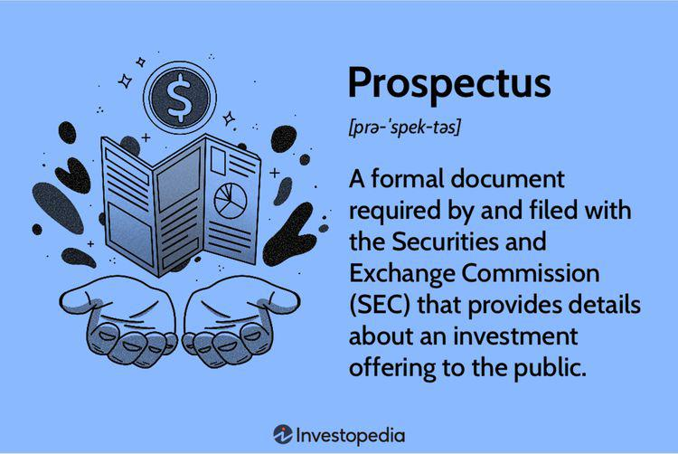

Financial documents serve as the backbone of informed investment decisions, providing a comprehensive view of a company's financial health and operational sustainability. These documents, including balance sheets, income statements, and cash flow statements, offer critical insights into a company's performance, allowing investors to assess risks and potential returns. They form the bedrock upon which investment strategies are built, enabling stakeholders to make informed, data-driven decisions. 

In the context of public offerings, the final prospectus stands as a pivotal document. It provides prospective investors with a detailed account of a company's business model, financial standings, and risk factors, thereby ensuring transparency and investor protection. The issuance of a final prospectus signals a company's readiness to enter the public market, offering a comprehensive snapshot that is vital for regulatory compliance and for investors who seek to weigh the potential risks and rewards.



Parallelly, algorithmic trading has emerged as a transformative force in financial markets. By automating trading processes using pre-defined algorithms, this approach enhances market efficiency, reduces transaction costs, and boosts liquidity. It leverages historical data and complex mathematical models to execute trades at speeds and frequencies that are beyond human capability, thus reshaping traditional trading landscapes.

The objective of this article is to interlink these elements—final prospectus analysis, financial document assessment, and algorithmic trading—in the framework of modern investment strategies. By understanding their roles and interactions, investors can develop more sophisticated and adaptive strategies, effectively navigating the complexities of today's financial markets.

## Table of Contents

## Understanding the Final Prospectus

A final prospectus is a pivotal document in the investment process, particularly relevant during public offerings. Its primary purpose is to provide potential investors with comprehensive and reliable information about a company's business model, financial condition, and associated risks before they commit capital. As a legally mandated document, the final prospectus serves to ensure transparency and uphold investor protection, which are essential in maintaining confidence in the financial markets.

### Definition and Purpose of a Final Prospectus

The final prospectus, sometimes referred to as the "statutory prospectus," is the definitive version of a company's offering document following the Securities and Exchange Commission's (SEC) review and approval. Its primary aim is to furnish potential investors with all pertinent details about an investment offering, enabling them to make informed decisions. The final prospectus is typically issued after the preliminary prospectus, incorporating any amendments or additional information requested by the SEC or based on feedback received during the IPO roadshow.

### Key Components of a Final Prospectus

1. **Business Model**: Clearly outlines the nature of the company's operations, industry positioning, strategic goals, and growth prospects. This section helps investors understand how the company generates revenue and its competitive advantages.

2. **Financial Statements**: Provides detailed financial data, including balance sheets, income statements, and cash flow statements. These documents are crucial for evaluating the company's past performance, current financial health, and future potential.

3. **Risk Factors**: Enumerates potential risks that could affect the company's performance and, consequently, the success of the investment. This section is critical for investors to assess the level of risk associated with their investment.

4. **Use of Proceeds**: Describes how the funds raised from the offering will be utilized, offering transparency about strategic investments, debt repayment, or other corporate purposes.

5. **Management and Governance**: Details about the company's leadership team, board of directors, and their respective qualifications. This information helps investors appraise the company's management quality and governance structure.

6. **Legal Concerns**: Discloses any pending litigation or regulatory issues that could materially impact the company's operations or financial condition.

### Importance of the Final Prospectus

The final prospectus is a vital tool for ensuring transparency between the issuer and potential investors. It allows investors to evaluate the value and viability of the securities offered, thereby protecting them from uninformed or speculative decision-making. By providing a standardized format for disclosure, the final prospectus helps mitigate information asymmetry and reinforces market integrity.

### Comparison Between Preliminary Prospectus and Final Prospectus

The preliminary prospectus, often known as the "red herring," is the initial version distributed to gauge investor interest before the SEC's review. While it contains much of the same information as the final prospectus, it lacks certain details such as the final offering price and issue size. The final prospectus resolves any ambiguities or uncertainties presented in the preliminary version and includes all the definitive terms of the offering. It serves as the authoritative document upon which investment decisions are based.

Overall, the final prospectus is a cornerstone document in the investment landscape, providing essential information that empowers investors to make informed and judicious investment choices.

## Role of Financial Documents in Investment

Financial documents are essential tools for investors, providing a window into the financial health and operations of a company. The three primary financial statements — the balance sheet, income statement, and cash flow statement — play a critical role in investment analysis and decision-making.

### Balance Sheet

The balance sheet offers a snapshot of a company's financial position at a specific point in time. It lists assets, liabilities, and shareholders' equity, adhering to the fundamental equation:
$$
\text{Assets} = \text{Liabilities} + \text{Equity}
$$

Understanding this statement helps investors assess the [liquidity](/wiki/liquidity-risk-premium), solvency, and capital structure of a company. Key metrics derived from the balance sheet include:

- **Current Ratio**: Calculated as current assets divided by current liabilities, it measures liquidity and the ability to cover short-term obligations.
- **Debt-to-Equity Ratio (D/E)**: Indicates the relative proportion of shareholders' equity and debt used to finance assets, aiding in the analysis of financial leverage.

### Income Statement

The income statement, also known as the profit and loss statement, details the company’s revenues, expenses, and profits over a period. It is pivotal for evaluating a company's profitability and operational efficiency. Key metrics from the income statement include:

- **Net Profit Margin**: Derived from dividing net income by total revenue, it shows how effectively a company converts sales into profits.
- **Earnings Per Share (EPS)**: Represents the portion of a company's profit allocated to each outstanding share of common stock, crucial for assessing shareholder value.

### Cash Flow Statement

The cash flow statement provides insights into cash inflows and outflows from operating, investing, and financing activities. Unlike the income statement, it focuses on actual cash flow rather than accounting profits. This statement aids in understanding the liquidity and financial flexibility of a company. Important metrics include:

- **Free Cash Flow (FCF)**: Calculated as operating cash flow minus capital expenditures, indicating cash available for expansion, dividends, or debt reduction.

### Application in Investment Strategies

Investors use these financial documents to formulate comprehensive investment strategies. By analyzing these statements, they assess valuation, forecast future performance, and determine investment suitability. For instance, value investors might focus on intrinsic value calculations derived from these financial statements, while growth investors examine revenue trends and expenditure patterns to assess potential for earnings expansion.

Moreover, financial statements are integral to [fundamental analysis](/wiki/fundamental-analysis), which investors apply to identify undervalued securities. Metrics such as Price-to-Earnings (P/E) ratio, derived from income statement data, help investors compare valuations within an industry or against historical performances.

In conclusion, financial documents are foundational to investment analysis, providing indispensable insights into a company’s profitability, financial health, and potential as an investment opportunity. By mastering these tools, investors can make informed decisions that align with their objectives and risk tolerance.

## Algorithmic Trading: An Overview

Algorithmic trading refers to the use of computer algorithms to automatically execute trading orders based on pre-defined criteria such as timing, price, and [volume](/wiki/volume-trading-strategy). This approach leverages speed and precision to optimize trading performance, minimizing human intervention. The history of [algorithmic trading](/wiki/algorithmic-trading) dates back to the 1970s when institutions began developing electronic trading platforms. However, it gained significant traction in the 1990s with advancements in computer technology and data analytics.

### Types of Algorithmic Trading Strategies

1. **Market Making**: This strategy involves providing liquidity by simultaneously posting buy and sell orders for a particular security. The market maker profits from the bid-ask spread. Algorithms can manage these orders dynamically, adjusting quotes according to market conditions to optimize profitability.

2. **Statistical Arbitrage**: This strategy relies on statistical models to identify price discrepancies between related securities. Traders use quantitative methods to evaluate historical trading patterns and correlations, enabling the execution of trades that capture risk-free profits from temporary mispricings.

3. **High-Frequency Trading (HFT)**: HFT involves executing a large number of orders at extremely high speeds, often within microseconds. This strategy capitalizes on minute price inefficiencies, requiring sophisticated infrastructure and proximity to trading venues to minimize latency. HFT firms employ complex algorithms to swiftly enter and exit positions, managing substantial volumes of trades daily.

### Advantages of Algorithmic Trading

Algorithmic trading offers several benefits:

- **Efficiency**: Algorithms can execute trades much faster than human traders, reacting to market changes in real-time. This speed is crucial in capitalizing on short-lived opportunities in highly volatile markets.

- **Cost Reduction**: By automating the execution process, algorithmic trading reduces the need for manual intervention, lowering operational costs. This efficiency can lead to significant savings, especially in large-scale trading operations.

- **Liquidity Enhancement**: Algorithmic strategies, particularly market making, contribute to market liquidity by consistently providing buy and sell orders. This presence facilitates smoother price discovery and tighter bid-ask spreads, benefiting all market participants.

### Challenges and Ethical Considerations

Despite its advantages, algorithmic trading presents challenges and raises ethical concerns:

- **Regulatory Challenges**: Regulatory bodies must balance market efficiency with stability. The rapid trading enabled by algorithms can exacerbate market volatility, as seen during the 2010 Flash Crash. Consequently, regulators impose rules like the Market Abuse Directive (MAD) and the Volcker Rule to deter manipulative practices and excessive risk-taking.

- **Risk Management**: Algorithms can malfunction due to coding errors or unforeseen market conditions, leading to substantial financial losses. Robust risk management protocols, including fail-safes and real-time monitoring, are essential to mitigate these risks.

- **Ethical Considerations**: The use of HFT and other aggressive trading strategies can result in unfair advantages over slower market participants, raising concerns about market fairness. Additionally, the reliance on complex algorithms may obscure decision-making processes, complicating accountability.

Algorithmic trading continues to evolve, driven by technological advancements and regulatory developments. Its integration into the financial markets underscores the need for ongoing adaptation and vigilance to harness its benefits while addressing associated challenges.

## Interconnection: Prospectus, Financial Documents, and Algo Trading

The intersection of prospectus analysis, financial document insights, and algorithmic trading strategies represents a pivotal evolution in modern investment practices. A final prospectus, which comprehensively details a company's business model, financial status, and risk factors, provides investors with critical insights required for informed decision-making. These insights, when combined with financial documents, become valuable inputs for algorithmic trading models that seek to optimize trades based on evolving market conditions.

Algorithmic trading strategies such as statistical [arbitrage](/wiki/arbitrage) and high-frequency trading greatly benefit from the transparency and predictive power of detailed financial information. For example, an algorithm can be programmed to execute trades based on anomalies detected between the projected performance in financial documents and live market data. This allows for timely responses to potential under- or over-valuations indicated by the market versus a company's recorded performance.

### Case Studies in Integration

Consider the case of XYZ Corp, a technology firm that went public in 2021. The final prospectus revealed aggressive growth forecasts fueled by an expansion strategy into emerging markets. Analysis of their financial documents indicated strong cash flows but also rising debt levels. An algorithmic trading strategy could leverage this information by setting conditional trade executions if specific financial metrics, such as debt-to-equity ratio or market growth rate, deviated from expected norms as described in the prospectus.

Another example is the application in the energy sector, where a company's final prospectus may outline various operational risks due to regulatory changes. Algorithmic models in this case could integrate data from financial reports to adjust the algorithm's sensitivity to regulatory news, thereby managing risk and capitalizing on market [volatility](/wiki/volatility-trading-strategies) due to policy shifts.

### Techniques for Leveraging Data

To effectively leverage prospectus data and financial document analysis in algorithmic models, several techniques can be applied:

1. **Data Normalization**: Convert qualitative information from prospectuses into quantitative metrics that can be easily integrated into machine learning models.

2. **Sentiment Analysis**: Use natural language processing to evaluate the language tone used in prospectus risk assessments, which can then feed into sentiment-driven trading algorithms.

3. **Financial Ratios and Metrics**: Aggregate critical ratios such as P/E (Price to Earnings), ROE (Return on Equity), and others into the algorithms to identify buy/sell signals more efficiently.

4. **Forecasting with Time-Series Models**: Utilize time-series analysis on historical data extracted from financial documents to predict future price movements and enhance algorithmic decision-making processes.

Here is an example of integrating sentiment analysis in a Python algorithm:

```python
from textblob import TextBlob
import pandas as pd

# Assume 'prospectus_text' is a string containing the text from a prospectus
prospectus_text = '''[Sample prospectus text]'''

# Perform sentiment analysis
blob = TextBlob(prospectus_text)
sentiment_score = blob.sentiment.polarity

# Example decision rule based on sentiment
if sentiment_score > 0.05:
    action = "BUY"
elif sentiment_score < -0.05:
    action = "SELL"
else:
    action = "HOLD"

print("Recommended Action:", action)
```

Advancements in data analytics and [machine learning](/wiki/machine-learning) have further revolutionized the potential for integrating detailed financial information and structured prospectus data into automated trading systems. This integration not only enhances strategic investment decisions but also enables a more dynamic and proactive approach to market participation.

## Challenges and Future Considerations

Regulatory challenges associated with the use of financial documents and algorithmic trading in modern financial markets are significant. With financial documents being the backbone of transparent investment practices, regulatory bodies like the SEC in the United States have established rigorous guidelines to ensure accuracy, completeness, and fairness in financial disclosures. These regulations are critical to maintaining market integrity, protecting investors from fraudulent activities, and preventing financial misstatements.

Algorithmic trading, evolving rapidly due to technological innovations, presents its own set of regulatory challenges. The use of high-frequency trading ([HFT](/wiki/high-frequency-trading-strategies)) strategies has prompted concerns over market stability. Regulatory measures, like the MiFID II in Europe, have been implemented to create safeguards such as circuit breakers and liquidity thresholds in an effort to curb excessive volatility caused by algorithms.

Managing risks and ethical considerations in modern trading environments necessitates a multidimensional approach. Participants must adhere to strict compliance requirements, ensuring systems and strategies conform to regulatory expectations. The ethical use of algorithms also demands transparency and fairness, preventing practices like front-running or market manipulation. Risk management frameworks must incorporate robust testing and real-time monitoring systems to safeguard against unforeseen algorithmic behavior and systemic risk.

The impact of evolving technologies on the integration of prospectus, financial documents, and algorithmic trading is profound. Artificial intelligence and machine learning algorithms enhance the analytical capabilities applied to prospectus data and financial statements. These technologies can identify patterns and predict market movements with unprecedented accuracy. However, they also pose new risks related to data privacy and cybersecurity, necessitating advanced protective measures to ensure data integrity and confidentiality.

Strategic approaches for staying compliant and informed in this dynamic landscape involve ongoing education and adaptation. Market participants must continually update their knowledge of regulatory changes and technological advancements. Collaborative engagement with regulatory authorities and participation in industry forums can provide critical insights and foster a proactive compliance culture. Additionally, investing in advanced analytics and automation tools can improve the accuracy and efficiency of both regulatory compliance and trading strategies. 

In conclusion, addressing the challenges and future considerations associated with financial documents and algorithmic trading requires a comprehensive approach that combines regulatory compliance, ethical practices, risk management, and technological integration. This strategic framework is essential for sustaining market stability and integrity in the ever-evolving financial landscape.

## Conclusion

Understanding the final prospectus, financial documents, and algorithmic trading is crucial for modern investors seeking to navigate the complex landscape of financial markets. The final prospectus serves as a comprehensive source of information, providing critical insights into a company's business model, financial health, and potential risks, thereby ensuring transparency and investor protection. It helps investors make informed decisions and assess the viability of investing in a public offering.

Financial documents, including balance sheets, income statements, and cash flow statements, offer a quantitative perspective on a company's financial health and future prospects. They form the bedrock of fundamental analysis, enabling investors to derive essential metrics such as earnings per share (EPS), return on equity (ROE), and debt-to-equity ratio. These metrics are instrumental in evaluating investment potential, allowing investors to develop robust strategies based on empirical data.

Algorithmic trading, with its reliance on mathematical models and computational power, revolutionizes the way trading is conducted. By executing trades at high speed and frequency, algorithmic trading enhances market liquidity and reduces transaction costs. However, it requires a thorough understanding of financial data and sophisticated algorithms to navigate the challenges it presents, including regulatory and ethical considerations.

The integration of prospectus analysis, financial document insights, and algorithmic trading strategies can significantly enhance investment strategies. Combining these elements allows investors to capitalize on data-driven decisions, leveraging the strengths of each component to build a comprehensive investment approach. This integration empowers investors not only to optimize returns but also to mitigate risks associated with contemporary trading environments.

In a rapidly evolving financial landscape, continuous learning and adaptation are vital. Investors must stay informed about regulatory changes, technological advancements, and emerging market trends to maintain a competitive edge. Engaging with modern tools and embracing new methodologies will enable investors to harness the full potential of the interconnected financial ecosystem.

Ultimately, understanding and integrating the insights from prospectuses, financial documents, and algorithmic trading empower investors to make informed and strategic decisions, fostering a more resilient and successful investment journey. As technology continues to reshape the industry, embracing these elements will be essential for navigating future challenges and opportunities.

## References & Further Reading

[1]: ["Regulation of Securities: SEC Answer Book"](https://law-store.wolterskluwer.com/s/product/regulation-of-securities-sec-answer-book-5e-misb/01t0f00000MxZitAAF) by Steven Mark Levy

[2]: ["Financial Statement Analysis and Security Valuation"](https://www.mheducation.com/highered/product/Financial-Statement-Analysis-and-Security-Valuation-Penman.html) by Stephen Penman

[3]: Aldridge, I. (2013). ["High-Frequency Trading: A Practical Guide to Algorithmic Strategies and Trading Systems."](https://www.amazon.com/High-Frequency-Trading-Practical-Algorithmic-Strategies/dp/1118343506) John Wiley & Sons.

[4]: Johnson, B. (2010). ["Algorithmic Trading & DMA: An introduction to direct access trading strategies."](https://archive.org/details/algorithmictradi0000john) 4Myeloma Press.

[5]: SEC Division of Corporation Finance. ["Preliminary Note to Rules 400 to 494."](https://www.sec.gov/about/divisions-offices/division-corporation-finance)