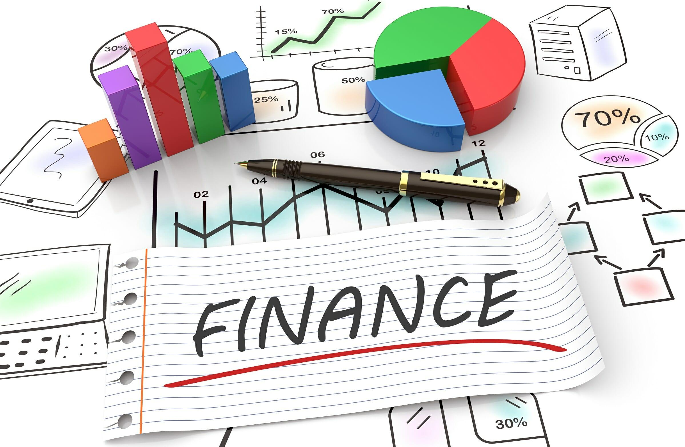

## Table of Contents

## What is finance and why is it important?

Finance is all about managing money. It includes things like saving, investing, borrowing, and spending. People, businesses, and governments all use finance to make sure they have enough money for what they need and want. It's like a roadmap that helps everyone figure out how to use their money wisely.

Finance is important because it helps us plan for the future. Whether it's saving for retirement, buying a house, or starting a business, good financial planning makes these goals possible. Without finance, it would be hard to know if we can afford big purchases or if we're saving enough for emergencies. It's a crucial part of making sure we can live comfortably and achieve our dreams.

## What are the basic concepts of personal finance?

Personal finance is about managing your own money. It includes things like making a budget, saving money, and paying bills. A budget helps you see where your money goes each month. You can plan to spend less on things you don't need and save more for the future. Saving money is important because it gives you a cushion for emergencies and helps you reach big goals, like buying a house or going on a dream vacation.

Another big part of personal finance is managing debt. Debt is money you borrow, like a loan or credit card balance. It's important to pay back what you owe on time to avoid extra fees and keep a good credit score. A good credit score can help you get better deals on loans and credit cards. Investing is also a key concept. When you invest, you put your money into things like stocks or real estate, hoping they will grow in value over time. This can help your money grow faster than just saving it in a bank.

Understanding these basic concepts can help you make smart choices with your money. By budgeting, saving, managing debt, and investing wisely, you can build a strong financial future. It's all about making your money work for you so you can live the life you want.

## How does one create a budget?

Creating a budget starts with figuring out how much money you make each month. This includes your salary, any extra income from side jobs, or money you get from other places like investments. Once you know your total income, the next step is to list all your expenses. This means writing down everything you spend money on, like rent, groceries, utilities, and even little things like coffee or snacks. It's important to be honest and include everything, so you get a clear picture of where your money goes.

After you have your income and expenses listed, you can start planning how to spend your money. Look at your expenses and see if there are places where you can spend less. Maybe you can cut back on eating out or find cheaper options for some things. Then, decide how much you want to save each month. It's a good idea to set some money aside for emergencies and long-term goals, like buying a car or going on a vacation. Once you have your plan, stick to it as best you can. It might take some time to get used to, but following a budget can help you feel more in control of your money.

## What are the different types of financial investments?

There are many different types of financial investments, and each one can help your money grow in different ways. One common type is stocks. When you buy stocks, you're buying a small piece of a company. If the company does well, the value of your stock can go up, and you might get dividends, which are like bonus payments. Another type is bonds. Bonds are like loans you give to a company or the government. They pay you back with interest over time. Mutual funds and exchange-traded funds (ETFs) are other options. These funds pool money from many people to buy a mix of stocks, bonds, or other investments, which can spread out your risk.

Real estate is another popular investment. This means buying property like houses or buildings. You can make money from real estate by renting it out or selling it for more than you paid. Then there are commodities, like gold or oil. These are physical things you can buy and sell, and their prices can go up and down based on what's happening in the world. Finally, there are things like savings accounts and certificates of deposit (CDs). These are very safe because they're usually backed by banks, but they usually don't grow your money as fast as other investments.

Each type of investment has its own risks and rewards. Stocks and real estate can grow a lot, but they can also lose value. Bonds and savings accounts are usually safer but might not grow as much. It's important to think about what you want from your investments and how much risk you're okay with. Talking to a financial advisor can help you figure out the best mix of investments for you.

## What is the difference between stocks and bonds?

Stocks and bonds are two different ways to invest your money. When you buy a stock, you're buying a small piece of a company. If the company does well, the value of your stock can go up, and you might get dividends, which are like little payments the company gives to its shareholders. But if the company doesn't do well, the value of your stock can go down, and you might lose money. Stocks can be a bit risky, but they also have the potential to grow a lot.

On the other hand, when you buy a bond, you're lending money to a company or the government. They promise to pay you back with interest over time. Bonds are usually seen as safer than stocks because you know you'll get your money back as long as the company or government doesn't go bankrupt. But the downside is that bonds usually don't grow as much as stocks. They're a good choice if you want a steady, predictable return on your investment.

So, the main difference between stocks and bonds is the level of risk and reward. Stocks can go up and down a lot, but they have the potential for big gains. Bonds are more stable and give you a steady return, but they usually don't grow as fast. It's important to think about your own goals and how much risk you're comfortable with when deciding between stocks and bonds.

## How does compound interest work in savings and loans?

Compound interest is like magic for your money when it comes to savings. It means that you earn interest not just on the money you put in the bank, but also on the interest you've already earned. Imagine you save $100 and the bank gives you 5% interest each year. After the first year, you'll have $105. But in the second year, you earn 5% on $105, not just the original $100. So, you'll have $110.25. This keeps happening, and over time, your savings can grow a lot faster than if you just got interest on your original amount.

When it comes to loans, compound interest can work against you. If you borrow money, like with a credit card or a loan, the interest you owe can grow on the total amount you owe, including any interest that's already been added. Let's say you borrow $1,000 at a 10% annual [interest rate](/wiki/interest-rate-trading-strategies). After the first year, you'll owe $1,100. But if you don't pay it off, the next year you'll owe interest on $1,100, not just the original $1,000. This can make your debt grow quickly if you're not careful. That's why it's important to pay off loans as soon as you can.

## What are financial markets and how do they function?

Financial markets are places where people buy and sell things like stocks, bonds, and other investments. They're like big marketplaces where you can trade money and other financial stuff. There are different types of financial markets, like stock markets where you can buy shares in companies, and bond markets where you can lend money to companies or governments. These markets help people and businesses get the money they need to grow and do new things. They also help people save and invest their money in ways that can make it grow over time.

Financial markets work by matching people who want to buy things with people who want to sell things. When you want to buy a stock, for example, you can go to a stock market and find someone who wants to sell that stock. The price of the stock is decided by how much people are willing to pay for it. If lots of people want to buy the stock, the price goes up. If fewer people want it, the price goes down. This buying and selling happens all the time, and it helps set the value of different investments. Financial markets also have rules and people who watch over them to make sure everything is fair and safe for everyone involved.

## How can one assess and manage financial risk?

Assessing and managing financial risk starts with understanding what could go wrong with your money. For example, if you invest in stocks, the value of those stocks might go down, and you could lose money. To figure out how much risk you're facing, you can look at things like how much of your money is in risky investments, how stable your job is, and whether you have enough savings to cover emergencies. It's also helpful to think about your goals and how long you have to reach them. If you're saving for something far in the future, like retirement, you might be able to take more risks because you have time to recover if things go wrong.

Once you know your risks, you can start managing them. One way to do this is by spreading your money around, which is called diversification. Instead of putting all your money into one stock or one type of investment, you can spread it out over different things, like stocks, bonds, and real estate. This way, if one investment goes down, you won't lose everything. Another way to manage risk is by having a safety net, like an emergency fund. This is money you keep in a safe place, like a savings account, that you can use if something unexpected happens. It's also smart to keep an eye on your investments and adjust them as needed. If you see that one investment is getting too risky, you can move your money to something safer. Talking to a financial advisor can also help you make better decisions and feel more confident about managing your risks.

## What are the principles of corporate finance?

Corporate finance is about how companies manage their money. It's all about making smart choices to help the company grow and make more money. One big principle is figuring out how to use the company's money in the best way. This means deciding whether to spend money on new projects, buy new equipment, or save it for later. Companies also need to think about how to get more money when they need it, like by borrowing from a bank or selling stocks to people who want to invest in the company. Another important part is making sure the company has enough money to pay its bills and keep running smoothly.

Another key principle of corporate finance is managing risk. Companies need to think about what could go wrong and how to protect themselves. This might mean buying insurance or making plans for what to do if something bad happens, like a big drop in sales. Companies also need to keep an eye on their investments and make sure they're not putting all their money into one thing that could fail. Finally, corporate finance is about making sure everyone who has a stake in the company, like shareholders and employees, is happy. This means making decisions that help the company grow but also treating everyone fairly and keeping them informed about what's going on.

## How do financial regulations impact the economy?

Financial regulations are rules that governments make to keep the money world safe and fair. They help stop big problems like banks going broke or people losing their money because someone did something wrong. When there are good rules, people feel safer putting their money in banks or buying stocks. This can help the economy grow because more people are willing to spend and invest. But if the rules are too strict, it can make it harder for businesses to get the money they need to grow. So, finding the right balance is important for keeping the economy strong.

Sometimes, financial regulations can slow down the economy a bit. If the rules are too tight, businesses might find it harder to borrow money or start new projects. This can mean fewer jobs and less growth. But on the other hand, having good rules can stop big financial crashes that hurt everyone. When people trust the system, they're more likely to save and invest, which helps the economy in the long run. So, while regulations can be a bit of a drag at times, they're really important for keeping things stable and making sure the economy stays healthy.

## What advanced strategies exist for portfolio diversification?

Advanced strategies for portfolio diversification go beyond just spreading your money across different types of investments. One strategy is called asset allocation, which means deciding how much of your money to put into things like stocks, bonds, and real estate based on your goals and how much risk you're okay with. Another way is to look at different sectors or industries. Instead of putting all your money into tech stocks, you might spread it out into healthcare, energy, and consumer goods. This can help protect your money if one sector has a bad year. You can also use something called geographic diversification, which means investing in companies from different countries. This can be good because if one country's economy is struggling, another might be doing well.

Another advanced strategy is using alternative investments, like hedge funds, private equity, or commodities. These can be riskier but might help your portfolio grow in different ways than just stocks and bonds. Some people also use a strategy called rebalancing, which means checking your investments regularly and making changes to keep your mix of investments the way you want it. For example, if your stocks have grown a lot and now make up too big a part of your portfolio, you might sell some and buy more bonds to get back to your original plan. All these strategies can help make your investments stronger and more likely to do well over time.

## How do global economic factors influence financial decision-making?

Global economic factors can really change how people and businesses make money choices. Things like interest rates, inflation, and how well other countries' economies are doing can all make a big difference. For example, if interest rates go up in another country, it might make it harder for businesses to borrow money, so they might decide to wait on starting new projects. Or if inflation is high, people might spend less because their money doesn't go as far, which can affect what companies decide to do with their money.

Another way global economic factors matter is through exchange rates. If the value of one country's money goes up compared to another, it can make things cheaper or more expensive to buy from that country. This can lead businesses to change where they buy things from or where they sell their products. Also, big events like a global financial crisis or a trade war can make people and companies more careful with their money. They might decide to save more and invest less, or they might look for safer places to put their money. All these things show how what happens around the world can affect financial decisions at home.

## References & Further Reading

[1]: Bergstra, J., Bardenet, R., Bengio, Y., & Kégl, B. (2011). ["Algorithms for Hyper-Parameter Optimization."](https://dl.acm.org/doi/10.5555/2986459.2986743) Advances in Neural Information Processing Systems 24.

[2]: ["Advances in Financial Machine Learning"](https://www.amazon.com/Advances-Financial-Machine-Learning-Marcos/dp/1119482089) by Marcos Lopez de Prado

[3]: ["Evidence-Based Technical Analysis: Applying the Scientific Method and Statistical Inference to Trading Signals"](https://www.amazon.com/Evidence-Based-Technical-Analysis-Scientific-Statistical/dp/0470008741) by David Aronson

[4]: ["Machine Learning for Algorithmic Trading"](https://github.com/stefan-jansen/machine-learning-for-trading) by Stefan Jansen

[5]: ["Quantitative Trading: How to Build Your Own Algorithmic Trading Business"](https://books.google.com/books/about/Quantitative_Trading.html?id=j70yEAAAQBAJ) by Ernest P. Chan