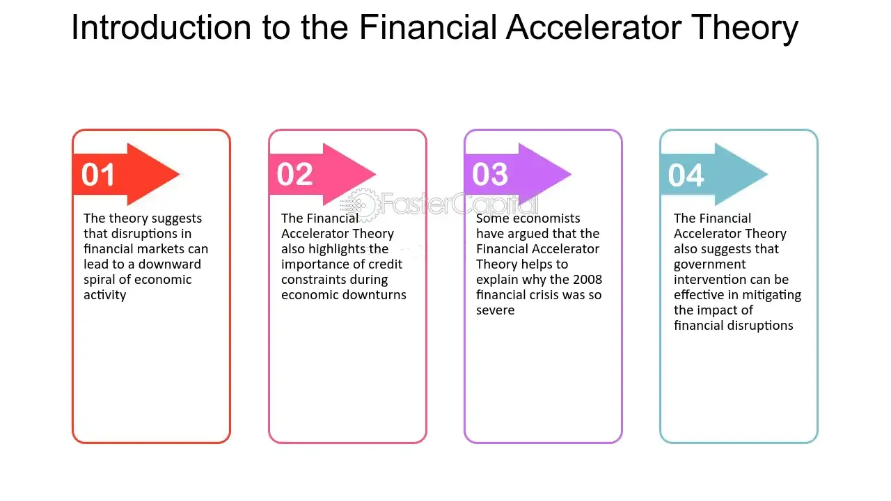

## Table of Contents

## What is the financial accelerator in economics?

The financial accelerator is a concept in economics that explains how small shocks to the economy can be magnified through the financial system, leading to bigger economic impacts. Imagine a snowball rolling down a hill, getting bigger as it goes. In the same way, a small problem, like a company struggling to pay its debts, can grow and affect the whole economy. This happens because when companies or people have trouble with their finances, they cut back on spending and investment, which slows down the economy even more.

Banks play a big role in this process. When the economy starts to slow down, banks become more cautious and might not lend as much money. This makes it harder for businesses to borrow and invest, which can make the economic slowdown worse. On the flip side, when the economy is doing well, banks are more willing to lend, which can help the economy grow even faster. So, the financial accelerator can make both good times and bad times more extreme.

## How does the financial accelerator affect economic cycles?

The financial accelerator can make economic cycles, like booms and busts, stronger. When the economy is doing well, businesses and people feel confident. They borrow more money from banks to invest and spend. Banks, seeing that things are going well, are happy to lend more. This extra spending and investment can make the economy grow even faster, turning a small boom into a big one. It's like adding fuel to a fire.

But when the economy starts to slow down, the financial accelerator can make things worse. If a few businesses start struggling to pay their debts, banks might get worried and start lending less. This makes it harder for other businesses to borrow money, so they cut back on spending and investment. As more businesses struggle, the economy slows down even more. It's like a chain reaction that can turn a small slowdown into a big recession. So, the financial accelerator can make both the good times and the bad times in the economy more extreme.

## What are the key components of the financial accelerator model?

The financial accelerator model has a few main parts that help explain how small problems can grow into big ones in the economy. One key part is the balance sheets of businesses and households. When they have a lot of debt and their assets lose value, it can make it hard for them to borrow more money. This is because their net worth, or the value of what they own minus what they owe, goes down. Banks look at this when deciding whether to lend money, so a lower net worth can mean less borrowing and spending.

Another important part is how banks react to changes in the economy. When the economy is doing well, banks are more willing to lend money because they think the risk is low. This extra lending can help the economy grow even more. But when the economy starts to slow down, banks get worried and might lend less. This can make it harder for businesses and people to borrow, which can make the slowdown worse. So, the way banks change their lending based on the economy's health is a big part of the financial accelerator.

The third part is the feedback loop between the real economy and the financial system. When businesses and households cut back on spending because they can't borrow as much, it can lead to lower sales and profits for other businesses. This can make more businesses struggle, causing banks to lend even less. This cycle can keep going, making small problems in the economy grow bigger and bigger. So, the way the real economy and the financial system affect each other is another key piece of the financial accelerator model.

## Can you explain the relationship between financial frictions and the financial accelerator?

Financial frictions are problems that make it harder for money to move around in the economy. Think of them like bumps in the road that slow down cars. These bumps can be things like high borrowing costs or banks being too cautious about lending money. The financial accelerator is like a magnifying glass that makes these bumps bigger. When there are financial frictions, they can make small problems in the economy grow into bigger ones because businesses and people have a harder time borrowing money.

When financial frictions are high, the financial accelerator can make economic cycles more extreme. For example, if businesses are struggling to pay their debts, banks might get worried and start lending less. This makes it even harder for businesses to borrow money, so they cut back on spending and investment. This can lead to a bigger slowdown in the economy. On the other hand, if the economy is doing well and financial frictions are low, the financial accelerator can help the economy grow even faster. So, financial frictions and the financial accelerator work together to make the ups and downs in the economy more intense.

## How does the financial accelerator amplify shocks in the economy?

The financial accelerator makes small problems in the economy grow bigger. Imagine a small rock falling into a pond, creating tiny ripples. The financial accelerator turns those tiny ripples into big waves. When businesses or people have trouble paying their debts, banks get worried and start lending less money. This makes it harder for others to borrow, so they cut back on spending and investment. As more businesses struggle, the economy slows down even more. It's like a chain reaction that can turn a small problem into a big one.

On the flip side, when the economy is doing well, the financial accelerator can make things even better. If businesses are making money and paying back their loans, banks feel confident and lend more. This extra money helps businesses invest and grow, which can make the economy boom even more. So, whether the economy is going up or down, the financial accelerator can make those changes bigger. It's like a magnifying glass that makes the ups and downs in the economy more extreme.

## What role do balance sheets play in the financial accelerator mechanism?

Balance sheets are really important in the financial accelerator because they show how much money businesses and people have after paying their debts. When the economy is doing well, the value of things they own, like buildings or equipment, goes up. This makes their balance sheets look good, so banks are happy to lend them more money. Businesses can then use this money to invest and grow, which helps the economy boom even more.

But when the economy starts to slow down, the value of those things can drop. This makes the balance sheets look bad because businesses and people have less money after paying their debts. Banks see this and get worried, so they start lending less. This makes it harder for businesses to borrow money, so they cut back on spending and investment. As more businesses struggle, the economy slows down even more. So, balance sheets can make small problems in the economy grow into big ones.

## How do changes in monetary policy influence the financial accelerator?

Changes in monetary policy, like when a central bank decides to raise or lower interest rates, can have a big effect on the financial accelerator. When the central bank lowers interest rates, borrowing money becomes cheaper. This makes businesses and people more likely to take out loans to spend and invest. Banks also feel more confident and are willing to lend more money. This extra spending and investment can help the economy grow faster, making the good times even better because of the financial accelerator.

On the other hand, when the central bank raises interest rates, borrowing money becomes more expensive. This can make businesses and people think twice about taking out loans. Banks might also get more cautious and lend less money. If the economy is already slowing down, this can make things worse. The financial accelerator can turn a small slowdown into a bigger one because businesses and people cut back on spending and investment even more. So, monetary policy can either help boost the economy or make a slowdown worse through the financial accelerator.

## What empirical evidence supports the financial accelerator theory?

There is a lot of real-world evidence that supports the financial accelerator theory. One big example is what happened during the 2008 financial crisis. When housing prices started to drop, many people and businesses found themselves with less money on their balance sheets. Banks got worried and started lending less money, which made it harder for businesses to borrow and invest. This led to a big slowdown in the economy, showing how small problems can grow into big ones because of the financial accelerator.

Another piece of evidence comes from studies that look at how changes in interest rates affect the economy. When central banks lower interest rates, businesses and people borrow more money because it's cheaper. This extra borrowing can help the economy grow faster, which is what the financial accelerator predicts. On the other hand, when interest rates go up, borrowing becomes more expensive, and businesses cut back on spending and investment. This can make a slowdown in the economy worse, just like the financial accelerator theory says. So, both the 2008 crisis and these studies show that the financial accelerator is a real thing that can make economic ups and downs more extreme.

## How does the financial accelerator interact with other economic theories like the credit channel?

The financial accelerator and the credit channel both explain how money moves around in the economy and how problems can grow bigger. The credit channel focuses on how banks change their lending based on what's happening in the economy. When the economy is doing well, banks lend more money, and when it's not, they lend less. This can make small problems bigger, just like the financial accelerator. The financial accelerator adds to this by showing how the balance sheets of businesses and people can make these problems even worse. When businesses have a lot of debt and their assets lose value, it's harder for them to borrow money, which can slow down the economy even more.

Both theories work together to show how the financial system can make economic ups and downs more extreme. The credit channel explains how changes in bank lending can affect the economy, while the financial accelerator shows how these changes can lead to a chain reaction that makes small problems grow. For example, when banks lend less money during a slowdown, businesses cut back on spending and investment, which can make the slowdown worse. This is why understanding both the financial accelerator and the credit channel is important for seeing how the economy works and how to keep it stable.

## What are the limitations and criticisms of the financial accelerator model?

The financial accelerator model is really helpful for understanding how small problems in the economy can grow bigger, but it's not perfect. One big criticism is that it can be hard to measure exactly how much the financial accelerator affects the economy. There are a lot of different things happening at the same time, like changes in interest rates or government policies, and it's tough to figure out which part is because of the financial accelerator. This makes it tricky for policymakers to use the model to make decisions because they can't be sure how big an impact it will have.

Another limitation is that the financial accelerator model doesn't always work the same way in every situation. For example, during a big crisis like the 2008 financial crisis, the effects of the financial accelerator were really strong. But in other times, when the economy is more stable, the effects might be smaller. This means that the model can be good for explaining what happens during big economic ups and downs, but it might not be as useful for understanding smaller changes in the economy. So, while the financial accelerator is a useful tool, it's important to remember its limits and use it along with other economic theories to get a full picture of what's going on.

## How can policymakers mitigate the negative effects of the financial accelerator?

Policymakers can help reduce the bad effects of the financial accelerator by making sure that businesses and people can still borrow money even when the economy is slowing down. One way to do this is by lowering interest rates. When borrowing money is cheaper, businesses are more likely to take out loans to keep investing and spending. This can help stop a small slowdown from turning into a big one. Another way is for the government to spend more money on things like building roads or schools. This extra spending can help keep the economy going and make businesses and people feel more confident.

Another thing policymakers can do is to keep a close eye on the financial system and step in if things start to go wrong. For example, if banks start lending less money because they're worried about the economy, the government can set up programs to help businesses get the money they need. They can also make rules to make sure that banks are lending responsibly and not taking too many risks. By doing these things, policymakers can help make sure that small problems in the economy don't grow into big ones because of the financial accelerator.

## What advanced models incorporate the financial accelerator and how do they extend its original framework?

Advanced models like the DSGE (Dynamic Stochastic General Equilibrium) models have taken the financial accelerator and made it even more detailed. These models look at the whole economy and how different parts, like businesses, households, and banks, all work together. They include the financial accelerator by showing how problems with borrowing and lending can spread and make small economic shocks bigger. For example, if businesses start struggling to pay their debts, these models can show how that might make banks lend less money, which can slow down the whole economy. By adding more details about the financial system and how it interacts with the rest of the economy, these models help economists understand the financial accelerator better and see how it can affect things in different situations.

Another type of advanced model that includes the financial accelerator is the agent-based model. These models look at the economy by focusing on individual businesses and people, called agents, and how they make decisions. They can show how the financial accelerator works by letting these agents borrow and lend money to each other. When some agents start having trouble with their debts, it can spread to others and make the whole economy slow down. Agent-based models are good at showing how small problems can grow into big ones because they can capture the way individual choices can lead to bigger changes in the economy. By using these advanced models, economists can get a clearer picture of how the financial accelerator works and how to manage its effects.

## What is the relationship between Economic Theory and the Financial Accelerator?

The financial [accelerator](/wiki/accelerator) theory, proposed by economists Ben Bernanke, Mark Gertler, and Simon Gilchrist, provides a framework for understanding how financial markets can intensify economic fluctuations. The theory posits a feedback loop within economic systems, where small changes in financial conditions can cause disproportionately large effects on the real economy. This occurs primarily through a mechanism where financial market conditions affect the real sector, which in turn feeds back into financial markets—amplifying the initial economic perturbations.

At the core of the financial accelerator is the notion that changes in asset prices influence the borrowing capacity of firms and households. A rise in asset prices increases net worth, which eases borrowing constraints because agencies and lenders view clients with higher net worth as less risky. Conversely, when asset prices fall, the decrease in net worth tightens credit conditions and exacerbates economic downturns. This mechanism can be represented by the following relationship:

$$

C = f(NW, \text{interest rate}) 
$$

where $C$ represents credit availability, $NW$ denotes net worth, and the interest rate embodies the financial conditions influencing credit.

This theory was particularly evident during the 2008 Great Recession. As the housing market collapsed, asset values plummeted, which diminished household wealth and tightened credit conditions drastically. This led to a pronounced reduction in consumption and investment, causing severe economic contraction. The feedback loop described by the financial accelerator theory helped explain why the financial shock had such a profound and prolonged impact on the global economy during this period.

Understanding the financial accelerator can assist policymakers in designing interventions to curb extreme economic [volatility](/wiki/volatility-trading-strategies). For example, stabilizing asset prices or ensuring liquidity during downturns can mitigate the adverse feedback loop between declining net worth and tightened credit conditions. Moreover, it underscores the importance of monitoring financial conditions as a precursor to real economic shifts.

Addressing economic fluctuations through this lens suggests that policies must not only respond to traditional economic indicators but also consider the broader financial landscape's influence on the real economy. Consequently, the financial accelerator theory continues to be pivotal in developing financial regulatory frameworks and macroeconomic stabilization policies. By recognizing and addressing the amplifying effects of financial conditions, policymakers can better manage economic cycles and stability.

## References & Further Reading

[1]: Bernanke, B., Gertler, M., & Gilchrist, S. (1999). ["The Financial Accelerator in a Quantitative Business Cycle Framework."](https://www.sciencedirect.com/science/article/pii/S157400489910034X) In Handbook of Macroeconomics (pp. 1341-1393). Elsevier.

[2]: Haldane, A. G., & Roberts-Sklar, M. (2013). ["Algorithmic Trading in Financial Markets."](https://papers.ssrn.com/sol3/papers.cfm?abstract_id=2858204) Bank of England Quarterly Bulletin, 53(3).

[3]: Bernanke, B. S., & Gertler, M. (1989). ["Agency Costs, Net Worth, and Business Fluctuations."](https://www.jstor.org/stable/pdf/1804770.pdf) American Economic Review, 79(1), 14-31.

[4]: Harris, L. (2003). ["Trading and Exchanges: Market Microstructure for Practitioners."](https://academic.oup.com/book/52292) Oxford University Press.

[5]: Narang, R. (2013). ["Inside the Black Box: A Simple Guide to Quantitative and High Frequency Trading."](https://www.amazon.com/Inside-Black-Box-Quantitative-Frequency/dp/1118362411) Wiley.

[6]: Aldridge, I. (2013). ["High-Frequency Trading: A Practical Guide to Algorithmic Strategies and Trading Systems."](https://onlinelibrary.wiley.com/doi/pdf/10.1002/9781119203803.fmatter) Wiley.