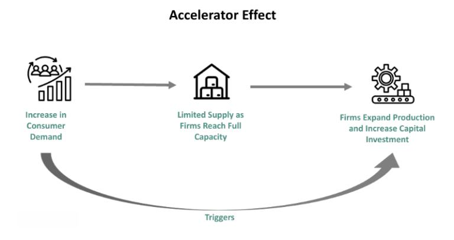

The global economy functions as an intricate web where various factors coalesce to shape its trajectory. At the heart of these factors lie monetary policy, economic theories, and technological advancements, each playing a pivotal role in influencing market dynamics. This interplay is crucial for understanding the broader economic landscape in which stakeholders operate.

Monetary policy, orchestrated mainly by central banks, involves the management of interest rates and money supply to achieve macroeconomic objectives such as controlling inflation, ensuring employment levels, and maintaining financial stability. The decisions made by institutions like the Federal Reserve reverberate throughout global markets, impacting investments and economic growth.



Economic theories, like the financial accelerator concept, provide a framework for examining how financial conditions can intensify economic cycles. Introduced by economists Ben Bernanke, Mark Gertler, and Simon Gilchrist, this theory underscores how minor fluctuations in the financial realm can lead to substantial economic shifts, particularly during crises.

Technological advancements, especially the rise of algorithmic trading, have transformed financial markets. Algorithmic trading employs sophisticated computer algorithms to execute trades rapidly, affecting market liquidity, volatility, and efficiency. It represents a paradigm shift, reshaping how markets function and how participants interact with them.

Understanding these interconnected elements—monetary policy, economic theory, and algorithmic trading—is essential for investors, economists, and policymakers. Their collective influence dictates the behavior of contemporary financial markets, making it imperative to grasp how they interact to shape global economic outcomes. As we explore these dynamics, we gain insights vital for navigating the complexities of the modern economic environment.

## Table of Contents

## Understanding Monetary Policy

Monetary policy refers to the processes and tools implemented by a central bank to manage a nation's money supply and interest rates. Its primary objectives are to control inflation, influence employment levels, and maintain currency stability. Central banks leverage several instruments to execute these policies effectively, with the overarching goal of ensuring economic stability and growth.

One of the fundamental tools of monetary policy is open market operations. This involves the buying and selling of government securities in the open market to either increase or decrease the amount of money circulating within the economy. When a central bank purchases government bonds, it injects [liquidity](/wiki/liquidity-risk-premium) into the financial system, which typically leads to lower interest rates and encourages borrowing and spending. Conversely, selling government securities withdraws liquidity and can result in higher interest rates, thus cooling off economic activity.

Another significant instrument is the modification of reserve requirements, which are regulations that determine the minimum reserves each bank must hold against customer deposits. Lowering reserve requirements increases the funds available for banks to lend, thereby expanding the money supply and stimulating economic activity. Conversely, raising reserve requirements reduces lending capacity, restraining money flow and potentially curbing inflationary pressures.

Interest rate setting, often represented by the policy rate, is also a crucial aspect of monetary policy. By adjusting the policy [interest rate](/wiki/interest-rate-trading-strategies), central banks can influence borrowing costs across the economy, affecting consumer spending and business investment. For example, a decrease in the policy rate reduces the cost of borrowing, encouraging spending and investment, while an increase can slow these activities to temper inflation.

The role of central banks, such as the Federal Reserve in the United States, in shaping economic conditions through these tools is profound. Their decisions on monetary policy not only impact domestic financial markets but also have significant global repercussions. For instance, changes in U.S. interest rates can influence global capital flows and exchange rates, affecting economies worldwide.

The effects of monetary policy decisions on economic conditions and financial markets are substantial and multifaceted. Expansionary monetary policy, characterized by lower interest rates and increased money supply, tends to boost economic growth and employment but may also lead to inflation if overused. On the other hand, contractionary monetary policy can help control inflation but may slow down economic growth and increase unemployment if applied too aggressively.

In summary, an understanding of monetary policy is essential for recognizing how central banks guide economic stability and growth. Through tools like open market operations, reserve requirements, and interest rate adjustments, these institutions play a pivotal role in influencing financial markets and overall economic conditions.

## Economic Theory and the Financial Accelerator

The financial [accelerator](/wiki/accelerator) theory, proposed by economists Ben Bernanke, Mark Gertler, and Simon Gilchrist, provides a framework for understanding how financial markets can intensify economic fluctuations. The theory posits a feedback loop within economic systems, where small changes in financial conditions can cause disproportionately large effects on the real economy. This occurs primarily through a mechanism where financial market conditions affect the real sector, which in turn feeds back into financial markets—amplifying the initial economic perturbations.

At the core of the financial accelerator is the notion that changes in asset prices influence the borrowing capacity of firms and households. A rise in asset prices increases net worth, which eases borrowing constraints because agencies and lenders view clients with higher net worth as less risky. Conversely, when asset prices fall, the decrease in net worth tightens credit conditions and exacerbates economic downturns. This mechanism can be represented by the following relationship:

$$

C = f(NW, \text{interest rate}) 
$$

where $C$ represents credit availability, $NW$ denotes net worth, and the interest rate embodies the financial conditions influencing credit.

This theory was particularly evident during the 2008 Great Recession. As the housing market collapsed, asset values plummeted, which diminished household wealth and tightened credit conditions drastically. This led to a pronounced reduction in consumption and investment, causing severe economic contraction. The feedback loop described by the financial accelerator theory helped explain why the financial shock had such a profound and prolonged impact on the global economy during this period.

Understanding the financial accelerator can assist policymakers in designing interventions to curb extreme economic [volatility](/wiki/volatility-trading-strategies). For example, stabilizing asset prices or ensuring liquidity during downturns can mitigate the adverse feedback loop between declining net worth and tightened credit conditions. Moreover, it underscores the importance of monitoring financial conditions as a precursor to real economic shifts.

Addressing economic fluctuations through this lens suggests that policies must not only respond to traditional economic indicators but also consider the broader financial landscape's influence on the real economy. Consequently, the financial accelerator theory continues to be pivotal in developing financial regulatory frameworks and macroeconomic stabilization policies. By recognizing and addressing the amplifying effects of financial conditions, policymakers can better manage economic cycles and stability.

## Role of Algorithmic Trading in Financial Markets

Algorithmic trading, often referred to as algo trading, employs computer algorithms to execute trades with high speed and [volume](/wiki/volume-trading-strategy), significantly altering the dynamics of financial markets. The primary objective of [algorithmic trading](/wiki/algorithmic-trading) is to execute trades at the most favorable prices, with minimal market impact, and optimized efficiency. This transformation is underscored by the increased market liquidity, reduced transaction costs, and the emergence of new trading strategies.

Among the diverse strategies employed in algorithmic trading, high-frequency trading ([HFT](/wiki/high-frequency-trading-strategies)), [market making](/wiki/market-making), and statistical [arbitrage](/wiki/arbitrage) are predominant. High-frequency trading is characterized by executing a large number of trades at extremely high speeds to capitalize on small price discrepancies. The success of HFT relies on advanced technology and minimal latency, often requiring proximity to financial exchanges to reduce transmission time.

Market making involves placing both buy and sell orders on a specific security to profit from the bid-ask spread while providing liquidity to the market. These trading programs ensure continuous buy and sell signals and stabilize market prices, which enhances liquidity and reduces the probability of substantial price swings.

Statistical arbitrage leverages mathematical and statistical models to identify and exploit price inefficiencies between correlated securities. It uses algorithms to perform large numbers of trades based on quantitative data analysis and aims to profit from the mean-reversion of asset prices.

Despite its advantages, algorithmic trading presents certain risks and challenges. One of the primary concerns is the potential for exacerbated market volatility. Algorithms that react to market movements can trigger rapid buy or sell orders, leading to short-term price swings known as "flash crashes." Furthermore, the complexity and opacity of trading algorithms can obscure their decision-making processes, raising concerns about transparency and market manipulation.

Algorithmic trading also impacts investor confidence. On one hand, improved liquidity and more efficient markets can boost investor trust. However, the unpredictability associated with algorithm-driven market movements may deter risk-averse investors. Therefore, a balance between leveraging technology and ensuring market stability is essential.

In summary, algorithmic trading has reshaped the financial markets by improving efficiency, liquidity, and the diversity of trading strategies. Yet, the implications for market stability and investor confidence necessitate continuous monitoring and regulation to mitigate potential risks. The evolution of this field calls for updated regulatory frameworks to ensure a robust and transparent trading environment.

## Interconnections Between Monetary Policy and Trading Algorithms

Monetary policy, executed chiefly by central banks, is pivotal in shaping financial market conditions through tools like interest rate adjustments and liquidity regulation. These tools play a fundamental role in algorithmic trading which increasingly dominates the trading landscape due to its speed and efficiency. The interconnection between monetary policy decisions and algorithmic trading is rooted in the responsiveness of trading algorithms to economic signals, such as changes in interest rates and announcements from central banks.

When a central bank alters interest rates, the immediate effect is a change in the cost of borrowing money. This shift influences asset valuation, as the future cash flows from investments are typically discounted using the prevailing interest rate. Algorithms programmed to detect these signals quickly adjust trading strategies, reallocating assets to capitalize on interest rate movements. For instance, in an environment where central banks lower interest rates, algorithms might prioritize stocks and commodities over fixed-income securities, anticipating increased investment in growth-oriented assets due to cheaper borrowing costs.

Moreover, monetary policy affects market liquidity, a critical component for algorithmic traders who rely on liquid markets to execute large volumes of trades with minimal price impact. Central banks might engage in open market operations that inject liquidity into the financial system, often leading algorithms to take advantage of these liquidity inflows by increasing trading activity and adjusting strategies for maximizing returns in the more fluid market conditions.

An example of how traders use algorithms to respond to monetary policy is evident during central bank announcements. High-frequency trading (HFT) algorithms, designed to process information faster than human traders, can parse news releases and predict market reactions almost instantaneously. This speed advantage allows them to execute trades milliseconds after detecting policy shifts, capturing profits from the immediate market adjustments before the rest of the market participants react.

To explore these adaptations further, consider a simple trading algorithm that reacts to interest rate changes and adjusts a portfolio allocation between equities and bonds. In Python, such an algorithm might look like this:

```python
def adjust_portfolio(current_rates, new_rates, equity_allocation, bond_allocation):
    rate_change = new_rates - current_rates
    adjustment = 0.05 * rate_change  # sensitivity factor

    if rate_change < 0:  # Indicates a rate cut
        equity_allocation += adjustment
        bond_allocation -= adjustment
    else:  # Indicates a rate increase
        equity_allocation -= adjustment
        bond_allocation += adjustment

    return equity_allocation, bond_allocation

# Example usage
current_equity_allocation, current_bond_allocation = 0.5, 0.5
new_equity_allocation, new_bond_allocation = adjust_portfolio(0.03, 0.02, current_equity_allocation, current_bond_allocation)

print("Updated Equity Allocation: ", new_equity_allocation)
print("Updated Bond Allocation: ", new_bond_allocation)
```

This simplified model shows how an algorithm might respond to changes in interest rates by shifting allocations to optimize returns. Such strategies require continuous refinement and adaptation as central banks evolve their policy mechanisms and as algorithms become more sophisticated.

Understanding the relationship between monetary policy and algorithmic trading is critical for predicting market movements and economic responses. It enables traders, economists, and policymakers to anticipate how markets might react to policy shifts and plan accordingly. The agility and precision provided by algorithmic trading systems present unique challenges and opportunities depending on the direction and magnitude of monetary policy changes. As such, recognizing how traders adapt algorithmic strategies in response to central bank policies is essential for navigating today's complex financial markets.

## Future Prospects and Policy Implications

The future of monetary policy and algorithmic trading is shaped by the need to adapt to rapid technological advancements and an evolving regulatory landscape. As algorithmic trading continues to grow, central banks are challenged to innovate their tools and methods to keep pace. This adaptation is essential not only to maintain effective monetary control but also to ensure the stability of increasingly complex financial markets.

Central banks must consider incorporating real-time data analytics and [machine learning](/wiki/machine-learning) to refine their decision-making processes. Leveraging such technologies allows for more precise interventions, potentially stabilizing markets more effectively in the face of algorithm-driven trading activities. For example, real-time monitoring of transaction data can help in detecting systemic risks posed by algorithmic strategies such as high-frequency trading.

Ensuring market stability and investor protection will necessitate robust regulatory oversight. Regulators may need to adopt frameworks that can dynamically respond to new trading technologies and strategies. This might include establishing data-sharing agreements between trading platforms and regulatory bodies, employing comprehensive stress-testing models, and enhancing transparency requirements for trading algorithms to mitigate risks of market manipulation.

Economic theories, like the financial accelerator, continue to play a crucial role in informing monetary policy decisions in this environment. These theories provide insight into how small changes in financial conditions can lead to significant economic fluctuations, underscoring the importance of cautious policy-making. Policymakers need to consider these relationships when designing measures to counter potential economic disruptions triggered by rapidly executed algorithmic trades.

Looking forward, stakeholders must prepare for upcoming challenges by fostering collaboration between financial institutions, technologists, and regulators. Potential developments include enhancing the resilience of financial infrastructures and promoting responsible innovation in algorithmic trading. Stakeholders may also need to focus on education and training to build expertise in relevant technological and economic fields, ensuring that future leaders are equipped to navigate these complexities.

In summary, the future of monetary policy and algorithmic trading calls for innovative approaches, vigilant oversight, and informed decision-making. By embracing technological advancements and adapting regulatory frameworks, central banks and market participants can bolster economic resilience and stability in the face of ongoing change.

## Conclusion

Monetary policy, economic theory, and algorithmic trading are interconnected elements within the financial ecosystem. Their interactions have the potential to affect market dynamics and economic conditions significantly. For example, a change in interest rates by the Federal Reserve can trigger swift responses in algorithmic trading systems. These systems, leveraging economic indicators analyze data rapidly to make announcements that influence market moves. Therefore, an understanding of these interconnections assists economists, policymakers, and investors in navigating the complexities of financial landscapes.

As technology continues to evolve, the necessity for adaptive strategies and thoughtful regulation grows. The pace at which algorithmic trading has been integrated into financial markets highlights both the benefits and the hazards associated with technological advancements. Market efficiency is enhanced but at the risk of increased volatility, which requires regulatory bodies to stay vigilant and innovative in their approaches to ensure stability without stifling innovation.

In light of these developments, ongoing financial and economic resilience requires staying informed about trends and insights in monetary policy, economic theory, and algorithmic trading. As we progress towards more technologically-driven markets, the importance of this interconnected understanding cannot be overstressed. This grasp will be crucial for formulating policies that mitigate risks and foster a stable economic environment.

## References & Further Reading

[1]: Bernanke, B., Gertler, M., & Gilchrist, S. (1999). ["The Financial Accelerator in a Quantitative Business Cycle Framework."](https://www.sciencedirect.com/science/article/pii/S157400489910034X) In Handbook of Macroeconomics (pp. 1341-1393). Elsevier.

[2]: Haldane, A. G., & Roberts-Sklar, M. (2013). ["Algorithmic Trading in Financial Markets."](https://papers.ssrn.com/sol3/papers.cfm?abstract_id=2858204) Bank of England Quarterly Bulletin, 53(3).

[3]: Bernanke, B. S., & Gertler, M. (1989). ["Agency Costs, Net Worth, and Business Fluctuations."](https://www.jstor.org/stable/pdf/1804770.pdf) American Economic Review, 79(1), 14-31.

[4]: Harris, L. (2003). ["Trading and Exchanges: Market Microstructure for Practitioners."](https://academic.oup.com/book/52292) Oxford University Press.

[5]: Narang, R. (2013). ["Inside the Black Box: A Simple Guide to Quantitative and High Frequency Trading."](https://www.amazon.com/Inside-Black-Box-Quantitative-Frequency/dp/1118362411) Wiley.

[6]: Aldridge, I. (2013). ["High-Frequency Trading: A Practical Guide to Algorithmic Strategies and Trading Systems."](https://onlinelibrary.wiley.com/doi/pdf/10.1002/9781119203803.fmatter) Wiley.