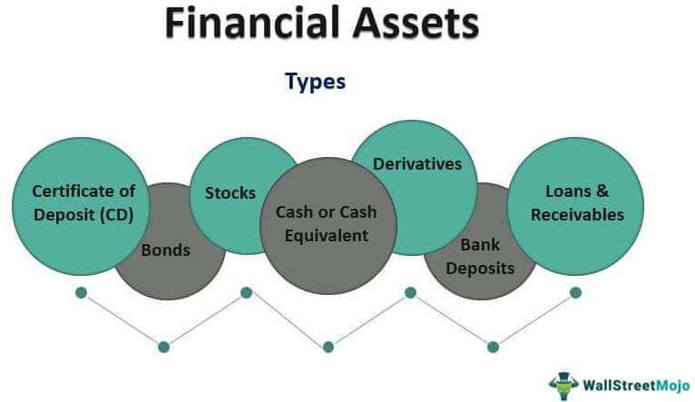

Algorithmic trading has significantly transformed the financial sector by automating trading activities through pre-programmed algorithms. This innovation allows for executing trades with remarkable speed and precision, optimizing the dealing process in ways that were previously unattainable by manual trading methods. In this article, we will examine the intricate interactions between financial assets, financial accounts, the constituents of these accounts, and their relationship with algorithmic trading.

Understanding the roles of financial assets and financial accounts is paramount for effectively engaging with today's financial markets. Financial assets, such as stocks, bonds, and cash, are liquid assets derived from contractual claims. These assets form the bedrock of investment and trading activities. In parallel, financial accounts, which form part of a country's balance of payments, are tasked with recording all transactions involving financial assets with nonresidents. This includes components like direct investments, portfolio investments, and reserve assets. A comprehensive grasp of these elements is essential for anyone looking to manage their financial assets successfully, whether they are seasoned investors or newcomers to the arena.



Algorithmic trading, through its advanced capabilities, has redefined how investors approach these elements, offering innovative ways to optimize portfolio management and enhance trading strategies. The integration of algorithmic methods into financial markets demands a robust understanding of these fundamental concepts to navigate efficiently and minimize risk. As financial landscapes become increasingly automated, equipping oneself with the knowledge of how financial assets and accounts intertwine with algorithmic trading is crucial for achieving favorable outcomes in trading and investment activities.

## Table of Contents

## Understanding Financial Assets and Financial Accounts

Financial assets are liquid assets that represent contractual claims on future cash flows or ownership rights. These include instruments such as stocks, bonds, and cash, which are essential components of investment portfolios. Stocks represent equity ownership in corporations, granting shareholders rights to a portion of the company's earnings and assets. Bonds are fixed-income instruments that signify a loan made by an investor to a borrower, typically a corporation or government, with the promise of periodic interest payments and the return of principal at maturity. Cash, as the most liquid asset, provides a foundation for meeting immediate financial obligations and opportunities.

A financial account is a crucial element of a country's balance of payments, which systematically records all economic transactions between residents and non-residents over a specified period. The balance of payments consists of three main accounts: the current account, capital account, and financial account. The financial account specifically tracks transactions involving financial assets and liabilities, including direct investments, portfolio investments, and reserve assets.

Understanding the components of financial accounts is essential for effective asset management. Direct investment involves the acquisition of a substantial interest in a foreign enterprise, aiming for significant influence over its operations. This typically includes mergers, acquisitions, and the establishment of subsidiaries. Portfolio investments refer to transactions in equity and debt securities that do not result in management control. These transactions allow investors to diversify portfolios and manage risk exposure across international markets. Reserve assets, comprising monetary gold, special drawing rights (SDRs), and foreign exchange currency holdings, are maintained by national authorities to manage currency stability and facilitate international payments.

Achieving a comprehensive understanding of financial assets and the intricacies of financial accounts is fundamental for investors seeking to optimize asset allocation and ensure robust financial management. Recognizing the distinction between direct and portfolio investments and the strategic importance of reserve assets can aid in navigating the global financial landscape.

## Components of Financial Accounts

The financial account in a country's balance of payments encompasses several key components: direct investment, portfolio investment, and reserve assets. Each of these components serves a distinct role in shaping the flow of financial capital across borders.

Direct investment represents capital flows with the objective of establishing long-term interest and control over enterprises in foreign economies. This form of investment often leads to the acquisition of significant influence over the management of a foreign company. Direct investments typically include mergers, acquisitions, and greenfield investments, signifying substantial cross-border financial movement aimed at achieving enduring economic interests. According to the International Monetary Fund (IMF), direct investment is a critical indicator of confidence in foreign markets, providing not just capital but also technology, management, and employment opportunities.

Portfolio investment refers to transactions involving equity securities, like stocks, and debt securities, such as bonds. Unlike direct investments, portfolio investments are usually more liquid and do not offer the investor direct control over the entities in which they are invested. These transactions are primarily motivated by profit rather than control, and may include investments in mutual funds, the purchase of government bonds, or derivatives. The distinction between portfolio and direct investments is generally based on the level of the investor's influence or intent to influence. Portfolio investments are characterized by their [volatility](/wiki/volatility-trading-strategies) and are significantly impacted by market conditions and investor sentiment.

Reserve assets are typically held by national governments or central banks and are used to manage or influence a country's currency exchange rate and to ensure the nation's financial stability. These assets include monetary gold, Special Drawing Rights (SDRs) from the IMF, and holdings in foreign currencies. They constitute a nation's external resources readily available for meeting balance of payments financing needs, intervention in currency markets to influence the exchange rate, and other related purposes (IMF, 2020).

Understanding these components of the financial account is vital for global investors, as they offer insights into a country's economic health, investor sentiment, and financial stability. The proportions and trends in these components often reflect broader economic policies and conditions, influencing international financial strategies and decisions.

## Algorithmic Trading: An Overview

Algorithmic trading refers to the use of complex algorithms to automate trading activities. These algorithms are designed to follow pre-set criteria, enabling the execution of trades with minimal human intervention. The principal advantage of [algorithmic trading](/wiki/algorithmic-trading) is its ability to process and execute large volumes of transactions with high speed and efficiency—capabilities unattainable by manual trading. This has made algorithmic trading an integral part of modern financial markets.

The automation provided by algorithmic trading systems enhances accuracy and reduces the risk of human error. Key strategies employed in algorithmic trading include trend-following, mean reversion, and statistical [arbitrage](/wiki/arbitrage), each utilizing distinct principles to optimize trade execution.

1. **Trend-Following**: This strategy is predicated on the idea that prices exhibit trends or momentum over time. Algorithms are programmed to identify these trends and execute trades that align with the directional movement of the market. For example, a trend-following system might involve buying an asset as its price increases and selling it when the price begins to decline.

2. **Mean Reversion**: This strategy is based on the assumption that the price of an asset will revert to its historical mean or average. Algorithms identify deviations from the average and execute trades that profit from the correction of these deviations. Typically, the algorithm buys the asset when its price is lower than its historical average and sells it when the price exceeds the average.

3. **Statistical Arbitrage**: This sophisticated strategy involves identifying statistical correlations or inefficiencies among asset prices that can be exploited for profit. Algorithms engaging in statistical arbitrage analyze historical price relationships and execute trades that capitalize on temporary discrepancies from these historical norms.

To implement these strategies, algorithmic trading systems often integrate various datasets and models to analyze market conditions. This can involve the use of [machine learning](/wiki/machine-learning) models, time series analysis, and other statistical methods to predict future asset price movements. Here is a simple python snippet that outlines a basic structure for implementing a moving average crossover strategy, a type of trend-following algorithm:

```python
import pandas as pd

# Load historical price data
data = pd.read_csv('historical_prices.csv')
data['Short_MA'] = data['Close'].rolling(window=20).mean()
data['Long_MA'] = data['Close'].rolling(window=50).mean()

# Generate trading signals
data['Signal'] = 0
data['Signal'][20:] = np.where(data['Short_MA'][20:] > data['Long_MA'][20:], 1, -1)

# Calculate returns
data['Strategy_Returns'] = data['Signal'].shift(1) * data['Close'].pct_change()

# Print results
print(data[['Date', 'Close', 'Signal', 'Strategy_Returns']])
```

In this example, the algorithm calculates two moving averages: a short-term (20-day) and a long-term (50-day). A buy signal is generated when the short-term moving average crosses above the long-term moving average, indicating an upward trend. Conversely, a sell signal is triggered when the short-term moving average crosses below the long-term moving average. 

Algorithmic trading systems have been pivotal in reshaping the financial landscape by enabling traders and institutions to execute orders with unprecedented speed, reduce transaction costs, and improve market efficiency. However, the reliance on these automated systems also introduces risks, such as technological failures and market volatility, which require careful consideration and risk management strategies.

## Integrating Financial Accounts with Algorithmic Trading

Integrating financial accounts with algorithmic trading is an intricate process that demands a comprehensive understanding of both domains. Financial accounts, which track the value of financial assets and liabilities within a country, provide crucial data that can inform trading strategies. Algorithmic trading systems capitalize on this data to make rapid and informed decisions, optimizing asset allocations in real-time.

Algorithmic trading systems utilize various strategies to enhance portfolio management by responding swiftly to changes observed in financial accounts. For instance, an increase in foreign investments might signal an opportunity for portfolio rebalancing. Similarly, changes in reserve assets can indicate shifts in a country's economic stability, prompting adjustments in trading strategies.

Effective transaction recording is paramount in this integration process. Each transaction impacts financial accounts and, consequently, influences algorithmic trading outcomes. Algorithmic traders must ensure that transactions are accurately recorded and reflected in their systems to maintain a coherent and responsive trading strategy.

An example of how this process works can be illustrated using a simple Python code snippet to simulate a reaction to changes in financial account data:

```python
def update_portfolio_on_financial_account_change(foreign_investment_change, reserve_asset_change):
    # Parameters to adjust portfolio allocation
    portfolio_allocation = {"stocks": 0.5, "bonds": 0.4, "cash": 0.1}

    if foreign_investment_change > 0:
        portfolio_allocation["stocks"] += 0.05  # Increase stock allocation
    if reserve_asset_change < 0:
        portfolio_allocation["bonds"] += 0.05  # Increase bond allocation to safeguard against risk

    return portfolio_allocation

# Example usage
new_allocation = update_portfolio_on_financial_account_change(10, -5)
print("Updated Portfolio Allocation:", new_allocation)
```

This code represents a basic framework where portfolio allocation adjusts based on changes in foreign investments and reserve assets. Such responsiveness in algorithmic trading systems helps mitigate risks and capitalize on new opportunities.

The key to successful integration lies in balancing the accuracy and speed of information processing while minimizing risks inherent in market volatility and transaction complexities. By leveraging changes in financial accounts strategically, traders can optimize returns and maintain robust, adaptive trading operations.

## Risks and Benefits of Algorithmic Trading

Algorithmic trading has reshaped the landscape of financial markets by offering substantial improvements in efficiency and speed. Through the use of precise, predefined criteria, algorithmic systems can execute trades much faster than traditional human methods, allowing traders to capitalize on fleeting market opportunities and reducing the time and cost associated with manual trading operations. This increased speed leads to improved market [liquidity](/wiki/liquidity-risk-premium) and narrower bid-ask spreads, ultimately benefiting both traders and broader market participants.

However, algorithmic trading is not without its significant risks. One prominent concern is market volatility. The rapid execution of trades by algorithms can exacerbate volatility, particularly in volatile markets or during unexpected economic events. Instances such as the "flash crash" of 2010, where markets saw abrupt, severe price declines over a matter of minutes, highlight the potential impacts of algorithmic systems interacting unpredictably with each other. In these scenarios, synchronized selling or buying powered by algorithms can lead to drastic, often illogical market movements.

Technical failures represent another critical risk. These may arise from software bugs, flawed algorithms, or infrastructure failures. Given the complexity of algorithmic trades and their reliance on technology, even minor glitches can result in large financial losses or unintended market distortions. Furthermore, the dependency on complex code and computational power means that any disruption in technological infrastructures, such as trading platform outages, can have severe implications.

A liberalized financial account offers increased access to global capital markets, enabling traders to engage with a broader range of financial instruments and markets. While this increased access can provide opportunities for diversification and enhanced profitability, it similarly exposes traders to international market shocks. Global economic events can rapidly affect open positions, and without adequate risk management strategies, these can result in substantial financial repercussions for traders.

Traders must carefully balance these risks with the benefits of algorithmic trading, focusing on strategies that minimize potential downsides while maximizing efficiency and profit potential. Lower transaction costs, facilitated by the minimized human intervention and improved trade execution speed, are significant advantages. As a result, traders can achieve economically efficient operations, leading to potentially higher net returns. However, successful participation in these markets demands rigorous development and testing of algorithms, robust risk management practices, and continual monitoring of market conditions to swiftly adapt to any arising challenges.

## Conclusion

Financial assets, financial accounts, and algorithmic trading form a complex yet interdependent structure within modern financial markets. This relationship underscores the necessity for a comprehensive understanding of each component to effectively harness their full potential. Financial accounts, encompassing elements such as direct investments, portfolio investments, and reserve assets, form the backbone of this structure. These accounts track the flow of financial assets and their interactions within global markets, serving as a crucial element for investors and traders who aim to optimize trading strategies, particularly through algorithmic trading.

Algorithmic trading, with its capacity for high-speed, high-[volume](/wiki/volume-trading-strategy) transactions, requires a nuanced understanding of financial accounts to mitigate risks and enhance decision-making processes. Knowing how changes in financial accounts can signal market trends or shifts allows traders to adjust their algorithms to better capture potential opportunities or avoid pitfalls. As automation in financial markets continues to evolve, understanding the strengths and limitations of algorithmic trading, alongside a solid grasp of financial account dynamics, provides traders and investors with a strategic advantage.

In an era where financial markets are increasingly automated, combining knowledge of financial assets, accounts, and algorithmic processes equips market participants to navigate these complexities effectively. By leveraging these concepts wisely, traders and investors can adapt to rapid market changes and make informed decisions, ensuring they remain competitive in the fast-paced financial environment.

## References & Further Reading

[1]: Bergstra, J., Bardenet, R., Bengio, Y., & Kégl, B. (2011). ["Algorithms for Hyper-Parameter Optimization."](https://papers.nips.cc/paper/4443-algorithms-for-hyper-parameter-optimization) Advances in Neural Information Processing Systems 24.

[2]: ["Advances in Financial Machine Learning"](https://www.amazon.com/Advances-Financial-Machine-Learning-Marcos/dp/1119482089) by Marcos Lopez de Prado

[3]: ["Evidence-Based Technical Analysis: Applying the Scientific Method and Statistical Inference to Trading Signals"](https://www.amazon.com/Evidence-Based-Technical-Analysis-Scientific-Statistical/dp/0470008741) by David Aronson

[4]: ["Machine Learning for Algorithmic Trading"](https://github.com/stefan-jansen/machine-learning-for-trading) by Stefan Jansen

[5]: ["Quantitative Trading: How to Build Your Own Algorithmic Trading Business"](https://www.amazon.com/Quantitative-Trading-Build-Algorithmic-Business/dp/1119800064) by Ernest P. Chan

[6]: International Monetary Fund (IMF). (2020). ["Balance of Payments Manual, Sixth Edition (BPM6)."](https://www.imf.org/external/pubs/ft/bop/2007/bopman6.htm)

[7]: Hasbrouck, J., & Saar, G. (2013). ["Low-Latency Trading."](https://www.sciencedirect.com/science/article/abs/pii/S1386418113000165) The Review of Financial Studies, 26(9), 2092-2136.