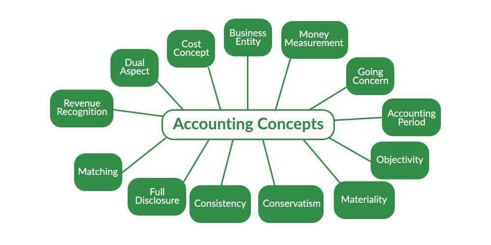

The dynamic landscape of finance and trading necessitates a robust understanding of accounting principles. These principles form the underpinning of effective financial accounting, which is crucial for ensuring transparency and consistency in financial reporting. In modern trading, particularly algorithmic trading, it is essential to adhere to these guidelines because they help maintain the reliability of financial data across various trading platforms and systems.

Accounting principles like revenue recognition, the matching principle, and full disclosure are cornerstones that support the accurate representation of an entity’s financial status. As algorithmic trading increasingly involves numerous high-speed transactions, understanding these principles is vital. They ensure that trades are reported correctly, capturing both performance metrics and compliance with regulatory frameworks. By adhering to these standards, businesses can offer a more transparent and consistent view of their financial operations, which in turn supports better decision-making among investors, regulators, and other stakeholders.

Adopting accounting principles within algorithmic trading enhances the accuracy of financial outcomes and assists in risk management. A correct and thorough comprehension of how these principles function within financial accounting can lead to improved decision-making, enhanced regulatory compliance, and ultimately, better financial success. This article will explore the significance of accounting principles, their role in financial accounting, and their relevance to algorithmic trading.

## Table of Contents

## Understanding Accounting Principles

Accounting principles are the standardized guidelines and rules essential for businesses to accurately represent their financial status. These principles serve numerous critical functions, primarily by ensuring that financial statements maintain consistency, comparability, and reliability across diverse entities and time periods. A uniform set of accounting principles allows stakeholders to trust the financial reports produced by different companies, facilitating informed decision-making.

Key accounting principles include revenue recognition, matching, full disclosure, and cost principles, each of which plays a vital role in presenting an accurate and fair depiction of a company's financial health.

1. **Revenue Recognition Principle**: This principle dictates that revenue should be recognized when it is earned, regardless of when the cash is received. This ensures that financial statements reflect the true income of the business during a specific period. For instance, if a service is delivered in one accounting period, but payment is received in the next, the revenue is recognized in the period when the service was completed.

2. **Matching Principle**: Closely linked to revenue recognition, the matching principle requires that expenses be recorded in the same period as the revenues they helped to generate. This alignment of costs with the related revenues provides a more accurate representation of a company’s profitability during a specific time frame. As a simple example, the cost of goods sold should be recorded in the same period as the sales revenue from those goods.

3. **Full Disclosure Principle**: This principle mandates that all relevant financial information be disclosed in an entity's financial statements or accompanying notes. The aim is to provide stakeholders with all necessary information for making well-informed decisions. This includes details on pending litigation, significant accounting methods, and any other details that could impact a user’s understanding of the financial statements.

4. **Cost Principle**: Under this principle, assets should be recorded and reported at their original purchase cost. This valuation provides a uniform basis for preparing and interpreting financial statements. While this principle maintains clarity and prevents arbitrary valuation, it may not always reflect the current market value of an asset.

Adhering to these principles is crucial for maintaining stakeholder trust, ensuring transparency, and complying with regulatory standards such as the International Financial Reporting Standards (IFRS) and Generally Accepted Accounting Principles (GAAP). Consistent application of these principles across all financial statements facilitates a clearer understanding of a company's financial health, enhancing comparability across industries and time periods, which is vital for analysts, investors, and regulatory bodies.

## Role of Financial Accounting in Business

Financial accounting involves the systematic preparation of financial statements, which are crucial for providing stakeholders, including investors, creditors, and management, with an essential overview of a company’s financial performance. These statements, typically comprising the balance sheet, income statement, and cash flow statement, serve as a fundamental tool for ensuring transparency and accountability in business operations.

One of the primary purposes of financial accounting is to assist in decision-making. Investors and creditors rely on accurate financial statements to assess the financial health of an entity, enabling them to make informed decisions regarding investments or creditworthiness. Management teams also utilize this financial data to guide strategic planning and operational improvements, ensuring the company's resources are optimized efficiently.

Moreover, financial accounting facilitates comparative analysis across different industries and competitors. By standardizing financial statements according to established accounting principles, businesses can engage in fair market practices, where stakeholders can make comparisons and benchmark performances. This comparability is vital for market actors aiming to gauge industry trends and individual company competitiveness.

Accurate financial reporting is crucial for assessing both the viability and profitability of business initiatives. Detailed financial records help identify successful ventures and those that require re-evaluation or optimization. This insight is particularly valuable for businesses seeking to sustain growth and profitability in a competitive environment.

Ultimately, financial accounting is indispensable in summarizing complex business activities into clear and concise reports that reflect a company’s financial health. This transparency not only reinforces stakeholder trust but also supports efficient capital allocation, fostering a healthy economic environment.

## Integration of Accounting with Algorithmic Trading

Algorithmic trading relies on sophisticated computer algorithms to execute high-speed and high-[volume](/wiki/volume-trading-strategy) trades, highlighting the necessity for precise financial accounting. The integration of accounting systems with trading platforms is paramount in offering real-time financial data, thereby ensuring adherence to financial regulations and enhancing the fidelity of financial operations.

Financial accounting plays a critical role in assessing the profitability of trading algorithms. By providing detailed performance analysis, accounting metrics evaluate the efficiency and success of trading strategies, ultimately guiding improvements and decision-making processes. This evaluation is often supported by performance indicators such as profit margins, return on investment (ROI), and cost-benefit analyses, which help in determining the economic impact of the trading algorithms.

The integration of accounting data in [algorithmic trading](/wiki/algorithmic-trading) bolsters risk management efforts by meticulously tracking the cost basis of investments and the resulting gains or losses. This tracking process ensures that traders can accurately assess the impact of their trades, thereby enabling more informed risk assessments and mitigation strategies. The precision in accounting data is crucial for identifying potential financial discrepancies and proactively addressing them.

Moreover, efficient accounting practices in the context of algorithmic trading are essential for regulatory compliance. As financial markets are governed by stringent regulations, maintaining transparent and accurate financial reporting is a legal necessity. Integrating sophisticated financial reporting frameworks helps in ensuring that all trading activities are thoroughly documented and compliant with regulatory standards such as the International Financial Reporting Standards (IFRS) and Generally Accepted Accounting Principles (GAAP).

In summary, the integration of accounting with algorithmic trading systems not only facilitates real-time data management and analysis but also underpins the robustness of financial operations through accurate performance measurement, risk management, and compliance with regulatory frameworks. This comprehensive approach ensures that algorithmic trading remains efficient, transparent, and aligned with the overarching objectives of financial integrity and success.

## Importance of Regulatory Compliance

Financial accounting principles are essential in ensuring companies adhere to regulatory requirements, especially in financial markets where transparency and integrity are paramount. Regulatory compliance is a critical component that minimizes legal risks and enhances corporate reputation. Companies are required to follow specific frameworks, such as the International Financial Reporting Standards (IFRS) and Generally Accepted Accounting Principles (GAAP), to standardize their financial reporting processes. These frameworks provide guidelines that assist accountants in preparing consistent and comparable financial statements.

The necessity for regulatory compliance is further heightened in algorithmic trading. This form of trading involves computer algorithms executing trades at high speeds and volumes, making the accuracy of financial data and adherence to financial reporting standards imperative. By aligning with IFRS and GAAP, companies avoid potential penalties associated with regulatory breaches and ensure the integrity of their market activities. This alignment helps maintain market integrity and investor confidence, as transparency in financial transactions supports fair trading practices.

Moreover, regulatory compliance safeguards investors by ensuring that financial statements accurately reflect the financial standings and performance of businesses. This transparency allows investors to make informed decisions, reinforcing trust in financial markets. Companies that neglect these requirements risk not only financial penalties but also damage to their reputations, which can lead to diminished investor confidence and reduced market participation.

In algorithmic trading, the pace and volume of transactions present additional challenges for maintaining compliance. Therefore, firms must invest in robust accounting systems capable of real-time data processing and integration with trading platforms. These systems should be designed to handle the complexity of financial data, ensuring all transactions are accurately captured and reported in compliance with existing regulations. By maintaining rigorous compliance procedures, firms can protect both their reputations and the interests of their investors while contributing to the broader stability and trustworthiness of financial markets.

## Challenges in Adopting Accounting Principles in Algo Trading

Integrating accounting principles into algorithmic trading presents several challenges primarily due to the intricate and rapid nature of transactions involved. The primary concern is maintaining accurate financial records in real-time, which necessitates the use of advanced accounting software and systems capable of handling large volumes of data swiftly and efficiently. Given the high speed and frequency of trades, these systems must not only record transactions accurately but also process and report them instantaneously to ensure consistent and reliable financial data.

Incorporating consistency and accuracy in financial reporting, amidst the [volatility](/wiki/volatility-trading-strategies) and rapid execution of trades, presents a further complication. Algorithmic trading environments generate immense datasets, and achieving consistency in financial reporting requires systems that can collate and analyze this data without error. Traditional accounting systems often fall short in this aspect, necessitating more sophisticated technology that can adapt to trading algorithms' demands.

The integration also demands specialized knowledge that straddles both accounting and algorithmic trading technologies. Professionals working in this space must possess a nuanced understanding of accounting standards alongside proficiency in the technical and strategic aspects of algorithmic trading. This dual expertise is rare and requires continuous professional development to remain relevant.

Moreover, the continuous updates in accounting standards and trading regulations impose an added layer of complexity. Standards like the International Financial Reporting Standards (IFRS) and Generally Accepted Accounting Principles (GAAP) are subject to evolution, and their interplay with trading regulations necessitates perpetual learning and adaptation from professionals. They must stay abreast of these changes to ensure that accounting practices remain compliant and pertinent within the fast-evolving financial landscape.

Ultimately, the confluence of these challenges underscores the need for dynamic accounting practices in algorithmic trading environments, supported by sophisticated technological solutions and a well-versed workforce capable of navigating the dual demands of finance and technology.

## Conclusion

Accounting principles, while traditionally associated with financial accounting, have become crucial for modern trading practices, including algorithmic trading. These principles serve as a reliable framework for accurate financial reporting, ensuring that all financial activities are recorded and reported consistently and transparently. This consistency is vital for regulatory compliance, as it ensures that businesses meet the necessary legal and financial regulations, thereby safeguarding their operations and protecting investors.

As the financial landscape continues to evolve, the integration of comprehensive accounting measures into trading activities is not just beneficial but essential. The speed and complexity of algorithmic trading require precise and robust accounting mechanisms to capture real-time financial data accurately. Businesses that effectively leverage these accounting principles in their algorithmic trading operations can achieve greater transparency, trust from stakeholders, and ultimately, financial success. They provide a clearer picture of performance metrics and enable informed decision-making by offering insights into profitability and risk exposures.

Moreover, the growing complexity of financial markets underscores the necessity for ongoing education and adaptation to new accounting challenges. Continuous updates in both accounting standards and trading regulations demand that businesses and financial professionals alike remain informed and agile. This adaptability ensures that organizations can maintain the integrity and reliability of their financial reporting amidst an ever-changing economic environment. Thus, the integration of accounting principles into algorithmic trading is not a one-time effort but a continuous process of adaptation and improvement.

## References & Further Reading

[1]: ["International Financial Reporting Standards (IFRS)"](https://www.investopedia.com/terms/i/ifrs.asp)

[2]: ["Generally Accepted Accounting Principles (GAAP)"](https://www.accounting.com/resources/gaap/)

[3]: ["Advances in Financial Machine Learning"](https://www.amazon.com/Advances-Financial-Machine-Learning-Marcos/dp/1119482089) by Marcos Lopez de Prado

[4]: ["Machine Learning for Algorithmic Trading"](https://github.com/stefan-jansen/machine-learning-for-trading) by Stefan Jansen

[5]: ["Quantitative Trading: How to Build Your Own Algorithmic Trading Business"](https://books.google.com/books/about/Quantitative_Trading.html?id=j70yEAAAQBAJ) by Ernest P. Chan

[6]: ["Algorithmic Trading and DMA: An introduction to direct access trading strategies"](https://www.amazon.com/Algorithmic-Trading-DMA-introduction-strategies/dp/0956399207) by Barry Johnson

[7]: ["Accounting for Value"](https://www.amazon.com/Accounting-Columbia-Business-School-Publishing/dp/0231151187) by Stephen Penman