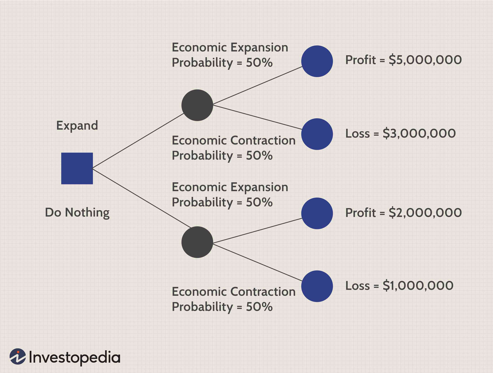

In today's era, characterized by rapid technological developments and intricate financial landscapes, decision-making has emerged as a sophisticated art requiring precision and foresight. In this complex environment, the fields of accounting and finance play a crucial role in guiding individuals and organizations toward informed choices. Effective decision-making in these areas is not merely a necessity but a cornerstone of strategic financial management and investment success.

This article examines the critical relationship between financial accounting and decision-making, emphasizing the growing relevance of algorithmic trading, commonly known as algo trading. Financial accounting provides a structured framework for recording and analyzing economic activities, offering stakeholders essential insights through financial reports. These insights are critical for evaluating the financial health and performance of companies, which in turn informs investment and business decisions.



Algorithmic trading represents a significant shift in how financial markets operate, utilizing pre-set rules and computer programs to execute trades at unprecedented speeds and volumes. This advanced trading approach heavily relies on real-time financial data and accounting principles, highlighting the profound interplay between accounting and algo trading.

In this context, we aim to uncover the ways accounting influences decision-making and interfaces with the rapidly evolving world of financial trading, offering stakeholders an edge in navigating the intricacies of global finance. Through this exploration, we aspire to illuminate the integration of accounting insights with innovative trading technologies, a synergy that holds potential for unlocking new opportunities in financial markets worldwide.

## Table of Contents

## The Role of Financial Accounting in Decision-Making

Financial accounting is essential for effective decision-making within organizations, primarily through its ability to record, summarize, and present economic activities. By systematically capturing financial events and transactions, financial accounting converts extensive data into coherent and easily interpretable information. This process culminates in the generation of standardized financial reports, such as balance sheets and income statements, which offer a snapshot of a company's financial status.

The significance of these financial reports cannot be overstated. For stakeholders, they provide a transparent view of a company’s financial health, acting as a reliable foundation for investment and lending decisions. A balance sheet, for example, provides insights into a company's assets, liabilities, and equity at a particular moment, thereby indicating solvency and liquidity. Similarly, the income statement reveals performance over a specific period by outlining revenues, expenses, and profits, which helps assess profitability and operational efficiency.

These documents thus allow investors to evaluate the viability and growth potential of a business, enabling them to make informed choices about buying, holding, or selling stock. For lenders and creditors, they offer a lens through which to gauge creditworthiness and repayment capabilities, minimizing the risk of default. 

The consistency and preciseness of these documents are enforced through adherence to standardized accounting principles, such as the Generally Accepted Accounting Principles (GAAP) and International Financial Reporting Standards (IFRS). These frameworks ensure that financial statements remain comparable, transparent, and reliable across different organizations and jurisdictions, thus maintaining stakeholder confidence and promoting sound investment and business decisions. 

By consolidating complex financial data into structured, standardized reports, financial accounting equips stakeholders with the necessary information to make strategic decisions that align closely with their financial goals and risk tolerances.

## Key Financial Statements for Informed Decisions

The three core financial statements—balance sheets, income statements, and cash flow statements—are indispensable tools in understanding and evaluating a company's financial position. Each statement provides a unique perspective on the financial health and operational results, catering to the diverse information needs of investors, creditors, and other stakeholders.

The balance sheet presents a snapshot of a company's financial position at a specific point in time. It details the company's assets, liabilities, and shareholders' equity, encapsulating what the company owns and owes. The equation that governs this statement, \[ \text{Assets} = \text{Liabilities} + \text{Shareholders' Equity} \], exemplifies the equilibrium essential for financial stability. Investors scrutinize balance sheets to analyze the company's [liquidity](/wiki/liquidity-risk-premium) and capital structure, which aids in assessing its valuation and potential investment opportunities. Creditors, on the other hand, focus on liabilities and equity to determine the company's creditworthiness and ability to meet financial obligations.

The income statement, also known as the profit and loss statement, summarizes the company's revenues, expenses, and profits over a reporting period. It provides crucial insights into operational efficiency and profitability. Key metrics such as net income, gross margin, and operating profit margins help investors gauge the company's performance and growth potential. This statement also enables creditors to evaluate a company's income-generating capabilities, thereby assessing the reliability of cash flows to service loans.

The cash flow statement outlines the inflows and outflows of cash and cash equivalents, segmented into operating, investing, and financing activities. It is essential for understanding how a company manages its cash and maintains liquidity. The statement's operating section reveals the cash generated from core business activities, while the investing and financing sections indicate the strategies employed for growth and capital structure management. Robust cash flow from operations often signals a company's ability to sustain operations and provide returns to investors.

Investors and creditors use these statements collectively to form a comprehensive view of the company's financial condition and operational effectiveness. Analyzing trends across these statements enables stakeholders to make informed decisions regarding investment potential and credit risk, ultimately influencing their engagement with the company.

## Financial Accounting Standards and Their Influence

The Generally Accepted Accounting Principles (GAAP) and International Financial Reporting Standards (IFRS) form the foundation of modern financial reporting. Both frameworks offer a structured approach to financial documentation, crucial for stakeholders to make informed decisions. GAAP, primarily adopted in the United States, encompasses a comprehensive set of guidelines that dictate how financial statements should be prepared. These principles focus on consistency, relevance, and reliability, enabling transparent representation of a company's financial health.

On the other hand, IFRS provides an international accounting language, developed and maintained by the International Accounting Standards Board (IASB). It facilitates comparability and uniformity in financial reporting across different countries. This global standard has been increasingly adopted worldwide, enhancing the ability of investors and businesses to analyze and understand financial information across borders.

Using these standardized accounting practices allows companies to produce financial reports that present a true and fair view of their financial position. This consistency is invaluable for investors assessing the potential risks and returns involved in investment opportunities. For instance, a balance sheet prepared under these standards will reliably depict assets, liabilities, and equity, enabling stakeholders to evaluate a company's solvency and liquidity.

Moreover, adherence to GAAP and IFRS significantly reduces information asymmetry between company management and external users, cultivating trust in financial disclosures. By ensuring that financial statements are both comparable and verifiable, these standards aid analysts, creditors, and investors in making well-informed judgments about a company's performance and financial stability.

In summary, by enforcing uniformity in financial reporting, GAAP and IFRS play an instrumental role in guiding investment decisions, lending practices, and strategic business planning. The adoption and implementation of these standards are pivotal for achieving transparency and accountability in financial markets globally.

## Algorithmic Trading: Transforming Financial Markets

Algorithmic trading, commonly referred to as algo trading, has revolutionized financial markets by automating trade execution through pre-set algorithms. These algorithms incorporate complex mathematical models and leverage high-frequency data processing capabilities to execute trades at speeds and volumes beyond the reach of traditional methods. One of the primary advantages of [algorithmic trading](/wiki/algorithmic-trading) is its ability to minimize human error, emotion, and inefficiency, resulting in more precise and faster trading decisions.

Real-time financial data is the cornerstone of algo trading. The ability to access and analyze data at sub-second intervals allows for swift market reactions. Traders use this data to identify [arbitrage](/wiki/arbitrage) opportunities, track price trends, and execute trades that capitalize on market inefficiencies. For example, high-frequency trading ([HFT](/wiki/high-frequency-trading-strategies)), a subset of algorithmic trading, uses algorithms to conduct millions of trades per day in milliseconds, relying heavily on the constant flow of real-time market data.

The relationship between financial accounting principles and algo trading lies in the structured representation of data that accounting provides. Financial statements and reports, governed by standards like GAAP or IFRS, serve as valuable input into trading algorithms. They offer actionable insights into a company's financial health, which is crucial for developing predictive models and setting trading parameters. These accounting-derived datasets are integrated into algorithms to assess company valuations, detect financial anomalies, and predict future performance, directly influencing trading strategies.

Algorithmic trading also extends to quantitative analysis or "quant trading," where statistical and numerical data, including macroeconomic indicators and economic calendars, are built into the trading algorithms. The algorithms make use of this comprehensive dataset to identify patterns or trends that human traders might overlook, enabling them to make more informed and strategic trading decisions.

Here is a simple example in Python, used for identifying patterns in real-time data:

```python
import numpy as np
import pandas as pd

# Simulate some market data
np.random.seed(42)
data = np.random.normal(0, 1, 1000)
data_df = pd.DataFrame(data, columns=['Price'])

# Calculate a simple moving average (SMA)
data_df['SMA_20'] = data_df['Price'].rolling(window=20).mean()

# Define a basic trading strategy: Buy when price > SMA_20, Sell otherwise
data_df['Signal'] = np.where(data_df['Price'] > data_df['SMA_20'], 'Buy', 'Sell')

print(data_df.head(30))
```

This code snippet generates a simulated market price data series, calculates a 20-period simple moving average (SMA), and generates buy/sell signals. In practice, more sophisticated models would integrate complex accounting datasets and utilize [machine learning](/wiki/machine-learning) to refine trading signals.

The transformative impact of algorithmic trading on financial markets is evident in its widespread adoption across various trading venues. It promotes greater liquidity and tighter spreads, benefiting market efficiency. However, it also introduces challenges such as increased market [volatility](/wiki/volatility-trading-strategies) and the potential for systemic risks, emphasizing the need for effective regulatory frameworks and risk management measures. These dynamics make algo trading an essential and evolving component of financial markets today.

## The Intersection of Accounting and Algo Trading

Accounting data is integral to the development and execution of algorithmic trading strategies, providing crucial insights that drive the creation of sophisticated trading models. At the most fundamental level, financial statements offer a wealth of information necessary for understanding market conditions and assessing company performance. This data includes earnings, expenses, liabilities, and cash flows, which are processed and analyzed to detect patterns and trends that inform trading decisions.

Algorithmic trading firms utilize accounting data to fine-tune their trading algorithms, adapting them to reflect the financial health and prospects of the entities they trade with or invest in. An important aspect of this process is risk management. By analyzing a company’s financial reports, algo traders can identify risk factors and uncertainties. For instance, a company's debt-to-equity ratio obtained from its balance sheet may indicate its financial leverage, which in turn affects credit risk assessments. This knowledge is vital for algorithms designed to minimize risk while maximizing returns.

In addition to mitigating risk, accounting data is leveraged to optimize trading models by using metrics like earnings per share (EPS) or return on equity (ROE). These metrics, derived from comprehensive financial statements, enable traders to evaluate investment potential and make informed decisions. Python libraries such as Pandas and NumPy are frequently used to handle and process large volumes of financial data efficiently, as shown in the simple example below:

```python
import pandas as pd

# Load financial data
data = pd.read_csv('financial_reports.csv')

# Calculate key metrics
data['ROE'] = data['Net_Income'] / data['Shareholders_Equity']
data['Debt_To_Equity'] = data['Total_Liabilities'] / data['Shareholders_Equity']

# Filter for investment opportunities
investment_opps = data[(data['ROE'] > 0.15) & (data['Debt_To_Equity'] < 1)]

print(investment_opps)
```

In this example, a dataset containing financial reports is used to calculate and filter companies based on specific criteria, identifying potential investment opportunities with sturdy growth prospects and manageable risk profiles.

Moreover, the integration of real-time accounting data via sophisticated software platforms enhances the capacity of trading algorithms to respond promptly to changing market conditions. This allows for rapid re-calibration of algorithms based on the latest financial inputs, thereby maintaining competitive advantage in fast-paced financial markets. Thus, the synergy between robust accounting data and advanced algorithm technologies not only supports high-frequency trading decisions but also ensures more accurate risk evaluation and strategic planning.

## Challenges and Opportunities

Despite its numerous advantages, algorithmic trading faces several challenges and opportunities that both traders and financial institutions must carefully manage. One of the most pressing challenges is market volatility. Algorithmic trading systems can exacerbate market fluctuations due to their ability to execute trades at incredibly high speeds and large volumes. This high-frequency trading can lead to swift and significant movements in asset prices, resulting in potential instability in financial markets. For example, the 2010 "Flash Crash" saw the Dow Jones Industrial Average drop by about 1,000 points in a matter of minutes, partly due to algorithmic trading [1].

In addition to market volatility, ethical considerations also pose a challenge. The opaque nature of some trading algorithms can raise concerns over market manipulation and fairness. As algorithms can exploit minute price movements that are imperceptible to human traders, questions arise about the equity of letting digitally automated systems participate in markets traditionally driven by human decision-makers.

Moreover, the integration of algorithmic trading with accounting practices highlights opportunities for innovation in financial analysis and trading efficiency. For instance, the synthesis of vast amounts of financial data in real time enables more adept risk management strategies and trading decisions. The use of precise accounting data can drive the development of algorithms that better predict market trends and enhance the profitability of trading activities.

The fusion of accounting technology with algorithmic trading systems offers prospects for heightened trading efficiency. Advanced analytics can optimize algorithms by improving data accuracy and reliability. This improvement can result in more informed decision-making processes that align closely with a company’s financial goals. Algorithms can be fine-tuned using accounting principles to minimize risks and ensure compliance with financial regulations, consequently enhancing the robustness and sustainability of trading operations.

As both algorithmic trading and financial accounting practices evolve, they present dual pathways: challenges requiring careful regulatory oversight and ethical considerations, and opportunities for enhanced efficiency, accuracy, and innovation in the financial markets. Stakeholders, including regulators, financial institutions, and technologists, must work collaboratively to harness these opportunities while managing the associated challenges.

[1] Nanex Research, "The Flash Crash: May 6, 2010".

## Conclusion

Financial accounting is an essential component in today’s decision-making processes, playing a pivotal role in both corporate governance and financial trading. It provides a framework for recording and summarizing economic activities, which is crucial for informed decision-making at all levels of an organization. As businesses and financial markets continue to evolve, the integration of accounting insights with advanced technologies such as algorithmic trading has become increasingly significant.

Algorithmic trading, characterized by its use of pre-programmed instructions to execute trades at high speed, benefits immensely from the accuracy and reliability of financial data provided by accounting. By leveraging financial statements and adhering to established accounting standards, algorithmic trading systems can more effectively calibrate their strategies, manage risk, and optimize trading decisions. This synergy enhances trading efficiency, allowing stakeholders to gain a competitive edge in rapidly changing financial markets.

Moreover, the partnership between financial accounting and algorithmic trading heralds new prospects for innovation in global finance. As both fields advance, their interconnection promises to create novel opportunities, from improved financial analysis techniques to more sophisticated trading algorithms. Such advancements are expected to improve market liquidity, reduce transaction costs, and ultimately contribute to more robust and efficient financial systems.

In conclusion, the interplay of financial accounting and algorithmic trading underscores a transformative shift in the financial landscape. Their integration not only aids in informed decision-making but also opens up a horizon of opportunities that could redefine the future of finance on a global scale.

## References & Further Reading

[1]: ["Financial Accounting Theory"](https://corporatefinanceinstitute.com/resources/accounting/financial-accounting-theory/) by William Scott

[2]: DeMiguel, V., Garlappi, L., & Uppal, R. (2009). ["Optimal versus Naive Diversification: How Inefficient is the 1/N Portfolio Strategy?"](https://www.jstor.org/stable/30226017) The Review of Financial Studies, 22(5), 1915-1953.

[3]: Poterba, J. M., & Summers, L. H. (1988). ["Mean Reversion in Stock Prices: Evidence and Implications."](https://www.nber.org/papers/w2343) Journal of Financial Economics, 22, 27-59.

[4]: Hull, J. C. (2015). ["Options, Futures, and Other Derivatives"](https://www.semanticscholar.org/paper/Options%2C-Futures%2C-and-Other-Derivatives-Hull/89bdee500c8623864fc9eb7a471546aa713acc44) (9th ed.). Pearson.

[5]: ["Algo Trading & DMA: An Introduction to Direct Access Trading Strategies"](https://github.com/balogunb/Algo_Trader/blob/master/Barry%20Johnson%20-%20Algorithmic%20Trading%20and%20DMA_%20An%20introduction%20to%20direct%20access%20trading%20strategies-4Myeloma%20Press%20(2010).pdf) by Barry Johnson

[6]: IEEE Spectrum. (2010). ["The Story of the Flash Crash: Nanex Research Paper."](https://spectrum.ieee.org/)