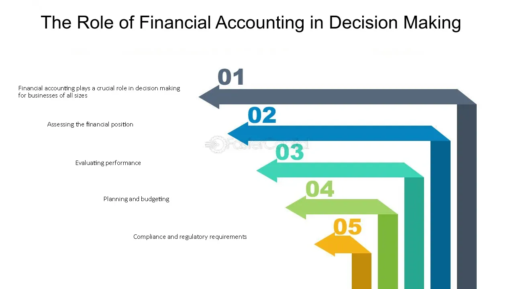

## Table of Contents

## What is financial accounting and how does it differ from managerial accounting?

Financial accounting is a type of accounting that focuses on recording, summarizing, and reporting the financial transactions of a business. It follows specific rules and standards, like Generally Accepted Accounting Principles (GAAP), to make sure the financial statements are accurate and useful. These statements, like the income statement and balance sheet, are shared with people outside the company, such as investors, creditors, and tax authorities. They use this information to understand how the business is doing and make decisions about investing or lending money.

Managerial accounting, on the other hand, is used inside the company to help managers make decisions. It doesn't have to follow strict rules like financial accounting. Instead, it can be customized to provide the specific information managers need to plan, control, and improve the business. This might include things like budgets, cost analysis, and performance reports. While financial accounting looks at the big picture of the whole company, managerial accounting can focus on smaller parts of the business, helping managers see where they can save money or make more profit.

## How does financial accounting provide information useful for decision-making?

Financial accounting helps people make decisions by giving them clear and organized information about a company's financial health. It does this by creating financial statements like the income statement, balance sheet, and cash flow statement. These statements show how much money the company made, what it owns and owes, and how cash moves in and out of the business. People like investors and creditors use this information to see if the company is doing well or if it's struggling. They can then decide if they want to invest in the company, lend it money, or maybe even buy it.

For example, an investor might look at the income statement to see if the company is making a profit. If it is, they might feel confident about buying the company's stock. On the other hand, if the company is losing money, the investor might decide to invest their money elsewhere. Similarly, a bank might look at the balance sheet to see if the company has enough assets to cover its debts. If it does, the bank might be willing to give the company a loan. But if the company's debts are too high, the bank might say no. So, financial accounting helps people make smart choices by giving them the numbers they need to understand a company's financial situation.

## What are the basic financial statements and what information do they convey?

The basic financial statements are the income statement, the balance sheet, and the cash flow statement. The income statement shows how much money a company made and spent over a certain time, like a year or a quarter. It tells you if the company made a profit or a loss by showing the revenue, which is the money from selling things, and the expenses, which are the costs of running the business. If the revenue is more than the expenses, the company made a profit. If it's less, the company had a loss.

The balance sheet is like a snapshot of what the company owns and owes at a specific time. It has three main parts: assets, liabilities, and equity. Assets are things the company owns, like cash, buildings, and equipment. Liabilities are what the company owes, like loans and bills. Equity is the value left for the owners after you take away the liabilities from the assets. The balance sheet helps you see if the company is financially strong or if it's in trouble.

The cash flow statement shows how money moves in and out of the company. It's split into three sections: operating activities, investing activities, and financing activities. Operating activities show the cash from the company's main business, like selling products or services. Investing activities show cash spent on or received from things like buying or selling equipment. Financing activities show cash from loans, paying back loans, or getting money from investors. The cash flow statement helps you see if the company has enough cash to keep running and growing.

## How can financial ratios be used to analyze a company's financial health?

Financial ratios are useful tools that help people understand a company's financial health by comparing different numbers from its financial statements. They make it easier to see how well the company is doing in areas like making money, managing debts, and using its assets. For example, the current ratio compares a company's current assets to its current liabilities. This helps people see if the company can pay its short-term bills. If the ratio is high, it means the company has enough money to cover its debts. If it's low, it might have trouble paying what it owes.

Another important ratio is the debt-to-equity ratio, which shows how much the company relies on borrowed money compared to money from its owners. A high debt-to-equity ratio can mean the company is risky because it has a lot of debt to pay back. On the other hand, a low ratio might mean the company is safer because it's not borrowing as much. By looking at these ratios, investors and creditors can make better decisions about whether to invest in or lend money to the company. Ratios like these give a clearer picture of the company's financial situation, making it easier to see if it's strong or struggling.

## What role do accounting standards (such as GAAP or IFRS) play in financial decision-making?

Accounting standards like GAAP (Generally Accepted Accounting Principles) and IFRS (International Financial Reporting Standards) are important because they make sure that financial information is accurate and easy to understand. These rules tell companies how to record and report their financial data, so everyone does it the same way. This makes it easier for people like investors and creditors to compare different companies. If every company used a different method, it would be hard to know which one is doing better. So, by following these standards, companies can show their financial health in a clear and reliable way.

These standards also help in making good financial decisions. When people know that the financial statements they are looking at are prepared according to strict rules, they can trust the information more. This trust is important for deciding whether to invest in a company, lend it money, or even buy it. Without these standards, people might not believe the numbers they see, and that could make them hesitant to make any financial moves. So, accounting standards play a big role in helping people feel confident about the financial decisions they make.

## How does financial accounting assist in budgeting and forecasting?

Financial accounting helps with budgeting and forecasting by giving a clear picture of a company's past financial performance. When you look at financial statements like the income statement and cash flow statement, you can see how much money the company made and spent in the past. This information is really useful for making a budget because it shows you what to expect. For example, if you know how much you usually spend on things like rent or salaries, you can plan your budget to make sure you have enough money for these costs in the future.

Forecasting is about guessing what will happen in the future, and financial accounting helps with this too. By looking at trends in the financial statements, like how sales have been growing or shrinking, you can make educated guesses about what might happen next. If sales have been going up by 10% every year, you might forecast that they will keep going up by about the same amount. This helps the company plan for the future, like deciding how much to spend on new projects or how much money to save. So, financial accounting gives the numbers you need to make smart plans for the future.

## What are the limitations of financial accounting in decision-making?

Financial accounting has some limits when it comes to helping people make decisions. One big problem is that it only shows what happened in the past. It tells you how much money a company made or spent last year, but it doesn't say much about what might happen next year. This can make it hard to plan for the future because you're only looking at old information. Also, financial accounting follows strict rules, like GAAP or IFRS, which means it can't be changed to fit what a specific person or company needs. This can make it less useful for some decisions because it doesn't give all the details someone might want.

Another limitation is that financial accounting can be hard to understand. The numbers and rules can be confusing, especially for people who aren't accountants. This can make it tough for them to use the information to make good choices. Plus, financial accounting doesn't show everything about a company. It might not tell you about things like how happy the employees are or how good the company's products are. These things can be important for making decisions, but they don't show up in the financial statements. So, while financial accounting is helpful, it's not perfect and has its limits.

## How can financial accounting data be used for investment decisions?

Financial accounting data helps people make investment decisions by showing them how a company is doing financially. When you look at the financial statements, like the income statement and balance sheet, you can see if the company is making money or losing it. For example, if the income statement shows that the company's profits are growing every year, it might be a good sign that the company is doing well. Investors can use this information to decide if they want to buy the company's stock. If the company is making more money, the value of its stock might go up, which means investors could make money too.

But financial accounting data is not just about profits. The balance sheet shows what the company owns and owes, which can tell investors if the company is in good financial shape. If the company has a lot of debt, it might be risky because it has to pay back that money. On the other hand, if the company has a lot of assets and not much debt, it might be a safer investment. By looking at these numbers, investors can figure out if the company is strong enough to be a good place to put their money. So, financial accounting data gives investors the information they need to make smart choices about where to invest.

## What advanced analytical techniques can be applied to financial accounting data for deeper insights?

Advanced analytical techniques like ratio analysis can help people understand financial accounting data better. Ratio analysis means looking at different numbers from the financial statements and comparing them to see how the company is doing. For example, the return on equity ratio shows how much profit the company makes with the money its owners have put in. If this ratio is high, it means the company is using its owners' money well to make profits. Another useful ratio is the gross profit margin, which shows how much money the company keeps from selling its products after paying for the costs of making them. By using these ratios, people can get a clearer picture of the company's financial health and see where it might need to improve.

Another technique is trend analysis, which looks at how the company's financial numbers change over time. By comparing financial statements from different years, you can see if the company's sales, profits, or debts are going up or down. This can help you guess what might happen in the future. For example, if sales have been growing by 5% every year, you might expect them to keep growing at about the same rate. Trend analysis can also show if there are any big changes or problems that need to be fixed. By using these advanced techniques, people can get deeper insights into the company's financial situation and make better decisions.

## How does financial accounting integrate with strategic planning and performance management?

Financial accounting helps with strategic planning by showing what the company has done in the past. When people make plans for the future, they need to know how much money the company made and spent before. By looking at financial statements like the income statement and balance sheet, they can see if the company is making profits or if it has a lot of debt. This information helps them decide what goals to set and what steps to take to reach those goals. For example, if the company's profits are growing, they might plan to expand the business. If the company has a lot of debt, they might decide to focus on paying it off first.

Financial accounting also plays a big role in performance management. It helps managers see how well the company is doing by comparing what's happening now to what was planned. For example, if the company set a goal to increase sales by 10%, managers can use financial accounting data to see if they are on track to meet that goal. If sales are not growing as expected, they can figure out why and make changes to improve. This way, financial accounting helps managers keep the company on the right path and make sure everyone is working towards the same goals.

## What are the ethical considerations in financial accounting that impact decision-making?

Ethical considerations in financial accounting are important because they make sure the numbers are honest and fair. When people make decisions based on financial statements, they need to trust that the information is true. If someone lies or hides information, it can lead to bad choices. For example, if a company makes its profits look bigger than they really are, investors might decide to buy its stock thinking the company is doing well. But if the truth comes out later, the stock price could drop, and investors could lose money. So, it's really important for accountants to follow ethical rules and report the numbers accurately.

Another ethical issue is making sure everyone is treated fairly. This means not favoring one group over another, like giving special information to some investors but not others. It's also about being open and honest about any conflicts of interest. For example, if an accountant owns stock in a company they are working for, they should tell people about it. This way, others can see if the accountant might be biased. By following these ethical rules, financial accounting helps people make better decisions because they can trust the information they are using.

## How do emerging technologies like AI and blockchain influence financial accounting practices and decision-making?

Emerging technologies like AI and blockchain are changing how financial accounting works and helps people make decisions. AI can make accounting easier by doing things like checking numbers for mistakes and finding patterns in big sets of data. This can save time and help accountants see things they might miss. For example, AI can look at a company's financial statements from the past few years and predict what might happen next. This can help people make better choices about where to spend money or how to plan for the future. Also, AI can help with tasks like making budgets and forecasts, making them more accurate and less work for accountants.

Blockchain is another technology that's changing financial accounting. It's like a digital record book that everyone can see and trust because it's hard to change the information once it's in there. This makes it easier to keep track of money moving in and out of a company and can help stop fraud. For example, if a company uses blockchain to record its transactions, it's easier for investors to see exactly what's happening and trust that the numbers are right. This can make them feel more confident about making decisions like buying the company's stock or lending it money. So, both AI and blockchain are making financial accounting more accurate, trustworthy, and helpful for decision-making.

## References & Further Reading

[1]: ["Financial Accounting Theory"](https://corporatefinanceinstitute.com/resources/accounting/financial-accounting-theory/) by William Scott

[2]: DeMiguel, V., Garlappi, L., & Uppal, R. (2009). ["Optimal versus Naive Diversification: How Inefficient is the 1/N Portfolio Strategy?"](https://www.jstor.org/stable/30226017) The Review of Financial Studies, 22(5), 1915-1953.

[3]: Poterba, J. M., & Summers, L. H. (1988). ["Mean Reversion in Stock Prices: Evidence and Implications."](https://www.nber.org/papers/w2343) Journal of Financial Economics, 22, 27-59.

[4]: Hull, J. C. (2015). ["Options, Futures, and Other Derivatives"](https://www.semanticscholar.org/paper/Options%2C-Futures%2C-and-Other-Derivatives-Hull/89bdee500c8623864fc9eb7a471546aa713acc44) (9th ed.). Pearson.

[5]: ["Algo Trading & DMA: An Introduction to Direct Access Trading Strategies"](https://github.com/balogunb/Algo_Trader/blob/master/Barry%20Johnson%20-%20Algorithmic%20Trading%20and%20DMA_%20An%20introduction%20to%20direct%20access%20trading%20strategies-4Myeloma%20Press%20(2010).pdf) by Barry Johnson

[6]: IEEE Spectrum. (2010). ["The Story of the Flash Crash: Nanex Research Paper."](https://spectrum.ieee.org/)