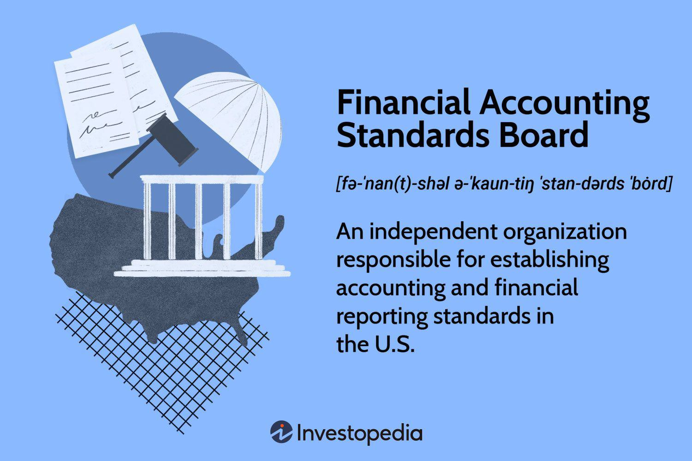

## Table of Contents

## What is the Financial Accounting Standards Board (FASB)?

The Financial Accounting Standards Board, or FASB, is an organization that creates rules for how companies should handle their financial reporting. These rules are called accounting standards. The main goal of the FASB is to make sure that the financial information companies share is clear, accurate, and useful for people like investors and creditors who need to make decisions based on that information.

The FASB was set up in 1973 and is based in the United States. It works independently but is overseen by the Financial Accounting Foundation. The board members of the FASB are experts in accounting and finance. They work to keep the accounting standards up to date, which means they change the rules when needed to reflect new business practices or economic conditions. This helps keep financial reporting trustworthy and relevant.

## When was the FASB established and why?

The Financial Accounting Standards Board, or FASB, was established in 1973. The main reason for creating the FASB was to improve the quality and consistency of financial reporting in the United States. Before the FASB existed, there were different ways companies could report their financial information, which made it hard for investors and others to understand and compare the financial health of different companies.

The FASB was set up to be an independent body that could create and update accounting standards. This was important because having one set of clear rules helps everyone trust the financial information they see. By making sure that all companies follow the same standards, the FASB helps investors make better decisions and keeps the financial markets fair and transparent.

## What is the primary purpose of the FASB?

The main job of the Financial Accounting Standards Board, or FASB, is to make sure that the financial information companies share is clear, accurate, and helpful. They do this by creating rules called accounting standards. These rules help everyone, like investors and people who lend money, understand how well a company is doing financially.

The FASB was started because there were too many different ways companies could report their finances, which made it confusing for people trying to compare them. By setting up one set of clear rules, the FASB makes sure that all companies report their financial information in the same way. This helps people trust the information and make better decisions about where to invest their money or whether to lend to a company.

## Who are the members of the FASB and how are they selected?

The members of the Financial Accounting Standards Board (FASB) are experts in accounting and finance. There are usually seven members on the board. These people come from different backgrounds like public accounting, business, and even teaching. They are chosen because they know a lot about how companies report their money and how to make rules that everyone can follow.

The members of the FASB are picked by the Financial Accounting Foundation (FAF). The FAF is a group that watches over the FASB to make sure it does its job well. When choosing new members, the FAF looks for people who are fair and can work well with others. They want members who can think about what's best for everyone who uses financial information, not just one group. This way, the rules the FASB makes are good for everyone.

## What is the standard-setting process of the FASB?

The standard-setting process of the Financial Accounting Standards Board (FASB) starts when they see a problem or a need for a new rule in financial reporting. They first talk to lots of people who use financial information, like investors, companies, and accountants, to understand the issue better. After gathering all this information, the FASB writes a document called an "Exposure Draft." This is a first version of the new rule they are thinking about. They share this Exposure Draft with everyone and ask for feedback. People can send in their thoughts and ideas about the new rule.

After getting feedback on the Exposure Draft, the FASB looks at all the comments carefully. They think about what everyone said and decide if they need to change the rule or if it's ready to go. If they make changes, they might put out another Exposure Draft to get more feedback. Once the FASB is happy with the rule, they vote on it. If most of the board members agree, the new rule becomes official. It's then called an "Accounting Standards Update," and companies have to follow it when they report their finances. This whole process can take a long time, but it helps make sure the rules are good for everyone.

## How does the FASB ensure transparency and due process in its operations?

The FASB works hard to make sure everyone can see what they are doing and that they follow a fair process when making new rules. They do this by talking to lots of different people before they even start writing a new rule. They ask for ideas from investors, companies, accountants, and anyone else who uses financial information. This way, they can understand what everyone needs and make rules that work for everyone.

When the FASB has a first version of a new rule, they share it with the public in something called an Exposure Draft. They ask people to read it and tell them what they think. The FASB listens to all the feedback and might change the rule based on what people say. They might even share another Exposure Draft to make sure they get it right. This back-and-forth helps make sure the final rule is fair and useful.

## What are some key accounting standards issued by the FASB?

The FASB has issued many important accounting standards over the years. One key standard is ASC 606, which is all about how companies should report their revenue. This rule says that companies should recognize revenue when they give a product or service to a customer, not just when they get paid. This helps make sure that the money a company says it has earned matches up with what it has actually done for customers.

Another important standard is ASC 842, which deals with leases. This rule says that companies need to include leases on their balance sheets, even if they are renting something instead of buying it. This makes it easier for people to see all the financial commitments a company has. By following this rule, companies show a clearer picture of their financial situation.

The FASB also issued ASC 740, which is about accounting for income taxes. This standard helps companies figure out how to report their taxes in a way that's clear and consistent. It makes sure that the tax information a company shares matches up with what they owe or what they will get back from the government. These standards help make financial reporting more honest and useful for everyone.

## How do the FASB's standards impact businesses and investors?

The FASB's standards help businesses by giving them clear rules on how to report their finances. When all companies follow the same rules, it makes it easier for them to show their financial health in a way that everyone can understand. This can help businesses get loans or attract investors because people can trust the numbers they see. For example, if a business follows the rule about reporting revenue correctly, it can show exactly when it earns money from sales, which makes its financial statements more reliable.

Investors also benefit a lot from the FASB's standards. When companies report their finances the same way, investors can compare different companies easily. This helps them make smarter choices about where to put their money. For example, if an investor is looking at two companies, and both are following the same lease accounting rules, the investor can see which company has more financial commitments and make a better decision. Overall, the FASB's standards make the financial world more fair and transparent for everyone.

## What is the relationship between the FASB and the Securities and Exchange Commission (SEC)?

The Financial Accounting Standards Board (FASB) and the Securities and Exchange Commission (SEC) work together to make sure financial reporting in the United States is clear and trustworthy. The SEC is a government agency that looks after the rules for companies that sell stocks and bonds to the public. The SEC has the power to make rules about financial reporting, but it often lets the FASB, which is an independent group, create the detailed accounting standards. This is because the FASB has experts who understand accounting very well and can make rules that are fair and helpful for everyone.

Even though the FASB makes the rules, the SEC still watches over them. The SEC can say no to a rule if it thinks it's not good enough. But most of the time, the SEC trusts the FASB's work and lets their rules become official. This partnership helps keep financial reporting honest and clear, which is important for investors and the whole economy.

## How does the FASB coordinate with international accounting standards?

The FASB works with other groups around the world to make sure that the rules for financial reporting are similar everywhere. They do this because it helps investors understand and compare companies from different countries more easily. The main group they work with is the International Accounting Standards Board (IASB). Together, they try to make their rules as close as possible. This process is called convergence. By working together, they hope to create a set of rules that everyone can use, no matter where they are.

Sometimes, the FASB and the IASB might have different rules for the same thing. When this happens, they talk to each other to see if they can change their rules to be more alike. They might not always agree right away, but they keep trying to find common ground. This helps make the financial world more connected and easier to understand for everyone who uses financial information.

## What are some recent or upcoming projects of the FASB?

The FASB is always working on new projects to keep financial reporting rules up to date. One recent project they finished is about how companies should report their income taxes. This new rule, called ASC 740, helps companies show their taxes in a clear way that everyone can understand. Another project they are working on is about how companies should report their expenses for things like research and development. The FASB wants to make sure these rules help people see how much money companies are spending on new ideas and projects.

The FASB also has some big projects coming up. One of them is about how companies should report their cryptocurrencies, like Bitcoin. Right now, the rules for this are not very clear, so the FASB is trying to make new rules that will help everyone understand how much these digital assets are worth. Another upcoming project is about how companies should report their environmental, social, and governance ([ESG](/wiki/esg-investing)) activities. This is important because more and more people want to know how companies are helping the planet and society. The FASB wants to make sure these reports are honest and useful for everyone.

## How can one stay updated on changes and developments from the FASB?

You can stay updated on changes and developments from the FASB by visiting their official website. The FASB's website has a section called "News & Events" where they post all their latest updates, new rules, and upcoming meetings. They also have a newsletter that you can sign up for. This newsletter comes right to your email and tells you about any new things the FASB is working on or any changes they are making to the rules.

Another way to stay informed is by following the FASB on social media. They have accounts on platforms like Twitter and LinkedIn where they share quick updates and news about their work. You can also join groups or forums where people talk about accounting and finance. These groups often discuss the latest news from the FASB and can help you understand how new rules might affect businesses and investors.

## What is the relevance of financial accounting to algo trading?

Financial accounting plays a pivotal role in business reporting and decision-making, as it provides critical insights into a company's financial health and operational performance. It is responsible for the preparation of financial statements, which serve as comprehensive records of financial activities over a specific period. These statements include the balance sheet, income statement, cash flow statement, and statement of shareholders' equity. Such documents are essential for managers, investors, analysts, and stakeholders to make informed financial decisions.

In [algorithmic trading](/wiki/algorithmic-trading), financial statements are indispensable because they provide the quantitative data required to develop and optimize trading strategies. Algorithmic trading, or algo trading, involves the use of computer algorithms to execute trades at optimal times by processing complex data at high speeds. The data sourced from financial statements enable traders to construct models that predict market movements, assess company valuations, and generate buy or sell signals.

An essential aspect of algo trading is the analysis of financial metrics extracted from these statements. Critical metrics such as revenue growth, earnings per share (EPS), debt-to-equity ratio, and return on equity (ROE) are frequently used as inputs into algorithmic models. For instance, calculating the Price-to-Earnings (P/E) ratio can be carried out as follows:

$$
\text{P/E Ratio} = \frac{\text{Market Value per Share}}{\text{Earnings per Share (EPS)}}
$$

This ratio helps in determining the relative value of a company's shares and aids in making comparative assessments across companies in the same sector. Other formulations might include the calculation of the Operating Cash Flow (OCF), which supports models assessing a company's [liquidity](/wiki/liquidity-risk-premium) by using data from cash flow statements.

Moreover, advanced algorithms incorporate multiple metrics and employ [machine learning](/wiki/machine-learning) techniques to enhance trading strategies. For example, a Python snippet to calculate the moving average, which could be used in conjunction with financial data points to predict price trends, is as follows:

```python
def moving_average(prices, window_size):
    return [sum(prices[i:i+window_size])/window_size for i in range(len(prices)-window_size+1)]

prices = [10, 12, 11, 15, 14, 13, 16]
window_size = 3
print(moving_average(prices, window_size))
```

The moving average helps smooth out price data by creating a constantly updated average price, which is particularly useful when developing predictive algorithms in trading.

The relationship between financial accounting and algo trading underscores the importance of accurate and timely financial data. As accounting standards evolve, ensuring that algorithmic models remain aligned with such changes is crucial, making the integration of reliable financial information a key competency for successful algorithmic trading systems.

## References & Further Reading

[1]: ["The FASB Accounting Standards Codification: A User-Friendly Guide for Investors"](https://fasb.org/standards) - CFA Institute

[2]: ["The Impact of New FASB Standards"](https://williamsmarston.com/insights/adapting-to-new-fasb-standards-the-future-of-financial-reporting/) - Deloitte

[3]: ["Advances in Financial Machine Learning"](https://www.amazon.com/Advances-Financial-Machine-Learning-Marcos/dp/1119482089) by Marcos Lopez de Prado

[4]: ["Machine Learning for Asset Managers"](https://github.com/emoen/Machine-Learning-for-Asset-Managers) by Marcos Lopez de Prado

[5]: ["Quantitative Trading: How to Build Your Own Algorithmic Trading Business"](https://www.amazon.com/Quantitative-Trading-Build-Algorithmic-Business/dp/1119800064) by Ernest P. Chan

[6]: ["Financial Accounting Theory and Analysis: Text and Cases"](https://archive.org/details/financialaccount0000schr) by Richard G. Schroeder and Myrtle W. Clark

[7]: ["Fair Value Measurements, FASB Accounting Standards Codification"](https://fasb.org/page/PageContent?pageId=/projects/recentlycompleted/discreviewfairvaluemeasurement.html&isstaticpage=true) - Financial Accounting Standards Board

[8]: ["FASB Rule Changes on Lease Accounting"](https://www.berrydunn.com/news-detail/fasb-issues-its-first-asu-of-the-year-and-makes-much-anticipated-changes-to-lease-accounting) - Journal of Accountancy