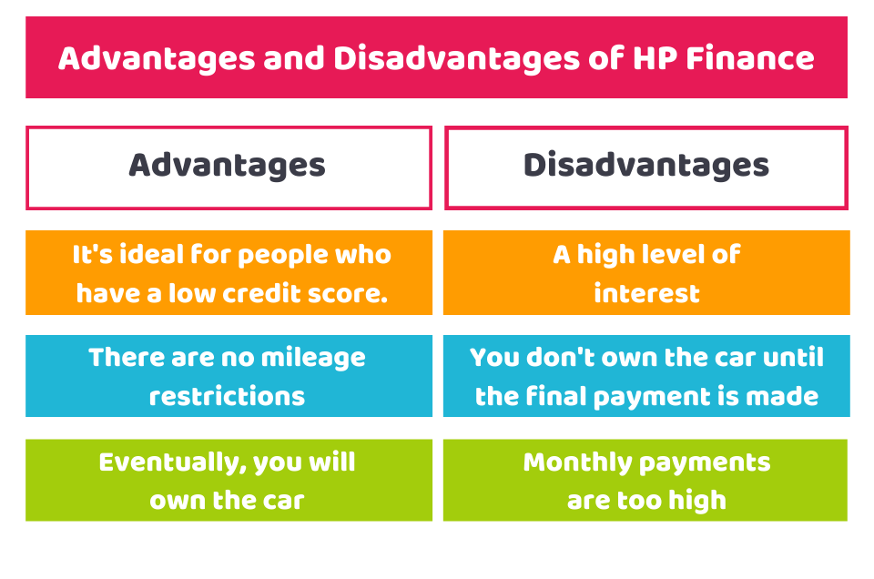

## Table of Contents

## What is hire purchase and how does it work?

Hire purchase is a way to buy things by paying for them over time. Instead of paying the full price right away, you make a smaller down payment and then pay the rest in installments. This can be helpful if you need something expensive, like a car or furniture, but don't have all the money at once. The item you buy belongs to the company that sells it to you until you finish paying everything.

When you use hire purchase, you agree to a contract that says how much you need to pay each month and for how long. If you miss a payment, the company can take back the item. But if you keep up with your payments, at the end of the agreement, you own the item completely. It's important to read the contract carefully and make sure you can afford the monthly payments before you start.

## How does hire purchase differ from other financing options?

Hire purchase is different from other financing options because it lets you use the item you want to buy right away, but you don't own it until you finish paying. With hire purchase, you make a down payment and then pay the rest in monthly installments. If you miss a payment, the company can take the item back. This is different from a loan, where you get the money upfront and own the item from the start, but you have to pay back the loan with interest.

Another financing option is leasing, where you pay to use an item for a certain time, but you never own it. With leasing, you might have lower monthly payments than with hire purchase, but at the end of the lease, you have to give the item back or buy it at a set price. Hire purchase is also different from buying on credit, where you use a credit card to buy something and pay it off over time. With credit, you own the item right away, but you might pay high interest rates if you don't pay off the card quickly.

In summary, hire purchase gives you the use of an item while you pay for it, but you only own it at the end. It's different from loans, leases, and credit because of when you own the item and how the payments work. It's important to think about these differences and choose the option that fits your needs and budget.

## What are the initial costs associated with a hire purchase agreement?

The first cost you'll have with a hire purchase agreement is the down payment. This is a part of the total price you need to pay right at the start before you can take the item home. The down payment can be different depending on the item and the company you're buying from. It's usually a smaller amount than the full price, but it can still be a lot of money.

After the down payment, you might also have to pay some fees. These can include things like an arrangement fee for setting up the hire purchase agreement, or a documentation fee for the paperwork. These fees add to the total cost of what you're buying, so it's good to know about them before you start. Make sure to ask the company about any extra costs so you know exactly what you'll need to pay.

## How can hire purchase help in managing cash flow for a business?

Hire purchase can help a business manage its cash flow by allowing it to spread out the cost of big purchases over time. Instead of paying a large amount all at once, a business can make a smaller down payment and then pay the rest in monthly installments. This means the business can keep more money in its bank account to use for other important things like paying employees or buying supplies.

This way of paying can be really helpful for a business that needs equipment or vehicles but doesn't have a lot of extra money right now. By using hire purchase, the business can get what it needs to keep running and growing, without using up all its cash. It's important for the business to make sure it can afford the monthly payments, but if it can, hire purchase can be a good way to manage money and keep the business going strong.

## What are the tax benefits of using hire purchase for business assets?

Using hire purchase for business assets can help a business save money on taxes. When a business buys something with hire purchase, it can often claim the interest part of the monthly payments as a tax deduction. This means the business can lower its taxable income by the amount of interest it pays, which can lead to paying less tax.

Another tax benefit is that the business can also claim depreciation on the asset. Depreciation is the way the value of the asset goes down over time. The business can subtract this depreciation from its income, which again helps to lower the taxes it has to pay. So, hire purchase can be a smart way for a business to manage its money and save on taxes at the same time.

## How does the interest rate on a hire purchase affect the total cost?

The [interest rate](/wiki/interest-rate-trading-strategies) on a hire purchase agreement can make the total cost of what you're buying go up a lot. When you use hire purchase, you're not just paying for the item itself, but also for the money you're borrowing to buy it. The interest rate is like a fee you pay for borrowing that money. If the interest rate is high, you'll end up paying more money over time than if the rate was lower. So, a higher interest rate means you'll pay more in the end than the item's original price.

It's important to look at the interest rate carefully before you agree to a hire purchase. Even a small difference in the interest rate can change how much you pay overall. For example, if you're buying something that costs $1,000 and the interest rate is 10%, you might end up paying $1,100 or more by the time you finish all your payments. But if the interest rate is 5%, you might only pay $1,050. That's why it's a good idea to compare different hire purchase offers and choose the one with the lowest interest rate to save money.

## Can hire purchase improve a company's credit rating?

Using hire purchase can help a company improve its credit rating if it makes all its payments on time. When a company borrows money to buy something and pays it back as promised, it shows other lenders that it is good at managing its money. This can make the company look more trustworthy, and lenders might give it a better credit rating. A better credit rating can help the company get loans with lower interest rates in the future, which can save it money.

However, if the company misses payments or can't pay back what it owes, its credit rating could get worse. Late payments or not paying at all can make lenders think the company is not good at managing its money. This can make it harder for the company to borrow money later on, and it might have to pay higher interest rates. So, it's important for the company to be sure it can afford the monthly payments before it starts a hire purchase agreement.

## What are the long-term financial benefits of using hire purchase for asset acquisition?

Using hire purchase for buying assets can help a business save money over time. When a business uses hire purchase, it spreads out the cost of the asset over many months. This means the business doesn't have to pay a big amount all at once, which can help keep more money in the bank for other important things like paying employees or buying supplies. By managing cash flow better, the business can keep running smoothly and might even have extra money to grow.

Another long-term benefit is that hire purchase can help a business save on taxes. The business can often claim the interest it pays on the hire purchase as a tax deduction, which means it can lower its taxable income and pay less tax. Also, the business can claim depreciation on the asset, which is the way the value of the asset goes down over time. This can also help lower the taxes the business has to pay. So, by using hire purchase, a business can manage its money better and save on taxes in the long run.

## How does the depreciation of assets factor into the financial advantages of hire purchase?

When a business uses hire purchase to buy an asset, it can take advantage of something called depreciation. Depreciation is when the value of an asset goes down over time. The business can claim this depreciation as a tax deduction, which means it can lower its taxable income. By doing this, the business pays less in taxes, which helps it save money over the long term.

This tax benefit can make hire purchase a smart choice for a business. Instead of paying a big amount all at once to buy an asset, the business can spread out the cost and also get a tax break on the depreciation. This way, the business can keep more money in its bank account to use for other important things, like growing the business or paying employees. So, using hire purchase can help a business manage its money better and save on taxes at the same time.

## What are the potential pitfalls or hidden costs in hire purchase agreements?

One big problem with hire purchase agreements is that they can have hidden costs. Sometimes, there are extra fees that you might not know about at first. These can be things like an arrangement fee to set up the agreement, or a documentation fee for the paperwork. These fees can make the total cost of what you're buying go up a lot. It's important to read the whole agreement carefully and ask about any fees before you sign anything. If you don't, you might end up paying more than you thought.

Another pitfall is the interest rate. The interest rate on a hire purchase agreement can be high, which means you'll pay a lot more over time than the item's original price. Even a small difference in the interest rate can make a big difference in how much you pay in the end. If you miss a payment, you might also have to pay late fees, which can add to the cost. So, it's a good idea to compare different hire purchase offers and choose the one with the lowest interest rate to save money.

## How can businesses leverage hire purchase to scale operations?

Businesses can use hire purchase to grow their operations by spreading out the cost of big purchases over time. Instead of paying a lot of money all at once for things like new equipment or vehicles, a business can make a smaller down payment and then pay the rest in monthly installments. This way, the business can keep more money in its bank account to use for other important things, like hiring more workers or buying supplies. By not using up all its cash at once, the business can keep running smoothly and even have extra money to expand.

Using hire purchase can also help a business save on taxes, which can give it more money to grow. The business can claim the interest it pays on the hire purchase as a tax deduction, which means it can lower its taxable income and pay less tax. Also, the business can claim depreciation on the asset, which is the way the value of the asset goes down over time. This can also help lower the taxes the business has to pay. So, by using hire purchase, a business can manage its money better, save on taxes, and have more money to scale up its operations.

## What advanced strategies can be employed to optimize the financial outcomes of multiple hire purchase agreements?

To make the most out of multiple hire purchase agreements, a business should first look at the interest rates carefully. By choosing agreements with the lowest interest rates, the business can save a lot of money over time. It's also a good idea to compare different offers and pick the ones that fit the business's needs best. Another smart strategy is to time the agreements so that the payments spread out evenly. This way, the business won't have to pay a lot of money all at once, and it can keep its cash flow steady.

Another important thing is to keep track of all the agreements and make sure to pay on time. Missing a payment can lead to extra fees and can hurt the business's credit rating. To avoid this, the business can set up automatic payments or use a calendar to remember when payments are due. Also, the business should think about how it can use the tax benefits from hire purchase. By claiming the interest and depreciation as tax deductions, the business can lower its taxes and have more money to reinvest in growing the business.

## References & Further Reading

[1]: ["Advances in Financial Machine Learning"](https://www.amazon.com/Advances-Financial-Machine-Learning-Marcos/dp/1119482089) by Marcos Lopez de Prado

[2]: Bergstra, J., Bardenet, R., Bengio, Y., & Kégl, B. (2011). ["Algorithms for Hyper-Parameter Optimization."](https://dl.acm.org/doi/10.5555/2986459.2986743) Advances in Neural Information Processing Systems 24.

[3]: ["Machine Learning for Algorithmic Trading"](https://github.com/stefan-jansen/machine-learning-for-trading) by Stefan Jansen

[4]: ["Quantitative Trading: How to Build Your Own Algorithmic Trading Business"](https://www.amazon.com/Quantitative-Trading-Build-Algorithmic-Business/dp/1119800064) by Ernest P. Chan

[5]: ["Evidence-Based Technical Analysis: Applying the Scientific Method and Statistical Inference to Trading Signals"](https://www.amazon.com/Evidence-Based-Technical-Analysis-Scientific-Statistical/dp/0470008741) by David Aronson