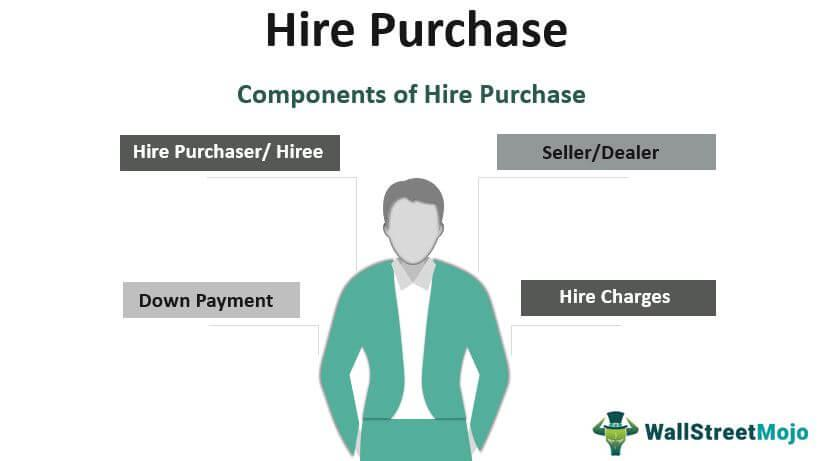

Hire purchase and algorithmic trading represent pivotal financial strategies in contemporary economic landscapes. Hire purchase, a traditional albeit still vital financial method, allows businesses and individuals to acquire assets through an installment-based system. Conversely, algorithmic trading embodies modern technological advancements in finance, automating trading decisions through sophisticated algorithms and high-speed data analysis.

Hire purchase facilitates access to necessary assets without necessitating a substantial upfront capital outlay, significantly aiding cash flow management for both businesses and consumers. This method supports businesses in maintaining liquidity and can be advantageous for acquiring high-cost machinery or vehicles integral to operations.



Algorithmic trading profoundly impacts financial markets by utilizing algorithms to automate trading, thus ensuring precision and speed that far surpass human capabilities. This strategy capitalizes on historical data, real-time market analysis, and sophisticated algorithms to execute trades, dramatically enhancing transaction efficiency. It mitigates emotional bias, a common pitfall among traders, leading to more consistent and objective decision-making.

In today's dynamic economic environment, both hire purchase and algorithmic trading offer vital benefits and opportunities for growth. Hire purchase enhances capital management and asset availability, while algorithmic trading provides superior speed, efficiency, and accuracy in financial markets. These strategies, distinct yet complementary, provide invaluable tools for both businesses and investors seeking to optimize their financial strategies and performance.

## Table of Contents

## Understanding Hire Purchase

Hire purchase is a financial arrangement that allows an individual or a business to acquire an asset by paying an initial installment, followed by a series of regular payments. Unlike a traditional loan, ownership of the asset is transferred only after all payments have been made, giving the buyer the ability to use the asset while paying for it over time. This structure is particularly beneficial for businesses looking to invest in equipment or machinery without the need for immediate full payment.

The concept of hire purchase can be traced back to the 19th century. It originated in the United Kingdom, where it was first recognized as a practical financial solution for individuals who required immediate use of goods but lacked the resources for outright purchase. Over time, hire purchase agreements became formalized, with legal frameworks established to protect the interests of both buyers and sellers. This financial innovation quickly spread to other countries, adapting to varying legal and economic environments worldwide.

Today, hire purchase is widely used in the business sector, particularly in industries requiring significant capital investment in machinery, vehicles, or technology. Companies utilize this method to manage cash flow effectively, as it allows them to conserve working capital while acquiring necessary assets. For example, a manufacturing company might use hire purchase to obtain new production equipment, thereby enhancing its operational capacity without disrupting its financial equilibrium.

Hire purchase agreements typically consist of several key components: 

1. **Initial Deposit**: A percentage of the asset's total cost, paid upfront.
2. **Instalment Payments**: The remaining balance is divided into equal installments, paid over a specified period.
3. **Interest Rates**: Fixed interest rates are often applied to the purchase price, allowing for predictable financial planning.
4. **Option to Purchase**: At the end of the payment schedule, the buyer has the option to purchase the asset outright, usually for a nominal fee.

This financial tool is particularly advantageous for businesses that experience fluctuating income streams, as it provides flexibility in planning and budgeting. Moreover, the fixed payment schedule aids in forecasting expenses and managing long-term financial commitments.

## Financial Benefits of Hire Purchase

Hire purchase is a financial arrangement that offers significant benefits by maximizing working capital and providing flexible payment options. One of the primary advantages of hire purchase is that it enables businesses to acquire essential assets without the necessity of full upfront payments. This approach allows companies to maintain [liquidity](/wiki/liquidity-risk-premium) and allocate their working capital to other operational needs, such as inventory or marketing, potentially boosting overall business performance.

From an accounting perspective, hire purchase agreements can be structured to keep the liabilities off a company's balance sheet, thereby improving its financial appearance. This is often achieved by using off-balance-sheet financing techniques where the asset and corresponding liability do not appear on the balance sheet. This improved financial appearance can result in a more favorable debt-to-equity ratio, a critical [factor](/wiki/factor-investing) when businesses seek additional financing from banks or investors.

Tax advantages are another significant benefit associated with hire purchase agreements. Typically, payments under a hire purchase plan are considered operating expenses, allowing businesses to deduct them from taxable income. Furthermore, businesses can often claim capital allowances on hired assets, leading to reduced tax liabilities. The interest component of hire purchase payments is also usually tax-deductible, providing an extra layer of financial efficiency.

Overall, the financial benefits of hire purchase make it a compelling option for businesses seeking to optimize capital usage while maintaining a robust financial profile. Its combination of working capital maximization, off-balance-sheet financing, and tax advantages provides a well-rounded strategy for asset acquisition and financial management.

## Advantages of Hire Purchase

Hire purchase offers several notable advantages for businesses seeking to acquire assets. One of the primary benefits is the ability to use assets immediately without the need for full upfront payment. This financial arrangement allows businesses to conserve cash flow, which can be redirected towards other operational needs or investments. By spreading the cost over a series of installments, companies can gain essential equipment or machinery to enhance productivity without depleting their capital reserves.

Another significant advantage of hire purchase is the stability offered by fixed interest rates. Unlike variable interest loans, where rates can fluctuate with market conditions, fixed interest rates provide predictability in financial planning. Businesses can accurately forecast their financial obligations over the term of the agreement, minimizing the risk of financial strain due to unforeseen [interest rate](/wiki/interest-rate-trading-strategies) hikes. This stability often accompanies flexible repayment terms, which can be tailored to suit the financial circumstances of the business. Such flexibility ensures that repayments are manageable and aligned with the company's cash flow cycles, further aiding in strategic financial planning.

Moreover, some hire purchase agreements include provisions for maintenance and upgrades of the acquired assets. This aspect reduces the burden on businesses to invest additional resources into the upkeep and modernization of the equipment. Maintenance contracts within hire purchase agreements ensure that the assets remain operational and efficient, which is vital for sustaining business productivity. Additionally, options for upgrades mean that companies can access latest technological advancements without having to negotiate new financial arrangements or purchase assets outright. This feature is particularly valuable in industries where technological obsolescence is rapid, ensuring that businesses remain competitive without extensive capital expenditure.

In summary, hire purchase agreements provide businesses with access to necessary assets while offering financial flexibility, stability with predictable costs, and opportunities for asset maintenance and technological upgrades. These advantages can significantly contribute to a company's strategic financial management and operational efficiency.

 to Algorithmic Trading

Algorithmic trading, commonly referred to as algo trading, is a method of executing trades using pre-programmed instructions that account for variables such as timing, price, and [volume](/wiki/volume-trading-strategy). These algorithms are designed to identify and capitalize on trading opportunities at speeds and frequencies that are impossible for human traders. The development and execution of these algorithms often involve detailed statistical analysis and complex mathematical models. 

In the context of trading, algorithms are used to automate transactions on financial markets by using a set of rules for decision-making. For example, a simple algorithm could be to buy stocks when their 50-day moving average surpasses the 200-day moving average, and sell them when the converse occurs. In pseudocode, this could be summarized as:

```python
if moving_average_50 > moving_average_200:
    execute_trade('BUY')
elif moving_average_50 < moving_average_200:
    execute_trade('SELL')
```

The integration of technology is a cornerstone in modern trading strategies, particularly for [algorithmic trading](/wiki/algorithmic-trading). Enhancements in computer processing power and the development of sophisticated financial software have enabled traders to handle enormous amounts of data rapidly and execute trades in microseconds. High-frequency trading ([HFT](/wiki/high-frequency-trading-strategies)), a subset of algorithmic trading, exemplifies this capability, operating on execution speeds that make significant profits from minute price movements.

Technological advancements mean algo trading has transformed the landscape of financial markets, influencing market liquidity, [volatility](/wiki/volatility-trading-strategies), and pricing. This strategy's prevalence is growing, owing to its ability to process real-time data from numerous financial markets simultaneously and make swift trading decisions. The competitive edge provided by algo trading is crucial for institutional investors and hedge funds who manage large portfolios and need to optimize the timing and sizing of their trades to avoid adverse price movements.

Moreover, the importance of algorithmic trading is reflected in its growing share in global trading volumes. Many exchanges worldwide report algorithmic trading as accounting for 60% to 75% of market activity. This surge highlights a trend where financial markets are becoming increasingly automated, with algorithms playing a key role in enabling seamless trading operations across various financial instruments. 

In summary, algorithmic trading is redefining the execution of financial transactions by merging finance and technology, leading to a more efficient, data-driven approach to trading. As this trend continues to evolve, it underscores the pivotal role of technological innovation in the advancement and operation of global financial markets.

## Financial Advantages of Algo Trading

Algorithmic trading, often referred to as algo trading, has revolutionized the way trades are executed in financial markets. One of the primary benefits of algo trading is its remarkable efficiency and speed. Algorithms can process vast amounts of market data and execute trades at fractions of a second, far outweighing the capabilities of human traders. This rapid execution allows traders to capitalize on even minor price fluctuations, which can accumulate into significant profits over time. Efficiency is not just about speed; algorithms can be programmed to scan and react to dynamic market conditions, ensuring trades are executed under optimal circumstances.

Another advantage of algorithmic trading is its ability to minimize emotional biases in trading decisions. Human traders are often susceptible to psychological influences, such as fear and greed, that can impact their decision-making process negatively. Algo trading eliminates these biases by adhering strictly to predefined rules and strategies coded into the algorithms. This disciplined approach ensures that trades are executed based on logic and strategy, devoid of emotional interference.

Furthermore, algorithmic trading offers the benefit of round-the-clock trading capabilities. Unlike human traders, algorithms do not require breaks and can operate continuously, accessing global markets that function in different time zones. This 24/7 trading ability ensures that opportunities across various markets are captured without interruption.

Cost efficiency is another significant financial advantage of algorithmic trading. The automation of trade execution reduces the need for constant human supervision and intervention, potentially lowering operational costs. Additionally, the increased precision in order execution minimizes transaction costs, as trades can be executed at the best possible prices.

Overall, the efficiency, emotional neutrality, continuous operation, and cost-effectiveness of algorithmic trading provide significant financial advantages, making it an indispensable tool for modern investors looking to optimize their trading strategies.

## Comparing Hire Purchase and Algo Trading

Hire purchase and algorithmic trading, while distinct in their applications, both provide robust mechanisms for financial growth when utilized effectively by businesses and investors. Hiring purchase focuses on asset acquisition, allowing businesses to leverage assets immediately without the burden of full upfront payment. In contrast, algorithmic trading optimizes the buying and selling of financial instruments using computer algorithms for speed and efficiency.

### Leveraging Hire Purchase and Algorithmic Trading

**Hire Purchase for Asset Management and Flexibility**: 
Hire purchase agreements allow companies to acquire essential assets while preserving cash flow. This flexibility in payment terms means enterprises can channel available capital into other revenue-generating activities. For instance, a manufacturing company might use hire purchase to acquire machinery, thus enhancing production capability while maintaining liquidity for day-to-day operations.

**Algorithmic Trading for Market Efficiency**: 
Algorithmic trading offers speed, precision, and the elimination of human emotion in trading decisions. These systems can execute complex strategies that take advantage of minute price differentials across multiple markets. A [hedge fund](/wiki/hedge-fund-trading-strategies), for example, can use algo trading to optimize its trading strategies, ensuring they can capitalize on fleeting market inefficiencies faster than manual traders can respond.

### Comparative Benefits

Both financial strategies offer distinct advantages suited to different financial objectives:

1. **Capital Allocation and Growth**: Hire purchase enables physical capital growth (e.g., acquiring expensive equipment or property) without depleting financial resources. In contrast, algorithmic trading focuses on market capital growth by enhancing transactional efficiency and profitability through high-frequency trading and arbitrage.

2. **Risk Management**: Hire purchase agreements often come with predictable, fixed payments, presenting a lower-risk solution in asset management. Conversely, algo trading, while reducing human error, introduces system and algorithmic risks, which require adept risk management strategies such as diversification and real-time monitoring.

3. **Scenarios of Suitability**:
   - **Hire Purchase** is particularly advantageous for businesses in asset-intensive industries (e.g., manufacturing, logistics) where equipment and machinery drive operational success. It's suited for companies needing immediate asset utilization without financial strain.
   - **Algorithmic Trading** serves investors and financial institutions aiming to optimize their trading portfolios through enhanced speed and reduced emotional involvement. It is especially beneficial in volatile markets where quick decision-making can be the difference between profit and loss.

In conclusion, both hire purchase and algorithmic trading serve as strategic tools that can significantly impact financial growth when aligned correctly with a business's or investor's goals. The choice between these strategies should depend on the specific financial needs, market circumstances, and risk appetite of the entity leveraging them.

## Conclusion

In summary, hire purchase and algorithmic trading present valuable opportunities for businesses and investors to enhance their financial strategies. Hire purchase allows companies to acquire critical assets without incurring immediate substantial costs, thus preserving working capital and potentially improving financial statements by keeping debt off balance sheets. The added benefits of fixed interest rates, flexible repayment terms, and possible maintenance and upgrades make it an attractive financing option for businesses looking to balance flexibility with financial prudence.

On the other hand, algorithmic trading offers a technologically advanced approach to trading in financial markets. Its ability to execute trades with speed and precision, coupled with the elimination of emotional biases, provides a significant competitive edge. Additionally, the capacity for round-the-clock trading and cost efficiency makes it an indispensable tool for modern traders seeking to maximize their market opportunities.

As these tools possess distinct strengths, they can serve as complementary strategies in bolstering financial growth. Businesses and investors are encouraged to explore these options to optimize their financial planning and operations. For those interested, consulting with financial advisors or conducting further research can provide tailored insights into how hire purchase and algorithmic trading can align with specific financial goals and risk profiles.

## References & Further Reading

[1]: ["Advances in Financial Machine Learning"](https://www.amazon.com/Advances-Financial-Machine-Learning-Marcos/dp/1119482089) by Marcos Lopez de Prado

[2]: Bergstra, J., Bardenet, R., Bengio, Y., & Kégl, B. (2011). ["Algorithms for Hyper-Parameter Optimization."](https://dl.acm.org/doi/10.5555/2986459.2986743) Advances in Neural Information Processing Systems 24.

[3]: ["Machine Learning for Algorithmic Trading"](https://github.com/stefan-jansen/machine-learning-for-trading) by Stefan Jansen

[4]: ["Quantitative Trading: How to Build Your Own Algorithmic Trading Business"](https://www.amazon.com/Quantitative-Trading-Build-Algorithmic-Business/dp/1119800064) by Ernest P. Chan

[5]: ["Evidence-Based Technical Analysis: Applying the Scientific Method and Statistical Inference to Trading Signals"](https://www.amazon.com/Evidence-Based-Technical-Analysis-Scientific-Statistical/dp/0470008741) by David Aronson