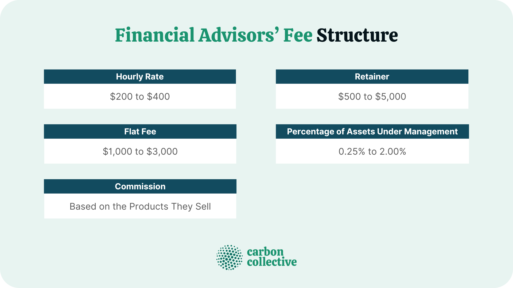

## Table of Contents

## What is a financial advisor?

A financial advisor is someone who helps people with their money. They give advice on how to save, invest, and plan for the future. People go to financial advisors when they want to make smart choices with their money, like saving for retirement, buying a house, or paying for their kids' education.

Financial advisors look at a person's whole financial situation. They think about things like how much money someone makes, how much they spend, and what they want to achieve with their money. Then, they suggest ways to reach those goals. This might include investing in stocks, bonds, or other things, or it might mean changing how someone budgets their money.

## Why do financial advisors charge fees?

Financial advisors charge fees because they need to make a living just like anyone else. When they help people with their money, they spend a lot of time and use their knowledge and skills. The fees they charge pay for the time they spend talking with clients, researching investments, and making plans. It's their way of earning money for the work they do, kind of like how a doctor charges for a check-up or a lawyer charges for legal advice.

These fees can also cover the costs of running their business. This includes things like office rent, software to manage investments, and other expenses. By charging fees, financial advisors can keep their business going and continue to help people make good choices with their money. It's important for clients to understand these fees so they can see the value they're getting from the advice and services provided.

## What are the common types of fee structures for financial advisors?

Financial advisors usually charge in a few different ways. One common way is by taking a percentage of the money they manage for you. This is called an "assets under management" or AUM fee. If you have $100,000 with them and they charge 1%, you would pay $1,000 a year. This fee goes up or down based on how much money you have with them.

Another way is by charging a flat fee or hourly rate. A flat fee might be a set amount for a specific service, like creating a financial plan. An hourly rate is when they charge by the hour for the time they spend working with you. This can be good if you only need advice now and then. Some advisors also charge based on performance, where they get a bonus if your investments do well, but this is less common.

Lastly, some advisors might get paid through commissions. This means they earn money when they sell you certain financial products, like insurance or mutual funds. It's important to know about this because it might affect the advice they give. Always ask your advisor how they get paid so you understand what you're paying for.

## How does an hourly fee structure work for financial advisors?

An hourly fee structure means a financial advisor charges you for the time they spend helping you. If they charge $200 an hour and they spend 5 hours working on your financial plan, you would pay them $1,000. This way, you only pay for the time they actually use, which can be good if you just need a little help or advice on something specific.

This kind of fee can be helpful if you don't want to commit to a long-term relationship with an advisor. You might just need advice on one thing, like how to start saving for retirement or what to do with a bonus. But, you need to keep track of the time they spend because the cost can add up if you need a lot of help.

## What is a flat fee and how is it used by financial advisors?

A flat fee is a set amount of money that a financial advisor charges for a specific service. For example, if you need help making a financial plan, the advisor might charge you $1,500 to do that, no matter how long it takes. This means you know exactly how much you will pay before you start, which can be good because there are no surprises.

Financial advisors use flat fees for things like creating a financial plan, doing a review of your money situation, or giving advice on a big decision. It's helpful because you pay one price for the whole job, and it doesn't matter if it takes the advisor a little more or less time than they thought. This can be a good choice if you want to know the cost upfront and don't want to worry about hourly rates or percentages of your money.

## Can you explain the percentage of assets under management (AUM) fee model?

The percentage of assets under management, or AUM, fee model is a way that financial advisors charge for their services. It means they take a small part of the money they are managing for you as their fee. For example, if you have $100,000 with an advisor and they charge a 1% AUM fee, you would pay them $1,000 each year. This fee goes up or down based on how much money you have with them. So, if your money grows to $110,000, the fee would go up to $1,100.

This kind of fee is good for advisors because it gives them a reason to help your money grow. If your investments do well, their fee goes up. But it can also mean you pay more as your money grows, which might not be what you want. It's important to understand how this fee works so you know what you're paying and if it's worth it for the help you get.

## What are performance-based fees and how do they benefit or risk clients?

Performance-based fees are when a financial advisor gets paid more if your investments do better. For example, if your money grows a lot, the advisor might get a special bonus on top of their regular fee. This kind of fee can be good for clients because it means the advisor has a big reason to make your money grow. If they do a good job, they get paid more, so they work hard to pick the best investments for you.

But, there are also risks with performance-based fees. If the advisor takes big risks to try to get that bonus, your money could go down a lot. Also, if the advisor only gets paid more when things go well, they might not be as careful about protecting your money when the market goes down. So, while it can push them to do well, it can also make them take chances that might not be good for you. It's important to understand these risks before choosing an advisor who uses this fee structure.

## How do financial advisors justify their fee structures?

Financial advisors say their fees are fair because they spend a lot of time and use their knowledge to help people with their money. They look at everything about a person's money, like how much they make, spend, and what they want to do with it. Then, they make plans and pick investments to help reach those goals. The fees they charge pay for all the work they do, like talking with clients, doing research, and keeping track of investments. It's like how a doctor or a lawyer charges for their time and expertise.

Some advisors charge a percentage of the money they manage, which they say is good because it makes them want to help your money grow. If your money does well, they get paid more, so they work hard to pick the best investments. Others might charge a flat fee or by the hour, which they say is clear and easy to understand. You know exactly what you're paying for, and it's good if you just need help with one thing. No matter how they charge, advisors believe their fees are worth it because they help people make smart choices with their money and reach their financial goals.

## What should you consider when comparing different financial advisor fee structures?

When you're looking at different ways financial advisors charge, think about what you need help with and how much you want to pay. Some advisors take a small part of your money each year, like 1% of what they manage. This is good if you want them to help your money grow because they get paid more when your money does well. But, if your money grows a lot, you'll pay more too. If you just need help with one thing, like making a plan or figuring out what to do with a bonus, you might want to pay a flat fee or by the hour. That way, you know exactly how much you'll pay, and it's usually less if you don't need a lot of help.

Also, think about how much time you want to spend with an advisor. If you need a lot of help and want to talk to them often, paying a percentage of your money might make sense because it covers all the time they spend with you. But if you just need quick advice, paying by the hour or a flat fee can save you money. It's also important to know if the advisor gets paid through commissions, which means they earn money when they sell you certain things. This can affect the advice they give, so always ask how they get paid to make sure it's a good fit for you.

## Are there any hidden costs associated with financial advisor fees?

When you hire a financial advisor, it's important to know about any hidden costs. Some advisors might charge you extra for things like trading fees when they buy or sell investments for you. They might also have fees for things like account maintenance or closing your account. These costs can add up, so it's good to ask about all the fees upfront.

Another thing to watch out for is if the advisor gets paid through commissions. This means they earn money when they sell you certain financial products, like insurance or mutual funds. While this isn't always a hidden cost, it can affect the advice they give because they might suggest things that pay them more, not what's best for you. Always ask your advisor how they get paid so you know what you're really paying for.

## How have regulatory changes impacted financial advisor fee structures?

Regulatory changes have made a big difference in how financial advisors charge for their services. One big change is the move towards more transparency. This means advisors have to tell you clearly how they get paid. Rules like the Department of Labor's Fiduciary Rule and the SEC's Regulation Best Interest make sure advisors put your interests first. Because of these rules, more advisors are using fee structures like charging a percentage of your money or a flat fee instead of getting paid through commissions. This helps make sure they give you advice that's best for you, not just what makes them more money.

These changes have also made it easier for you to compare different advisors. When advisors have to be clear about their fees, you can see what you're paying and decide if it's worth it. Some advisors have even started to offer different kinds of fee structures to fit what people want. For example, some might offer hourly rates or performance-based fees. This gives you more choices and helps you pick the advisor that's right for you.

## What trends are emerging in financial advisor fee models for the future?

In the future, more financial advisors might start using fee models that are easy to understand and fair for everyone. One big trend is moving away from getting paid through commissions and towards charging a flat fee or a percentage of the money they manage. This is because people want to know exactly what they're paying for and make sure the advice they get is in their best interest. Advisors are also starting to offer different kinds of fees, like hourly rates or fees based on how well your investments do. This gives people more choices and helps them pick the advisor that fits their needs.

Another trend is using technology to make things cheaper and easier. Some advisors are using online tools and apps to help people with their money. This can lower the cost of advice because it doesn't take as much time. Also, more people are looking for advisors who charge less but still give good advice. This means advisors might have to find new ways to keep their fees low while still helping people reach their financial goals. As these trends keep growing, it will be important for people to understand the different fee models so they can choose the best one for them.

## What are the key aspects to understanding financial advisory fee structures?

Financial advisory fee structures are an essential aspect of the financial services industry, shaping the cost and approach to financial planning and investment management. These fee structures are categorized broadly and come with their distinct attributes, allowing investors to find an arrangement that aligns with their financial needs and goals.

### Fee Structures

1. **Hourly Fees**: This fee model involves charging the client based on the actual time an advisor spends managing their financial matters. It provides transparency and allows clients to pay for only the time they need. The simplicity of tracking time spent can make this method attractive; however, it may not align with long-term client-advisor relationships focused on results.

2. **Fixed Fees**: Fixed fees denote a predetermined cost for specific services, offering predictability and control over advisory expenses. This structure can make budgeting straightforward for clients who want clarity on their financial commitments without the variability of hourly charges. Advisors may offer a fixed fee for tasks such as financial planning, retirement strategy development, or tax planning.

3. **Asset-Based Fees**: Under the asset-based fee structure, clients are charged a percentage of the total assets under management (AUM). This model can align the advisor's success with the client's financial growth, motivating advisors to enhance the value of their clients' portfolios. A typical formula for asset-based fees might be as follows:
$$
   \text{Fee} = \text{AUM} \times \left(\frac{\text{Percentage Fee Rate}}{100}\right)

$$

   For instance, if an advisor manages $1,000,000 in assets with a 1% fee rate, the annual fee would be $10,000 (i.e., $1,000,000 × 0.01).

4. **Commission-Based Fees**: This model involves earning commissions from the financial products that advisors sell to clients. It incentivizes advisors to engage in transaction activities, which can sometimes lead to conflicts of interest if advisors prioritize products that offer higher commissions over those best suited for the client.

Each fee structure differs in how it aligns with client expectations and financial goals. Understanding these structures aids investors in choosing an advisor that complements their specific financial strategy. Roman numeral outlines further enhance this classification and simplify fee structure comparisons, enabling more informed decision-making for clients.

## References & Further Reading

[1]: Bergstra, J., Bardenet, R., Bengio, Y., & Kégl, B. (2011). ["Algorithms for Hyper-Parameter Optimization."](https://dl.acm.org/doi/10.5555/2986459.2986743) Advances in Neural Information Processing Systems 24.

[2]: ["Advances in Financial Machine Learning"](https://www.amazon.com/Advances-Financial-Machine-Learning-Marcos/dp/1119482089) by Marcos Lopez de Prado

[3]: ["Evidence-Based Technical Analysis: Applying the Scientific Method and Statistical Inference to Trading Signals"](https://www.amazon.com/Evidence-Based-Technical-Analysis-Scientific-Statistical/dp/0470008741) by David Aronson

[4]: ["Machine Learning for Algorithmic Trading"](https://github.com/PacktPublishing/Machine-Learning-for-Algorithmic-Trading-Second-Edition) by Stefan Jansen

[5]: ["Quantitative Trading: How to Build Your Own Algorithmic Trading Business"](https://www.amazon.com/Quantitative-Trading-Build-Algorithmic-Business/dp/1119800064) by Ernest P. Chan