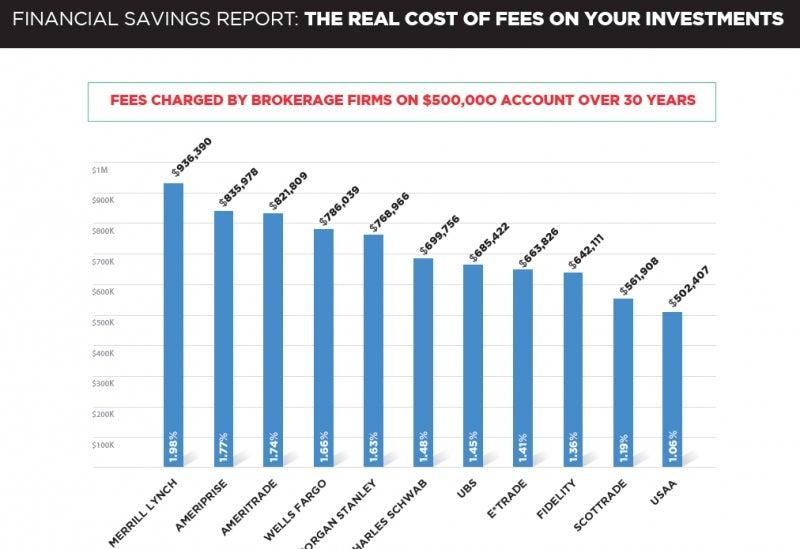

In today's complex financial environment, understanding the costs associated with financial advisory services is crucial for investors. Financial advisory fees can vary significantly depending on the advisor's fee structure and the services offered. Advisors generally charge fees in several ways, such as hourly rates, fixed fees, asset-based fees, or commission-based fees. Each structure offers distinctive features and potential implications for both the advisor and the investor, influencing how advisory services are utilized to reach financial goals.

Moreover, the rise of algorithmic trading has added another layer of complexity to this topic. Algorithmic trading, the use of algorithms to automate complex trading strategies, has significantly altered investment landscapes, including advisory fees and overall investment strategies. By enhancing efficiency and potentially reducing trading costs, algorithmic trading has reshaped how financial advisors interact with their clients and structure their service fees.

This article will explore the various financial advisory fee structures, their potential benefits and drawbacks, and how they impact investment success. Additionally, we will assess the role algorithmic trading plays in contemporary financial advisory services, offering insights into how technology influences both costs and strategies in investing. With a clear understanding of these factors, investors can more effectively navigate the financial advisory landscape and make informed decisions that align with their financial objectives.

## Table of Contents

## Understanding Financial Advisory Fee Structures

Financial advisory fee structures are an essential aspect of the financial services industry, shaping the cost and approach to financial planning and investment management. These fee structures are categorized broadly and come with their distinct attributes, allowing investors to find an arrangement that aligns with their financial needs and goals.

### Fee Structures

1. **Hourly Fees**: This fee model involves charging the client based on the actual time an advisor spends managing their financial matters. It provides transparency and allows clients to pay for only the time they need. The simplicity of tracking time spent can make this method attractive; however, it may not align with long-term client-advisor relationships focused on results.

2. **Fixed Fees**: Fixed fees denote a predetermined cost for specific services, offering predictability and control over advisory expenses. This structure can make budgeting straightforward for clients who want clarity on their financial commitments without the variability of hourly charges. Advisors may offer a fixed fee for tasks such as financial planning, retirement strategy development, or tax planning.

3. **Asset-Based Fees**: Under the asset-based fee structure, clients are charged a percentage of the total assets under management (AUM). This model can align the advisor's success with the client's financial growth, motivating advisors to enhance the value of their clients' portfolios. A typical formula for asset-based fees might be as follows:
$$
   \text{Fee} = \text{AUM} \times \left(\frac{\text{Percentage Fee Rate}}{100}\right)

$$

   For instance, if an advisor manages $1,000,000 in assets with a 1% fee rate, the annual fee would be $10,000 (i.e., $1,000,000 × 0.01).

4. **Commission-Based Fees**: This model involves earning commissions from the financial products that advisors sell to clients. It incentivizes advisors to engage in transaction activities, which can sometimes lead to conflicts of interest if advisors prioritize products that offer higher commissions over those best suited for the client.

Each fee structure differs in how it aligns with client expectations and financial goals. Understanding these structures aids investors in choosing an advisor that complements their specific financial strategy. Roman numeral outlines further enhance this classification and simplify fee structure comparisons, enabling more informed decision-making for clients.

## Pros and Cons of Different Fee Structures

Each fee structure in financial advisory services presents unique advantages and disadvantages, impacting both advisors and their clients. Understanding these nuances can guide investors toward making decisions aligned with their financial goals and preferences.

Hourly and fixed fees are two common structures that offer transparency and predictability. Hourly fees involve clients paying advisors based on the time dedicated to their financial matters. This structure provides clarity for clients who can precisely anticipate costs based on estimated service hours. Similarly, fixed fees are predetermined charges for specific services, ensuring clients know the total advisory cost upfront. However, these structures may not always align advisors' incentives with client outcomes. Advisors being paid by time or fixed rate might not be directly motivated to maximize client asset performance, potentially resulting in less proactive financial management.

Asset-based fees calculate advisory costs as a percentage of the client's assets under management (AUM). This structure inherently aligns the advisor's success with the client's portfolio performance. As the portfolio grows, so does the advisor's revenue, incentivizing advisors to work towards increasing client wealth. However, as portfolio values rise, the cumulative costs from asset-based fees can escalate, becoming a significant expense for clients. For example, a standard 1% asset-based fee on a $1 million portfolio amounts to $10,000 annually, which could rise with portfolio appreciation.

Commission-based fees reward advisors for transactions, potentially leading to conflicts of interest. Advisors might be tempted to encourage frequent trading to boost their income, potentially disengaging from the client’s best interest. This structure risks promoting behaviors that could harm portfolio performance due to excessive trading or unnecessary financial products.

Effectively evaluating these pros and cons requires investors to [factor](/wiki/factor-investing) in their financial objectives and comfort with specific cost structures. While transparency in hourly and fixed fees may appeal to those valuing consistent budgeting, asset-based fees may benefit those prioritizing aligned incentives and portfolio growth. Despite potential conflicts, commission-based fees might suit clients needing specific transactional services.

In summary, understanding each fee structure’s implications and alignment with personal financial goals is critical in selecting the most suitable financial advisory services.

## The Impact of Algorithmic Trading on Advisory Costs

Algorithmic trading, widely known as algo trading, has gained significant traction among both retail and institutional investors due to its technological efficiency. This approach automates complex trading strategies using algorithms, thereby lowering transaction costs and enhancing market efficiency. By leveraging such technology, financial advisors can potentially reduce operational costs, which may be reflected in the fees charged to clients.

The implementation of [algorithmic trading](/wiki/algorithmic-trading) allows for the execution of trades at speeds and volumes impossible for human traders, often leading to better pricing and reduced market impact. This, combined with lower transaction fees, can result in cost savings for clients. Advisors, aiming to remain competitive, might pass some of these savings on to their clients by reducing their fees, thereby providing a more attractive value proposition.

However, the integration of algorithmic trading into advisory services requires substantial investment in advanced technological infrastructure. Advisors need to acquire, maintain, and upgrade these systems regularly, which can affect their overall cost structures. These expenses might, in some cases, be transferred to clients through adjusted fee arrangements, potentially offsetting some of the cost benefits initially brought by efficiency gains.

Moreover, the use of algorithmic trading tools can significantly influence an advisor's asset management strategy. Algorithms can analyze large datasets quickly, identifying patterns and opportunities that might be imperceptible to human advisors. This can lead to more dynamic and data-driven investment strategies, potentially improving portfolio performance. However, the dependence on technology necessitates a deep understanding of both its capabilities and limitations, as well as continuous monitoring to ensure that algorithmic strategies align with clients' financial objectives.

In summary, while algorithmic trading presents opportunities for reduced advisory costs and enhanced strategic capabilities, it also introduces complexities that advisors and clients must navigate. The net impact on advisory fees is influenced by both cost savings from efficient trade execution and the expenses related to technology investments.

## Evaluating the Cost-Effectiveness of Advisory Services

When selecting a financial advisor, evaluating the cost-effectiveness of their services is crucial. The primary consideration should be the value of financial guidance relative to the fees being charged. An advisor's services must not only meet fiduciary standards but also provide tangible benefits, such as improved portfolio performance, tax optimization, or personalized financial planning. The perceived value should outweigh the costs associated with the chosen fee structure, be it hourly, fixed, asset-based, or commission-based.

To identify advisors offering the best value for money, comparing fee structures across various advisors is necessary. Hourly and fixed fees typically offer a straightforward comparison, as they provide a predictable cost framework. In contrast, asset-based fees require an analysis of potential portfolio growth to assess their future financial impact. Commission-based fees might look enticing due to potentially lower upfront costs, but they often necessitate a deeper dive into the advisor’s trading behavior and conflict of interest risks.

Another factor in evaluating cost-effectiveness is the role of algorithmic trading. As algorithmic trading continues to gain traction, it has the potential to enhance an advisor’s ability to meet clients' financial goals effectively. Financial advisors utilizing such technology may offer strategies that minimize transaction costs and optimize asset allocation. However, the advanced technology underlying algorithmic trading might also increase service costs, impacting the overall fee structure. 

When evaluating advisory services, it is essential to weigh both quantitative costs and qualitative benefits. Quantitative factors include explicit fees and predicted portfolio returns, whereas qualitative benefits encompass the advisor’s expertise, technology use, service accessibility, and personal rapport. A comprehensive evaluation requires considering total cost, service quality, and the potential for achieving financial goals. This holistic approach ensures that investors can make informed decisions that align their financial aspirations with cost-efficient advisory services.

## Conclusion

Financial advisory fees and their structures significantly influence the cost dynamics of investing. Investors must thoroughly understand these structures—hourly, fixed, asset-based, and commission-based—to make informed decisions that align with their financial objectives. Each type of fee has distinct implications, benefits, and potential drawbacks that can affect both the advisor's incentives and the client's financial outcomes.

The advent of algorithmic trading has presented new opportunities for cost reduction and efficiency in the financial advisory sector. By automating complex trading strategies, algorithmic trading can potentially lower advisory fees, thus benefiting clients. However, the implementation of such advanced technologies requires substantial investment from advisors, which could reshape fee structures. Furthermore, it impacts asset management strategies, necessitating a careful evaluation of how these tools align with an investor's financial goals.

Investors should strategically analyze both traditional advisory methods and algorithmic options to optimize their investment strategies. This involves not just comparing costs across different advisory models, but also evaluating the qualitative benefits offered. The decision-making process should aim to strike a balance between cost and value, ensuring alignment with personal financial goals. By doing so, investors can choose an advisor and fee structure that complement their investment needs and future aspirations.

## References & Further Reading

[1]: Bergstra, J., Bardenet, R., Bengio, Y., & Kégl, B. (2011). ["Algorithms for Hyper-Parameter Optimization."](https://dl.acm.org/doi/10.5555/2986459.2986743) Advances in Neural Information Processing Systems 24.

[2]: ["Advances in Financial Machine Learning"](https://www.amazon.com/Advances-Financial-Machine-Learning-Marcos/dp/1119482089) by Marcos Lopez de Prado

[3]: ["Evidence-Based Technical Analysis: Applying the Scientific Method and Statistical Inference to Trading Signals"](https://www.amazon.com/Evidence-Based-Technical-Analysis-Scientific-Statistical/dp/0470008741) by David Aronson

[4]: ["Machine Learning for Algorithmic Trading"](https://github.com/PacktPublishing/Machine-Learning-for-Algorithmic-Trading-Second-Edition) by Stefan Jansen

[5]: ["Quantitative Trading: How to Build Your Own Algorithmic Trading Business"](https://www.amazon.com/Quantitative-Trading-Build-Algorithmic-Business/dp/1119800064) by Ernest P. Chan