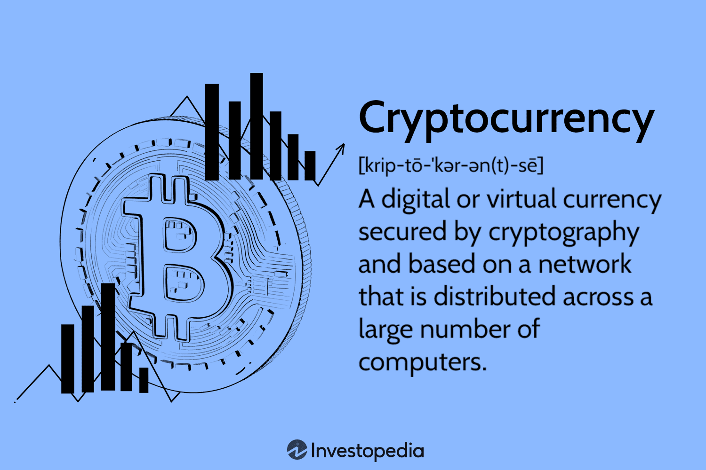

The financial landscape has evolved significantly over the past decade, marking a substantial shift from traditional finance mechanisms to more innovative and decentralized systems. One of the most transformative elements in this evolution is the rise of cryptocurrency, a form of digital or virtual currency that leverages cryptographic principles to secure transactions and control the creation of new units. Since the introduction of Bitcoin in 2009, cryptocurrencies have proliferated, with thousands of variants emerging, each with unique features and applications.

Cryptocurrencies are reshaping traditional finance by challenging conventional banking and payment systems. They offer the possibility of reduced transaction costs, enhanced security, and increased access to financial services, especially for the unbanked population. Meanwhile, central banks and financial institutions are navigating the implications of digital currencies, investigating central bank digital currencies (CBDCs), and integrating blockchain technology into their operations to remain competitive.

As cryptocurrencies gain traction, the role of financial advisors has expanded to encompass guidance in the digital currency space. Financial advisors are now tasked with helping clients understand this novel asset class, its associated risks, and its potential benefits. They also navigate regulatory challenges and ensure compliance with evolving laws surrounding digital assets. Advisors play an important role in integrating cryptocurrency into traditional investment portfolios, balancing the novel risks with established financial strategies.

One key development in cryptocurrency markets is the growing popularity of algorithmic trading. Algorithmic trading involves using computer programs to execute defined trading strategies at speeds and frequencies beyond the capability of human traders. In the context of cryptocurrency, algorithmic trading allows for rapid responses to market changes, capitalizing on the digital market's volatility and liquidity. This trend is reshaping how trades are executed and influencing market dynamics significantly.

The purpose of this article is to explore the roles and strategies of financial advisors in the ever-evolving cryptocurrency landscape and to examine how they can leverage algorithmic trading to enhance their services. The scope includes understanding the complex regulatory environment, effective client communication, integration of cryptocurrencies and algorithmic trading into advisory services, and future trends and challenges that advisors may face. As digital finance continues to evolve, adapting to these changes will be crucial for financial advisors aiming to provide comprehensive, forward-thinking services in a highly competitive market.

## Table of Contents

## The Role of Financial Advisors in the Cryptocurrency Revolution

The evolving landscape of finance is being significantly reshaped by the rise of cryptocurrency, presenting both opportunities and challenges for investors and financial advisors alike. As digital currencies become more mainstream, financial advisors play a crucial role in guiding clients through the complexities of cryptocurrency investments.

### Assisting Clients with Cryptocurrency Investments

Financial advisors can assist clients in navigating the volatile [cryptocurrency](/wiki/cryptocurrency) market by offering expertise in investment strategies and market analysis. They can help clients identify suitable cryptocurrencies for investment based on individual risk tolerance and financial goals. Advisors can employ a variety of tools and platforms to monitor market trends and execute transactions, providing clients with real-time data insights.

### Regulatory Challenges and Compliance in Digital Assets

The regulatory environment surrounding cryptocurrencies is continually evolving, with governments worldwide striving to develop frameworks to regulate digital assets. Financial advisors must stay informed about the latest regulatory developments to ensure compliance and protect clients' interests. They should understand the implications of regulations such as anti-money laundering (AML) and know-your-customer (KYC) requirements, guiding clients on how to remain compliant while investing in cryptocurrencies.

### Educating Clients on Risks and Benefits of Cryptocurrency

Advisors have a responsibility to educate their clients about the unique risks associated with cryptocurrency investments, including high [volatility](/wiki/volatility-trading-strategies), cybersecurity threats, and potential regulatory changes. Conversely, they should also highlight the benefits, such as portfolio diversification, potential high returns, and the innovative nature of blockchain technology. Providing clients with balanced information allows them to make informed decisions aligned with their investment objectives.

### Integrating Crypto into Traditional Investment Portfolios

One of the strategies for financial advisors is to integrate cryptocurrencies into clients' traditional investment portfolios. This involves assessing the client's overall portfolio diversification needs and risk appetite. Advisors can suggest a strategic allocation of a small percentage of the portfolio to cryptocurrencies, potentially enhancing returns while spreading risk. Modern portfolio theory can assist in determining the optimal allocation to balance risk and return, considering the unique characteristics of digital assets.

### Successful Crypto Advisory Engagements

Numerous case studies highlight the success of financial advisors integrating cryptocurrencies into client portfolios. For example, some advisors have helped clients achieve substantial returns by investing in established cryptocurrencies like Bitcoin and Ethereum during market surges while managing risk through diversification. Others have successfully advised clients on initial coin offerings (ICOs), ensuring comprehensive due diligence to identify legitimate projects with strong potential.

In conclusion, financial advisors have a pivotal role in the cryptocurrency revolution, offering clients invaluable guidance through the intricate landscape of digital assets. By understanding regulations, educating clients on risks and benefits, and effectively integrating cryptocurrencies into portfolios, advisors can aid clients in navigating this dynamic segment of the financial market.

## Effective Communication Strategies for Financial Advisors

Financial advisors are crucial in guiding clients through the complexities of cryptocurrency investments. Given the intricate nature of digital assets, effective communication is paramount. This section outlines strategies that financial advisors can employ to elucidate complex crypto concepts to clients, harness technology and social media for broader reach, build trust through transparency, tailor engagement strategies for diverse demographics, and avoid common communication pitfalls.

### Tips for Explaining Complex Crypto Concepts to Clients

Cryptocurrency features unique terminologies and principles, such as blockchain, cryptographic hashing, and decentralized finance. Financial advisors need to simplify these concepts without distorting their essence. One effective approach is to use analogies. For example, likening blockchain to a digital ledger that records transactions can help clients better understand its function. Visual aids, like diagrams and flowcharts, are also helpful in illustrating how blockchain works or how crypto transactions are validated.

### Using Technology and Social Media to Reach a Wider Audience

Technology and social media can significantly extend the reach of financial advisors. Advisors can create educational content such as blogs, podcasts, and webinars to explain crypto concepts and investment strategies. Social media platforms like LinkedIn, Twitter, and YouTube provide additional channels for disseminating this content and engaging with a broader audience. By using these tools, advisors can position themselves as knowledgeable and accessible experts in the cryptocurrency field.

### Building Trust Through Transparency and Comprehensive Reporting

Trust is essential in any advisory relationship, particularly in the volatile world of cryptocurrencies. Financial advisors should emphasize transparency by clearly outlining investment processes, risks, and fees associated with crypto assets. Comprehensive reporting is also vital, providing clients with regular updates on their portfolio performance and market trends. By maintaining open lines of communication and delivering honest assessments, advisors can build lasting trust with their clients.

### Engagement Strategies for Different Client Demographics

Different client demographics may have varying levels of understanding and interest in cryptocurrencies. Tailoring engagement strategies to suit these differences is essential for effective communication. For instance, younger clients who are digital natives might appreciate interactive, tech-driven presentations, whereas older clients might prefer more traditional face-to-face meetings with ample time for questions. Additionally, cultural nuances should be considered to ensure that communication is respectful and relevant across diverse audiences.

### Common Pitfalls to Avoid in Crypto Communication

Several pitfalls can undermine effective communication about cryptocurrencies. One common mistake is using jargon without adequate explanation, which can confuse and alienate clients. Overpromising potential returns while downplaying risks can lead to distrust and potentially severe consequences for both clients and advisors. Lastly, failure to adapt communication styles to individual client needs can result in disengagement or misunderstanding. Advisors should strive to provide balanced, clear, and tailored information to each client.

By employing these strategies, financial advisors can navigate the challenges of communicating about cryptocurrencies, ultimately empowering their clients to make informed investment decisions.

## Algorithmic Trading in Cryptocurrency: An Overview

Algorithmic trading, often referred to as algo trading, involves the use of computer algorithms to automate the process of trading financial instruments. These algorithms make decisions based on predefined criteria, executing orders at speeds and frequencies that are impossible for human traders to achieve. The history of [algorithmic trading](/wiki/algorithmic-trading) dates back to the early 1970s with the introduction of electronic trading platforms and has since evolved with advancements in computer technology and data analytics.

In the cryptocurrency markets, algorithmic trading has gained prominence due to its ability to process vast amounts of data in real-time and execute trades with precision. Unlike traditional assets, cryptocurrencies trade 24/7 on a global scale, making them ideal candidates for automated trading systems. Algo trading in this context enhances market efficiency by providing [liquidity](/wiki/liquidity-risk-premium) and reducing the bid-ask spread.

Several strategies are popular in cryptocurrency algo trading. These include:

1. **Market Making**: This strategy involves placing both buy and sell orders to capture the spread between them. The algorithm continuously adjusts these orders based on market movements to maintain liquidity.

2. **Arbitrage**: Exploiting price differences of the same asset across different exchanges is a common strategy. For example, if Bitcoin is priced differently on two platforms, the algorithm will buy low on one and sell high on the other.

3. **Trend Following**: This strategy uses technical indicators to identify and capitalize on asset price momentum. It was historically popularized by traders like Richard Dennis and utilizes moving averages or the Relative Strength Index (RSI).

4. **Mean Reversion**: Assuming that prices will eventually return to their historical averages, this strategy buys when the price is low and sells when high.

AI and [machine learning](/wiki/machine-learning) are crucial in developing sophisticated trading algorithms. Machine learning models are trained on historical data to predict future price movements, improve pattern recognition, and optimize trade execution strategies. Techniques such as [deep learning](/wiki/deep-learning) can analyze complex datasets and identify non-linear relationships within market data.

Despite their advantages, algorithmic trading systems in cryptocurrency markets face several risks and regulatory considerations. Market volatility and sudden shifts can lead to significant losses if algorithms are not properly calibrated. Additionally, the opaque nature of some crypto exchanges can introduce execution risks. Regulatory bodies across the globe are also scrutinizing the use of algorithmic trading in crypto markets to ensure fairness and prevent market manipulation.

In summary, algorithmic trading plays a transformative role in the cryptocurrency space by delivering speed, efficiency, and potential profitability. It continues to evolve with advancements in AI and machine learning, offering innovative strategies for traders, while also posing unique challenges and regulatory considerations.

## Integrating Algorithmic Trading into Financial Advisory Services

Algorithmic trading has become a cornerstone of modern financial markets, offering a range of advantages for financial advisors looking to enhance client portfolios. By leveraging computer algorithms to automate trading decisions, advisors can provide more efficient and data-driven investment strategies. One of the primary benefits of algorithmic trading is its capacity for high-frequency trading, which can execute orders at speeds and volumes that humans cannot match, potentially increasing returns by capturing small price discrepancies. Additionally, the algorithms' ability to operate continuously allows for the exploitation of trading opportunities around the clock, particularly beneficial in cryptocurrency markets that never close.

Implementing algorithmic strategies requires a robust technical infrastructure and a specific skill set. Financial advisors must access advanced computing resources capable of processing large amounts of data swiftly. Programming skills, especially in languages such as Python, are essential for developing and maintaining trading algorithms. Expertise in data analysis, [statistics](/wiki/bayesian-statistics), and machine learning further enhances the capability to create sophisticated models that can predict market movements with reasonable accuracy.

When evaluating and selecting algorithmic trading tools, advisors should consider several key factors. First, the tool's historical performance and reliability must be scrutinized to ensure it can deliver consistent returns. Transparency in the tool’s algorithmic process is crucial to understand its decision-making framework and risk management mechanisms. Customizability is also important, allowing the advisor to tailor the algorithm to specific client needs or market conditions. Finally, the tool should offer robust security measures to protect sensitive financial data.

Success stories of financial advisors embracing algorithmic trading are increasingly emerging, with many reporting enhanced portfolio performance and client satisfaction. For example, an advisory firm that integrated a custom high-frequency trading algorithm reportedly saw a marked improvement in return rates and a significant reduction in manual intervention errors. These success stories indicate the potential for algorithmic trading to provide a competitive edge in wealth management.

However, balancing robo-advisors with human advisory services is crucial in maintaining a comprehensive client approach. While algorithms can optimize trading efficiency and execution, human advisors play a vital role in understanding the nuanced aspects of client needs, such as risk tolerance and long-term financial goals. Combining the precision of algorithmic strategies with the personalized touch of human advisors can offer a holistic service that caters to both market efficiency and individualized client care. A hybrid model may be the most effective approach, ensuring that the mechanized data-driven processes of algorithms do not overshadow the relationship and trust-building capabilities inherent in human interaction. 

In summary, integrating algorithmic trading into financial advisory services can significantly enhance the ability to meet client investment goals. However, it requires careful consideration and balancing of technological resources, advisor expertise, and the intrinsic value of human insight.

## Future Trends and Challenges for Financial Advisors in Crypto and Algo Trading

Cryptocurrency and algorithmic trading are poised to become integral aspects of the financial advisory landscape. As these technologies continue to mature, financial advisors will have to navigate a rapidly evolving environment, characterized by both opportunities and challenges.

### Predictions for the Future of Cryptocurrency and Financial Advising

The trajectory of cryptocurrency suggests a future where it plays a significant role in diversified portfolios. Analysts predict the mainstream acceptance of digital currencies as an asset class, necessitating financial advisors to develop expertise in cryptocurrency markets. According to a report by Deloitte, blockchain technologies are likely to drive transparency and efficiency in financial transactions, potentially transforming traditional financial systems.

### Emerging Technologies Shaping the Future of Crypto Advisory

Several cutting-edge technologies are poised to redefine the services offered by financial advisors. The integration of Artificial Intelligence (AI) and Machine Learning (ML) is expected to bolster predictive analytics, enabling advisors to offer more personalized investment strategies. Blockchain technology will continue to enhance security measures, offering clients increased trust in digital transactions. Additionally, advanced data analytics will empower advisors to make data-driven decisions, improving the accuracy and reliability of their financial advice.

### Potential Challenges and Regulatory Hurdles on the Horizon

With innovation comes regulatory scrutiny. Financial advisors will need to stay abreast of evolving regulations concerning digital assets. The lack of a unified global regulatory framework poses a challenge, as advisors must navigate varying laws across jurisdictions. Additionally, the volatility of cryptocurrency markets remains a risk [factor](/wiki/factor-investing) that advisors must effectively manage.

### Opportunities for Innovation and Differentiation in Advisory Services

The integration of technology into advisory services presents myriad opportunities for differentiation. Financial advisors can distinguish themselves by offering unique value propositions, such as tailored algorithmic trading solutions and crypto-inclusive portfolio management. Advisors who can combine human expertise with technological prowess are likely to set themselves apart in a competitive market.

### Final Thoughts on Securing a Competitive Edge in a Digital Finance World

To maintain a competitive edge, financial advisors must pursue a dual strategy of continuous education and technology adoption. Staying informed about emerging trends and regulatory changes is crucial. Advisors should also embrace digital tools that enhance service efficiency and client engagement. By adapting to technological advancements and regulatory frameworks, financial advisors can not only survive but thrive in an increasingly digital financial ecosystem. 

In conclusion, the convergence of cryptocurrency and algorithmic trading with financial advisory services offers both excitement and complexity. Those who can navigate the challenges and capitalize on technological advancements will lead the financial advising industry into a new era.

## Conclusion

The rapid transformation of the financial landscape, driven by the rise of cryptocurrencies and algorithmic trading, highlights the critical role financial advisors play in guiding clients through these new avenues of investment. Throughout this article, we explored how advisors can navigate regulatory challenges, educate clients on risks and benefits, and integrate digital assets into traditional portfolios. Effective communication and leveraging technology are essential for building trust and expanding client reach.

As the financial world continues to evolve, continuous learning and adaptation become not just beneficial but necessary for financial advisors. Embracing the digital revolution entails staying abreast of regulatory changes, technological advancements, and emerging market strategies. Advisors who invest in their knowledge and skill enhancement are better equipped to offer nuanced insights and innovative solutions that meet the needs of modern investors.

Staying informed in such a rapidly changing market ensures advisors remain competitive and effective. This requires vigilance and ongoing education to preempt challenges and seize opportunities as they arise. By embracing these changes and committing to learning, financial advisors position themselves and their clients for success amidst the volatility and promise of digital finance.

In conclusion, the necessity for financial advisors to embrace the digital revolution cannot be understated. Emphasizing continuous education and adaptation ensures they remain indispensable resources for clients seeking to navigate the complexities of crypto and algorithmic trading. A proactive approach to these transformative trends secures their role in providing relevant, informed, and strategic advisory services.

## References & Further Reading

[1]: Nakamoto, S. (2008). ["Bitcoin: A Peer-to-Peer Electronic Cash System."](https://nakamotoinstitute.org/library/bitcoin/)

[2]: Gandal, N., Hamrick, J. T., Moore, T., & Oberman, T. (2018). ["Price manipulation in the Bitcoin ecosystem."](https://www.sciencedirect.com/science/article/pii/S0304393217301666) Journal of Monetary Economics, 95, 86-96.

[3]: Popper, N. (2015). ["Digital Gold: Bitcoin and the Inside Story of the Misfits and Millionaires Trying to Reinvent Money."](https://www.amazon.com/Digital-Gold-Bitcoin-Millionaires-Reinvent/dp/006236250X) HarperCollins.

[4]: Lopez de Prado, M. (2018). ["Advances in Financial Machine Learning."](https://www.amazon.com/Advances-Financial-Machine-Learning-Marcos/dp/1119482089) Wiley.

[5]: Hlawatsch, S., & Mehta, A. (2019). ["Data-Driven Market Making: An Artificial Intelligence Approach."](https://www.sciencedirect.com/science/article/pii/S004016252031218X) Springer Series in Finance.

[6]: Yermack, D. (2017). ["Corporate Governance and Blockchains."](https://academic.oup.com/rof/article/21/1/7/2888422) Review of Finance Studies, 30(2), 1038-1064.

[7]: Jansen, S. (2020). ["Machine Learning for Algorithmic Trading: Predictive models to extract signals from market and alternative data for systematic trading strategies with Python, 2nd Edition."](https://www.amazon.com/Machine-Learning-Algorithmic-Trading-alternative/dp/1839217715) Packt.