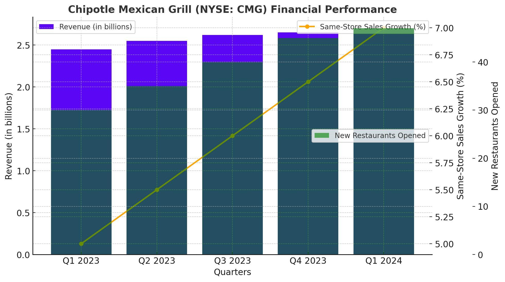

Chipotle Mexican Grill, Inc. (CMG) stands as a quintessential example of success within the fast-casual dining sector. Renowned for its commitment to using fresh, high-quality ingredients and its focus on delivering a simple yet customizable menu, Chipotle has set itself apart from traditional quick-service restaurant chains. Since its inception in 1993, the company has grown exponentially, capitalizing on the demand for convenient yet healthy meals. As of recent years, Chipotle's financial success is evidenced by its robust revenue growth, strong brand loyalty, and strategic expansion plans, cementing its status as a leader in the industry.

Financial analysis holds paramount importance in understanding a company's performance and potential. By dissecting financial statements, ratios, and other key metrics, investors and analysts can assess an organization's profitability, stability, and growth prospects. This process becomes even more sophisticated when merged with algorithmic trading (algo trading), which has gained prominence in modern financial markets. Algo trading employs mathematical models and software to execute trades at speeds and frequencies that surpass human capabilities, leveraging historical and real-time data to make informed decisions.



The primary objective of this article is to explore the financial health and performance of Chipotle Mexican Grill, Inc., offering insights into the factors that drive its success. Furthermore, it aims to investigate how algorithmic trading strategies can be tailored and applied to CMG stock. Understanding the interplay between Chipotle's financials and algo trading opens up avenues for traders and investors to potentially enhance their trading strategies by integrating traditional financial analysis with cutting-edge technology. This synthesis of knowledge promises to shed light on the potential applications and implications of algo trading within the context of CMG, revealing opportunities for innovation and growth in the fast-evolving landscape of financial markets.

## Table of Contents

## Understanding Chipotle's Financial Health

Chipotle Mexican Grill has established itself as a prominent player in the fast-casual restaurant industry, characterized by consistent revenue growth and a robust financial profile. Over recent years, Chipotle's revenue trajectory has demonstrated a positive trend, driven by strategic initiatives and a strong brand presence. The company's financial statements reveal significant growth in top-line figures, indicating successful market penetration and consumer appeal.

### Revenue Growth and Profitability

Chipotle's financial reports indicate an upward trajectory in revenue, with a compounding annual growth rate (CAGR) that reflects its successful expansion and growing customer base. Notably, Chipotle adapted to changing consumer preferences towards healthier, fast-casual dining options without compromising convenience or taste.

Profitability is another key indicator of Chipotle's financial health. The company has maintained substantial net income margins, showcasing its ability to convert revenues into actual profit effectively. Efficient cost management and pricing strategies have contributed to sustaining these profit margins.

### Key Financial Ratios

Several financial ratios offer insights into Chipotle's performance metrics:

- **Profit Margin:** Reflecting operational efficiency, Chipotle's profit margin has remained competitive within the industry. This ratio highlights the percentage of revenue that exceeds the company's costs of goods sold and operating expenses.

- **Return on Equity (ROE):** This ratio measures the company's ability to generate profits from shareholders' equity. Chipotle's ROE indicates effective management in utilizing equity to fuel growth and profitability.

- **Debt Structure:** Chipotle maintains a balanced capital structure with prudent use of debt financing. The debt-to-equity ratio reflects Chipotle's strategic approach to leveraging debt while managing financial risk prudently.

### Influencing Factors

Several external and internal factors have shaped Chipotle's financial landscape:

- **Market Trends:** The trend towards healthier eating has driven Chipotle's popularity. Market trends emphasizing sustainable, organic, and non-GMO ingredients aligned well with Chipotle's offerings, capitalizing on consumer preferences.

- **Consumer Behavior:** Consumer demand for transparency and ethical sourcing in food products has bolstered Chipotle's market position. Adaptability to customer feedback and evolving preferences has been crucial to Chipotle's continued success.

- **Operational Efficiency:** Chipotle's emphasis on streamlined operations, from supply chain management to in-store processes, has enhanced efficiency. Digital transformation, particularly in online ordering and delivery, has further optimized operations and improved customer experience.

In conclusion, Chipotle's financial health is underpinned by strong revenue growth, strategic financial management, and alignment with market and consumer dynamics. These factors collectively underline the company's resilience and ability to capitalize on industry trends, securing its position as a leading entity in the fast-casual dining sector.

## The Role of Algo Trading in Financial Markets

Algorithmic trading, often referred to as algo trading, embodies the use of computer programs and algorithms to execute financial transactions at speeds and frequencies that are beyond the capabilities of human traders. This method of trading is significant in today's financial markets due to its ability to leverage computational efficiency and data processing prowess.

At its core, [algorithmic trading](/wiki/algorithmic-trading) entails automating the decision-making process, relying on mathematical models and complex algorithms. This can involve parsing through large datasets to make predictions about future stock price movements or executing trades based on pre-defined criteria without direct human intervention. Algo trading has risen to prominence as stock exchanges have increasingly moved to electronic and high-speed trading, allowing institutional investors, hedge funds, and even individual traders to optimize their trading strategies and performance.

### Types of Algorithmic Trading Strategies

There are several principal strategies employed in algorithmic trading:

1. **Trend Following**: This strategy involves developing algorithms that identify and follow market trends. By analyzing historical price patterns, the algorithm aims to predict whether a security will move up or down and execute buy or sell orders accordingly. This strategy does not require predictive forecasting and is based simply on the belief that securities that have performed well will continue to do so.

2. **Mean Reversion**: This strategy is grounded in the hypothesis that asset prices tend to revert to their historical means or averages. An algo developed for mean reversion will identify when a stock's price has diverged significantly from its historical average and predict that it will revert back, making trades to capture this expected movement.

3. **Arbitrage**: This approach involves exploiting price differentials of the same asset in different markets or formats. For example, if a stock is trading lower on one exchange than another, an algorithm can buy the stock at the lower price and sell it at the higher one, pocketing the difference. Arbitrage strategies require high-speed execution to capitalize on these often fleeting opportunities.

### Advantages of Algorithmic Trading

The advantages of algorithmic trading are manifold, making it a preferred choice for many market participants:

- **Speed**: Algorithms can process and execute trades much faster than human traders. Speed is critical in executing strategies like arbitrage where prices can align in milliseconds.

- **Accuracy**: By using pre-set guidelines, algorithms can execute trades with high precision, reducing the likelihood of human error.

- **Processing Large Datasets**: Algorithms can sift through vast amounts of market data much more quickly and efficiently than a human, identifying patterns or trends that may not be visible to the naked eye.

- **Reduced Emotional Stress**: Automated trading minimizes the impact of human emotions, such as fear or greed, which can often adversely affect trading decisions.

Algorithmic trading continues to evolve, benefiting from advancements in technology and data science. It enhances market [liquidity](/wiki/liquidity-risk-premium) and can lead to more efficient market pricing, though it also raises concerns about market stability and fairness, which regulators are continually addressing. By understanding and implementing these sophisticated trading strategies, market participants can potentially achieve better returns and improved risk management.

## Leveraging Algo Trading for CMG Stock

Identifying trading signals and patterns specific to Chipotle's (CMG) stock requires a thorough analysis of historical price data and the factors that influence market movements. Chipotle's stock, like many equity securities, demonstrates specific patterns and signals that can be utilized for algorithmic trading.

### Trading Signals and Patterns

One common method of identifying trading signals is through technical analysis, which involves studying price charts and indicators like moving averages, Relative Strength Index (RSI), and Bollinger Bands. For CMG, price patterns such as support and resistance levels, trend lines, and candlestick patterns can be analyzed to predict potential price movements. Additionally, [machine learning](/wiki/machine-learning) algorithms can be employed to detect complex patterns that are not easily identifiable through traditional methods. 

### Backtesting Algorithmic Strategies

Backtesting involves applying an algorithmic trading strategy to historical CMG data to evaluate its effectiveness. This process helps in estimating the past performance of a strategy and its robustness. The general steps in [backtesting](/wiki/backtesting) include:

1. **Data Collection**: Historical price data for CMG is collected, including daily open, high, low, close prices, and volume.

2. **Strategy Definition**: Define the specific rules for entry and exit, such as buying when the 50-day moving average crosses above the 200-day moving average, also known as a golden cross.

3. **Simulation**: Apply the strategy to historical data to simulate trades and calculate performance metrics such as return, Sharpe ratio, and maximum drawdown.

4. **Analysis**: Evaluate the results to determine the strategy’s effectiveness. Key metrics should be compared against benchmarks like the S&P 500 or a relevant sector ETF.

Here is an example of a simple backtesting framework using Python and the `pandas` library:

```python
import pandas as pd
import numpy as np

# Load historical data for CMG
data = pd.read_csv('CMG_historical_data.csv')
data['50_MA'] = data['Close'].rolling(window=50).mean()
data['200_MA'] = data['Close'].rolling(window=200).mean()

# Implement trading strategy
data['Signal'] = np.where(data['50_MA'] > data['200_MA'], 1, 0)
data['Position'] = data['Signal'].diff()

# Calculate returns
data['Daily_Return'] = data['Close'].pct_change()
data['Strategy_Return'] = data['Daily_Return'] * data['Position'].shift(1)

# Calculate performance metrics
total_return = data['Strategy_Return'].sum()
annual_return = total_return / len(data) * 252  # Assuming 252 trading days
sharpe_ratio = data['Strategy_Return'].mean() / data['Strategy_Return'].std() * np.sqrt(252)

print(f"Annual Return: {annual_return:.2%}")
print(f"Sharpe Ratio: {sharpe_ratio:.2f}")
```

### Challenges and Considerations

Algo trading in stocks like CMG encounters several challenges:

- **Liquidity**: CMG may have lower trading volume compared to large-cap stocks like Apple or Amazon, which can impact the ability to enter and exit positions swiftly without affecting market price significantly. Traders must ensure that their algorithms are designed to accommodate potential liquidity constraints.

- **Volatility**: As a player in the consumer discretionary sector, CMG's stock price may exhibit significant volatility due to changes in consumer preferences, earnings announcements, or macroeconomic factors. High volatility can lead to both opportunities and risks for algorithmic strategies.

- **Data Quality and Latency**: Accurate and timely data is crucial for algorithmic trading. Any error or delay in data can lead to incorrect trading signals, resulting in potential losses.

In applying algorithmic trading strategies to CMG, traders must consider these factors and rigorously test their models under various market conditions to ensure effectiveness and resilience.

## Case Studies and Practical Applications

Algorithmic trading (algo trading) has gained traction among traders and investors for efficiently managing stocks like Chipotle Mexican Grill (CMG). This segment focuses on practical applications of algo trading applied to CMG, highlighting successful strategies, lessons learned, and the integration of these strategies with traditional analysis.

One notable example of algo trading applied to CMG involves the use of trend-following models. Trend-following is a strategy where trading decisions are made based on the [momentum](/wiki/momentum) of a stock's price. For instance, traders might use moving averages to identify buy and sell signals. A common approach is the use of the Moving Average Crossover strategy, where a shorter-term moving average crosses above a longer-term moving average, signaling a buy, and vice versa for a sell. Python can be employed to backtest this strategy using historical CMG data:

```python
import pandas as pd
import numpy as np

# Sample data loading (assuming 'historical_data.csv' contains CMG stock prices)
data = pd.read_csv('historical_data.csv')
data['Short_MA'] = data['Close'].rolling(window=20).mean()
data['Long_MA'] = data['Close'].rolling(window=50).mean()

# Generating buy/sell signals
data['Signal'] = np.where(data['Short_MA'] > data['Long_MA'], 1, 0)
data['Position'] = data['Signal'].diff()  # 1 indicates a buy, -1 a sell
```

Trend-following strategies capitalize on prolonged trends in CMG's stock price, but they require careful consideration of timing and execution. The primary lesson learned is the importance of tuning the parameters, like the periods for moving averages, to align with market conditions. This strategy is beneficial in trending markets but may result in whipsaws during sideways markets, where frequent trades occur without significant price movement, leading to potential losses.

Risk management becomes pivotal, particularly when handling stocks with [volatility](/wiki/volatility-trading-strategies) like CMG. The use of stop-loss orders can mitigate potential downsides. Algorithmic setups frequently incorporate volatility-based stop orders, such as the Average True Range (ATR), to dynamically adjust stop losses and protect profits.

Another key insight is the integration of algo trading with traditional analysis. While algorithms provide precision and the capacity to process vast datasets, incorporating traditional analysis like [fundamental analysis](/wiki/fundamental-analysis) adds depth. For example, a trader might use algo trading for execution efficiency but rely on CMG's financial health indicators for decision-making. Augmenting technical insights with Chipotle’s quarterly earnings can enhance the strategic vantage point, providing a comprehensive approach.

Practical applications underline the necessity of continuous system evaluation, especially for timing and execution. High-frequency trading systems might benefit from the speed and accuracy that algo trading imparts, but robust infrastructure and backtesting are crucial to ensure reliability and profitability.

In summary, successful algo trading with CMG involves leveraging efficient strategies like trend-following while emphasizing risk management and incorporating holistic analysis. Traders can enhance performance by pairing algorithmic techniques with traditional financial insights, thus forging a robust framework for trading CMG stock.

## Potential Risks and Ethical Considerations

Algorithmic trading, a critical component of modern financial markets, has revolutionized how trades are executed by utilizing computer algorithms to automate decision-making processes. Despite its advantages, it also introduces significant risks, particularly those associated with market manipulation and flash crashes. 

Algorithmic trading may lead to market manipulation through strategies like spoofing, where false intentions to trade are displayed to influence the market price. This tactic can create artificial volatility, as other traders react to the perceived demand or supply. For instance, an algorithm might place a large number of buy or sell orders with no intention of executing them, only to cancel them once markets react and prices move in the desired direction.

Flash crashes, another risk associated with algorithmic trading, occur due to sudden, extreme price movements within a short period. These are often exacerbated by high-frequency trading algorithms acting on faulty signals or unforeseen market conditions. A notable example is the Flash Crash of May 6, 2010, when the Dow Jones Industrial Average plunged about 1,000 points and recovered within minutes, partly due to algorithmic trading strategies reacting to unusual market conditions.

Regulatory bodies have been increasingly focused on addressing these risks posed by algorithmic trading. Compliance requirements include comprehensive risk management protocols, testing of algorithms under various scenarios, and maintaining audit trails. The U.S. Securities and Exchange Commission (SEC) and the European Securities and Markets Authority (ESMA), among others, have developed guidelines to ensure transparency and integrity in algorithmic trading practices. These include stringent pre-trade risk controls, such as circuit breakers and kill switches, to prevent runaway algorithms from executing unchecked trades.

Ethical considerations also play a crucial role in algorithmic trading, particularly concerning fairness and transparency. Algorithms, if not carefully designed and monitored, can perpetuate biases or operate in ways that are advantageous to select market participants at the expense of others. The use of [artificial intelligence](/wiki/ai-artificial-intelligence) and machine learning further complicates this landscape, as these systems can evolve in unpredictable ways, potentially reinforcing unethical trading practices.

Developers and users of trading algorithms must consider the broader impact of their technology on market dynamics. Ensuring transparency in automated trading decisions involves clear documentation of algorithmic strategies and decision-making criteria. Moreover, continuous monitoring and evaluation of trading outcomes are crucial to maintaining ethical standards.

In summary, while algorithmic trading offers significant efficiencies, the associated risks of market manipulation and flash crashes necessitate robust regulatory oversight and ethical scrutiny. Balancing the technological advantages of algorithmic trading with fair and transparent market practices remains an ongoing challenge for the financial industry.

## Conclusion and Future Outlook

Chipotle Mexican Grill (CMG) stands as a notable entity in the fast-casual dining sector, demonstrating impressive financial performance through consistent revenue growth and robust profitability metrics over recent years. The company's ability to maintain healthy profit margins and a strong return on equity, while managing its debt structure effectively, reflects a sound financial standing. Contributing factors to this success include favorable market trends, evolving consumer behaviors that favor healthier dining options, and operational efficiencies across its numerous locations.

Algorithmic trading (algo trading) has become an integral part of modern financial markets, transforming how traders and investors engage with stocks, including CMG. This approach involves using pre-programmed instructions or algorithms to execute trades, which offers advantages like enhanced speed, precision, and the ability to handle vast datasets. Moreover, various algo trading strategies, such as [trend following](/wiki/trend-following) and mean reversion, provide traders with opportunities to exploit price patterns and efficiently manage their portfolios.

Looking ahead, the landscape of algorithmic trading is expected to witness significant advancements driven by technological innovations and increased computational power. For stocks like CMG, these advancements could lead to even more sophisticated trading signals and predictive models that enhance the trading decision-making process. As machine learning and artificial intelligence continue to evolve, algorithms will likely become more adept at processing and interpreting the subtle and complex signals present in market data.

Moreover, merging traditional financial analysis with technology-driven trading strategies promises substantial growth and innovation potential. By employing automated solutions alongside human expertise, traders can achieve a balanced and informed approach to market participation. This merger could lead to the development of comprehensive trading systems that not only execute trades with precision but also adapt to changing market conditions in real-time.

In conclusion, the interplay between Chipotle's solid financial performance and the role of algorithmic trading presents a dynamic opportunity for traders and investors. As algo trading continues to integrate advanced technologies, it holds the promise of altering market dynamics and providing superior trading experiences. With the continued emphasis on data-driven strategies, the future of trading in stocks like CMG appears poised for exciting growth and innovation, ultimately contributing to a more efficient and transparent financial market landscape.

## References & Further Reading

[1]: Bergstra, J., Bardenet, R., Bengio, Y., & Kégl, B. (2011). ["Algorithms for Hyper-Parameter Optimization."](https://papers.nips.cc/paper/4443-algorithms-for-hyper-parameter-optimization) Advances in Neural Information Processing Systems 24.

[2]: ["Advances in Financial Machine Learning"](https://www.amazon.com/Advances-Financial-Machine-Learning-Marcos/dp/1119482089) by Marcos Lopez de Prado

[3]: ["Evidence-Based Technical Analysis: Applying the Scientific Method and Statistical Inference to Trading Signals"](https://www.amazon.com/Evidence-Based-Technical-Analysis-Scientific-Statistical/dp/0470008741) by David Aronson

[4]: ["Machine Learning for Algorithmic Trading"](https://github.com/stefan-jansen/machine-learning-for-trading) by Stefan Jansen

[5]: ["Quantitative Trading: How to Build Your Own Algorithmic Trading Business"](https://www.amazon.com/Quantitative-Trading-Build-Algorithmic-Business/dp/1119800064) by Ernest P. Chan