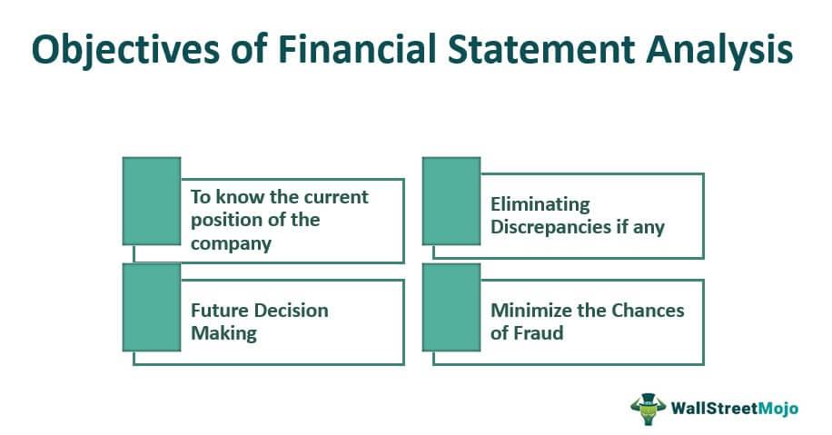

Understanding financial analysis is crucial for evaluating the financial health and performance of an entity. It serves as an essential practice in both personal and professional contexts, providing insights into how efficiently a company or an investment is operating, and predicting its future successes or challenges. Financial analysis essentially involves the assessment of a given entity's financial statements, employing various methodologies to interpret data that conveys the fiscal stability, profitability, and growth potential of the organization.

This article explores the importance of financial analysis, its various types, and its application in algorithmic trading. Financial analysis can be divided broadly into two categories: fundamental analysis, which evaluates the intrinsic value of an entity by examining its financial statements, economic indicators, and qualitative factors; and technical analysis, which focuses on statistical analysis of market activity, including price and volume. Each method presents unique insights, and investors often blend them to form comprehensive investment strategies.



Algorithmic trading, a sophisticated and automated method utilized in financial markets, heavily relies on financial analysis to make informed trading decisions. By integrating data-driven insights from both fundamental and technical analyses, algorithmic systems can identify patterns and execute trades with minimal human intervention. This synthesis not only enhances decision-making efficiency but also mitigates risk, adapting swiftly to market dynamics.

In the following sections, this article will further elaborate on the significance of financial analysis in making investment decisions and its far-reaching implications in the domain of algorithmic trading. Through understanding these analytical techniques, investors and analysts can develop robust frameworks for evaluating investments and optimizing their trading strategies.

## Table of Contents

## The Importance of Financial Analysis

Financial analysis plays a vital role in determining the financial health and operational efficiency of a business or investment. It serves two primary purposes: aiding internal management and guiding external investors.

Internally, financial analysis supports management in making informed decisions about the company's future. By examining financial metrics such as revenue growth, net profit margin, and return on equity, management can assess the company's performance and identify areas for improvement. Furthermore, financial analysis assists in setting financial policies by analyzing cash flow statements to ensure [liquidity](/wiki/liquidity-risk-premium) and manage debts effectively. This process involves evaluating ratios like the current ratio and quick ratio to assess the firm's short-term financial standing and ability to cover its liabilities.

Externally, financial analysis is crucial for investors who seek to evaluate potential investment opportunities. By scrutinizing financial statements, investors gain insights into a company’s profitability, growth prospects, and overall financial stability. Key performance indicators such as earnings per share (EPS) and the price-to-earnings (P/E) ratio allow investors to compare companies within the same industry and make informed investment choices. Investors typically rely on financial ratios and trend analysis to determine the risk and return profile of potential investments. 

In summary, financial analysis is indispensable for both internal governance and external investment decisions. It equips management with the tools to optimize financial strategies and provides investors with a comprehensive framework to assess the viability and potential of their investment choices.

## Types of Financial Analysis

Financial analysis encompasses several methodologies that aid in the assessment and understanding of various financial attributes of a business or investment. Key types of financial analysis include [fundamental analysis](/wiki/fundamental-analysis), technical analysis, and horizontal and vertical analysis. Each of these approaches serves distinct purposes and offers insights beneficial for different aspects of financial evaluation.

**Fundamental Analysis**

Fundamental analysis involves scrutinizing financial statements to ascertain the intrinsic value of a company. This approach examines various economic factors, including revenue, expenses, earnings, assets, and liabilities. The primary aim is to gain an understanding of the underlying value of a business and its potential for future growth.

The analytical process involves several key financial metrics and ratios:
- **Price-to-Earnings Ratio (P/E Ratio):** This ratio evaluates a company's current share price relative to its per-share earnings, highlighting how market participants value a company’s profitability.
$$
  \text{P/E Ratio} = \frac{\text{Market Value per Share}}{\text{Earnings per Share (EPS)}}

$$
- **Return on Equity (ROE):** This measures a company's profitability by revealing how much profit it generates with the money shareholders have invested.
$$
  \text{ROE} = \frac{\text{Net Income}}{\text{Shareholders' Equity}}

$$
- **Debt-to-Equity Ratio:** This assesses the relative proportion of shareholder equity and debt to finance a company's assets.
$$
  \text{Debt-to-Equity Ratio} = \frac{\text{Total Liabilities}}{\text{Shareholders' Equity}}

$$

By analyzing these ratios and other financial data, investors can conclude whether a stock is undervalued or overvalued, thereby guiding investment decisions.

**Technical Analysis**

Technical analysis is primarily concerned with forecasting future price movements based on historical price patterns and trading volumes. Unlike fundamental analysis, which focuses on a company's intrinsic value, technical analysis looks at statistical trends gathered from trading activity, such as price movement and [volume](/wiki/volume-trading-strategy).

Key tools and concepts in technical analysis include:
- **Charts and Patterns:** Analysts often use candlestick charts and identify patterns such as head and shoulders, support and resistance levels to predict future price directions.
- **Indicators and Oscillators:** Commonly used indicators include Moving Averages (e.g., SMA, EMA) and Relative Strength Index (RSI), which help in identifying market entry and exit points. For example, a simple moving average in Python can be calculated using:
  ```python
  def moving_average(data, window_size):
      weights = np.repeat(1.0, window_size) / window_size
      sma = np.convolve(data, weights, 'valid')
      return sma
  ```
- **Volume Analysis:** Assessing trading volume helps confirm trends and predict the strength of market moves.

Technical analysis assumes that market dynamics such as price movements and trends repeat over time, and by recognizing these patterns, one can forecast future movements.

**Horizontal and Vertical Analysis**

Horizontal and vertical analysis are techniques used primarily for financial statement analysis, allowing comparison within statements and across periods.

- **Horizontal Analysis:** Also known as trend analysis, this involves comparing financial data over a series of reporting periods to identify trends and growth patterns. It showcases how figures have changed over time by evaluating year-on-year changes in line items of financial statements. For example:
$$
  \text{Horizontal Change (\%)} = \frac{\text{Current Year Value} - \text{Base Year Value}}{\text{Base Year Value}} \times 100

$$

- **Vertical Analysis:** Often applied to a single financial statement, vertical analysis involves expressing each item as a percentage of a base figure, such as total revenue for an income statement. This method provides a proportional analysis, making it easier to compare companies of different sizes.

These methods offer insights into business operations by highlighting trends and comparing items within financial statements, offering a comprehensive view of a company's financial health over time or against benchmarks.

Each type of financial analysis provides unique insights. By applying these methodologies, investors and analysts can make informed judgments about the viability and potential of investments, assisting in the development of sound financial strategies.

## Application of Financial Analysis in Algorithmic Trading

Algorithmic trading leverages financial analysis to enhance the precision and efficiency of trading decisions. This method often involves designing algorithms that execute trades based on predefined criteria derived from extensive data analysis. Both technical and fundamental analyses play a crucial role in informing these algorithmic strategies.

Technical analysis serves as a cornerstone for [algorithmic trading](/wiki/algorithmic-trading). It involves examining historical price patterns and trading volumes to forecast future market movements. Traders use various statistical methods, such as moving averages, Bollinger Bands, and Relative Strength Index (RSI), to identify trends and potential entry or [exit](/wiki/exit-strategy) points in the market. These indicators can be programmatically incorporated into trading algorithms. For instance, a simple moving average crossover strategy can be coded as follows in Python:

```python
import pandas as pd

def moving_average_crossover(data, short_window, long_window):
    data['Short_MA'] = data['Close'].rolling(window=short_window, min_periods=1).mean()
    data['Long_MA'] = data['Close'].rolling(window=long_window, min_periods=1).mean()
    data['Signal'] = 0
    data['Signal'][short_window:] = np.where(data['Short_MA'][short_window:] > data['Long_MA'][short_window:], 1, 0)
    data['Position'] = data['Signal'].diff()
    return data

# Example usage
# data = pd.DataFrame({'Close': close_prices})
# strategy = moving_average_crossover(data, 40, 100)
```

This script calculates the short-term and long-term moving averages of a stock's closing prices and generates buy or sell signals when the short-term average crosses above or below the long-term average.

Incorporating fundamental analysis into algorithmic trading involves using financial ratios and other intrinsic value assessments to inform trading decisions. Fundamental metrics such as price-to-earnings (P/E) ratio, return on equity (ROE), and debt-to-equity ratio can be used to develop algorithms that target fundamentally strong companies. An example might be an algorithm that prioritizes buying stocks with a P/E ratio below a certain threshold and an ROE above a certain value. This approach attempts to combine quantitative assessments of a company's financial health with the market efficiency of algorithmic trades.

The integration of financial analysis into trading algorithms offers significant advantages, including optimizing trading efficiency and reducing risks. Algorithmic trading systems can process vast quantities of market data swiftly and make informed trading decisions without the delay and error introduced by human emotions. Additionally, by utilizing both technical and fundamental analyses, traders can test strategies against historical data and adjust them as necessary to account for various market conditions, thereby minimizing potential losses and maximizing gains.

In summary, the application of financial analysis in algorithmic trading combines technical indicators and fundamental financial metrics to develop sophisticated trading strategies. These methodologies aim to increase the accuracy and responsiveness of trading actions, ultimately leading to more consistent and profitable trading outcomes.

## Conclusion

Financial analysis serves as a critical tool for investors aiming to make informed decisions. It provides quantifiable insights into the health, stability, and future prospects of businesses, allowing for a well-rounded evaluation of investment opportunities. By incorporating various types of analysis, such as fundamental and technical, investors can gain a holistic understanding of an entity's financial standing and market behavior. Fundamental analysis, which entails a thorough examination of financial statements, enables investors to ascertain a company's intrinsic value. In contrast, technical analysis focuses on historical price trends and trading volumes to forecast future price movements.

By understanding the different methodologies of financial analysis, investors are equipped with a comprehensive framework to better assess the economic landscape. This knowledge allows them to differentiate between short-term market fluctuations and long-term growth potential, leading to more strategic investment choices.

When applied to algorithmic trading, financial analysis enhances the precision and effectiveness of trading strategies. Algorithmic trading utilizes computer programs to execute trades at optimal times determined by mathematical models. By integrating insights from both fundamental and technical analyses, these algorithms can be tuned to react to market data with greater accuracy. For instance, incorporating financial ratios and trends into algorithms can aid in identifying undervalued stocks or potential [breakout](/wiki/breakout-trading) opportunities in the market. This synergy between financial analysis and algorithmic trading not only optimizes trading outcomes but also mitigates risk, offering investors a robust mechanism to navigate the complexities of financial markets.

In conclusion, the application of financial analysis is imperative for the discerning investor, providing the essential tools required to navigate and succeed in the dynamic world of investments. With a grounded understanding of diverse analytical methods, coupled with advancements in algorithmic trading technologies, investors stand to significantly enhance their investment strategies and achieve favorable outcomes.

## References & Further Reading

[1]: Bergstra, J., Bardenet, R., Bengio, Y., & Kégl, B. (2011). ["Algorithms for Hyper-Parameter Optimization."](https://dl.acm.org/doi/10.5555/2986459.2986743) Advances in Neural Information Processing Systems 24.

[2]: ["Advances in Financial Machine Learning"](https://www.amazon.com/Advances-Financial-Machine-Learning-Marcos/dp/1119482089) by Marcos Lopez de Prado

[3]: ["Evidence-Based Technical Analysis: Applying the Scientific Method and Statistical Inference to Trading Signals"](https://www.amazon.com/Evidence-Based-Technical-Analysis-Scientific-Statistical/dp/0470008741) by David Aronson

[4]: ["Machine Learning for Algorithmic Trading"](https://github.com/stefan-jansen/machine-learning-for-trading) by Stefan Jansen

[5]: ["Quantitative Trading: How to Build Your Own Algorithmic Trading Business"](https://www.amazon.com/Quantitative-Trading-Build-Algorithmic-Business/dp/1119800064) by Ernest P. Chan