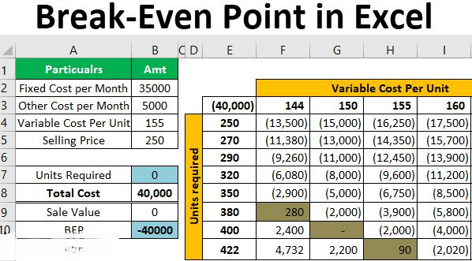

The digital revolution has reshaped a myriad of sectors, with the financial industry standing prominently among those transformed. Through the integration of data analysis, financial analysis, Excel, and algorithmic trading, the traditional approach to financial operations has evolved, fostering enhanced efficiency and precision. These technological advancements are not mere enhancements but pivotal elements that redefine financial tasks from their core.

Data analysis serves as the foundation of this transformation, allowing professionals to parse through vast datasets to extract meaningful insights. Financial analysis, leveraging tools like Excel, continues to be indispensable in simplifying and resolving complex financial queries, ranging from investment analysis to risk assessment.



Excel, despite the advent of specialized software, remains a cornerstone for finance professionals due to its flexibility and potent functionalities. Its capabilities extend beyond mere spreadsheets, acting as a dynamic platform for creating complex financial models and performing intricate analyses.

Algorithmic trading further introduces a revolutionary approach to trading strategies. By employing predefined rules and data-driven decisions, algorithms ensure that trades are executed with optimal speed and accuracy, minimizing human error and emotion-driven decisions.

Together, these components form a cohesive framework, essential for those navigating today's fast-paced financial environment. Understanding their interplay not only provides valuable insights and efficiencies but also equips investors, analysts, and traders with a competitive edge. This article will explore these tools and techniques, illustrating how their synergy powers modern financial strategies.

## Table of Contents

## The Role of Data Analysis in Financial Markets

Data analysis is pivotal in modern financial markets, providing the foundation for informed decision-making and strategic planning. By utilizing extensive datasets, financial analysts can discern patterns, assess performance, and forecast future market movements—key elements for traders and investors alike.

A significant aspect of data analysis in finance is the application of statistical methods and [machine learning](/wiki/machine-learning) algorithms. These techniques allow analysts to derive a profound comprehension of market dynamics. For instance, regression analysis, time series analysis, and classification algorithms are commonly employed to identify correlations, trends, and anomalies within the markets. Machine learning models, such as random forests or neural networks, are especially beneficial for predictive analytics, helping to anticipate market shifts and optimize trading strategies.

The information utilized in these analyses comes from a diverse array of sources. Company financial statements offer in-depth insights into a firm's financial health, enabling analysts to perform [fundamental analysis](/wiki/fundamental-analysis). Market indices provide a macroeconomic view, reflecting broader market sentiment and trends. Furthermore, real-time trading data is crucial for technical analysis, where price movements and trading volumes are scrutinized to predict future price directions.

The evolution of data availability and analytic sophistication has empowered traders and investors. Advanced data analytics tools and platforms, like Python libraries (e.g., pandas, NumPy, scikit-learn) and data visualization software (e.g., Tableau, Power BI), enable complex analyses and the extraction of actionable insights from vast datasets. These tools facilitate not only the swift processing of data but also the construction of intricate models that enhance decision-making precision.

For example, a typical Python script leveraging pandas for financial analysis might look like this:

```python
import pandas as pd

# Load financial data into a DataFrame
data = pd.read_csv('market_data.csv')

# Calculate moving averages
data['20_MA'] = data['Close'].rolling(window=20).mean()
data['50_MA'] = data['Close'].rolling(window=50).mean()

# Compute daily returns
data['Daily_Return'] = data['Close'].pct_change()

# Use a simple condition to spot buying signals
data['Buy_Signal'] = (data['20_MA'] > data['50_MA']) & (data['Close'] > data['20_MA'])
```

In summary, data analysis is a cornerstone of financial market operations, offering insights that drive decision-making and strategy development. As data becomes increasingly accessible and analytical techniques more advanced, traders are equipped with the tools needed to make informed and timely decisions, maintaining their competitive edge in the fast-paced financial environment.

## Excel as a Tool for Financial Analysis

Excel remains an indispensable tool for finance professionals due to its flexibility and powerful functions. It serves a variety of purposes, which include budgeting, forecasting, risk analysis, and the creation of complex financial models. Its widespread adoption in the financial sector can be attributed to its robust capacity to handle substantial volumes of data while providing strong analytical tools, making it highly effective for performing both fundamental and technical analysis.

Financial analysts often employ Excel for budgeting activities, allowing them to organize financial data efficiently and make projections about future performance. Through its capability for forecasting, professionals can use historical data to predict future trends, improving decision-making processes. Additionally, Excel's features in risk analysis help in evaluating potential risks by quantifying and assessing uncertainties associated with financial decisions.

Excel's utility is further enhanced by several powerful features. Pivot tables allow users to sort, reorganize, and summarize data dynamically, facilitating quick insights into large datasets. Lookup functions like VLOOKUP and HLOOKUP enable users to search and retrieve data across spreadsheets efficiently. Macros, which are sequences of instructions to automate repetitive tasks, can significantly save time and minimize errors, therefore increasing productivity and accuracy.

Despite the availability of more advanced financial software, Excel's user-friendly interface ensures it remains a popular choice. Its adaptability allows users to customize and expand upon its features; this flexibility suits a variety of financial tasks, from simple computations to elaborate, multi-variable models.

In summary, Excel continues to be a cornerstone of financial analysis due to its unmatched versatility, extensive capabilities, and ease of use. By mastering Excel, professionals can gain substantial efficiencies and insights in financial analysis, maintaining its status as a pivotal tool in the financial industry.

## Financial Analysis Techniques using Excel

Excel supports a diverse array of financial analysis techniques, enabling analysts to address a variety of financial challenges from simple to complex. At its core, Excel is widely used for calculating fundamental metrics essential for evaluating investment opportunities. These include Return on Investment (ROI), Net Present Value (NPV), and Internal Rate of Return (IRR). 

ROI is a measure of the profitability of an investment, calculated as:
$$
\text{ROI} = \left( \frac{\text{Net Profit}}{\text{Cost of Investment}} \right) \times 100
$$

NPV is used to analyze the profitability of a projected investment or project, factoring in the time value of money:
$$
\text{NPV} = \sum_{t=0}^{T} \frac{R_t}{(1 + i)^t}
$$
where $R_t$ represents net cash inflow at time $t$, $i$ is the discount rate, and $T$ is the total number of time periods.

IRR is a rate at which the NPV of costs and benefits of a project break even:
It can be found using Excel's IRR function that iteratively calculates the discount rate to make the NPV zero.

Technical analysts employ Excel for charting trends and scrutinizing price movements using historical data. Through features like pivot tables and chart tools, Excel facilitates technical analysis, making it possible to visually interpret data and forecast future price trends. Functions like the moving average can be implemented to smooth out price data to identify the direction of the trend.

Moreover, organizations rely on Excel for capital budgeting, risk assessment, and financial forecasting. By employing scenario analysis, Excel aids companies in preparing for uncertain futures by evaluating the potential impact of different financial scenarios. Sensitivity analysis in Excel can be used to predict the outcome of a decision given a certain range of variables.

Mastering Excel functions tailored to specific analysis needs can significantly streamline financial processes and decision-making. Formulas, such as OFFSET and VLOOKUP, alongside financial functions like PMT and PV, offer powerful tools to maximize the accuracy and efficiency of financial calculations. Additionally, using Excel's VBA (Visual Basic for Applications), users can automate repetitive tasks, creating more time for in-depth analysis and planning. 

In conclusion, Excel remains a versatile and efficient tool for financial analysis, delivering comprehensive solutions for a spectrum of accounting and financial challenges. By leveraging its potential, financial analysts can enhance the accuracy of their insights and predictions significantly.

 to Algorithmic Trading

Algorithmic trading has revolutionized modern financial markets by automating trading strategies through the use of sophisticated algorithms. These automated systems are programmed with predefined rules to make decisions and initiate trades, optimizing the process by executing at the most advantageous prices. This capability greatly surpasses human traders, as algorithms can process vast quantities of data at extraordinary speeds with heightened precision.

The essence of [algorithmic trading](/wiki/algorithmic-trading) lies in the application of mathematical models and complex algorithms, which allow for systematic trading strategies. By automating these processes, algorithmic trading enhances market efficiency, reduces transaction costs, and mitigates the emotional biases that often influence human decision-making. This ensures a more objective approach to trading, where decisions are driven by data rather than impulse or sentiment.

Consider a simple moving average crossover strategy, where a short-term moving average (SMA) is used to make buy or sell decisions against a long-term SMA:

```python
import numpy as np
import pandas as pd

def moving_average_crossover_strategy(data, short_window=40, long_window=100):
    signals = pd.DataFrame(index=data.index)
    signals['price'] = data['Close']
    signals['short_mavg'] = data['Close'].rolling(window=short_window, min_periods=1, center=False).mean()
    signals['long_mavg'] = data['Close'].rolling(window=long_window, min_periods=1, center=False).mean()
    signals['signal'] = 0.0
    signals['signal'][short_window:] = np.where(signals['short_mavg'][short_window:] > signals['long_mavg'][short_window:], 1.0, 0.0)   
    signals['positions'] = signals['signal'].diff()
    return signals
```

In this Python code, a moving average crossover strategy is implemented, which generates buy or sell signals based on the crossover of short and long-term moving averages. Such automated trading strategies are popular for their simplicity and adaptability.

Comprehending algorithmic trading principles is fundamental for traders aiming to exploit technological advantages for improved results. By embracing these methodologies, traders can enhance their trading efficacy, aligning with the evolving landscape of financial markets.

## Integrating Excel with Algorithmic Trading

Integrating Excel with algorithmic trading presents a fusion of familiar spreadsheet functionalities with the precise, data-driven demands of automated trading systems. By leveraging Excel's robust capabilities, traders are empowered to design, test, and refine trading strategies with greater ease and adaptability.

Traders utilize Excel for the design and [backtesting](/wiki/backtesting) of trading strategies, a process that involves evaluating potential strategies on historical data to assess their viability before live market deployment. Excel's advanced functions, such as arrays, pivot tables, and built-in statistical tools, allow for intricate and personalized strategy development. The use of Visual Basic for Applications (VBA) further enhances this capability, enabling users to automate repetitive tasks and perform complex calculations, while custom formulas can simulate trading conditions and compute key performance metrics.

Real-time data integration is another significant advantage of Excel in algorithmic trading. By linking Excel to live market feeds through APIs or data streaming services, traders gain the ability to continuously monitor financial markets. This integration facilitates the adjustment of trading strategies in response to shifting market conditions, allowing for dynamic and timely decision-making.

Moreover, Excel serves as an intuitive interface for configuring and controlling algorithmic trading systems. This interface allows users to enter parameters, set trading rules, and initiate trades without delving into complex programming environments. By doing so, it reduces the learning curve typically associated with high-frequency trading systems. External libraries like `xlwings` for Python further expand Excel's capabilities, providing seamless interaction between Excel and more advanced programming solutions.

This integration holds particular appeal both for professional and amateur traders by offering transparency and flexibility. Professionals benefit from the ability to prototype strategies quickly, while amateur traders gain access to a toolset that simplifies trading automation processes. Excel’s adaptability to changing market strategies makes it a robust platform for algorithmic trading endeavors, underscoring its enduring relevance amidst high-tech trading technologies.

## Conclusion

The integration of data analysis, financial analysis, Excel, and algorithmic trading is undeniably transforming the financial landscape. These tools and techniques provide financial experts with the ability to make informed decisions, leading to substantial gains. By leveraging these technologies effectively, market participants can maintain a competitive edge in an increasingly complex financial industry.

Excel continues to be a vital tool in financial analysis due to its robust capabilities. Its flexibility and wide range of functions allow analysts to unravel complex financial data, create detailed models, and perform both fundamental and technical analyses with ease. On the other hand, algorithmic trading introduces a sophisticated layer of automation and precision. By utilizing predefined rules and data-driven strategies, algorithmic trading optimizes trade execution, potentially minimizing costs and reducing emotional biases.

As financial markets continually evolve, it is crucial for professionals to remain proficient with these technologies. Mastery of data analysis can reveal actionable insights, while a deep understanding of financial analysis techniques using Excel ensures accurate and reliable evaluations. Furthermore, embracing algorithmic trading promises enhanced efficiency and market responsiveness, offering new horizons in deploying analytical knowledge effectively.

In conclusion, the intersection of these disciplines is reshaping the financial services sector and is central to achieving success. As the industry grows more intricate, acquiring and mastering these skills will be essential for thriving in the contemporary financial environment.

## References & Further Reading

[1]: Bergstra, J., Bardenet, R., Bengio, Y., & Kégl, B. (2011). ["Algorithms for Hyper-Parameter Optimization."](https://dl.acm.org/doi/10.5555/2986459.2986743) Advances in Neural Information Processing Systems 24.

[2]: ["Advances in Financial Machine Learning"](https://www.amazon.com/Advances-Financial-Machine-Learning-Marcos/dp/1119482089) by Marcos Lopez de Prado

[3]: ["Evidence-Based Technical Analysis: Applying the Scientific Method and Statistical Inference to Trading Signals"](https://www.amazon.com/Evidence-Based-Technical-Analysis-Scientific-Statistical/dp/0470008741) by David Aronson

[4]: ["Machine Learning for Algorithmic Trading"](https://github.com/stefan-jansen/machine-learning-for-trading) by Stefan Jansen

[5]: ["Quantitative Trading: How to Build Your Own Algorithmic Trading Business"](https://www.amazon.com/Quantitative-Trading-Build-Algorithmic-Business/dp/1119800064) by Ernest P. Chan