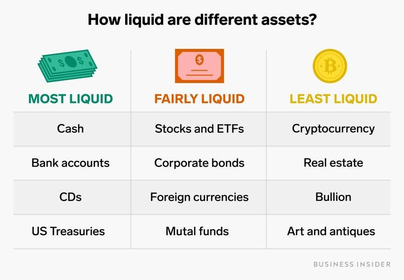

## Table of Contents

## What are financial assets?

Financial assets are things that have value and can be owned, like money, stocks, or bonds. They are different from physical things you can touch, like a house or a car. People and companies use financial assets to save money, invest, or make more money. For example, if you buy a stock, you own a small part of a company and might earn money if the company does well.

There are many types of financial assets. Some common ones are cash, which you can use to buy things right away; stocks, which are pieces of a company; and bonds, which are like loans you give to a company or government that they pay back with interest. Other examples include mutual funds, where your money is combined with others to buy a mix of stocks and bonds, and cryptocurrencies, which are digital money that you can use online. Each type of financial asset has its own risks and benefits, so it's important to understand them before you invest.

## What is the difference between liquid and illiquid financial assets?

Liquid financial assets are easy to turn into cash quickly without losing much value. Think of cash in your wallet or money in your bank account. You can use it right away to buy things or pay bills. Stocks and bonds that are traded a lot on big markets are also liquid because you can sell them fast and get your money. Having liquid assets is good because it means you can get to your money when you need it.

Illiquid financial assets are harder to turn into cash and might take longer to sell or could lose value if you need to sell them fast. Examples include real estate, like a house, or private company stocks that aren't traded on big markets. If you want to sell these, it might take weeks or months to find a buyer, and you might not get as much money as you hoped. People usually hold onto illiquid assets for a longer time because they can grow in value over time, but they're not good if you need money quickly.

## Can you give examples of liquid financial assets?

Liquid financial assets are things you can turn into cash quickly and easily. The best example is cash itself. If you have money in your wallet or your bank account, you can use it right away to buy things or pay for stuff. Another good example is money market funds. These are like savings accounts where you can get your money out fast without losing much.

Stocks and bonds that are traded a lot on big markets, like the New York Stock Exchange, are also liquid. If you own shares in a big company like Apple or Microsoft, you can sell them quickly and get your money. Government bonds, like U.S. Treasury bonds, are also easy to sell because lots of people want to buy them. These assets are great if you need money fast because you can turn them into cash without waiting long or losing value.

## What are some common examples of illiquid financial assets?

Illiquid financial assets are things that you can't turn into cash quickly. One common example is real estate, like a house or a piece of land. If you want to sell your house, it might take a long time to find a buyer. You might have to wait weeks or even months, and you might not get as much money as you want if you need to sell fast.

Another example of an illiquid asset is private company stocks. These are shares in companies that aren't traded on big stock markets. If you own part of a small, private business, it can be hard to find someone who wants to buy your shares. It might take a long time, and you might not get a good price.

Other examples include art, collectibles, and some types of loans. These things can be valuable, but they're not easy to sell quickly. If you need money fast, illiquid assets aren't the best choice because you can't turn them into cash right away.

## How does liquidity affect the value of a financial asset?

Liquidity can have a big effect on the value of a financial asset. If an asset is liquid, like cash or stocks traded on big markets, it's easier to sell it quickly without losing much value. People like having liquid assets because they can get their money when they need it. This demand for liquid assets can make them more valuable. For example, if you own a stock that a lot of people want to buy, you can sell it fast and get a good price.

On the other hand, if an asset is illiquid, like a house or private company shares, it can be hard to sell it quickly. You might have to wait a long time to find a buyer, and if you need to sell fast, you might have to lower the price. This can make the asset less valuable because people don't want to be stuck with something they can't turn into cash easily. So, the value of an illiquid asset can go down if you need money fast, but it might be worth more if you can wait for the right buyer.

## What are the risks associated with holding illiquid assets?

Holding illiquid assets can be risky because they are hard to turn into cash quickly. If you need money fast for something important, like an emergency or a big bill, you might be in trouble. You might have to sell your illiquid asset for less money than it's worth just to get cash fast. This is called a "fire sale," and it can make you lose a lot of money.

Another risk is that the value of illiquid assets can be harder to figure out. Because they don't trade often, it's tough to know what they're really worth. If you need to sell, you might find out that the price you thought you could get is much lower than what you expected. This uncertainty can make it hard to plan your finances and could lead to big surprises if you need to sell.

Overall, while illiquid assets can grow in value over time and be good for long-term investing, they come with the risk of not being able to access your money when you need it and the challenge of knowing their true worth. It's important to think about these risks before you decide to hold onto illiquid assets.

## How can one convert an illiquid asset into a liquid asset?

Converting an illiquid asset into a liquid asset can be tricky, but it's possible with some planning. One way to do it is by selling the illiquid asset. For example, if you own a house, you can put it on the market and sell it to someone who wants to buy it. Once you get the money from the sale, you can put it in your bank account, which is a liquid asset. The downside is that selling an illiquid asset can take time, and you might not get as much money as you hoped if you need to sell quickly.

Another way to convert an illiquid asset is by using it as collateral for a loan. For instance, you can use your house to get a mortgage or your private company stocks to get a loan from a bank. The bank gives you cash, which is liquid, and you keep the illiquid asset. You'll need to pay back the loan with interest, but this way, you can turn your illiquid asset into cash without selling it. Just remember that if you can't pay back the loan, the bank might take your asset, so it's a risk you need to think about carefully.

## What strategies can be used to manage a portfolio containing both liquid and illiquid assets?

Managing a portfolio with both liquid and illiquid assets means you need to balance how easy it is to get your money with how much your investments can grow. Liquid assets, like cash or stocks, are great for when you need money fast. They're easy to sell and turn into cash without losing much value. You should keep some liquid assets in your portfolio to cover emergencies or unexpected costs. On the other hand, illiquid assets, like real estate or private company stocks, can grow a lot over time but are hard to sell quickly. You might want to hold onto these for the long term, hoping they'll be worth more later.

To manage both types of assets well, think about your goals and how long you can wait to use your money. If you need money soon, keep more liquid assets. If you're saving for the future and can wait, you might put more money into illiquid assets. It's also smart to check your portfolio often and see if you need to change things. If one of your illiquid assets is doing really well, you might decide to sell it and put the money into something else. Or if you need more cash, you might sell some liquid assets. The key is to keep a good mix that fits your needs and helps your money grow.

## How do market conditions influence the liquidity of financial assets?

Market conditions can change how easy it is to turn your financial assets into cash. When the market is doing well, lots of people want to buy and sell things, so it's easier to find someone who wants to buy your stocks or bonds. This makes your assets more liquid because you can sell them fast and get a good price. But if the market is not doing well, like during a big economic problem, fewer people want to buy things. It can be harder to sell your assets quickly, and you might have to sell them for less money than you hoped. This makes your assets less liquid.

Even things like real estate or private company stocks can be affected by market conditions. When the economy is strong, more people have money to buy houses or invest in private businesses, so these illiquid assets can become a bit easier to sell. But when the economy is weak, it can be really hard to find buyers for these assets. They stay illiquid, and you might have to wait a long time or accept a lower price to sell them. So, market conditions play a big role in how liquid your financial assets are.

## What role do financial regulations play in the liquidity of assets?

Financial regulations can make a big difference in how easy it is to turn your assets into cash. Rules set by governments and financial watchdogs can help keep markets stable and fair, which can make people feel more confident about buying and selling things. For example, if the rules make sure that companies tell the truth about their money and business, more people might want to buy their stocks or bonds. This can make those assets more liquid because it's easier to find someone to buy them. On the other hand, if the rules are too strict or hard to follow, they might make it harder for companies to sell their stocks or bonds, which can make those assets less liquid.

Regulations can also affect how banks and other financial places handle money. If the rules say banks have to keep a lot of cash on hand, they might not be able to lend as much money to people who want to buy things like houses or cars. This can make those assets less liquid because fewer people can buy them. But if the rules are more relaxed and let banks lend more, it can be easier for people to get loans and buy things, making those assets more liquid. So, financial regulations can change how easy or hard it is to turn your assets into cash, depending on how they are set up.

## How do advanced financial instruments like derivatives affect the liquidity of underlying assets?

Advanced financial instruments like derivatives can make it easier to buy and sell the assets they're based on, which makes those assets more liquid. Derivatives are like bets on how an asset will do in the future. They let people and companies guess about prices without actually buying the asset. This can bring more people into the market because they don't need a lot of money to start. More people trading means it's easier to find someone to buy or sell your asset, making it more liquid. For example, if you own a stock and there are lots of options and futures based on it, it's easier to sell your stock because more people are interested in it.

But derivatives can also make things more complicated and risky. If a lot of people are betting on an asset and the market gets shaky, it can be hard to know what the asset is really worth. This uncertainty can scare people away from buying or selling, making the asset less liquid. Also, if someone loses a lot of money on a derivative, they might have to sell their assets fast to pay back what they owe. This can lead to a "fire sale," where they sell their assets for less than they're worth, making those assets less liquid. So, while derivatives can help make markets more liquid, they can also make things more risky and less predictable.

## What are the latest trends and technologies impacting the liquidity of financial assets?

The latest trends and technologies are changing how easy it is to turn financial assets into cash. One big trend is the growth of online trading platforms and apps. These let people buy and sell things like stocks and bonds from their phones or computers, anytime and anywhere. This makes it easier for more people to trade, which can make assets more liquid. Also, technology like blockchain and cryptocurrencies is making a difference. With cryptocurrencies, you can trade money online without a bank, which can make money more liquid because it's easier to move around.

Another trend is the use of [artificial intelligence](/wiki/ai-artificial-intelligence) (AI) and big data in trading. AI can help people and companies guess how the market will move by looking at lots of information really fast. This can make trading smoother and faster, which helps make assets more liquid. But there are also new risks. For example, high-frequency trading, where computers trade very quickly, can make markets move a lot and make it harder to know what an asset is really worth. So, while new tech can help make things more liquid, it can also make the market more unpredictable.

## What is the understanding of financial assets?

Financial assets are instruments that can be easily traded or converted into cash, acting as pivotal components within the global financial ecosystem. They are primarily represented by stocks, bonds, and bank deposits, each serving specific roles in investment strategies.

Stocks represent ownership claims in corporations, granting shareholders a portion of the company's earnings and assets. Bonds are debt securities issued by corporations, governments, or other entities to raise capital, where the issuer promises to repay a specified amount at maturity along with periodic interest payments. Bank deposits are claims on a bank, allowing the holder to access funds on demand or after a fixed term, depending on the account type.

The value of financial assets arises from contractual claims or ownership rights rather than any intrinsic worth they might hold. Stocks, for example, derive their value from shareholders' legal entitlement to a company's profits and assets. Bonds' worth is based on the promise of returning principal and interest, backed by the issuer's creditworthiness.

Globally, financial assets are critical not just to individual and institutional portfolios but also in shaping the dynamics of the financial markets. They allow for diversification, enabling investors to spread risk across various asset classes. This diversification can be quantified using the standard deviation of portfolio returns, a measure of total risk. 

Furthermore, financial assets facilitate [liquidity](/wiki/liquidity-risk-premium) in markets, allowing economies to function efficiently. They also reflect the expected future cash flows and the risk associated with them, often assessed through models like the Capital Asset Pricing Model (CAPM), which relates expected return to risk with the formula:

$$
E(R_i) = R_f + \beta_i \times (E(R_m) - R_f)
$$

where $E(R_i)$ is the expected return of investment, $R_f$ is the risk-free rate, $\beta_i$ is the investment's beta, and $E(R_m)$ is the expected market return.

Financial assets, thus, play a central role in investment strategies, reflecting investor perspectives on risk, return, and liquidity, and form the basis for algorithmic models that enhance trading efficiency in modern markets. Their omnipresence across financial systems underscores their importance in economic stability and growth.

## References & Further Reading

[1]: Bergstra, J., Bardenet, R., Bengio, Y., & Kégl, B. (2011). ["Algorithms for Hyper-Parameter Optimization."](https://papers.nips.cc/paper/4443-algorithms-for-hyper-parameter-optimization) Advances in Neural Information Processing Systems 24.

[2]: ["Advances in Financial Machine Learning"](https://www.amazon.com/Advances-Financial-Machine-Learning-Marcos/dp/1119482089) by Marcos Lopez de Prado

[3]: ["Evidence-Based Technical Analysis: Applying the Scientific Method and Statistical Inference to Trading Signals"](https://www.amazon.com/Evidence-Based-Technical-Analysis-Scientific-Statistical/dp/0470008741) by David Aronson

[4]: ["Machine Learning for Algorithmic Trading"](https://github.com/PacktPublishing/Machine-Learning-for-Algorithmic-Trading-Second-Edition) by Stefan Jansen

[5]: ["Quantitative Trading: How to Build Your Own Algorithmic Trading Business"](https://www.amazon.com/Quantitative-Trading-Build-Algorithmic-Business/dp/1119800064) by Ernest P. Chan