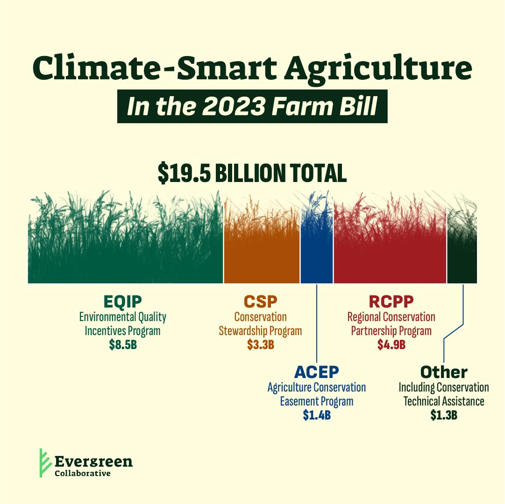

## Table of Contents

## What is climate-smart agriculture and ranching?

Climate-smart agriculture and ranching are ways of farming and raising animals that help fight climate change. They do this by reducing greenhouse gases, like carbon dioxide and methane, that come from farming. Farmers and ranchers use special methods to grow crops and take care of animals in a way that is good for the environment. This includes using less water and fewer chemicals, and planting trees or other plants that can take in carbon dioxide from the air.

These practices also help farmers and ranchers deal with the changes in weather that come with climate change. For example, they might plant different types of crops that can survive in hotter or drier conditions. By doing this, they can keep their farms and ranches going strong even when the weather is unpredictable. Overall, climate-smart agriculture and ranching are important because they help protect the planet and make sure that farmers can keep growing food for everyone.

## Why is financial assistance important for climate-smart practices?

Financial assistance is important for climate-smart practices because they can be expensive to start. Farmers and ranchers might need to buy new equipment or learn new ways of doing things. This can cost a lot of money, and many farmers and ranchers might not have enough to pay for it all by themselves. Financial help from the government or other organizations can make it easier for them to try these new methods without worrying about the cost.

Also, financial assistance can help farmers and ranchers keep using climate-smart practices over time. Sometimes, the benefits of these practices, like better soil or less water use, take a while to show up. If farmers and ranchers are struggling to make ends meet, they might not be able to wait for these long-term benefits. Money from financial assistance can help them keep going until they start seeing the rewards of their hard work. This way, more people can join in and help fight climate change.

## What types of financial assistance are available for farmers and ranchers?

Farmers and ranchers can get different kinds of financial help to use climate-smart practices. One way is through grants, which are like gifts of money that they don't have to pay back. Governments or other groups might give out grants to help farmers buy new equipment or learn new farming methods that are good for the environment. Another type of help is loans, which are money that farmers borrow and have to pay back over time. Some loans have low interest rates, which means farmers don't have to pay back as much extra money, making it easier to afford new practices.

There are also programs that give farmers money for doing certain things that help the environment. For example, if a farmer plants trees or uses less water, they might get paid for it. These payments can help cover the costs of trying new ways of farming. Some insurance programs can also help. They can protect farmers from losing money if bad weather or other problems happen because of climate change. This makes it less risky for farmers to try new practices, knowing they have some support if things go wrong.

Overall, these different kinds of financial assistance can make a big difference. They help farmers and ranchers start using climate-smart practices without worrying too much about the cost. This support can help more people join in and do their part to fight climate change, making farming better for everyone and the planet.

## How can farmers and ranchers apply for financial assistance programs?

Farmers and ranchers can apply for financial assistance programs by first finding out what programs are available. They can do this by checking with their local government offices, like the U.S. Department of Agriculture (USDA) if they are in the United States, or similar agencies in other countries. These offices often have websites with information about different grants, loans, and payment programs. Farmers can also talk to local extension agents, who are experts that help farmers learn about new practices and find financial help.

Once they know about the programs, farmers and ranchers need to fill out an application. This usually involves filling out forms with information about their farm or ranch, what they want to do with the money, and how it will help the environment. Sometimes, they might need to include a plan showing how they will use the new practices. After submitting the application, they might need to wait for a while as the program reviews it. If their application is approved, they will get the money or other help they applied for, which they can use to start or keep using climate-smart practices.

## What are the eligibility criteria for these financial assistance programs?

To get financial help for climate-smart farming, farmers and ranchers need to meet certain rules. These rules can be different depending on the program, but often they need to show that they are real farmers or ranchers with a working farm or ranch. They might also need to prove that they are using or want to use practices that help the environment. Sometimes, the size of their farm or the type of crops they grow can matter too. For example, some programs might only help small farms or farms that grow certain kinds of crops.

Applying for these programs usually means filling out forms and giving information about their farm and what they plan to do with the money. They might need to show that they have a good plan for using climate-smart practices and that these practices will make a positive difference. Some programs might also look at how much money the farmer or rancher makes, to make sure the help goes to those who need it most. It's important for farmers and ranchers to read the rules carefully and make sure they meet all the requirements before applying.

## Can small-scale farmers and ranchers access these financial assistance programs?

Yes, small-scale farmers and ranchers can often get financial help for climate-smart practices. Many programs are made to help smaller farms because they might not have as much money to try new ways of farming. These programs might look at how much money the farmer makes or how big their farm is to decide who gets help. Small farmers can apply for grants, loans, or payments that can help them buy new tools or learn new ways to farm that are good for the environment.

To apply, small-scale farmers and ranchers need to find out about the programs that are right for them. They can check with their local government or farming groups to learn about what help is available. When they apply, they will need to fill out forms and show that they are real farmers with a plan to use climate-smart practices. If their application is approved, they can use the money to start or keep using these new ways of farming that help fight climate change.

## What are some examples of successful climate-smart projects that received financial assistance?

One good example of a successful climate-smart project is the work done by a group of farmers in Iowa. They got money from the USDA to plant cover crops. Cover crops are plants that farmers grow when their main crops are not growing. They help keep the soil healthy and stop it from washing away. The farmers used the money to buy seeds and learn how to plant cover crops. After a few years, they saw that their soil was better, and they needed less water and fewer chemicals. This project showed that with a little help, farmers can do a lot to help the environment.

Another example is a ranch in Colorado that got a grant to use rotational grazing. This means moving cows to different parts of the ranch so the grass can grow back. The money helped the rancher buy new fencing and learn about this new way of managing cows. Over time, the grass on the ranch got healthier, and the cows had more to eat. The rancher also noticed that the land was better at holding water, which was good during dry times. This project proved that financial help can make a big difference for ranchers trying new ways to take care of their land.

## How does financial assistance impact the adoption of climate-smart practices?

Financial assistance makes it easier for farmers and ranchers to start using climate-smart practices. These practices can be expensive at first, so money from grants, loans, or payments helps them buy new tools or learn new ways of farming without worrying about the cost. When farmers know they have help, they are more likely to try new things that are good for the environment. This means more people can join in and help fight climate change.

Once farmers and ranchers start using these new practices, financial assistance helps them keep going. Some of the benefits, like better soil or less water use, take time to show up. If farmers are struggling to make ends meet, they might not be able to wait for these long-term rewards. Money from financial help lets them keep using climate-smart practices until they see the good results. This support makes a big difference because it encourages more farmers and ranchers to keep helping the planet.

## What role do government policies play in providing financial assistance for climate-smart agriculture?

Government policies are really important for giving financial help to farmers and ranchers who want to use climate-smart practices. These policies can create special programs that give out grants, loans, or payments to farmers. This money helps them buy new equipment or learn new ways to farm that are good for the environment. Governments can also make rules that make it easier for farmers to get this help, like setting up easy ways to apply or making sure the money goes to those who need it most. Without these policies, it would be harder for farmers to try new things because they might not have the money to start.

These policies also help make sure that the financial help is used in the best way possible. Governments can check to see if the money is making a difference, like if it's helping to reduce greenhouse gases or make farms more able to handle changes in the weather. If something isn't working well, they can change the policies to make them better. This way, more farmers and ranchers can get the help they need, and more people can join in to fight climate change. Overall, government policies are key to making sure that financial help reaches the farmers who can use it to make a positive impact on the environment.

## How can private sector investments complement government financial assistance programs?

Private sector investments can help a lot by working together with government financial assistance programs. Companies can give money to farmers and ranchers to try new climate-smart practices. This extra money can help more farmers get started, even if they don't get help from the government. Private companies might also have new ideas or technology that can make farming better for the environment. By working with the government, they can make sure that their money and ideas are used in the best way to help fight climate change.

Also, private sector investments can keep helping farmers even after government programs end. Sometimes, government money might only last for a short time. But if private companies keep investing, farmers can keep using climate-smart practices for longer. This can make a bigger difference in the long run. Plus, when private companies see that the government is helping farmers, they might be more willing to invest too. This teamwork can make it easier for more farmers to join in and help the planet.

## What are the long-term benefits of investing in climate-smart agriculture and ranching?

Investing in climate-smart agriculture and ranching helps the planet in the long run. These practices can make the soil healthier and use less water, which is good for the environment. By using less water and fewer chemicals, farms can put out fewer greenhouse gases, like carbon dioxide and methane. This helps slow down climate change. When more farmers and ranchers use these practices, it adds up to a big difference for the whole planet.

These investments also help farmers and ranchers have strong farms for a long time. Climate-smart practices can help farms handle changes in the weather, like hotter summers or more storms. This means farmers can keep growing food even when the weather is unpredictable. Over time, these practices can also save farmers money because they use fewer resources. This makes farming more stable and helps make sure there is enough food for everyone in the future.

## How can we measure the effectiveness of financial assistance programs in promoting climate-smart agriculture?

To measure how well financial assistance programs work for climate-smart agriculture, we can look at a few things. First, we can check if more farmers are using climate-smart practices after getting the money. If more farmers are planting cover crops or using less water, that's a good sign. We can also see if the environment is getting better. For example, if the soil is healthier or if there are fewer greenhouse gases, the programs are probably helping. Surveys and data from farms can give us this information.

Another way to measure the effectiveness is to look at the long-term benefits for the farmers. If farmers are able to keep using these practices and see good results, like saving money or having better crops, then the programs are working well. We can also talk to farmers and ask them how the financial help has made a difference. If they say it helped them try new things and stick with them, that's a good measure of success. By looking at these different signs, we can tell if the financial assistance is really helping promote climate-smart agriculture.

## References & Further Reading

[1]: United States Department of Agriculture (USDA). (n.d.). ["Conservation Tillage."](https://www.ers.usda.gov/webdocs/publications/90201/eib-197.pdf?v=7027.1/) Retrieved from https://www.nrcs.usda.gov/

[2]: Natural Resources Conservation Service. ["Environmental Quality Incentives Program."](https://www.nrcs.usda.gov/programs-initiatives/eqip-environmental-quality-incentives) Retrieved from https://www.nrcs.usda.gov/wps/portal/nrcs/main/national/programs/financial/eqip/

[3]: Lal, R. (2015). ["Restoring Soil Quality to Mitigate Soil Degradation."](https://www.mdpi.com/2071-1050/7/5/5875) Journal of Hydrology, 520, 329-340.

[4]: Lopez de Prado, M. (2018). ["Advances in Financial Machine Learning."](https://www.amazon.com/Advances-Financial-Machine-Learning-Marcos/dp/1119482089) Wiley.

[5]: Chan, E. P. (2008). ["Quantitative Trading: How to Build Your Own Algorithmic Trading Business."](https://github.com/ftvision/quant_trading_echan_book) Wiley.

[6]: Aronson, D. R. (2006). ["Evidence-Based Technical Analysis: Applying the Scientific Method and Statistical Inference to Trading Signals."](https://www.amazon.com/Evidence-Based-Technical-Analysis-Scientific-Statistical/dp/0470008741) Wiley.