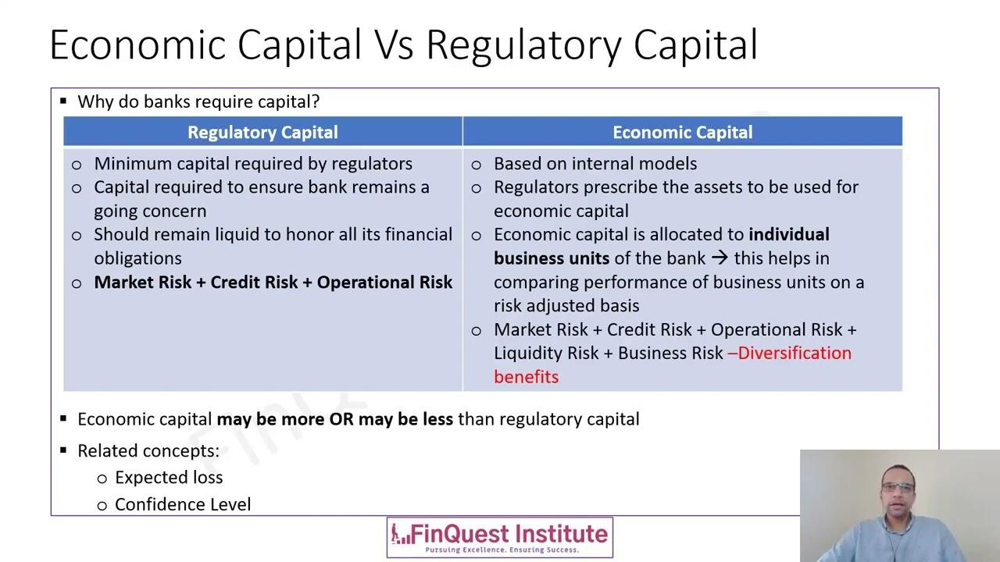

## Table of Contents

## What is financial capital?

Financial capital is the money or funds that businesses, people, and governments use to buy things, invest, and grow. It's like the fuel that helps the economy run. Financial capital can come from different places, like savings, loans, or investments. When people save money in a bank, the bank can lend that money to others as financial capital. When someone buys stocks or bonds, they are also providing financial capital to companies or governments.

Using financial capital wisely is important for both individuals and businesses. For a person, financial capital might mean having enough money to buy a house, go to school, or start a business. For a company, it means having the money to buy equipment, hire workers, or expand into new markets. If financial capital is managed well, it can lead to growth and prosperity. But if it's not used carefully, it can lead to problems like debt or even bankruptcy. So, understanding and managing financial capital is key to success in the world of money.

## What is economic capital?

Economic capital is the total value of all the things a person, business, or country owns that can be used to make money. This includes money in the bank, machines, buildings, and even skills and knowledge. It's like the tools and resources that help create wealth and keep the economy going.

For a business, economic capital might include the factory they use to make products, the trucks they use to deliver goods, and the money they have to pay workers. For a country, it could be natural resources like oil or minerals, as well as the education and skills of its people. Having enough economic capital is important because it helps businesses grow and countries develop.

## How do financial capital and economic capital differ in their basic definitions?

Financial capital is the money that people, businesses, and governments use to buy things, invest, and grow. It's like the cash or funds that help the economy work. Financial capital can come from savings, loans, or investments. For example, when you save money in a bank, that money can be loaned out to others as financial capital. When you buy stocks or bonds, you're giving financial capital to companies or governments.

Economic capital, on the other hand, is the total value of everything a person, business, or country owns that can be used to make money. This includes not just money, but also things like machines, buildings, and even skills and knowledge. For a business, economic capital might include the factory they use to make products or the trucks they use to deliver goods. For a country, it could be natural resources like oil or the education level of its people. Economic capital is like the tools and resources that help create wealth and keep the economy going.

In simple terms, financial capital is the money used to do things, while economic capital is all the stuff and skills that help make money. Both are important for the economy, but they are different because financial capital is about the money itself, and economic capital is about the things and abilities that money can buy or develop.

## What are the primary sources of financial capital?

The primary sources of financial capital are savings, loans, and investments. Savings are the money people put aside from their income. Banks collect these savings and can lend them out to others who need money. Loans are another big source of financial capital. Banks, credit unions, and other lenders give out loans to people and businesses. They charge interest on these loans, which is how they make money. Investments are also a key source of financial capital. When people buy stocks, bonds, or other securities, they are giving money to companies or governments to use.

Another important source of financial capital is venture capital. This is money that investors give to new or growing businesses that they think will do well. These investors hope to make a lot of money if the business succeeds. Governments can also provide financial capital through grants or subsidies. They might give money to businesses or people to help them start projects or do research. All these sources help provide the money that keeps the economy moving and growing.

## How is economic capital measured and what does it include?

Economic capital is measured by looking at all the things a person, business, or country owns that can help make money. This includes money in the bank, buildings, machines, and even the skills and knowledge people have. To measure it, you add up the value of all these things. For example, a business might count its factory, trucks, and the money it has saved. A country might measure its natural resources like oil or minerals, and also look at how educated and skilled its people are. The total value of all these things together is the economic capital.

Economic capital includes a lot of different things. For a business, it might include the office building, the computers, and the money they have to pay workers. It also includes the skills and knowledge of the employees, which help the business run well. For a person, economic capital could be their savings, their house, and their education or job skills. For a country, economic capital includes things like farmland, factories, and the education level of its people. All these things together help create wealth and keep the economy going.

## Can financial capital be converted into economic capital? If so, how?

Yes, financial capital can be turned into economic capital. This happens when people or businesses use money to buy things that can help them make more money. For example, a business might use its financial capital to buy a new machine for its factory. This machine is now part of the business's economic capital because it can help make more products and earn more money. Or, a person might use their savings to go to school and learn new skills. Those skills become part of their economic capital, helping them get a better job and earn more money.

The process of turning financial capital into economic capital is important for growing and developing. When a business invests in new equipment or a person invests in their education, they are creating more tools and resources that can help them make money in the future. This is why managing financial capital wisely is so important. By using it to buy things that can create more value, people and businesses can increase their economic capital and build a stronger foundation for success.

## What role does financial capital play in economic growth?

Financial capital is really important for making the economy grow. It's like the fuel that keeps everything moving. When businesses have money, they can buy new machines or build new factories. This helps them make more stuff and sell more, which can lead to more jobs and more money for everyone. People can also use financial capital to go to school or start their own businesses. When they do this, they help the economy grow even more by bringing in new ideas and creating new jobs.

If financial capital is used well, it can make the economy stronger and help it grow faster. Banks and investors play a big role in this. They give out loans and investments that businesses and people can use to do big things. But if financial capital is not used carefully, it can cause problems. Too much debt or bad investments can slow down the economy and even cause it to shrink. So, it's important to use financial capital wisely to keep the economy growing and healthy.

## How does economic capital influence the productivity of a nation?

Economic capital is super important for making a country more productive. It includes things like machines, factories, and even the skills and knowledge of the people. When a country has a lot of economic capital, businesses can make more stuff faster and better. For example, if a factory has new machines, it can produce more goods in less time. Also, if people are well-educated and skilled, they can do their jobs better and come up with new ideas to improve things. All these things help the country make more money and grow.

But economic capital is not just about having stuff. It's also about using it in the right way. If a country invests in education and training, it can help its people become more skilled and productive. This means they can do their jobs better and maybe even start new businesses. Also, if the country takes care of its natural resources and uses them wisely, it can keep making money from them for a long time. So, having and using economic capital well is key to making a nation more productive and helping its economy grow.

## What are the risks associated with managing financial capital?

Managing financial capital can be risky because there's always a chance you might lose money. One big risk is taking on too much debt. When you borrow a lot of money, you have to pay it back with interest. If you can't pay it back, you might go bankrupt. Another risk is making bad investments. If you put your money into a business or a stock that doesn't do well, you could lose a lot of your money. Also, if you keep all your money in one place, like one bank or one type of investment, you might lose everything if that place fails.

Another risk is not planning for the future. If you spend all your money now and don't save any for later, you might not have enough when you really need it. This can be a big problem if you lose your job or have a big unexpected expense. Also, inflation can be a risk. If prices go up a lot, the money you have saved might not be worth as much in the future. So, it's important to think about these risks and try to manage your financial capital carefully to avoid losing money.

## How do regulatory frameworks affect the management of economic capital?

Regulatory frameworks are rules made by governments that businesses and people have to follow. These rules can change how economic capital is managed. For example, rules about safety can make it more expensive for businesses to buy new machines or build factories. This means they might need to spend more money to follow the rules, which can affect how much economic capital they have. Also, rules about the environment can change how a country uses its natural resources, which is a big part of economic capital.

Another way regulatory frameworks affect economic capital is through rules about money and investments. Governments might set rules about how much money banks can lend or what kinds of investments are allowed. These rules can make it harder or easier for businesses to get the money they need to buy new things or grow. If the rules are strict, businesses might have less economic capital because they can't borrow as much. But if the rules are fair and clear, they can help keep the economy stable and help businesses use their economic capital wisely.

## What advanced strategies can be used to optimize the use of financial capital in a business?

One advanced strategy to optimize the use of financial capital in a business is to use financial forecasting and modeling. This means using data and math to predict how much money the business will make and spend in the future. By doing this, the business can plan better and make smarter decisions about where to put its money. For example, if the forecast shows that a new product will be popular, the business might decide to spend more financial capital on making that product. This can help the business grow and make more money in the long run.

Another strategy is to use financial leverage wisely. This means borrowing money to invest in things that can make the business more profitable. If the business can borrow money at a low [interest rate](/wiki/interest-rate-trading-strategies) and use it to buy something that will make more money than the interest costs, it can grow faster. But this strategy is risky because if the investment doesn't work out, the business will still have to pay back the loan. So, it's important to do a lot of research and be careful about how much money to borrow and what to use it for.

## How can economic capital be leveraged to enhance long-term economic sustainability?

Economic capital can help make the economy strong and last a long time if it's used in the right way. One way to do this is by investing in things that can keep making money for a long time, like education and new technology. When a country spends money on schools and training, people can learn new skills and get better jobs. This helps them make more money and spend more, which is good for the economy. Also, if businesses use their money to make new inventions or better ways of doing things, they can grow and create more jobs. This makes the economy stronger and helps it last longer.

Another way to use economic capital for long-term sustainability is by taking care of natural resources. Things like forests, water, and minerals are part of a country's economic capital. If a country uses these resources wisely and doesn't waste them, it can keep making money from them for a long time. For example, instead of cutting down all the trees, a country might plant new ones to replace them. This helps the environment and makes sure there are still trees for people to use in the future. By thinking about the long term and using economic capital in smart ways, a country can keep its economy healthy and growing for many years.

## What is Understanding Financial Capital?

Financial capital constitutes the backbone of any business, encompassing the monetary resources necessary for producing goods or offering services. Essentially, financial capital can be broken down into two main categories: debt and equity. Debt refers to the funds a company borrows, which require repayment over time, often with interest. These loans can come from various sources, including banks, financial institutions, or corporate bonds. Equity, conversely, involves direct investments into a company, providing the investor with ownership stakes and a claim on the company's future profits.

The primary objective of financial capital is to drive business operations and foster future revenues. It acts as a crucial element in establishing a company's financial leverage, which is the ratio of a firm's debt relative to its equity, and potential for growth. Financial leverage, often expressed as the debt-to-equity ratio, gives insight into the financial health and risk profile of a company. A company with high leverage is typically using more debt to finance its operations, which could increase returns on equity but also adds risk.

In the context of [algorithmic trading](/wiki/algorithmic-trading), financial capital serves as both the seed and operational capital required to engage in trades. Algorithmic trading relies on advanced algorithms to automate trading decisions, requiring significant initial investments in technology infrastructure, such as high-speed computing and data storage. These expenses form part of the financial capital outlay necessary to initiate trading activities. Moreover, continuous operational funding is essential to maintain and upgrade trading systems, manage transaction costs, and capitalize on market opportunities.

To model financial capital in a simplified manner that captures the relation between debt and equity, consider the financial leverage formula:

$$
\text{Financial Leverage} = \frac{\text{Total Debt}}{\text{Total Equity}}
$$

In algorithmic trading, maintaining optimal financial leverage is critical. While a high leverage ratio can amplify profits during favorable market conditions, it poses significant risks, particularly in volatile markets. Therefore, effective management and distribution of financial capital are prerequisites for ensuring the sustainability and success of algorithmic trading strategies.

## What is the process of decoding economic capital?

Economic capital represents the capital amount required to protect a company against potential unexpected losses. This concept is pivotal in the financial sector, especially within risk management practices. It is largely determined through sophisticated risk models that account for the probability and impact of various risk factors. By evaluating both expected and unexpected loss metrics, businesses can gain a comprehensive understanding of their risk exposure.

Expected loss refers to the anticipated loss over a specific period, calculated based on historical data and current market conditions. Unexpected loss, on the other hand, accounts for the potential variation in actual losses from the expected values. The formula to calculate economic capital is often structured as:

$$
\text{Economic Capital} = \text{Value at Risk (VaR)} - \text{Expected Loss}
$$

Value at Risk (VaR) is a widely used risk metric that estimates the potential loss of an investment portfolio over a defined period for a given confidence interval. Economic capital hence represents the additional financial buffer a firm needs beyond the expected loss to secure against these unforeseen circumstances.

In contexts where market conditions are volatile, economic capital serves as a critical barometer for maintaining corporate solvency. Financial institutions, particularly in the insurance and banking industries, prioritize economic capital to ensure they possess sufficient resources to absorb substantial losses without jeopardizing their financial stability. This includes the allocation of reserves and the structuring of capital tiers to buffer against both internal and external shocks.

For algorithmic trading firms, economic capital assessments are crucial to quantify and manage risks inherent in diverse trading strategies. By leveraging advanced analytics and modeling techniques, these firms can simulate various market scenarios to gauge potential financial impacts. This allows for the calibration of algorithms not just for profitability but also for risk containment, ensuring that trading activities align with the overall risk appetite of the organization.

In summary, economic capital is more than just a financial safeguard; it represents a strategic tool that enables businesses to navigate uncertainty by providing a quantifiable measure of the capital needed to withstand potential adverse outcomes.

## References & Further Reading

[1]: Bergstra, J., Bardenet, R., Bengio, Y., & Kégl, B. (2011). ["Algorithms for Hyper-Parameter Optimization."](https://papers.nips.cc/paper/4443-algorithms-for-hyper-parameter-optimization) Advances in Neural Information Processing Systems 24.

[2]: ["Advances in Financial Machine Learning"](https://www.amazon.com/Advances-Financial-Machine-Learning-Marcos/dp/1119482089) by Marcos Lopez de Prado

[3]: ["Evidence-Based Technical Analysis: Applying the Scientific Method and Statistical Inference to Trading Signals"](https://www.amazon.com/Evidence-Based-Technical-Analysis-Scientific-Statistical/dp/0470008741) by David Aronson

[4]: ["Machine Learning for Algorithmic Trading"](https://github.com/stefan-jansen/machine-learning-for-trading) by Stefan Jansen

[5]: ["Quantitative Trading: How to Build Your Own Algorithmic Trading Business"](https://www.amazon.com/Quantitative-Trading-Build-Algorithmic-Business/dp/1119800064) by Ernest P. Chan