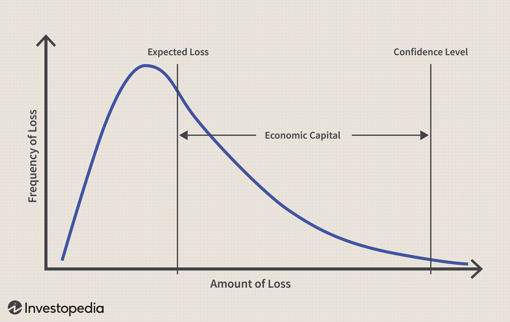

The modern financial landscape is characterized by rapid technological advancements and shifting economic paradigms, with financial and economic capital playing pivotal roles, particularly in algorithmic trading. As businesses and investors navigate these changes, distinguishing between financial capital and economic capital becomes crucial. Financial capital primarily consists of monetary assets used to generate goods or services, often categorized into debt and equity forms. These assets fuel business operations and drive future growth by establishing financial leverage.

Conversely, economic capital pertains to the capital allocation required to cover potential future losses. It is a concept rooted in risk management, assessing a business's risk exposure through both expected and unexpected loss metrics. This type of capital is integral to maintaining corporate stability and solvency, especially in sectors like banking and insurance. In the context of algorithmic trading, understanding how these different forms of capital interrelate can significantly enhance strategic financial approaches.

Algorithmic trading, a method that automates decision-making processes in financial markets through complex algorithms, acts as a conduit linking theoretical financial frameworks with their practical applications. It capitalizes on financial capital to establish the necessary technological infrastructure for trading activities, such as high-speed computing systems and sophisticated software environments. Concurrently, economic capital informs risk management strategies within these trading practices, protecting firms from substantial unforeseen losses.

This article will explore the measurement and economic roles of financial and economic capitals, and how algorithmic trading leverages these concepts to bolster financial strategies. By comparing these two forms of capital, we will highlight their integration in optimizing trading strategies. This analysis underscores the importance of balancing financial needs with effective risk management to sustain competitive advantage in today's volatile financial markets.

## Table of Contents

## Understanding Financial Capital

Financial capital constitutes the backbone of any business, encompassing the monetary resources necessary for producing goods or offering services. Essentially, financial capital can be broken down into two main categories: debt and equity. Debt refers to the funds a company borrows, which require repayment over time, often with interest. These loans can come from various sources, including banks, financial institutions, or corporate bonds. Equity, conversely, involves direct investments into a company, providing the investor with ownership stakes and a claim on the company's future profits.

The primary objective of financial capital is to drive business operations and foster future revenues. It acts as a crucial element in establishing a company's financial leverage, which is the ratio of a firm's debt relative to its equity, and potential for growth. Financial leverage, often expressed as the debt-to-equity ratio, gives insight into the financial health and risk profile of a company. A company with high leverage is typically using more debt to finance its operations, which could increase returns on equity but also adds risk.

In the context of [algorithmic trading](/wiki/algorithmic-trading), financial capital serves as both the seed and operational capital required to engage in trades. Algorithmic trading relies on advanced algorithms to automate trading decisions, requiring significant initial investments in technology infrastructure, such as high-speed computing and data storage. These expenses form part of the financial capital outlay necessary to initiate trading activities. Moreover, continuous operational funding is essential to maintain and upgrade trading systems, manage transaction costs, and capitalize on market opportunities.

To model financial capital in a simplified manner that captures the relation between debt and equity, consider the financial leverage formula:

$$
\text{Financial Leverage} = \frac{\text{Total Debt}}{\text{Total Equity}}
$$

In algorithmic trading, maintaining optimal financial leverage is critical. While a high leverage ratio can amplify profits during favorable market conditions, it poses significant risks, particularly in volatile markets. Therefore, effective management and distribution of financial capital are prerequisites for ensuring the sustainability and success of algorithmic trading strategies.

## Decoding Economic Capital

Economic capital represents the capital amount required to protect a company against potential unexpected losses. This concept is pivotal in the financial sector, especially within risk management practices. It is largely determined through sophisticated risk models that account for the probability and impact of various risk factors. By evaluating both expected and unexpected loss metrics, businesses can gain a comprehensive understanding of their risk exposure.

Expected loss refers to the anticipated loss over a specific period, calculated based on historical data and current market conditions. Unexpected loss, on the other hand, accounts for the potential variation in actual losses from the expected values. The formula to calculate economic capital is often structured as:

$$
\text{Economic Capital} = \text{Value at Risk (VaR)} - \text{Expected Loss}
$$

Value at Risk (VaR) is a widely used risk metric that estimates the potential loss of an investment portfolio over a defined period for a given confidence interval. Economic capital hence represents the additional financial buffer a firm needs beyond the expected loss to secure against these unforeseen circumstances.

In contexts where market conditions are volatile, economic capital serves as a critical barometer for maintaining corporate solvency. Financial institutions, particularly in the insurance and banking industries, prioritize economic capital to ensure they possess sufficient resources to absorb substantial losses without jeopardizing their financial stability. This includes the allocation of reserves and the structuring of capital tiers to buffer against both internal and external shocks.

For algorithmic trading firms, economic capital assessments are crucial to quantify and manage risks inherent in diverse trading strategies. By leveraging advanced analytics and modeling techniques, these firms can simulate various market scenarios to gauge potential financial impacts. This allows for the calibration of algorithms not just for profitability but also for risk containment, ensuring that trading activities align with the overall risk appetite of the organization.

In summary, economic capital is more than just a financial safeguard; it represents a strategic tool that enables businesses to navigate uncertainty by providing a quantifiable measure of the capital needed to withstand potential adverse outcomes.

## Algorithmic Trading: The Capital Connection

Algorithmic trading utilizes algorithms, a set of rules or processes to be followed in problem-solving operations, for automating and refining trading decisions and executions. This automation enables more efficient and faster trading compared to traditional manual methods, allowing for the exploitation of minute market inefficiencies and the execution of strategies that would be impractical manually due to time constraints.

Financial capital provides the backbone for algorithmic trading by funding the technological infrastructure necessary for its implementation. This includes investments in high-speed computing systems, advanced software development, and necessary data acquisition services. The ability to process vast amounts of data quickly and accurately is paramount in algorithmic trading, as algorithms rely on this data to predict market trends and make informed trading decisions. Moreover, financial capital supports the continuous development and refinement of trading algorithms to enhance their performance over time.

On the other hand, economic capital is pivotal in algorithmic trading for managing risks associated with trading activities. Risk management strategies are essential in protecting against large unforeseen losses that may arise due to market [volatility](/wiki/volatility-trading-strategies) or algorithmic errors. Through rigorous risk assessment models, firms determine the necessary economic capital to buffer against potential losses, ensuring they have sufficient financial means to cover unexpected events without jeopardizing their operational stability.

The role of capital in algorithmic trading extends beyond mere investment in technology and risk management. It also ensures [liquidity](/wiki/liquidity-risk-premium) and operational scalability, critical for executing trades swiftly in response to market fluctuations. Liquidity allows traders to enter and [exit](/wiki/exit-strategy) positions with minimal slippage, while scalable operations ensure that the trading system can handle increased [volume](/wiki/volume-trading-strategy) without degradation in performance.

Effective algorithmic trading necessitates integrating both financial and economic capital seamlessly to maximize performance and potential returns. By aligning financial resources with robust risk management frameworks, firms can ensure that they capitalize on market opportunities while remaining shielded from adverse events. This balance between leveraging financial capital for technological advancements and employing economic capital for risk mitigation underpins the success of algorithmic trading strategies in contemporary financial markets.

## Comparative Analysis: Financial vs Economic Capital

While both financial and economic capitals are foundational components of business operations, each serves different functions and applications within organizations. Financial capital fulfills immediate operational needs, enabling firms to acquire resources essential for the development and implementation of advanced trading technologies. This includes investing in infrastructure such as high-speed computing systems, software development, and data acquisition tools, which are crucial for executing algorithmic trading strategies effectively. The liquidity provided by financial capital allows for swift responses to market conditions, ensuring that businesses can capitalize on trading opportunities as they arise.

Conversely, economic capital serves a more strategic purpose by connecting a company's financial resources with its risk management strategies. Economic capital is primarily concerned with assessing the amount of risk a firm can take on, based on its current assets and liabilities. This involves understanding both expected and unexpected losses, allowing firms to develop contingency plans aligned with their risk appetites. By doing so, businesses can maintain financial solvency and ensure preparedness against potential market disruptions or unanticipated financial setbacks.

The interplay between financial and economic capital is vital for a firm's holistic financial health. While financial capital addresses the immediate needs of operationalizing trading strategies, economic capital provides the cushion for long-term resilience and sustainability. This complementary relationship is especially critical in algorithmic trading, where the need for immediate capital to support fast-paced market activities must be carefully balanced with the necessity for robust risk management frameworks to mitigate potential losses.

In the context of algorithmic trading, understanding and differentiating between these two types of capital enables firms to design strategies that both maximize returns and minimize risks. Effective management of financial capital ensures that the technological and operational aspects of trading are well-funded, while prudent economic capital oversight ensures that firms can withstand financial shocks. This balanced approach to capital management is essential for maintaining market competitiveness and achieving sustained success in a rapidly evolving financial landscape.

## Strategic Implications and Future Trends

Understanding the nuances between financial and economic capital is essential for making informed decisions in capital allocation and investment strategies. This comprehension drives the creation of financial models that effectively balance risk and return, accommodating both immediate operational needs and long-term risk management. 

Technological advancements, notably in data analytics, are increasingly important for integrating complex financial models with real-time risk management systems. These technologies allow for immediate analysis and reaction to market dynamics, thus providing a significant edge in algorithmic trading. The capability to assess and adjust positions dynamically enhances the ability to protect against losses and capitalize on profit opportunities.

The incorporation of [artificial intelligence](/wiki/ai-artificial-intelligence) (AI) and [machine learning](/wiki/machine-learning) (ML) technologies is becoming predominant in optimizing trading strategies. These technologies aid in recognizing patterns, predicting market movements, and autonomously adjusting trading parameters to optimize risk-return profiles. AI models can process enormous datasets far beyond human capabilities, enabling traders to make informed decisions with unprecedented speed and accuracy.

Regulatory changes play a critical role in shaping the future of algorithmic trading. Compliance with evolving financial regulations necessitates continuous innovations in financial and economic capital applications. Firms must ensure that their trading strategies adhere to regulatory requirements to prevent sanctions and maintain their reputational and operational integrity. 

In an ever-changing global economic environment, it is vital for firms to adapt their capital strategies to remain competitive and resilient. This involves not only leveraging technological and analytical advancements but also continuously reevaluating and refining risk management processes. Firms that remain agile and informed will be better positioned to withstand economic shifts and capitalize on emerging opportunities. 

The future of algorithmic trading will likely witness a deeper integration of sophisticated technologies, regulatory adaptation, and strategic capital management. Firms that achieve this integration will be well-placed to navigate financial market complexities, thus securing sustained growth and competitive advantage.

## Conclusion

Financial and economic capitals are foundational components in optimizing algorithmic trading strategies. Each form of capital plays a significant role: financial capital drives operational capabilities, providing the necessary resources for technological investments and execution of trades, while economic capital ensures systemic resilience against risks, acting as a safeguard against potential losses through comprehensive risk assessments.

The interplay of financial and economic capitals is crucial in navigating the complexities and volatilities of financial markets. This dynamic is particularly important in algorithmic trading, where rapid decision-making and execution require both substantial funding (financial capital) and robust risk management frameworks (economic capital). The synchronization of these capitals helps firms maintain liquidity, manage risks intelligently, and enhance scalability and profitability of trading operations.

Firms that effectively harness both types of capital gain a competitive advantage by leveraging innovative technologies and implementing robust risk management standards. These firms are better equipped to adapt to market changes, optimize trading returns, and maintain financial stability. The integration of advanced analytics, artificial intelligence, and machine learning into trading strategies allows firms to optimize the balance between risk and return, enhancing their market competitive edge.

As markets evolve, staying informed and agile in capital management becomes essential for sustained growth and success. Ongoing assessment and optimization of financial and economic capital strategies are critical to respond to emerging market trends, regulatory changes, and technological advancements. Firms that remain proactive in refining their capital strategies will ensure their resilience and increased performance in a dynamic global economy.

## References & Further Reading

[1]: Bergstra, J., Bardenet, R., Bengio, Y., & Kégl, B. (2011). ["Algorithms for Hyper-Parameter Optimization."](https://papers.nips.cc/paper/4443-algorithms-for-hyper-parameter-optimization) Advances in Neural Information Processing Systems 24.

[2]: ["Advances in Financial Machine Learning"](https://www.amazon.com/Advances-Financial-Machine-Learning-Marcos/dp/1119482089) by Marcos Lopez de Prado

[3]: ["Evidence-Based Technical Analysis: Applying the Scientific Method and Statistical Inference to Trading Signals"](https://www.amazon.com/Evidence-Based-Technical-Analysis-Scientific-Statistical/dp/0470008741) by David Aronson

[4]: ["Machine Learning for Algorithmic Trading"](https://github.com/stefan-jansen/machine-learning-for-trading) by Stefan Jansen

[5]: ["Quantitative Trading: How to Build Your Own Algorithmic Trading Business"](https://www.amazon.com/Quantitative-Trading-Build-Algorithmic-Business/dp/1119800064) by Ernest P. Chan