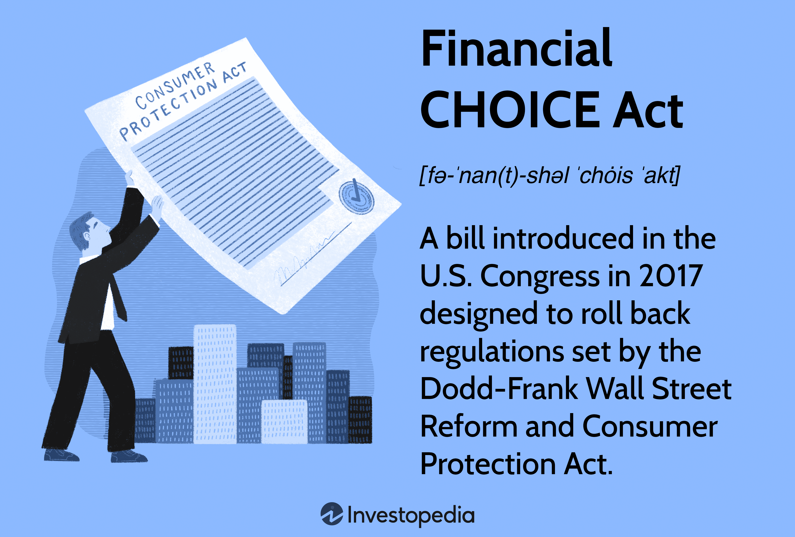

## Table of Contents

## What is the Financial CHOICE Act?

The Financial CHOICE Act is a bill that was introduced in the United States to change some of the rules about how banks and other financial companies work. It was created to replace parts of a big law called the Dodd-Frank Act, which was made after the 2008 financial crisis to make sure banks are safer and don't cause another crisis. The CHOICE Act wants to make it easier for banks to do business by reducing some of the strict rules from Dodd-Frank.

One big change the CHOICE Act wants to make is to let banks avoid some strict rules if they keep enough money in reserve. This means if a bank has a lot of money saved up, it doesn't have to follow all the detailed rules about how it manages its money. The idea is that this will help banks lend more money to people and businesses, which can help the economy grow. However, some people worry that relaxing these rules might make the financial system riskier again.

## Who introduced the Financial CHOICE Act and when?

The Financial CHOICE Act was introduced by a man named Jeb Hensarling. He was a Congressman from Texas and the head of the House Financial Services Committee. He introduced the bill on April 26, 2017.

The main goal of the Financial CHOICE Act was to change some of the rules that were set by the Dodd-Frank Act. The Dodd-Frank Act was made to make banks safer after the big financial crisis in 2008. But some people, like Jeb Hensarling, thought that these rules made it too hard for banks to do business. So, he wanted to make the rules easier, hoping it would help the economy grow.

## What are the main goals of the Financial CHOICE Act?

The main goal of the Financial CHOICE Act is to make it easier for banks to do business by changing some of the strict rules set by the Dodd-Frank Act. The Dodd-Frank Act was made to make banks safer after the 2008 financial crisis, but some people think these rules are too tough and slow down the economy. The CHOICE Act wants to let banks avoid some of these rules if they have enough money saved up. This way, banks can lend more money to people and businesses, which could help the economy grow.

Another goal of the Financial CHOICE Act is to reduce the power of the Consumer Financial Protection Bureau (CFPB). The CFPB was created by the Dodd-Frank Act to protect people from being treated unfairly by banks and other financial companies. Some people think the CFPB has too much power and makes it hard for banks to do business. The CHOICE Act wants to change how the CFPB works so it has less control over banks. This is supposed to make it easier for banks to offer new products and services, but some worry it might make it harder to protect consumers.

## How does the Financial CHOICE Act aim to change the Dodd-Frank Wall Street Reform and Consumer Protection Act?

The Financial CHOICE Act wants to change the Dodd-Frank Act by making some rules easier for banks. The Dodd-Frank Act was made to make banks safer after the 2008 financial crisis, but some people think it's too hard for banks to do business under these rules. The CHOICE Act says that if a bank keeps enough money saved up, it doesn't have to follow all the strict rules about how it manages its money. This is supposed to help banks lend more money to people and businesses, which can help the economy grow. But some people worry that relaxing these rules might make the financial system riskier again.

Another way the Financial CHOICE Act wants to change the Dodd-Frank Act is by reducing the power of the Consumer Financial Protection Bureau (CFPB). The CFPB was created to protect people from being treated unfairly by banks and other financial companies. Some people think the CFPB has too much power and makes it hard for banks to do business. The CHOICE Act wants to change how the CFPB works so it has less control over banks. This is supposed to make it easier for banks to offer new products and services, but some worry it might make it harder to protect consumers.

## What are the key provisions of the Financial CHOICE Act?

The Financial CHOICE Act wants to change the rules that banks have to follow, which were set by the Dodd-Frank Act. One key provision is that if a bank keeps a lot of money saved up, it doesn't have to follow all the strict rules about how it manages its money. This is supposed to help banks lend more money to people and businesses, which can help the economy grow. But some people worry that relaxing these rules might make the financial system riskier again.

Another key provision of the Financial CHOICE Act is about the Consumer Financial Protection Bureau (CFPB). The CFPB was created to protect people from being treated unfairly by banks and other financial companies. The CHOICE Act wants to reduce the power of the CFPB so it has less control over banks. This is supposed to make it easier for banks to offer new products and services, but some worry it might make it harder to protect consumers.

The Financial CHOICE Act also wants to change how the government oversees big banks. It wants to end the rule that says the government has to keep an eye on banks that are considered "too big to fail." Instead, the Act wants to let the market decide which banks are successful. This means less government control over big banks, which some people think will help the economy, but others worry it might lead to another financial crisis.

## How does the Financial CHOICE Act affect community banks and credit unions?

The Financial CHOICE Act aims to help community banks and credit unions by making some rules easier for them. The Dodd-Frank Act set strict rules to make banks safer after the 2008 financial crisis, but these rules can be hard for smaller banks and credit unions to follow. The CHOICE Act says that if these smaller banks and credit unions keep enough money saved up, they don't have to follow all the strict rules about how they manage their money. This can help them lend more money to people and businesses in their communities, which can help the local economy grow.

Another way the Financial CHOICE Act helps community banks and credit unions is by reducing the power of the Consumer Financial Protection Bureau (CFPB). The CFPB was created to protect people from being treated unfairly by banks, but some people think it has too much power and makes it hard for smaller banks and credit unions to do business. By changing how the CFPB works, the CHOICE Act makes it easier for these smaller financial institutions to offer new products and services to their customers. This can help them grow and better serve their communities, but some worry it might make it harder to protect consumers from unfair practices.

## What impact does the Financial CHOICE Act have on regulatory agencies like the CFPB?

The Financial CHOICE Act wants to change how the Consumer Financial Protection Bureau (CFPB) works. The CFPB was made to protect people from being treated unfairly by banks and other financial companies. But some people think the CFPB has too much power and makes it hard for banks to do business. The CHOICE Act wants to reduce the power of the CFPB so it has less control over banks. This means the CFPB would not be able to make as many rules or enforce them as strictly. The idea is that this will make it easier for banks to offer new products and services.

Some people worry that if the CFPB has less power, it might be harder to protect consumers from unfair practices. They think that without strict rules, banks might take advantage of people. But others believe that by reducing the power of the CFPB, banks will be able to do more business, which could help the economy grow. The CHOICE Act tries to balance these concerns by making it easier for banks while still trying to protect consumers, but it's a tricky balance to get right.

## How does the Financial CHOICE Act propose to alter capital and liquidity requirements for banks?

The Financial CHOICE Act wants to change the rules about how much money banks need to keep saved up, which are called capital and [liquidity](/wiki/liquidity-risk-premium) requirements. These rules were set by the Dodd-Frank Act to make banks safer after the 2008 financial crisis. The CHOICE Act says that if a bank keeps a lot of money saved up, it doesn't have to follow all the strict rules about how it manages its money. This means that banks can have more freedom in how they use their money, which can help them lend more to people and businesses.

Some people worry that if banks don't have to follow these strict rules, it might make the financial system riskier again. They think that without these rules, banks might not keep enough money saved up to handle problems if they happen. But others believe that by giving banks more freedom, they can help the economy grow by lending more money. The CHOICE Act tries to balance these concerns by letting banks avoid some rules if they have enough money saved up, but it's a tricky balance to get right.

## What are the potential benefits of the Financial CHOICE Act for the financial industry?

The Financial CHOICE Act wants to make it easier for banks to do business. It says that if banks keep a lot of money saved up, they don't have to follow all the strict rules about how they manage their money. This can help banks lend more money to people and businesses. When banks can lend more, it can help the economy grow because people and businesses can use that money to buy things or start new projects. The Act also wants to reduce the power of the Consumer Financial Protection Bureau (CFPB), which some people think makes it hard for banks to offer new products and services. By making it easier for banks to do business, the Act hopes to help the financial industry grow and be more successful.

Another benefit of the Financial CHOICE Act for the financial industry is that it wants to change how the government oversees big banks. The Act wants to end the rule that says the government has to keep a close eye on banks that are considered "too big to fail." Instead, it wants to let the market decide which banks are successful. This means less government control over big banks, which some people think will help banks be more innovative and take more risks to grow their business. By giving banks more freedom, the Act hopes to encourage more competition and growth in the financial industry.

## What criticisms have been made against the Financial CHOICE Act?

Some people don't like the Financial CHOICE Act because they think it makes the financial system riskier. They worry that if banks don't have to follow strict rules about keeping money saved up, they might not save enough. This could lead to problems like the 2008 financial crisis happening again. Critics also think that by reducing the power of the Consumer Financial Protection Bureau (CFPB), the Act might make it harder to protect people from being treated unfairly by banks. They believe that without strong rules, banks might take advantage of people and cause harm.

Another criticism of the Financial CHOICE Act is that it might help big banks more than small ones. While the Act says it wants to help community banks and credit unions, some people think that big banks will benefit the most from the changes. They worry that big banks will have more freedom to take risks and grow, while smaller banks might struggle to keep up. Critics also say that the Act focuses too much on helping banks and not enough on protecting people and the economy. They think that the government should keep a close eye on banks to make sure they don't cause another financial crisis.

## How has the Financial CHOICE Act evolved since its introduction?

Since it was first introduced in 2017, the Financial CHOICE Act has gone through some changes. The main idea of the Act has stayed the same: it wants to make some rules easier for banks so they can do more business. But as people talked about it and made suggestions, some parts of the Act were changed. For example, the Act started with a lot of different ideas to change the Dodd-Frank Act, but over time, some of these ideas were taken out or made smaller to try to get more people to agree with it.

One big change happened when the Senate passed a different version of the Act in 2018, called the Economic Growth, Regulatory Relief, and Consumer Protection Act. This new version didn't change as many rules as the original CHOICE Act, but it did make some rules easier for smaller banks. It also kept some of the strict rules for the biggest banks. This showed that while the main ideas of the CHOICE Act were still important, lawmakers had to make compromises to get the Act passed. Even though the full Financial CHOICE Act hasn't become law yet, parts of it have influenced how banks are regulated today.

## What is the current status of the Financial CHOICE Act in legislative processes?

The Financial CHOICE Act, as it was first introduced in 2017, has not become law yet. The original version of the Act wanted to change a lot of rules set by the Dodd-Frank Act, but it didn't get enough support to pass in the Senate. However, parts of the CHOICE Act have influenced other laws. In 2018, the Senate passed a different version called the Economic Growth, Regulatory Relief, and Consumer Protection Act. This new law made some rules easier for smaller banks but kept strict rules for the biggest banks.

Since then, the idea of changing the rules for banks has kept coming up in discussions in Congress. Some lawmakers still want to pass a version of the Financial CHOICE Act, but it's hard to get everyone to agree. The main ideas of the CHOICE Act, like making rules easier for banks and reducing the power of the Consumer Financial Protection Bureau, are still talked about. But for now, the full Financial CHOICE Act is not moving forward in the legislative process.

## References & Further Reading

[1]: Barth, J. R., Prabha, A., & Swagel, P. (2012). ["Just how big is the too-big-to-fail problem?"](https://link.springer.com/content/pdf/10.1057/jbr.2012.13.pdf) American Enterprise Institute.

[2]: Coffee, J. C. Jr. (2012). ["The Political Economy of Dodd-Frank: Why Financial Reform Tends to be Frustrated and Systemic Risk Perpetuated."](https://papers.ssrn.com/sol3/papers.cfm?abstract_id=1982128) Cornell Law Review, 97(5), 1019-1080.

[3]: Healey, N. (2017). ["The Financial CHOICE Act and the Future of Financial Regulation."](https://en.wikipedia.org/wiki/Financial_CHOICE_Act) Cato Institute.

[4]: Lopez, J. A. (2014). ["Stress Tests: Useful or Useless?"](https://psycnet.apa.org/record/2014-55255-003) FRBSF Economic Letter.

[5]: Stiglitz, J. E. (2010). ["Freefall: America, Free Markets, and the Sinking of the World Economy."](https://archive.org/details/freefallamericaf0000stig) W.W. Norton & Company.

[6]: Yadav, Y. (2013). ["The Problematic Case of Clearinghouses in Complex Markets."](https://papers.ssrn.com/sol3/papers.cfm?abstract_id=2006452) Villanova Law Review, 59(2), 191-252.