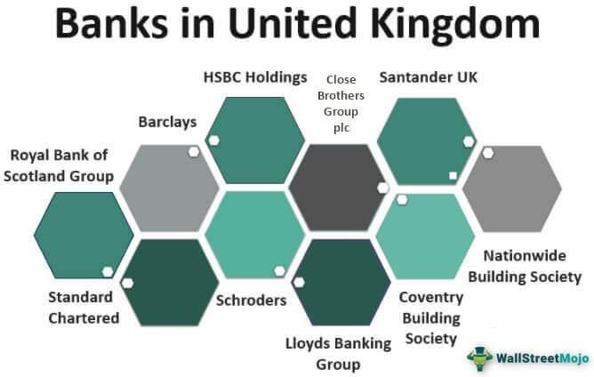

In recent years, algorithmic trading has significantly altered the dynamics of financial markets by enhancing trading speed and efficiency. This transformation has been driven by sophisticated algorithms that process vast amounts of data within milliseconds, executing trades with minimal human intervention. Such advancements, however, bring with them a set of challenges, notably the need for stringent regulatory oversight to prevent potential market manipulation and systemic risk.

In the United Kingdom, the Financial Conduct Authority (FCA) plays a pivotal role in regulating the nation's financial markets, ensuring their integrity and fairness. Established in 2013, the FCA became the successor to the Financial Services Authority, tasked with overseeing approximately 58,000 financial services firms and market participants. Its mandate includes both conduct and prudential regulation, making it a cornerstone of the UK's financial regulatory framework.

The FCA's involvement in the regulation of algorithmic trading is multifaceted, focusing on maintaining market stability and protecting consumer interests. By setting standards for algorithmic trading practices and pushing for transparency and accountability among market participants, the FCA seeks to mitigate the risks associated with automated trading strategies. This regulatory oversight is crucial, as algorithmic trading can exacerbate market volatility and create opportunities for unfair trading practices if left unchecked.

Understanding the FCA's regulatory frameworks is vital for traders, financial firms, and investors engaged in the UK's financial markets. These guidelines and regulations not only foster a secure trading environment but also promote innovation by balancing technological advancements with market integrity. As such, grasping the complexities of these regulations enables market participants to navigate the dynamic landscape of algorithmic trading effectively.

In summary, as algorithmic trading continues to grow in complexity and importance, the FCA remains a key player in ensuring that the UK's financial marketplace maintains a fair and secure environment for all parties involved. Its continuous adaptation and enforcement of regulatory measures are indispensable for upholding market stability in an era characterized by rapid technological change.

## Table of Contents

## The Role of the Financial Conduct Authority (FCA)

The Financial Conduct Authority (FCA) is the principal regulatory body for financial services and markets in the United Kingdom. Established in 2013, it succeeded the Financial Services Authority (FSA) with the mission of maintaining the integrity of UK financial markets. This organization is headquartered in London and operates independently to ensure an impartial regulatory environment, free from external influences. 

The FCA supervises approximately 58,000 firms engaged in financial services, ensuring they comply with both conduct and prudential regulatory standards. Conduct regulation focuses on the behavior of financial firms, aiming to ensure they act in the best interest of consumers. Prudential regulation, on the other hand, concentrates on the financial health and stability of these organizations, making sure they have adequate capital and risk controls in place to withstand economic shocks.

Funding for the FCA comes directly from the firms it regulates rather than government allocations, which supports its independent status. This funding model allows the FCA to operate without bias, holding firms accountable through a system that promotes transparency and fairness.

Among its many responsibilities, the FCA is tasked with protecting consumer interests. This includes ensuring the fair treatment of consumers, enhancing competition in the financial sector, and preventing market abuse. Additionally, the FCA has the authority to approve and authorize firms and individuals, providing them with the necessary licenses to perform specific financial activities within the UK.

The accountability of the FCA extends to the UK Treasury and Parliament, underscoring its pivotal role in safeguarding the financial ecosystem. Through regular reporting and oversight, these bodies ensure that the FCA operates efficiently and effectively within its regulatory mandate. The collaboration between the FCA, the Treasury, and Parliament helps maintain a robust and resilient financial market that supports both UK economic growth and consumer protection.

## Algorithmic Trading and its Regulation

Algorithmic trading is a process that utilizes advanced algorithms to automate trading activities, thereby enhancing efficiency. This automation provides benefits such as faster trade execution and the ability to process large volumes of transactions, but also presents unique risks, including market [volatility](/wiki/volatility-trading-strategies) and the potential for system failures. Recognizing these challenges, the Financial Conduct Authority (FCA) collaborates with the Prudential Regulation Authority (PRA) to monitor [algorithmic trading](/wiki/algorithmic-trading) activities with the goal of mitigating potential market risks.

The FCA's approach involves a clear definition of what constitutes algorithmic trading, which helps set the scope for regulation and ensures that all relevant activities fall within its purview. This definition is vital for developing specific regulatory measures that enhance risk controls and mandate robust governance and oversight among trading entities. The FCA's involvement ensures that algorithms are not only efficient but also conform to established safety and regulatory standards before they are deployed in the market.

A key aspect of the FCA's regulatory initiatives is the development of frameworks that both accommodate technological advancements and uphold market conduct principles. These frameworks are designed to address the rapid evolution in trading technologies while safeguarding market integrity. They require firms to implement comprehensive testing protocols for their algorithms to prevent market manipulation and systemic risks. The FCA also emphasizes governance, holding trading firms accountable for their algorithmic operations. This involves clear reporting lines and decision-making processes to ensure that firms remain in control of their trading strategies.

By instituting these guidelines, the FCA aims to achieve a delicate balance between fostering innovation and maintaining market integrity. This effort ensures that while algorithmic trading can expand and become more sophisticated, it does not undermine fairness or transparency. Through its vigilant oversight and proactive regulatory strategies, the FCA seeks to cultivate a trading environment that is both dynamic and secure, helping to maintain the UK’s position as a leader in financial markets regulation.

## Key Areas of Focus in FCA’s Algorithmic Trading Oversight

### Key Areas of Focus in FCA’s Algorithmic Trading Oversight

The FCA plays an essential role in the regulation and oversight of algorithmic trading in the UK. Its focus spans several key areas to ensure robust and fair financial markets.

**Defining Algorithmic Trading:** The FCA provides a clear definition of what constitutes algorithmic trading to establish boundaries and expectations within the financial sector. Algorithmic trading is typically understood as the use of algorithms, or a set of predefined instructions, in the electronic execution of trading orders. This deterministic approach is characterized by such features as speed, frequency, and complexity that exceed human capabilities.

**Development and Testing:** Ensuring that algorithms are thoroughly tested before deployment is crucial to avoid systemic risks. The FCA emphasizes the need for rigorous development and testing protocols. This involves subjecting algorithmic strategies to multiple scenarios to test their performance and compliance within a controlled environment. The testing phase helps in identifying potential flaws or risks that could lead to market disruption.

**Risk Controls:** The implementation of risk controls is critical to prevent market abuse and manage systemic risks. These controls may include circuit breakers, kill switches, and pre-trade risk controls that automatically halt trading activities when abnormal trading patterns are detected. Such measures are designed to protect the integrity of the markets by ensuring that algorithmic trading does not result in unfair pricing practices or excessive volatility.

**Governance and Oversight:** Governance within firms is a priority for the FCA, which mandates high levels of accountability in algorithmic trading operations. Governance structures must clearly delineate roles and responsibilities to ensure that there is sufficient oversight of trading algorithms. This includes establishing a robust compliance framework to oversee algorithmic deployment and continuous monitoring for adherence to regulatory standards.

**Market Conduct:** To promote transparency and fairness, the FCA aligns trading practices with regulatory requirements, preventing market manipulation and safeguarding the interests of market participants. This focus on market conduct ensures that trading activities are transparent and that any form of manipulation or misconduct is swiftly addressed. The FCA issues guidelines and standards that firms must adhere to, which include reporting requirements and adherence to best execution policies.

Given these focal areas, the FCA’s oversight of algorithmic trading aims to balance innovation with risk management. This ensures that algorithmic trading can contribute positively to market efficiency and [liquidity](/wiki/liquidity-risk-premium), while also protecting against potential threats to market stability.

## Challenges and Developments in Regulatory Frameworks

The financial regulatory landscape in the UK is facing continuous challenges due to the ever-evolving nature of financial markets and technological advancements. These challenges necessitate adaptive regulatory frameworks, particularly for algorithmic trading. One significant event that has impacted these frameworks is Brexit, which required the Financial Conduct Authority (FCA) to recalibrate UK regulations initially aligned with European Union guidelines. This recalibration involves ensuring that UK-specific standards continue to uphold market integrity and stability while accommodating local market nuances.

Post-Brexit, one of the key tasks for the FCA has been to redefine the regulatory approach to various financial instruments, including [cryptocurrency](/wiki/cryptocurrency) derivatives. The FCA has implemented restrictions on these instruments due to their volatile nature and the potential risks they pose to investors. This move reflects the agency's proactive stance in mitigating risks associated with novel financial products while maintaining investor protection.

In addition to these initiatives, the FCA has been a leader in advancing anti-money laundering (AML) protocols. By strengthening AML frameworks, the FCA aims to prevent financial crimes that can undermine the credibility of financial markets. This involves enhancing the vigilance of financial institutions and mandating stringent compliance checks to detect and deter illicit activities effectively.

The Global Financial Innovation Network (GFIN) represents another critical development. Facilitated by the FCA, GFIN aims to foster international collaboration in financial regulation, encouraging the exchange of best practices and regulatory innovations across jurisdictions. This initiative is particularly crucial in a globally interconnected financial ecosystem where cross-border activities are common.

Through these adaptations and ongoing developments, the FCA remains committed to maintaining market integrity and safeguarding market participants. The ability to swiftly respond to technological advances and geopolitical changes is vital to ensuring the robustness and resilience of the UK's financial regulatory framework. As such, the FCA continues to prioritize these challenges, ensuring that financial markets operate transparently and fairly.

## Conclusion

As algorithmic trading continues to evolve, driven by technological advancements and complex algorithms, the necessity for vigilant regulatory oversight by bodies such as the Financial Conduct Authority (FCA) is paramount to assure market stability. The FCA's role in this arena is crucial, underpinning the UK's position as a leader in fair and secure trading environments. By maintaining a robust regulatory framework, the FCA ensures that financial innovations can thrive without compromising the integrity of the market.

The FCA's commitment to adapting and enforcing regulatory measures is evident in its proactive stance towards evolving market conditions and technological progressions. This commitment is essential to prevent potential pitfalls associated with rapid innovation, such as market manipulation and systemic risk, thereby safeguarding investor confidence and maintaining orderly market operations.

For market participants—including traders, financial firms, and investors—understanding and adhering to FCA guidelines is not merely about compliance but is critical for effective engagement with the multifaceted landscape of algorithmic trading in the UK. Familiarity with these regulations helps in aligning trading strategies with regulatory expectations, fostering an environment of transparency and accountability.

Looking ahead, the future of financial regulation heavily relies on a proactive approach that addresses both anticipated and unforeseen challenges in the digital age. The continuous evolution of algorithmic trading necessitates that regulatory frameworks are not only responsive but also anticipatory, ensuring that the balance between innovation and market integrity is preserved. By maintaining this equilibrium, the FCA plays an instrumental role in shaping a secure and progressive financial market landscape.

## References & Further Reading

[1]: Black, F. (1986). ["Noise."](https://onlinelibrary.wiley.com/doi/abs/10.1111/j.1540-6261.1986.tb04513.x) The Journal of Finance, 41(3), 529-543.

[2]: Aldridge, I. (2013). ["High-Frequency Trading: A Practical Guide to Algorithmic Strategies and Trading Systems"](https://www.wiley.com/en-us/High+Frequency+Trading%3A+A+Practical+Guide+to+Algorithmic+Strategies+and+Trading+Systems%2C+2nd+Edition-p-9781118343500). John Wiley & Sons.

[3]: Financial Conduct Authority. (2018). ["Algorithmic Trading Compliance in Wholesale Markets"](https://www.fca.org.uk/publications/multi-firm-reviews/algorithmic-trading-compliance-wholesale-markets).

[4]: Treleaven, P., Galas, M., & Lalchand, V. (2013). ["Algorithmic Trading Review."](https://www.researchgate.net/publication/262239006_Algorithmic_Trading_Review) Communications of the ACM, 56(11), 76-85.

[5]: Leal, S. J. (2017). ["Algorithmic and High-Frequency Trading: An Overview."](https://assets.cambridge.org/97811070/91146/frontmatter/9781107091146_frontmatter.pdf) Decisions in Economics and Finance, 40(1-2), 337-355.