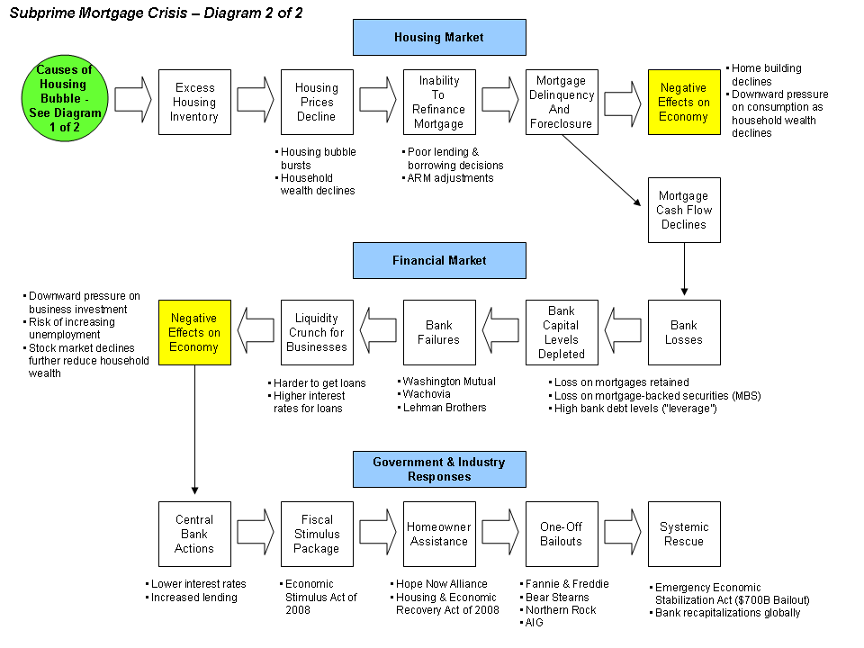

## Table of Contents

## What is financial contagion?

Financial contagion is when problems in one part of the financial system spread to other parts, like a sickness spreading from person to person. It often starts in one country or market and then moves to others, causing trouble for banks, businesses, and people everywhere. This can happen quickly because the world's financial systems are all connected. When people lose trust in one place, they might start pulling their money out of other places too, making the problem bigger.

For example, if a big bank in one country fails, it might make people worried about banks in other countries. They might take their money out of those banks too, even if those banks are okay. This can lead to more bank failures and make the whole financial system shaky. Governments and financial leaders try to stop financial contagion by working together and taking steps to calm things down, like giving loans to banks or making new rules to make the system stronger.

## How does financial contagion spread during an economic crisis?

Financial contagion spreads during an economic crisis mainly through the connections between different parts of the financial world. Imagine a big web where banks, businesses, and countries are all linked together. If one part of this web starts to have problems, like a bank going bankrupt or a country facing a big debt crisis, the trouble can move quickly to other parts. This happens because when people see trouble in one place, they might start to worry about similar problems in other places. They might pull their money out of banks or stop investing in certain countries, which can make the crisis spread.

For example, if a big bank in one country fails, people might start to think that other banks, even in different countries, could fail too. They might rush to take their money out of those banks to keep it safe, which can cause more banks to struggle. This can lead to a chain reaction where the crisis grows bigger and bigger. Governments and financial leaders try to stop this from happening by working together to support banks and calm people down, but it can be hard to stop once it starts.

## Can you explain the difference between direct and indirect financial contagion?

Direct financial contagion happens when problems in one part of the financial system spread directly to another part because they are closely linked. Imagine two banks that often do business with each other. If one bank goes bankrupt, it might not be able to pay back the money it owes to the other bank. This can cause the second bank to have trouble too, and maybe even go bankrupt itself. This kind of contagion is easier to see and track because the connection between the two parts is clear.

Indirect financial contagion is trickier because it spreads through less obvious connections. It happens when the trouble in one part of the system makes people lose trust and confidence in other parts, even if those parts aren't directly linked. For example, if a big bank fails, people might start to worry about all banks, not just the ones that did business with the failed bank. They might pull their money out of other banks, causing a broader crisis. This kind of contagion is harder to stop because it's driven by fear and uncertainty, which can spread quickly and unpredictably.

## What are some historical examples of financial contagion during economic crises?

One big example of financial contagion happened during the Asian Financial Crisis in 1997. It started in Thailand when the country's currency, the baht, crashed. People and businesses in Thailand had borrowed a lot of money in US dollars, but when the baht lost value, it became much harder for them to pay back those loans. This caused a lot of trouble in Thailand's banks and businesses. Soon, people in other countries in Asia, like South Korea and Indonesia, started to worry that the same thing could happen to them. They began pulling their money out of banks and selling off their investments, which made the crisis spread to those countries too.

Another famous example is the Global Financial Crisis of 2007-2008, which started in the United States. It began with problems in the housing market, where many people had taken out loans they couldn't afford to pay back. When these loans started to fail, it caused big trouble for banks and financial companies that had invested in them. As banks in the US started to fail, people around the world got worried. They started taking their money out of banks in Europe and other places, thinking that those banks might be in trouble too. This led to a worldwide financial crisis, where many countries faced economic problems because of the contagion from the US.

## How do banks and financial institutions contribute to the spread of financial contagion?

Banks and financial institutions can help spread financial contagion because they are all connected to each other. If one big bank gets into trouble, it might owe money to other banks. When that bank can't pay back what it owes, the other banks can start to have problems too. This is like a chain reaction where trouble in one bank spreads to others. For example, if a bank in one country fails, it might owe money to banks in other countries. Those banks might then struggle to get their money back, which can cause them to fail too.

Also, banks and financial institutions can spread financial contagion through the way they make people feel. When one bank has problems, people can start to worry about all banks. They might rush to take their money out of other banks, even if those banks are okay. This can cause more banks to fail because they don't have enough money to keep going. During the 2008 financial crisis, for example, when big banks in the US started to fail, people all over the world got scared and started pulling their money out of banks everywhere, making the crisis spread even more.

## What role do global financial markets play in the spread of financial contagion?

Global financial markets are like a big web where money and investments move around the world. If something bad happens in one part of this web, like a bank failing or a country having a big debt problem, it can affect other parts of the web too. This is because banks, businesses, and investors in different countries are all connected. When people see trouble in one place, they might start to worry about other places and pull their money out or stop investing. This can make the problem spread quickly from one country to another.

During the 2008 financial crisis, for example, problems started in the US with bad loans in the housing market. But because global financial markets are so connected, the trouble didn't stay in the US. People around the world got worried and started taking their money out of banks and selling their investments in other countries too. This made the crisis spread to Europe, Asia, and other places, turning it into a global problem. The way money and investments move around the world makes it easier for financial contagion to spread during an economic crisis.

## How can government policies and regulations mitigate the effects of financial contagion?

Governments can help stop financial contagion by making rules that make banks and financial systems stronger. They can tell banks to keep more money on hand so they can handle problems better. They can also check banks more often to make sure they are doing well. By having these rules, governments can catch problems early and stop them from spreading to other banks and countries. For example, after the 2008 financial crisis, many countries made new rules to make their banks safer and to stop big problems from happening again.

Another way governments can help is by working together with other countries. When a crisis starts in one place, other countries can step in to help calm things down. They can give loans to countries or banks that are in trouble, which can stop people from getting too worried and pulling their money out. Governments can also talk to each other and share information to keep an eye on the financial system and act quickly if they see trouble coming. By working together, they can make the whole world's financial system stronger and less likely to spread problems from one place to another.

## What are the economic indicators that signal the onset of financial contagion?

Economic indicators that signal the start of financial contagion often include sharp drops in stock markets. When people see the value of their investments falling fast, they might start to worry about the whole financial system. Another sign is when banks start to have trouble. If a bank goes bankrupt or needs help from the government, it can make people scared that other banks might have problems too. High levels of debt in a country or a business can also be a warning sign. If a country or a company has borrowed a lot of money and can't pay it back, it can cause a crisis that spreads to other places.

Another important indicator is when the value of a country's currency falls a lot. This can make it hard for people and businesses to pay back loans they took out in other currencies, leading to more problems. If people start taking their money out of banks and moving it to safer places, this can also be a sign that financial contagion is starting. This kind of behavior can make the crisis worse and spread it to other countries. By watching these signs, governments and financial leaders can try to stop the contagion before it gets out of control.

## How do international organizations like the IMF respond to financial contagion?

The International Monetary Fund (IMF) helps stop financial contagion by giving money to countries that are in trouble. When a country's economy is struggling, the IMF can give it loans to help it get back on its feet. This can stop people from getting too worried and pulling their money out of the country's banks, which can keep the problem from spreading to other places. The IMF also watches the world's economies closely and tells countries when it sees signs of trouble coming. By sharing this information, the IMF helps countries work together to stop financial contagion before it gets out of control.

Besides giving money, the IMF also gives advice to countries on how to make their financial systems stronger. It tells them what rules they should have to make sure their banks are safe and can handle problems. The IMF also helps countries work together to solve big financial problems. For example, during the 2008 financial crisis, the IMF worked with many countries to calm things down and stop the crisis from spreading even more. By doing these things, the IMF plays a big role in fighting financial contagion and keeping the world's financial system stable.

## What are the long-term impacts of financial contagion on economies?

Financial contagion can hurt economies for a long time. When a crisis spreads from one country to another, it can make people and businesses lose trust in banks and the financial system. This can lead to less spending and investing, which slows down the economy. Companies might have to lay off workers, and it can be hard for people to find new jobs. Also, if a country's currency loses value because of the crisis, it can make it more expensive to buy things from other countries. This can make life harder for people and businesses, and it can take years for the economy to get better.

Over time, financial contagion can also make it harder for countries to borrow money. If a country has had a big financial crisis, other countries and investors might be scared to lend it money again. This can make it harder for the country to pay for important things like schools and hospitals. Governments might have to cut back on spending, which can make life even tougher for people. But, if countries learn from the crisis and make their financial systems stronger, they can be better prepared for the next time trouble comes. This can help stop financial contagion from causing so much damage in the future.

## How can investors protect their portfolios from the risks of financial contagion?

Investors can protect their portfolios from financial contagion by spreading their money around. Instead of putting all their money in one place, like stocks in one country or one type of investment, they can invest in different things. This way, if one part of the world or one type of investment gets into trouble, the rest of their portfolio might be okay. It's like not putting all your eggs in one basket. By having a mix of investments, like stocks, bonds, and maybe even some money in other countries, investors can lower the risk that financial contagion will hurt their whole portfolio.

Another way investors can protect themselves is by staying informed and being ready to make changes. They should keep an eye on what's happening in the world's economies and financial markets. If they see signs of trouble, like big drops in stock markets or banks having problems, they can move some of their money to safer investments. This might mean buying things like government bonds or keeping some money in cash. By being ready to adjust their investments, investors can try to avoid the worst effects of financial contagion and keep their portfolios safer.

## What advanced models and theories are used to predict and analyze financial contagion?

Scientists and economists use different models and theories to predict and understand financial contagion. One popular model is called the "network model." It looks at the world's financial systems like a big web where banks, countries, and investors are all connected. By studying how money and investments move around this web, experts can see how problems in one place might spread to other places. Another model is the "stress test," which checks how well banks and financial systems can handle big problems. By running these tests, experts can find weak spots and predict where financial contagion might start.

Another important theory is the "herd behavior" theory. It says that when people see others getting worried and pulling their money out of banks or selling their investments, they might do the same thing even if they aren't sure why. This can make financial contagion spread faster because it's driven by fear and uncertainty. Economists also use something called "econometric models" to look at past data and find patterns that might help them predict future crises. By combining these models and theories, experts can better understand financial contagion and try to stop it before it gets too big.

## How do Algorithmic Trading and Economic Contagion relate to each other?

Algorithmic trading, commonly referred to as algo trading, employs sophisticated computer algorithms to execute trades rapidly based on predetermined instructions. This form of trading has revolutionized financial markets by significantly increasing trading speed and [volume](/wiki/volume-trading-strategy), while also enhancing market efficiency. However, the high-frequency nature of [algorithmic trading](/wiki/algorithmic-trading) systems can lead to notable market consequences during periods of financial stress, contributing to financial contagion.

Algorithmic trading systems analyze vast amounts of market data to identify trading opportunities within fractions of a second. The algorithms are designed to optimize trading outcomes based on strategies such as statistical [arbitrage](/wiki/arbitrage), [trend following](/wiki/trend-following), and market-making. This rapid automation can narrow bid-ask spreads and increase market [liquidity](/wiki/liquidity-risk-premium), benefiting investors by reducing transaction costs and providing continuous price discovery.

Despite these advantages, the reliance on algorithmic trading carries potential risks. The rapid execution and interconnected nature of trades can lead to systemic vulnerabilities, particularly during times of market [volatility](/wiki/volatility-trading-strategies). Automated trading systems are capable of triggering large volumes of trades independently, sometimes leading to unintended consequences. For instance, a sudden adverse price movement may activate a cascade of sell orders, exacerbating price declines and contributing to a market contagion effect. This type of scenario was vividly illustrated during the "Flash Crash" of May 6, 2010, when the U.S. stock market experienced a dramatic, albeit brief, drop in prices.

The amplification of market swings by algorithmic trading can be understood through feedback loops where initial price movements prompt automated responses that further intensify the movement. During a financial crisis, such feedback loops can propagate shocks across geographically separated markets, magnifying the impact and accelerating the spread of economic stress.

To better comprehend the potential effects of algorithmic trading on financial contagion, consider a simple mathematical model of a financial market where the price at time $t$, denoted $P(t)$, is influenced by both fundamental value changes and trader behavior. If algorithmic trading accounts for a significant portion of market volume, the price dynamics can be described by:

$$
P(t+1) = P(t) + \alpha (F(t) - P(t)) + \beta A(t)
$$

Here, $F(t)$ represents the market's fundamental value at time $t$, while $A(t)$ symbolizes the aggregate trading action by algorithms. The parameters $\alpha$ and $\beta$ denote the responsiveness of the price to fundamental value changes and algorithmic activities, respectively. During periods of volatility, high values of $\beta$ may result in significant price adjustments due to algorithm-driven trade execution, thereby influencing market stability.

Understanding these dynamics is crucial for developing strategies to mitigate the risks posed by algorithmic trading during financial crises. Regulatory frameworks and market infrastructure enhancements, such as the implementation of circuit breakers, can help dampen extreme fluctuations. Circuit breakers provide a pause in trading when market indices experience substantial movements, which can help curb the [momentum](/wiki/momentum)-driven trades triggered by algorithms.

Overall, while algorithmic trading has introduced efficiencies and innovations in financial markets, its influence on economic contagion necessitates careful regulatory oversight to safeguard the stability of global financial systems.

## References & Further Reading

[1]: Claessens, S., & Forbes, K. J. (Eds.). (2001). ["International Financial Contagion"](https://link.springer.com/book/10.1007/978-1-4757-3314-3). Springer.

[2]: Allen, F., Babus, A., & Carletti, E. (2011). ["Financial Connections and Systemic Risk."](https://www.nber.org/papers/w16177) Journal of Economic Perspectives, 25(1), 131-150.

[3]: Brunnermeier, M. K. (2009). ["Deciphering the Liquidity and Credit Crunch 2007-2008."](https://www.princeton.edu/~markus/research/papers/liquidity_credit_crunch.pdf) Journal of Economic Perspectives, 23(1), 77-100.

[4]: Johnson, B., & Zhang, L. (2020). ["Algorithmic Trading and the Role of High-Frequency Trading."](https://onlinelibrary.wiley.com/doi/full/10.1111/1475-679X.12540) The Journal of Finance, 75(3), 1459-1482.

[5]: Bookstaber, R. (2007). ["A Demon of Our Own Design: Markets, Hedge Funds, and the Perils of Financial Innovation"](https://archive.org/details/demonofourowndes0000book). Wiley.

[6]: Dornbusch, R., Park, Y. C., & Claessens, S. (2000). ["Contagion: Understanding How It Spreads."](https://www.jstor.org/stable/3986415) The World Bank Research Observer, 15(2), 177-197.

[7]: MacKenzie, D. (2014). ["A Sociology of Algorithms: High-Frequency Trading and the Shaping of Markets."](https://uberty.org/wp-content/uploads/2015/11/mackenzie-algorithms.pdf) Theory, Culture & Society, 31(6), 51-77.