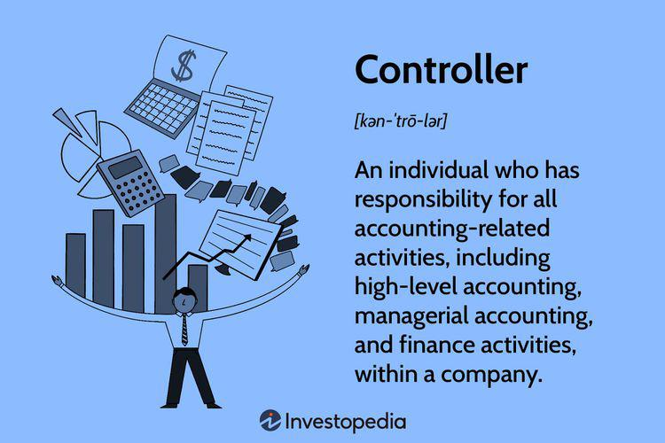

## Table of Contents

## What is a financial controller?

A financial controller is a person who helps a company manage its money. They make sure the company follows the rules about money and keeps good records. They also check the company's financial reports to make sure they are correct.

Financial controllers also help plan the company's budget. They work with other leaders in the company to decide how to spend money wisely. This helps the company stay healthy and grow.

## What are the primary roles of a financial controller in a company?

A financial controller's main job is to keep track of a company's money. They make sure all the money coming in and going out is recorded correctly. They also check that the company follows all the money rules and laws. This includes making sure the company's financial reports are accurate and honest.

Another big part of their job is helping to plan the company's budget. They work with other leaders to decide how to spend money in a smart way. This helps the company use its money to grow and stay healthy. They also look at the company's financial performance to see where it can improve.

Overall, a financial controller helps keep the company's finances in order. They play a key role in making sure the company can make good decisions about money. This helps the company succeed and reach its goals.

## What are the key responsibilities of a financial controller?

A financial controller's main job is to keep track of a company's money. They make sure all the money that comes in and goes out is written down correctly. They also make sure the company follows all the money rules and laws. This means they check the company's financial reports to make sure they are correct and honest. If there are any mistakes or problems, they fix them.

Another important part of their job is helping to plan the company's budget. They work with other leaders to decide how to spend the money wisely. This helps the company use its money to grow and stay healthy. They also look at how the company is doing financially to see where it can do better. This helps the company make smart decisions about money.

Overall, a financial controller helps keep the company's finances in order. They play a big role in making sure the company can make good choices about money. This helps the company succeed and reach its goals.

## What skills are essential for a financial controller to be effective?

A financial controller needs to be good at numbers and paying attention to details. They must know how to use accounting software and understand financial rules and laws. Being able to solve problems and think critically is important too. They often have to find mistakes in financial reports and fix them, so being careful and accurate is key.

Good communication skills are also essential for a financial controller. They need to explain financial information clearly to other people in the company, like managers and leaders. Working well with others is important because they often work with different teams to plan budgets and make financial decisions. Being organized and able to manage time well helps them keep up with all their tasks.

Lastly, a financial controller should be honest and ethical. They handle sensitive financial information, so trust is very important. They need to make sure the company follows the rules and does the right thing with its money. Being able to lead and guide other people in the finance team is also helpful.

## How does a financial controller differ from other financial roles like CFO or accountant?

A financial controller, a CFO (Chief Financial Officer), and an accountant all work with a company's money, but they have different jobs. A financial controller focuses on making sure the company's financial records are correct and that it follows all the money rules. They also help plan the company's budget and check its financial performance. A financial controller is like the person who keeps the money organized and makes sure everything is done right.

A CFO, on the other hand, is more like the big boss of the company's money. They make big decisions about how to spend the money and plan for the future. The CFO works with the financial controller and other leaders to make sure the company grows and stays healthy. They look at the big picture and help the company reach its goals. While the financial controller focuses on details, the CFO focuses on strategy and leadership.

An accountant is different because they focus on recording and reporting the company's financial transactions. They make sure all the numbers add up and prepare financial statements. Accountants work closely with the financial controller, who oversees their work and makes sure it's accurate. While the financial controller manages the overall financial operations, the accountant is more hands-on with the day-to-day numbers.

## What educational background is required to become a financial controller?

To become a financial controller, you usually need a strong educational background in finance or accounting. Most financial controllers have at least a bachelor's degree in accounting, finance, or a related field. This education helps them understand how to manage a company's money and follow financial rules. Some financial controllers also have a master's degree, like an MBA with a focus on finance or accounting, which can give them more advanced knowledge and skills.

In addition to a degree, many financial controllers become certified. A common certification is the Certified Public Accountant (CPA), which shows they have passed a tough exam and meet high standards in accounting. Other certifications, like the Certified Management Accountant (CMA) or Chartered Financial Analyst (CFA), can also be helpful. These certifications show that the financial controller has the skills and knowledge needed to manage a company's finances well.

## What certifications can enhance a financial controller's career?

Certifications can help a financial controller do their job better and move up in their career. One important certification is the Certified Public Accountant (CPA). To get this, a financial controller needs to pass a hard exam and meet certain standards. Having a CPA shows that they know a lot about accounting and can be trusted to handle a company's money well. This certification is very respected and can open up more job opportunities and higher pay.

Another helpful certification is the Certified Management Accountant (CMA). This certification focuses on management accounting, which is important for financial controllers who help plan budgets and make financial decisions. The CMA also requires passing an exam and meeting certain standards. It shows that a financial controller can help a company use its money wisely to grow and succeed. Some financial controllers also get the Chartered Financial Analyst (CFA) certification, which is good for understanding investments and financial analysis. Having these certifications can make a financial controller more valuable to their company and help them advance in their career.

## How can someone start a career as a financial controller?

To start a career as a financial controller, you need to get a good education first. Most financial controllers have a bachelor's degree in accounting, finance, or a related field. This helps them learn how to manage money and follow financial rules. Some also get a master's degree, like an MBA, which can give them more advanced skills. After getting their degree, many financial controllers become certified. A common certification is the Certified Public Accountant (CPA), which shows they know a lot about accounting and can be trusted with a company's money.

Once you have the right education and certifications, you can start working in finance. Many people begin their careers as accountants or financial analysts. This helps them gain experience and learn how to handle a company's finances. As they work, they can move up to higher positions, like becoming a financial controller. To do this, they need to show they can manage budgets, keep accurate financial records, and help the company make smart financial decisions. With hard work and the right skills, someone can build a successful career as a financial controller.

## What are the typical career progression paths for a financial controller?

Starting as a financial controller often begins with getting a degree in accounting or finance. After finishing school, many people start working as accountants or financial analysts. This helps them learn how to handle a company's money and follow financial rules. With experience, they can move up to become an assistant controller or a senior accountant. These roles give them more responsibility and help them learn how to manage budgets and financial reports.

As they gain more experience and skills, financial controllers can move up to higher positions. They might become the head of the accounting department or take on the role of a controller in a bigger company. Some financial controllers even become Chief Financial Officers (CFOs), where they help make big financial decisions and plan for the company's future. To reach these higher positions, they need to keep learning and maybe get certifications like CPA or CMA. With hard work and the right skills, a financial controller can have a successful career and move up the ladder in a company.

## What are the challenges faced by financial controllers in their role?

Financial controllers face many challenges in their job. One big challenge is keeping up with all the rules and laws about money. These rules can change often, so financial controllers need to stay updated and make sure their company follows them. They also have to make sure all the financial records are correct. This can be hard because there are so many numbers and details to check. If they miss something, it can cause big problems for the company.

Another challenge is working with different teams in the company. Financial controllers need to talk to managers and leaders about budgets and financial plans. They have to explain complicated financial information in a way that everyone can understand. This can be tough, especially when people have different ideas about how to spend money. Financial controllers also have to balance short-term needs, like paying bills, with long-term goals, like growing the company. This requires a lot of planning and problem-solving.

## How do financial controllers use technology and software in their daily tasks?

Financial controllers use technology and software every day to help them do their jobs better. They use accounting software to keep track of all the money coming in and going out of the company. This software helps them make sure all the numbers are correct and that they can create financial reports easily. They also use special tools to check if the company is following all the money rules and laws. These tools can find mistakes and help fix them quickly, which saves a lot of time and effort.

Another way financial controllers use technology is by using budgeting and planning software. This helps them work with other leaders to decide how to spend the company's money wisely. They can make different plans and see how each one might affect the company's future. Financial controllers also use data analysis tools to look at the company's financial performance. These tools help them find patterns and make smart decisions about where the company can improve. Using technology makes their job easier and helps them keep the company's finances in good shape.

## What are the future trends and developments that might impact the role of a financial controller?

In the future, technology will play a bigger role in the job of a financial controller. More companies will use artificial intelligence (AI) and automation to help with accounting and financial tasks. This means financial controllers will need to learn how to use these new tools. They will also need to focus more on analyzing data and making smart decisions based on what the data shows. This shift will help them find ways to improve the company's financial health and plan for the future.

Another trend is that financial controllers will need to know more about cybersecurity. As more financial information is kept online, it's important to keep it safe from hackers. Financial controllers will need to work with IT teams to make sure the company's financial data is secure. They will also need to stay updated on new rules and laws about data privacy. These changes will make their job more challenging, but also more important for keeping the company's money safe and sound.

## References & Further Reading

[1]: Bergstra, J., Bardenet, R., Bengio, Y., & Kégl, B. (2011). ["Algorithms for Hyper-Parameter Optimization."](https://papers.nips.cc/paper/4443-algorithms-for-hyper-parameter-optimization) Advances in Neural Information Processing Systems 24.

[2]: ["Advances in Financial Machine Learning"](https://www.amazon.com/Advances-Financial-Machine-Learning-Marcos/dp/1119482089) by Marcos Lopez de Prado

[3]: ["Evidence-Based Technical Analysis: Applying the Scientific Method and Statistical Inference to Trading Signals"](https://www.amazon.com/Evidence-Based-Technical-Analysis-Scientific-Statistical/dp/0470008741) by David Aronson

[4]: ["Machine Learning for Algorithmic Trading"](https://github.com/PacktPublishing/Machine-Learning-for-Algorithmic-Trading-Second-Edition) by Stefan Jansen

[5]: ["Quantitative Trading: How to Build Your Own Algorithmic Trading Business"](https://www.amazon.com/Quantitative-Trading-Build-Algorithmic-Business/dp/0470284889) by Ernest P. Chan