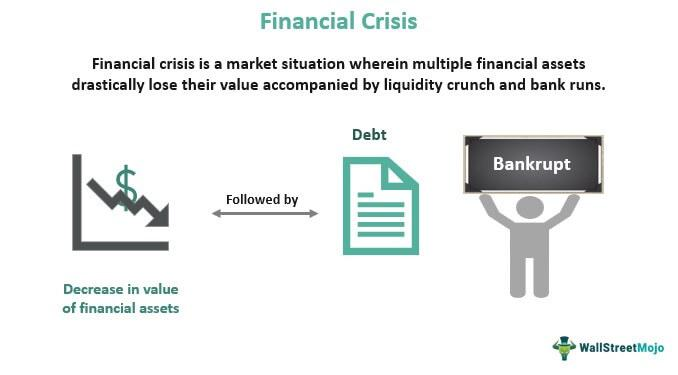

Economic downturns and financial crises have consistently shaped the landscape of global economies and markets throughout history. These events, which can occur due to a mix of asset bubbles, excessive risk-taking, and regulatory shortcomings, lead to far-reaching consequences, challenging economies to adapt and recover. In recent decades, the advent of technology, and more precisely, the rise of algorithmic or 'algo' trading, introduces an additional complexity to the dynamics of financial markets.

Algorithmic trading, which leverages complex algorithms to execute trades with extraordinary speed and volume, now plays a pivotal role in modern financial markets. This technology enhances the efficiency and liquidity of markets by facilitating rapid transactions and dissemination of market information. However, its potential to exacerbate systemic risks during periods of financial instability is a cause for concern. Algorithm-driven trades can create feedback loops that intensify market volatility, contributing to rapid price fluctuations and liquidity crises during downturns.



This article seeks to explore the underlying causes of financial crises and the role of algorithmic trading in deepening these economic challenges. By examining the interplay between these elements during economic downturns, we aim to provide insights into how market structures and participant behaviors can be better understood. Understanding these dynamics is vital for identifying effective strategies to mitigate associated risks and to enhance economic resilience.

Effective risk management and robust regulatory frameworks are essential in harnessing the benefits of algorithmic trading while minimizing its potential threats. As financial markets continue to evolve with technology, continuous monitoring and adaptive approaches are necessary to uphold financial stability and resilience. These efforts are essential in preparing for future financial challenges, ensuring that economies are equipped to withstand disruptions and recover more robustly.

## Table of Contents

## What Causes Economic Downturns and Financial Crises?

Economic downturns and financial crises are complex phenomena typically resulting from a confluence of factors such as asset bubbles, excessive risk-taking, regulatory failures, and contagion effects. These crises have significant impacts on financial markets and economies worldwide.

One of the primary causes is the formation of asset bubbles, where the prices of assets such as real estate or stocks inflate to unsustainable levels, driven largely by speculative investment. When these bubbles burst, they can lead to sharp declines in asset prices, severely affecting economic stability. The 2008 Global Financial Crisis (GFC) exemplifies this scenario, where a real estate bubble—fueled by subprime lending practices—burst and resulted in widespread financial turmoil. The crisis was exacerbated by complex financial derivatives that spread risks throughout the financial system, creating a domino effect as institutions faced massive losses.

Excessive risk-taking by financial institutions also contributes significantly to financial crises. In pursuit of higher returns, banks and investment firms often engage in risky financial practices without sufficient capital to cover potential losses. This behavior can lead to systemic vulnerabilities, as seen during the GFC, when many institutions underestimated the risks associated with mortgage-backed securities.

Regulatory failures compound these vulnerabilities, as inadequate oversight and lack of stringent regulatory frameworks allow risky financial behaviors to proliferate. The GFC highlighted the consequences of such failures, where insufficient regulation allowed banks to engage in risky lending and investment practices, contributing to the crisis's escalation.

Moreover, panic selling and loss of investor confidence can accelerate the onset and severity of financial crises. When investors perceive a significant threat to market stability or negative economic sentiment prevails, they may engage in panic selling, massively withdrawing investments. This behavior can lead to a rapid decline in market values and [liquidity](/wiki/liquidity-risk-premium), deepening the crisis.

External, unanticipated events, such as the COVID-19 pandemic, also play a significant role in escalating financial instability. The pandemic disrupted global supply chains, reduced consumer demand, and resulted in widespread economic contraction. Such disruptions can strain financial systems, reduce market confidence, and lead to an economic downturn.

Overall, the complex interplay of these factors can lead to severe economic downturns and financial crises. Addressing these requires comprehensive regulatory frameworks, informed risk management strategies, and proactive measures to mitigate systemic risks and enhance economic resilience.

## Algorithmic Trading: A Double-Edged Sword

Algorithmic trading utilizes advanced mathematical models and algorithms to execute trades at extraordinary speeds. This form of trading has become integral to contemporary financial markets, profoundly influencing how transactions are conducted. The rapidity and precision of [algorithmic trading](/wiki/algorithmic-trading) enhance market efficiency and liquidity under standard market conditions. This efficiency is achieved through quick price discovery, minimized bid-ask spreads, and the ability to process vast quantities of market data instantaneously.

However, in volatile markets, the very features that make algorithmic trading beneficial can also exacerbate systemic risks. During periods of extreme market movement, the speed and [volume](/wiki/volume-trading-strategy) of trades executed by algorithms can amplify price swings, leading to heightened market [volatility](/wiki/volatility-trading-strategies). The May 2010 'Flash Crash' serves as a prominent example of this phenomenon. On that day, the Dow Jones Industrial Average dramatically plummeted and recovered within minutes, partly due to high-frequency trading algorithms executing sell orders at rapid rates. This event illustrated how algorithms could contribute to a rapid and significant market sell-off followed by an equally swift recovery, all within a very short time frame.

Algorithmic trading has also been associated with practices like 'spoofing,' where traders place false orders to create deceptive impressions of demand or supply, thereby manipulating prices to their advantage. This practice was highlighted in cases such as the prosecution of traders who engaged in spoofing to influence market prices for their gain. Such manipulation not only undermines market integrity but can also trigger regulatory scrutiny and potential destabilization of financial systems.

To illustrate how algorithmic trading strategies function, consider a basic trading algorithm in Python:

```python
import numpy as np

def moving_average(data, window_size):
    weights = np.repeat(1.0, window_size)/window_size
    return np.convolve(data, weights, 'valid')

# Example trading strategy based on moving average
def trading_strategy(prices, short_window=40, long_window=100):
    short_ma = moving_average(prices, short_window)
    long_ma = moving_average(prices, long_window)

    signals = np.where(short_ma > long_ma, 1, 0)  # 1 for buy signal, 0 for sell
    return signals
```

This simple strategy uses moving averages to generate buy/sell signals, exemplifying the types of calculations that underpin more complex algorithmic trading systems. In practice, high-frequency traders employ far more sophisticated models, capable of adapting to market conditions in real-time.

Ultimately, while algorithmic trading provides numerous benefits under stable market conditions, its capacity to exacerbate volatility and facilitate market manipulation showcases its dual nature as both a tool for efficiency and a potential catalyst for instability. Understanding and managing these risks remain pivotal to leveraging algorithmic trading effectively.

## How Algorithmic Trading Influences Economic Downturns

Algorithmic trading, a potent catalyst in modern financial markets, possesses the capability to amplify the effects of economic downturns significantly. This is largely due to its inherent design, which allows trades to be executed in milliseconds based on pre-defined criteria. During periods of economic instability, these algorithms can hasten market corrections and initiate a cascade of automated sell-offs, exacerbating existing turmoil.

When markets are stressed, algorithmic systems might interpret rapidly decreasing prices as signals to sell, executing trades far quicker than human traders could. This reaction can result in a lack of liquidity, as assets are offloaded en masse, leaving fewer participants willing to buy at rapidly dropping prices. The consequence is heightened volatility, with price swings occurring more frequently and sharply.

A pivotal [factor](/wiki/factor-investing) in these scenarios is the feedback loop created by algorithmic trading. This loop emerges when algorithms, reacting to market conditions they partly create, exacerbate those conditions through further trading. For example, if an algorithm detects a downward trend and sells off assets, this action can amplify the fall, triggering other algorithms to sell in response to the worsening market conditions. This can potentially magnify even minor market anomalies, transforming them into significant downturns.

These dynamics highlight a key risk: errant algorithms can misinterpret market signals or react to false patterns, leading to inappropriate trading actions. An illustration of this effect was seen during the 2010 'Flash Crash', where massive automated trading led to a sudden and severe market drop, followed by an equally rapid recovery. The event underscored how algorithmic trading, if unchecked, could lead to unintended and destabilizing consequences.

To mitigate such risks, trading firms and regulators are increasingly focusing on incorporating safeguards such as circuit breakers, which halt trading if prices fluctuate too wildly, and implementing more sophisticated risk management strategies. Despite these measures, the inherent speed and reactivity of algorithmic systems mean they will remain a formidable force capable of influencing economic downturns. Understanding and adapting to these tendencies is crucial for maintaining market stability.

## Mitigating the Risks of Algo Trading in Financial Crises

Regulatory measures play a crucial role in mitigating the risks posed by algorithmic trading during financial crises. One of the key strategies is the implementation of circuit breakers and kill switches. Circuit breakers are pre-defined thresholds that temporarily halt trading in response to significant price movements within a short time frame, allowing markets to stabilize and preventing panic-induced mass sell-offs. For instance, if the value of a major index falls by a set percentage, trading can be paused, giving investors time to assess the situation more calmly. Kill switches provide an additional layer of security by allowing market operators or traders to instantly terminate all automated trading activities in the event of a suspected malfunction or market-threatening volatility.

Enhancing oversight and transparency of algorithmic trading entities is another crucial aspect of risk mitigation. This involves requiring firms to register their algorithms with regulatory bodies, ensuring that trading strategies are well-documented and subject to regular audits. By scrutinizing the algorithms, regulators can identify and address potentially destabilizing strategies, such as those that might engage in manipulative practices like spoofing, where false orders are used to deceive other market participants.

Developing robust risk management strategies is essential in this context. Financial institutions and individual investors alike must employ sophisticated tools to monitor and manage the risks associated with algorithmic trading. Advancements in [machine learning](/wiki/machine-learning) and [artificial intelligence](/wiki/ai-artificial-intelligence) enable the creation of predictive models that can assess market conditions and signal potential risks in real time. These models can be trained to recognize patterns indicative of market distress, allowing traders to adjust their positions accordingly.

Investor education plays a pivotal role in safeguarding against the adverse effects of algorithmic trading. By understanding the mechanics and implications of algorithmic systems, investors can make informed decisions and avoid knee-jerk reactions during turbulent market conditions. Educational initiatives can include workshops, webinars, and detailed guides that explain how algorithmic trading works, its risks, and how investors can protect themselves.

In conclusion, mitigating the risks of algorithmic trading in financial crises requires a multi-faceted approach. Regulatory measures such as circuit breakers and kill switches need to be complemented by enhanced oversight, transparent operations, advanced risk management strategies, and comprehensive investor education. Such an integrated approach can help harness the benefits of algorithmic trading while minimizing its potential threats during economic downturns.

## Conclusion

Algorithmic trading has emerged as a cornerstone of contemporary financial markets, transforming the landscape through its ability to process large volumes of transactions at unprecedented speeds. However, the role of algorithmic trading is a double-edged sword, particularly during economic downturns when its potential to exacerbate financial crises becomes apparent. Therefore, understanding the impacts of algorithmic trading during such periods is crucial for maintaining market stability.

The integration of algorithmic trading in financial systems necessitates robust risk management and regulatory frameworks. These measures are essential to harness the efficiencies and liquidity benefits that algorithmic trading provides while mitigating its risks. Implementing circuit breakers and kill switches, for instance, can act as preventive mechanisms to avert market crashes triggered by erratic algorithmic behaviors. Additionally, enhancing oversight and transparency for entities engaging in automated trading is critical. Such steps ensure accountability and help prevent manipulative practices like spoofing, which can destabilize markets.

As technology continues to advance, continuous monitoring and refinement of these frameworks must be prioritized. The rapid development of artificial intelligence and machine learning algorithms presents both opportunities and challenges in managing algorithmic trading's influence. A dynamic approach that evolves with technological advancements will be key to safeguarding financial systems. By fostering an adaptable regulatory environment and promoting ongoing research into the impacts of technological innovations on market dynamics, stakeholders can ensure financial stability and resilience in an ever-evolving economic landscape.

## References & Further Reading

[1]: Lewis, M. (2010). ["The Big Short: Inside the Doomsday Machine."](https://books.google.com/books/about/The_Big_Short_Inside_the_Doomsday_Machin.html?id=eParwQ0YdrcC) W. W. Norton & Company.

[2]: Johnson, H., & Kwok, C. (2010). ["Re-examining the Causes of the Flash Crash of 2010."](https://psycnet.apa.org/record/2010-17658-003) Journal of Trading, 8(1).

[3]: MacKenzie, D. A., & Spears, T. (2018). ["‘A Device for Being Able to Go Bankrupt’: The Invention of Credit Default Swaps."](https://journals.sagepub.com/doi/10.1177/0306312713517158) Economy and Society, 29(1).

[4]: Pasquariello, P. (2019). ["Financial Market Dislocations."](https://www.semanticscholar.org/paper/Financial-Market-Dislocations-Pasquariello/fca4b7e12f01f7bfd39c55f150daf67a9ff937c7) Review of Financial Studies, 32(3), 1111-1166.

[5]: Aldridge, I. (2013). ["High-Frequency Trading: A Practical Guide to Algorithmic Strategies and Trading Systems."](https://www.amazon.com/High-Frequency-Trading-Practical-Algorithmic-Strategies/dp/1118343506) Wiley. 

[6]: Hendershott, T., Jones, C. M., & Menkveld, A. J. (2011). ["Does Algorithmic Trading Improve Liquidity?"](https://onlinelibrary.wiley.com/doi/full/10.1111/j.1540-6261.2010.01624.x) The Journal of Finance, 66(1), 1-33.

[7]: Kirilenko, A. A., Kyle, A. S., Samadi, M., & Tuzun, T. (2017). ["The Flash Crash: The Impact of High-Frequency Trading on an Electronic Market."](https://onlinelibrary.wiley.com/doi/abs/10.1111/jofi.12498) The Journal of Finance, 72(6), 2773-2783.