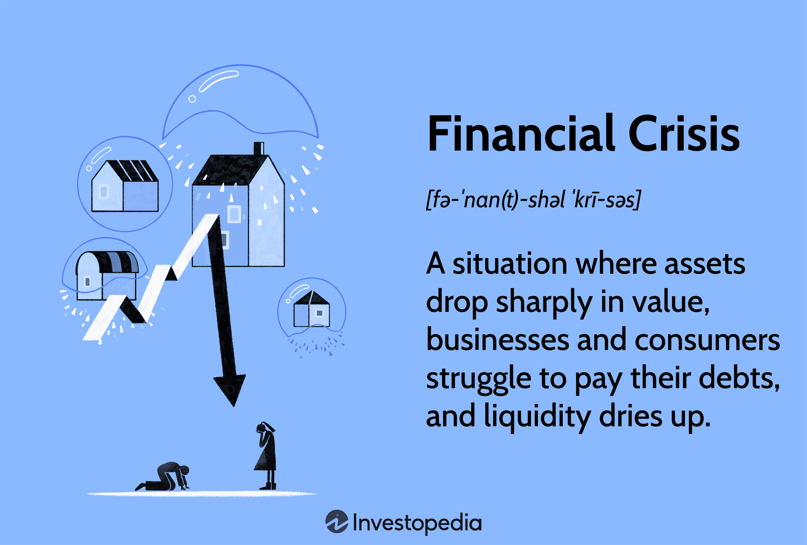

## Table of Contents

## What is a financial crisis?

A financial crisis is when the money system of a country or the world gets into big trouble. It happens when banks, businesses, and people can't pay back their loans, and they start to lose trust in the financial system. This can lead to a lot of problems, like people losing their jobs, businesses closing down, and the value of money going down.

During a financial crisis, it can be hard for people to get loans or money from banks. This is because banks are scared and want to keep their money safe. Governments and big organizations often step in to try and fix things, but it can take a long time for everything to get back to normal. A financial crisis can affect everyone, not just the people directly involved, and it can take years for a country or the world to recover.

## What are the common causes of financial crises?

Financial crises often start because of too much borrowing and risky investments. When people, businesses, and even banks borrow a lot of money, they hope to make more money from their investments. But if those investments fail, they can't pay back their loans. This can cause a chain reaction where everyone starts to worry and tries to get their money back from the banks at the same time. Banks might not have enough money to give back to everyone, which makes the situation worse.

Another common cause is when the value of things like houses or stocks goes up a lot, then suddenly drops. People might borrow money to buy these things, thinking the prices will keep going up. But if the prices fall, they lose money and can't pay back their loans. This can lead to a lot of people selling their houses or stocks at the same time, making the prices drop even more. Governments and banks can also make things worse if they don't keep a close eye on the economy and make rules to stop risky behavior.

Sometimes, problems in one country can spread to others because the world's economies are connected. For example, if a big country has a financial crisis, it can affect other countries that do business with it. This can lead to a global financial crisis where many countries face the same problems at the same time. Keeping the economy stable is hard, and it needs careful planning and rules to avoid these crises.

## Can you explain the role of banks in financial crises?

Banks play a big role in financial crises. They lend money to people and businesses, and they also keep people's money safe. When too many people can't pay back their loans, banks can get into trouble. This is because banks use the money they get from loans to lend more money to others. If people start to worry and want to take their money out of the bank all at once, the bank might not have enough money to give back to everyone. This is called a bank run, and it can make the financial crisis worse.

Banks can also make financial crises happen by taking too many risks. They might lend money to people or businesses that are not very safe bets, hoping to make more money. If these risky loans fail, the banks lose money and might not be able to pay back the people who put their money in the bank. When banks fail, it can scare everyone and make them lose trust in the whole financial system. Governments often have to step in to help the banks and stop the crisis from getting worse, but it can be hard to fix everything quickly.

## How do government policies contribute to financial crises?

Government policies can make financial crises happen if they don't keep a close eye on the economy. When governments don't set good rules for banks and businesses, they might take too many risks. For example, if the government lets banks lend a lot of money without checking if people can pay it back, it can lead to a lot of bad loans. If too many of these loans fail, it can start a financial crisis. Also, if the government doesn't stop risky behavior, like people borrowing too much money to buy houses or stocks, it can make prices go up too fast and then crash, causing a crisis.

Sometimes, governments can make things worse by not acting quickly enough when they see problems coming. If they wait too long to help banks that are in trouble or to fix the economy, the crisis can get bigger. On the other hand, if the government steps in too much and tries to control everything, it can also cause problems. For example, if they set interest rates too low for too long, it can make people borrow too much money and take more risks. So, finding the right balance in government policies is very important to stop financial crises from happening.

## What is the impact of global interconnectedness on financial crises?

Global interconnectedness means that what happens in one country can affect many others. When a big country has a financial crisis, it can spread to other countries because they do business with each other. For example, if a big bank in one country fails, it might owe money to banks in other countries. Those banks could then have trouble paying their own debts, causing problems to spread from one country to another. This is how a financial crisis can become a global crisis.

Because countries are so connected, it's harder for any one country to stop a financial crisis on its own. If many countries are facing the same problems at the same time, it can be very hard to fix. Governments and big organizations around the world have to work together to help each other and stop the crisis from getting worse. But even with everyone working together, it can take a long time for things to get back to normal because the problems are so big and spread out.

## What are some early warning signs of a financial crisis?

One early warning sign of a financial crisis is when a lot of people and businesses start to have trouble paying back their loans. This can happen if too many people borrowed money to buy things like houses or stocks, hoping the prices would keep going up. But if the prices start to drop, they can lose money and not be able to pay back what they owe. Banks might start to worry and stop lending as much money, making it harder for people to get loans.

Another sign is when there's a lot of worry and fear in the markets. You might see the stock market going up and down a lot, or people talking about how risky things are. If people start to lose trust in banks and the financial system, they might try to take their money out of the bank all at once. This can lead to a bank run, where the bank doesn't have enough money to give back to everyone. Governments and big organizations might start to talk about the problems and try to fix them before things get worse.

A third sign can be when the value of money starts to change a lot. If the price of things like food, gas, or houses goes up really fast, it can be a sign that the economy is getting out of control. Governments might try to stop this by changing interest rates or making new rules, but if they don't act quickly enough, it can lead to a bigger problem. Keeping an eye on these signs can help people and governments try to stop a financial crisis before it gets too big.

## How can financial crises be prevented or mitigated?

To prevent or mitigate financial crises, governments and banks need to be careful and make good rules. They should keep a close eye on the economy and stop people and businesses from taking too many risks. For example, banks should check if people can pay back their loans before lending money. Governments can also set rules to stop the prices of things like houses or stocks from going up too fast. If they see problems coming, they should act quickly to fix them before they get worse. This can help stop a small problem from turning into a big crisis.

When a financial crisis does happen, governments and big organizations need to work together to fix it. They can help banks that are in trouble and make sure people can still get loans. Sometimes, they might need to give money to people who lost their jobs or businesses that are struggling. It's important for everyone to stay calm and not panic, because fear can make the crisis worse. By working together and taking quick action, they can help the economy get back to normal faster and stop the crisis from spreading to other countries.

## Can you provide examples of major financial crises in history?

One big financial crisis was the Great Depression that started in 1929. It began in the United States when the stock market crashed. People lost a lot of money, and many banks failed because they couldn't give back the money people had put in them. This made people lose trust in banks and the whole economy. The crisis spread to other countries around the world, causing businesses to close and many people to lose their jobs. It took a long time, about ten years, for things to start getting better.

Another major financial crisis happened in 2007-2008 and is often called the Global Financial Crisis. It started in the United States because of problems with housing loans. Banks had given out too many loans to people who couldn't pay them back, and when house prices started to fall, it caused a big problem. The crisis spread quickly to other countries because the world's economies are connected. Many banks and businesses failed, and governments had to step in to help fix things. It took several years for the world to recover from this crisis.

These crises show how important it is for governments and banks to be careful and make good rules to stop problems from getting too big. When things go wrong, it can affect everyone, not just the people directly involved, and it can take a long time to fix everything.

## What were the specific causes of the 2008 global financial crisis?

The 2008 global financial crisis started because of problems with housing loans in the United States. Banks gave out too many loans to people who couldn't pay them back. They thought house prices would keep going up, so they didn't worry about the risk. But when house prices started to fall, a lot of people couldn't pay their loans. This made the value of the loans drop, and banks lost a lot of money. Because banks had also sold these loans to other banks around the world, the problem spread quickly to other countries.

Another big cause was that banks were taking too many risks. They were borrowing a lot of money to make more loans and investments, hoping to make more money. But when the housing market crashed, they couldn't pay back their own loans. This made people lose trust in the banks, and many people tried to take their money out of the banks all at once. Governments had to step in to help the banks and stop the crisis from getting worse, but it took a long time for things to get back to normal.

## How did the Asian Financial Crisis of 1997 unfold and what were its impacts?

The Asian Financial Crisis started in 1997 when Thailand's currency, the baht, lost a lot of its value. Thailand had borrowed a lot of money from other countries, and when people started to worry about the country's economy, they wanted their money back. This made the baht drop even more, and soon other countries in Asia like South Korea, Indonesia, and Malaysia started to have the same problems. Banks in these countries had also borrowed a lot of money, and when they couldn't pay it back, many of them failed. This made people lose trust in the banks and the whole financial system in Asia.

The crisis had a big impact on the people and economies of these countries. Many people lost their jobs, and businesses had to close down. The value of money went down, making everything more expensive. Governments had to ask for help from big organizations like the International Monetary Fund (IMF) to fix their economies. It took several years for these countries to recover, and they had to make a lot of changes to stop the same thing from happening again. The crisis also showed how connected the world's economies are, because it affected countries far away from Asia too.

## What are the long-term economic effects of financial crises on a country?

Financial crises can have big effects on a country's economy for a long time. After a crisis, it can take years for the economy to get back to normal. Many people lose their jobs, and it's hard for them to find new ones. Businesses might close down because they can't make money, and it's tough for new businesses to start up. Banks might be scared to lend money, making it hard for people to buy houses or start businesses. All of this can slow down the economy and make it hard for the country to grow.

Governments often have to spend a lot of money to help fix things after a financial crisis. They might give money to people who lost their jobs or help banks that are in trouble. This can lead to big debts for the government, which can take a long time to pay back. The crisis can also make people lose trust in the financial system, so they might save more money and spend less. This can keep the economy from growing as fast as it could. Over time, countries can learn from the crisis and make new rules to stop it from happening again, but the effects can last for many years.

## How do financial crises influence global economic policies and regulations?

Financial crises make countries and big organizations around the world think about how to stop them from happening again. After a big crisis, governments often make new rules to make sure banks and businesses don't take too many risks. They might set up groups to watch the economy more closely and stop problems before they get too big. For example, after the 2008 global financial crisis, many countries made new laws to make banks keep more money in case of trouble and to check if people can pay back their loans before giving them money. These rules help make the financial system safer and more stable.

These crises also show how connected the world's economies are. When one country has a big problem, it can affect others, so countries have to work together to fix things. Big organizations like the International Monetary Fund (IMF) and the World Bank help countries that are in trouble and make rules that everyone should follow. They might give money to countries that need it and help them make their economies stronger. By working together and learning from past crises, countries can make the world's economy more stable and stop big problems from happening again.

## References & Further Reading

[1]: Lewis, M. (2010). ["The Big Short: Inside the Doomsday Machine."](https://books.google.com/books/about/The_Big_Short_Inside_the_Doomsday_Machin.html?id=eParwQ0YdrcC) W. W. Norton & Company.

[2]: Johnson, H., & Kwok, C. (2010). ["Re-examining the Causes of the Flash Crash of 2010."](https://psycnet.apa.org/record/2010-17658-003) Journal of Trading, 8(1).

[3]: MacKenzie, D. A., & Spears, T. (2018). ["‘A Device for Being Able to Go Bankrupt’: The Invention of Credit Default Swaps."](https://journals.sagepub.com/doi/10.1177/0306312713517158) Economy and Society, 29(1).

[4]: Pasquariello, P. (2019). ["Financial Market Dislocations."](https://www.semanticscholar.org/paper/Financial-Market-Dislocations-Pasquariello/fca4b7e12f01f7bfd39c55f150daf67a9ff937c7) Review of Financial Studies, 32(3), 1111-1166.

[5]: Aldridge, I. (2013). ["High-Frequency Trading: A Practical Guide to Algorithmic Strategies and Trading Systems."](https://www.amazon.com/High-Frequency-Trading-Practical-Algorithmic-Strategies/dp/1118343506) Wiley. 

[6]: Hendershott, T., Jones, C. M., & Menkveld, A. J. (2011). ["Does Algorithmic Trading Improve Liquidity?"](https://onlinelibrary.wiley.com/doi/full/10.1111/j.1540-6261.2010.01624.x) The Journal of Finance, 66(1), 1-33.

[7]: Kirilenko, A. A., Kyle, A. S., Samadi, M., & Tuzun, T. (2017). ["The Flash Crash: The Impact of High-Frequency Trading on an Electronic Market."](https://onlinelibrary.wiley.com/doi/abs/10.1111/jofi.12498) The Journal of Finance, 72(6), 2773-2783.