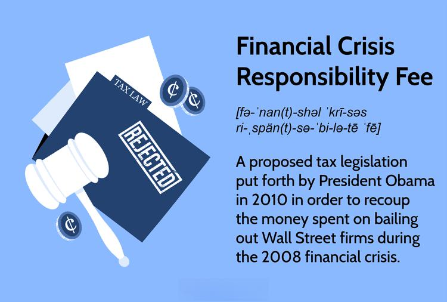

The financial landscape has been repeatedly shaped by crises, each leaving a legacy of heightened awareness and a call for reform. These events spotlight the sectors involved, notably the banking industry, whose operations are critical to maintaining economic stability. A significant turning point in recent history was the 2008 financial crisis, which underscored systemic vulnerabilities linked to irresponsible lending practices and the failure of major financial institutions. This debacle not only triggered a global economic downturn but also led to introspection about the role of financial intermediaries.

In the wake of the 2008 meltdown, there was a proposal known as the Financial Crisis Responsibility Fee, designed to address the financial burden on taxpayers who funded bailouts like the Troubled Asset Relief Program (TARP). This proposal reflected growing concerns over moral hazard and the necessity to hold financial institutions accountable for their risk-laden ventures. Although this fee was never implemented, its consideration marks a critical point in discussing financial accountability.

Furthermore, the advent and proliferation of algorithmic trading have fundamentally altered financial markets. These automated systems offer unprecedented efficiency and speed in executing trades, yet they also introduce substantial risks, including heightened volatility and the potential for systemic failures during crises. Understanding these dynamics is crucial for crafting regulations that can mitigate future financial upheavals.

Complementing these discussions is the debate over financial taxation as a mechanism to prevent future crises. Tax proposals aim to foster accountability in financial institutions, ensuring they're not shielded from the repercussions of their strategies. Such measures seek to strike a balance between imposing regulations that uphold market integrity and avoiding stifling economic growth.

This article examines the multifaceted implications of financial crises, the responsibilities of banks, the transformative role of algorithmic trading, and the contentious debate over financial taxation. Through these lenses, we aim to understand how to forge a resilient financial system capable of withstanding future shocks and ensuring equitable risk-sharing among stakeholders.

## Table of Contents

## Understanding Financial Crises and Their Impact

Financial crises have been a recurring feature of the global economy, often leading to severe economic downturns and necessitating government interventions. These crises typically result from a combination of financial mismanagement, excessive risk-taking, and systemic vulnerabilities within financial systems. Historically, they have manifested as bank runs, stock market crashes, or currency devaluations, each leaving behind a trail of economic hardship.

The 2008 financial crisis stands as a landmark event in recent history, illustrating the profound impact a financial crisis can have on the global economy. Triggered by high-risk lending practices and the collapse of major financial institutions, the crisis led to a severe global recession. Central to the crisis were subprime mortgage loans, which were issued to borrowers with poor credit histories. Financial institutions had heavily invested in mortgage-backed securities, which plummeted in value as housing prices fell and mortgage defaults surged. This created a [liquidity](/wiki/liquidity-risk-premium) crisis, instigating panic in financial markets and a chain reaction of institutional failures.

The aftermath of the 2008 crisis was extensive, affecting economies worldwide and contributing to significant job losses, home foreclosures, and a decline in consumer wealth. The interconnectedness of the global financial system meant that the crisis's repercussions extended far beyond the United States, impacting Europe and other regions. Governments around the world responded with unprecedented interventions, including bailouts for banks, stimulus packages, and monetary policy adjustments aimed at stabilizing financial systems and fostering economic recovery.

In the years following the crisis, there has been a concerted effort by governments and international organizations to develop strategies to prevent similar occurrences. Regulatory frameworks have been strengthened, with measures such as the Basel III standards introduced to enhance the resilience of banking institutions by increasing capital requirements and liquidity coverage ratios. Additionally, there has been a shift towards more rigorous oversight of financial markets, aimed at curtailing the kind of risky behaviour that precipitated the 2008 crisis.

However, the quest for economic stability is ongoing. While steps have been taken to address the vulnerabilities exposed by the 2008 crisis, challenges persist. Complex financial products, systemic risks associated with interconnected global markets, and the rapid evolution of financial technologies continue to pose potential threats. Thus, understanding the causes and impacts of past financial crises remains crucial for policymakers and financial institutions as they work towards creating a more stable and secure financial environment.

## The Role of Banks in Financial Crises

Banks have long been the backbone of any functioning financial system, channeling savings into investments and providing liquidity to the economy. As financial intermediaries, banks are responsible for managing risks and ensuring the stability of the economy. However, their pivotal role also means that their failure can lead to severe economic repercussions, as exemplified by the 2008 financial crisis.

In 2008, a global financial meltdown was triggered by a handful of intertwined factors, including risky lending practices, speculative investments, and the securitization of subprime mortgages. The crisis was exacerbated by the collapse of major financial institutions, which were deemed "too big to fail." Consequently, governments worldwide had to intervene to prevent the crisis from spiraling into a more catastrophic economic downturn.

One significant measure taken was the introduction of the Troubled Asset Relief Program (TARP) in the United States. TARP was established to stabilize the financial system by purchasing distressed assets from banks and providing capital injections to prevent insolvencies. Through TARP, the U.S. Treasury allocated $700 billion to support embattled financial institutions, aiming to restore confidence and avert a deeper economic collapse.

Despite the immediate relief provided by TARP and similar bailout programs, these interventions sparked debates about accountability and the potential moral hazard they introduced. Moral hazard arises when entities are insulated from the risks associated with their actions, leading them to engage in more reckless behavior. In the context of bank bailouts, there is concern that rescuing failing banks without imposing stricter regulatory measures could encourage future imprudent risk-taking.

Critics argued that the lack of accountability measures allowed financial institutions to operate irresponsibly, knowing that they could rely on government support in times of trouble. This situation underscored the need for enhanced regulatory frameworks that would hold banks accountable for their actions and deter excessive risk-taking.

In response to these concerns, measures such as the Dodd-Frank Wall Street Reform and Consumer Protection Act were implemented in the United States. These regulations aimed to increase transparency, improve risk management, and reduce the probability of future crises by imposing stricter oversight on banks and financial markets.

The role of banks in financial crises remains a contentious issue, as policymakers continue to grapple with finding the right balance between providing necessary support during crises and ensuring that institutions uphold their responsibilities without exploiting systemic safety nets.

## The Financial Crisis Responsibility Fee: A Proposed Solution

In 2010, in the wake of the 2008 financial crisis, President Barack Obama introduced the Financial Crisis Responsibility Fee. This proposal was aimed at recouping the costs associated with the Troubled Asset Relief Program (TARP), a critical government initiative that provided financial support to shaky banks during the crisis. The primary objective of this fee was to ensure that the burden of financial rescues did not fall upon taxpayers but rather on the financial institutions that had benefitted from such support.

The Financial Crisis Responsibility Fee was designed as a financial levy on the largest banks and financial firms, primarily those with assets exceeding $50 billion. The idea was to target significant institutions that posed systemic risks to the financial system, which had been a major [factor](/wiki/factor-investing) in the economic downturn. The fee was expected to raise approximately $90 billion over a decade, helping offset the estimated $700 billion initially allocated to TARP. By imposing this fee, the administration sought to incentivize more responsible financial practices and discourage excessive risk-taking that could lead to future instability.

Despite its conceptual advantages, the proposal faced substantial obstacles and was never enacted. Its feasibility was debated extensively, with opponents arguing that such a tax could hinder economic growth and competitiveness of U.S. banks. Critics contended that the fee might be passed on to consumers in the form of higher fees or restricted credit access, thus negating its intended purpose. They also raised concerns about the potential for regulatory overreach and the economic impact on already recovering financial institutions.

Supporters of the fee highlighted its potential to enhance financial stability by promoting accountability among banks. They argued that ensuring these institutions contributed to the recovery of bailout costs was a fair approach to prevent moral hazard, where banks might otherwise engage in risky behavior under the assumption of government bailouts.

While the Financial Crisis Responsibility Fee was ultimately not implemented, it initiated significant dialogue on the need for mechanisms that balance financial innovation with systemic security. This debate continues to influence discussions on regulatory measures and taxation policies aimed at mitigating risks within the financial industry. Reference: [Obama's Financial Crisis Responsibility Fee Proposal](https://obamawhitehouse.archives.gov/the-press-office/background-administration-proposal-financial-crisis-responsibility-fee).

## Algorithmic Trading and Its Influence on Financial Markets

Algorithmic trading, a burgeoning strategy in modern finance, leverages advanced algorithms to execute trades rapidly and with precision. Utilizing sophisticated mathematical models and high-frequency trading systems, it allows traders to capitalize on marginal price discrepancies across various markets, ultimately optimizing execution speed and cost-efficiency. The advent of [algorithmic trading](/wiki/algorithmic-trading) has transformed financial markets by enhancing liquidity and tightening bid-ask spreads, thereby promoting more efficient market conditions.

Despite its advantages, algorithmic trading introduces significant risks, especially concerning market [volatility](/wiki/volatility-trading-strategies) and systemic threats. The "Flash Crash" of May 6, 2010, serves as a notable example, during which the Dow Jones Industrial Average plummeted nearly 1,000 points within minutes, before rapidly recovering. This incident highlighted the inherent dangers posed by high-frequency trading algorithms that can exacerbate market fluctuations during periods of unexpected stress.

The potential for market instability stems from algorithms' capacity to react instantaneously to market data, occasionally leading to a feedback loop of rapid buy and sell orders. This can culminate in a liquidity crisis as order [books](/wiki/algo-trading-books) dry up, forcing prices to nosedive or skyrocket. Moreover, the increased interconnectivity of global markets amplifies the potential impact of such fluctuations, as algorithms interact across international boundaries almost instantaneously.

To mitigate these risks, understanding the dynamics of algorithmic trading is crucial for regulators and market participants alike. Regulatory frameworks, such as circuit breakers, have been implemented to temporarily halt trading during excessive volatility, granting markets time to stabilize. Furthermore, ongoing research and monitoring of trading algorithms can ensure they do not inadvertently contribute to systemic risks.

In addition to real-time risk assessment, algorithmic trading demands robust post-trade analysis to identify potential areas of concern and refine trading strategies accordingly. By fostering collaboration between technologists, traders, and regulators, the financial industry can harness the benefits of algorithmic trading while safeguarding against its potential perils. Achieving this balance is essential for the continued evolution and stability of global financial markets.

## Taxing Financial Institutions: Debating Responsibility and Fairness

Imposing taxes on financial institutions, such as the proposed Financial Crisis Responsibility Fee, has sparked considerable debate about both fairness and economic repercussions. This proposal emerged following the 2008 financial crisis, with supporters advocating for its implementation to ensure that financial institutions, rather than taxpayers, bear the economic hardships associated with bailouts. By taxing these institutions, proponents argue for enhanced accountability among banks, encouraging them to adopt more prudent financial practices, and subsequently reducing the likelihood of future crises.

The rationale for imposing such taxes aligns with the principle of moral hazard, which suggests that when entities operate with the assumption that they will be rescued during times of distress, they may engage in riskier behaviors. By attaching a financial penalty to these actions, the proposed fee aims to mitigate excessive risk-taking by shifting some of the financial burdens back to the institutions benefiting from government aid. Moreover, the revenue generated by these fees could potentially offset the costs associated with government-backed rescue programs, alleviating the fiscal burden on taxpayers.

However, critics caution that imposing taxes on financial institutions could have adverse effects on economic growth. They argue that additional taxes might decrease the capital available for banks to lend, potentially stifling investment and economic expansion. Furthermore, such measures could lead to increased costs for consumers as institutions may pass on these expenses through higher fees or interest rates. There is also concern that the imposition of taxes might drive financial institutions to relocate their operations to jurisdictions with more favorable tax environments, thus undermining the domestic banking industry's competitiveness.

The balancing act between regulation and market freedom is central to this debate, highlighting the challenge policymakers face in designing effective regulatory frameworks. While ensuring financial stability and protecting taxpayers is paramount, maintaining an environment that stimulates economic growth and innovation is equally critical. Lawmakers must carefully consider the potential implications of taxes on financial institutions, exploring other avenues such as enhanced regulation and improved transparency to achieve a sustainable financial system.

The discussion remains open-ended, reflecting the complexities of modern financial systems where both stability and growth are valued. As policymakers navigate these challenges, they strive to craft solutions that draw lessons from past crises while addressing contemporary economic realities.

## Conclusion

The intersection of financial crises, banking responsibility, and algorithmic trading presents a multifaceted challenge for policymakers. Successfully navigating these issues demands a balanced approach that incorporates regulatory oversight without hindering economic growth and innovation. Financial crises often expose systemic weaknesses and the interconnectedness of global financial systems, necessitating a comprehensive strategy to mitigate risks.

In addressing banking responsibilities, it is essential for regulators to impose frameworks that ensure accountability and limit exposure to moral hazard. This involves formulating policies that both safeguard taxpayers and hold financial institutions accountable for reckless behavior. Implementing rigorous stress testing and robust capital holding requirements can help fortify banks against potential downturns.

Algorithmic trading, with its capacity to enhance market efficiency and liquidity, also introduces complexities such as heightened volatility and systemic threats. Crafting intelligent regulations that adapt to technological advancements without curbing the potential benefits of algorithmic trading is crucial. Regulators must prioritize transparency, enforce circuit breakers, and explore [machine learning](/wiki/machine-learning) tools to detect emerging risks proactively.

As discussions around financial responsibility and taxation persist, it is imperative to draw lessons from previous crises to foster a resilient financial system. Balancing market freedom with protective measures, refining risk management practices, and promoting financial literacy are pivotal strategies for future stability. Policymakers should remain vigilant, innovating within regulatory frameworks to ensure fair and safe financial markets.

## References & Further Reading

[1]: Gorton, G., & Metrick, A. (2012). ["Getting Up to Speed on the Financial Crisis: A One-Weekend-Reader's Guide."](https://www.nber.org/system/files/working_papers/w17778/w17778.pdf) Journal of Economic Literature, 50(1), 128-150.

[2]: Adrian, T., & Shin, H. S. (2010). ["Liquidity and leverage."](https://www.sciencedirect.com/science/article/pii/S1042957308000764) Journal of Financial Intermediation, 19(3), 418-437.

[3]: MacKenzie, D. (2014). ["A sociology of algorithms: High-Frequency Trading and the shaping of market landscapes."](https://uberty.org/wp-content/uploads/2015/11/mackenzie-algorithms.pdf) Theory, Culture & Society, 31(6), 105-123.

[4]: Haldane, A. G. (2011). ["The race to zero."](https://www.bis.org/review/r110720a.pdf) Bank of England.

[5]: Turner, A. (2009). ["The Turner Review: A regulatory response to the global banking crisis."](https://actuaries.org/CTTEES_TFRISKCRISIS/Documents/turner_review.pdf) Financial Services Authority.

[6]: Lopez de Prado, M. (2018). ["Advances in Financial Machine Learning."](https://www.amazon.com/Advances-Financial-Machine-Learning-Marcos/dp/1119482089) Wiley.