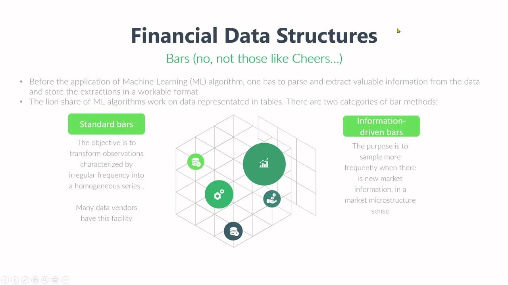

## Table of Contents

## What are financial data structures?

Financial data structures are ways to organize and store financial information so that it can be easily used and understood. They help in managing data related to money, like bank accounts, investments, and transactions. Think of them as special containers that keep financial data neat and organized, making it easier for people and computers to work with this information.

There are different types of financial data structures, each designed for specific purposes. For example, a ledger is a simple structure that records all financial transactions in a clear and chronological order. Another example is a portfolio, which organizes information about different investments someone might have, like stocks and bonds. These structures help financial professionals and individuals keep track of their money and make better decisions.

Using the right financial data structure can make a big difference. It helps in analyzing financial data quickly and accurately, which is important for tasks like budgeting, forecasting, and reporting. By organizing financial data effectively, people can see patterns and trends, manage their finances better, and plan for the future.

## Why are data structures important in finance?

Data structures are really important in finance because they help keep financial information organized and easy to use. Imagine trying to find a specific piece of information in a huge pile of papers. It would be really hard and take a lot of time. But if you have a good system to organize all that information, like using folders or a filing cabinet, you can find what you need quickly. In finance, data structures are like those folders and cabinets. They help store and sort information about things like bank accounts, investments, and transactions so that it's easier to manage and understand.

Another reason data structures are important in finance is that they make it possible to analyze financial data quickly and accurately. When financial information is organized well, it's easier to see patterns and trends. For example, if you want to know how your investments are doing over time, a well-organized data structure can help you see that information clearly. This helps people make better decisions about their money, like figuring out where to invest or how to budget. Good data structures save time and help make smart financial choices.

## What is the difference between a list and an array in financial data handling?

In financial data handling, a list and an array are both used to store collections of items, but they have some key differences. A list is more flexible and can grow or shrink as you add or remove items. This makes it easier to use when you're not sure how much data you'll be working with, like when you're collecting financial transactions over time. Lists are great for adding new data without having to worry about running out of space.

On the other hand, an array is fixed in size, which means you have to decide how many items it can hold from the start. This can be useful in finance when you know exactly how much data you'll need to store, like when you're working with a set number of accounts or investments. Arrays can be faster to access and process because their size doesn't change, which can be important for quick financial calculations and analysis.

## How can stacks and queues be used in financial transaction processing?

Stacks and queues are like special ways to organize financial transactions that can help make processing them easier. A stack is like a pile of papers where you can only add or take away the top paper. In finance, you might use a stack to keep track of transactions that need to be undone or reversed. For example, if you need to cancel a series of transactions, you can go back through the stack and undo them one by one, starting with the most recent transaction at the top.

A queue is different because it works like a line of people waiting for their turn. You add new transactions to the back of the line and process the ones at the front first. This can be useful in finance when you need to handle transactions in the order they came in, like processing payments or withdrawals from a bank account. Using a queue helps make sure everything is done fairly and in the right order, which is important for keeping financial records accurate and up to date.

## What role do trees play in organizing financial data?

Trees are like family trees but for financial data. They help organize information in a way that shows how different pieces of data are connected. Imagine a big tree with branches. The main branch at the top could be something like a company, and the smaller branches that come off it could be different departments or products. This helps people see how everything fits together and makes it easier to find specific information, like how much money a certain department is making.

In finance, trees can be used to sort out things like investment portfolios or company structures. For example, if you have a lot of investments, you can use a tree to group them by type, like stocks, bonds, and real estate. Each type can have its own branch, and within those branches, you can have even smaller branches for different companies or properties. This makes it easier to see how well each part of your portfolio is doing and helps you make better decisions about where to put your money.

## How are graphs used to model financial networks?

Graphs are like maps that show how different things in finance are connected. Imagine a graph as a bunch of dots (called nodes) with lines (called edges) connecting them. In finance, the dots can represent things like banks, companies, or investors, and the lines show how money or information moves between them. For example, if a bank lends money to a company, there would be a line between the bank dot and the company dot. This helps people see the whole financial network and understand how money flows through it.

Using graphs to model financial networks is really helpful for spotting risks and opportunities. If one part of the network, like a big bank, starts to have problems, you can see how it might affect other parts of the network. This can help prevent big financial problems from spreading. Also, graphs can show where there might be good chances to invest or do business, by looking at the connections and seeing where money is moving a lot. So, graphs are a powerful tool for understanding and managing financial networks.

## What is a hash table and how is it used in financial data storage?

A hash table is like a special kind of filing cabinet for storing financial data. It uses a clever trick called a "hash function" to turn each piece of data into a unique address. When you want to store something, like a bank transaction, the hash function figures out where in the cabinet it should go. This makes it really fast to find and store information because you don't have to search through everything; you just go straight to the right spot.

In finance, hash tables are great for keeping track of lots of different things quickly. For example, if you're a bank and you need to check if a customer's account number is real, a hash table can do that almost instantly. It's also useful for keeping records of transactions, making sure no two transactions have the same ID, and even for spotting fraud by quickly comparing new transactions to old ones. So, hash tables help make financial data storage and retrieval super efficient.

## Can you explain the use of heaps in financial analytics?

Heaps are like special piles of data that help with financial analytics. Imagine you have a bunch of numbers, like the daily profits of different stores. A heap can organize these numbers so that the biggest or smallest number is always at the top. This makes it easy to quickly find the highest or lowest value without looking through all the data. In finance, this can be really useful for things like finding the best-performing investment or the store with the lowest sales.

For example, if you're managing a portfolio of stocks, you might want to know which stock has the highest return at any given time. By using a heap, you can keep track of the returns and always have the top performer right at your fingertips. This helps in making quick decisions about where to invest more money or where to cut losses. Heaps make it easier to analyze financial data and react fast to changes in the market.

## How do financial institutions use databases to manage data?

Financial institutions use databases to keep track of all kinds of important information, like customer accounts, transactions, and investments. A database is like a big, organized filing system where they can store and find data quickly. For example, when a customer makes a withdrawal, the bank uses the database to check the account balance and update it right away. This helps them keep everything accurate and up to date, which is really important for managing money.

Databases also help financial institutions analyze data to make better decisions. They can use the data to see how well different products or services are doing, or to find patterns in customer behavior. For instance, a bank might look at the database to see which types of loans are most popular or to spot any unusual activity that could be fraud. By using databases, financial institutions can run smoothly and provide good service to their customers.

## What advanced data structures are used for high-frequency trading?

In high-frequency trading, traders use special data structures to handle lots of information very quickly. One of these is a "trie," which is like a tree that helps find words or numbers fast. In trading, a trie can help match buy and sell orders quickly by organizing them in a way that makes it easy to find the right price. Another useful data structure is a "skip list," which is like a list with shortcuts that let you jump over parts of it to find what you need faster. This is important in high-frequency trading because every second counts, and these data structures help traders make decisions and execute trades in the blink of an eye.

Another advanced data structure used in high-frequency trading is a "Bloom filter." It's like a quick way to check if something might be in a set of data without looking at everything. For example, a trader might use a Bloom filter to see if a certain stock is on a list of stocks they want to trade, without having to go through the whole list. This can save time and help traders react faster to market changes. By using these advanced data structures, high-frequency traders can process huge amounts of data and make quick, smart decisions to stay ahead in the fast-paced world of trading.

## How can blockchain be considered a data structure in financial applications?

Blockchain is like a special kind of data structure that's used a lot in finance, especially for things like cryptocurrencies. Imagine a long chain of blocks, where each block holds a bunch of information about transactions. In finance, these blocks can store details about money moving from one place to another. The cool thing about blockchain is that it's really hard to change or cheat the information once it's in there because every block is connected to the ones before and after it. This makes it a safe and reliable way to keep track of financial transactions.

In financial applications, blockchain helps make sure that records of money moving around are clear and can't be messed with easily. For example, when you send money using a [cryptocurrency](/wiki/cryptocurrency) like Bitcoin, the details of that transaction go into a block on the blockchain. Everyone who uses the same blockchain can see the transaction and check that it's real. This helps stop fraud and makes it easier for people to trust that the financial information is correct. So, blockchain is a powerful data structure that's changing how we handle money and keep it safe.

## What are some challenges and solutions in optimizing financial data structures for performance?

Optimizing financial data structures for performance can be tricky because financial systems often deal with huge amounts of data and need to work really fast. One big challenge is making sure the data can be accessed and updated quickly, especially in high-frequency trading where every millisecond counts. Another challenge is keeping the data safe and accurate, because mistakes or security breaches can cost a lot of money. Also, as more data comes in, the system needs to be able to handle it without slowing down, which can be tough.

To solve these problems, financial institutions use smart tricks. For example, they might use special data structures like heaps or tries to find and sort data quickly. They also use caching, which means keeping some of the most important data in a place that's easy to get to, so it doesn't slow things down. To keep data safe, they use techniques like encryption and blockchain, which make it hard for bad guys to mess with the information. And to handle more data, they might use things like distributed databases, which spread the data across different computers so it can be processed faster. By using these solutions, financial systems can work better and keep up with the fast pace of finance.

## References & Further Reading

[1]: Bergstra, J., Bardenet, R., Bengio, Y., & Kégl, B. (2011). ["Algorithms for Hyper-Parameter Optimization."](https://proceedings.neurips.cc/paper/2011/file/86e8f7ab32cfd12577bc2619bc635690-Paper.pdf) Advances in Neural Information Processing Systems 24.

[2]: ["Advances in Financial Machine Learning"](https://www.amazon.com/Advances-Financial-Machine-Learning-Marcos/dp/1119482089) by Marcos Lopez de Prado

[3]: ["Evidence-Based Technical Analysis: Applying the Scientific Method and Statistical Inference to Trading Signals"](https://www.amazon.com/Evidence-Based-Technical-Analysis-Scientific-Statistical/dp/0470008741) by David Aronson

[4]: ["Machine Learning for Algorithmic Trading"](https://github.com/stefan-jansen/machine-learning-for-trading) by Stefan Jansen

[5]: ["Quantitative Trading: How to Build Your Own Algorithmic Trading Business"](https://books.google.com/books/about/Quantitative_Trading.html?id=j70yEAAAQBAJ) by Ernest P. Chan