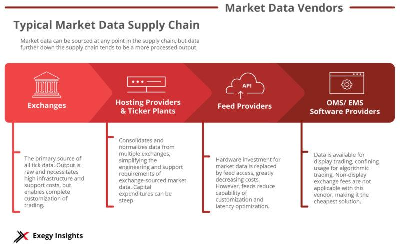

## Table of Contents

## What is a financial data vendor?

A financial data vendor is a company that collects, processes, and sells financial data to other businesses, investors, and financial institutions. This data can include stock prices, interest rates, economic indicators, and other financial information that helps people make decisions about investing and managing money. Financial data vendors gather this information from various sources like stock exchanges, government reports, and company financial statements, and then organize it in a way that is easy to understand and use.

These vendors play a crucial role in the financial industry because they provide the essential data that helps people make informed decisions. For example, a stock trader might use data from a financial data vendor to decide when to buy or sell stocks, while a financial analyst might use it to create reports and forecasts. By providing accurate and timely data, financial data vendors help keep the financial markets running smoothly and efficiently.

## What types of data do financial data vendors provide?

Financial data vendors provide a wide range of data that helps people in the finance world. This includes stock prices, which tell you how much a share of a company is worth at any given time. They also give out bond prices, which show the value of loans made to governments or companies. Another important piece of data is interest rates, which affect how much it costs to borrow money or how much you earn from saving it. Economic indicators, like unemployment rates or inflation, are also part of the data they offer. These numbers help people understand how well the economy is doing.

In addition to these, financial data vendors provide company financial statements. These are reports that show how much money a company is making or losing, and how much it owns or owes. They also offer data on commodities, like the prices of oil, gold, or wheat, which can be important for investors and businesses. Lastly, they might give out data on currencies, showing how much one country's money is worth compared to another's. All this data helps people make smart choices about where to put their money and how to manage it.

## How do financial data vendors collect and manage their data?

Financial data vendors collect data from many different places. They get information from stock exchanges, which tell them the prices of stocks and bonds. They also look at government reports to find out about things like unemployment rates and inflation. Sometimes, they get data straight from companies, like financial statements that show how much money a company is making or losing. To make sure the data is correct, they use special computer programs to check it and compare it with other sources.

Once they have collected all this data, financial data vendors need to organize it so that people can use it easily. They put the data into databases, which are like big digital filing cabinets. They use software to sort the data into categories, like stocks, bonds, or economic indicators. This way, when someone wants to look at stock prices, they can find it quickly. The vendors also update the data regularly to make sure it stays current. This helps people make good decisions with the most up-to-date information.

## What are some well-known financial data vendors in the market?

Some well-known financial data vendors are Bloomberg, Reuters, and S&P Global. Bloomberg is famous for its Bloomberg Terminal, which many people in finance use to get real-time data and news. Reuters, which is now part of Thomson Reuters, gives out a lot of financial news and data too. S&P Global is known for its credit ratings and also provides a lot of financial data and analytics.

Another popular vendor is Morningstar, which is really helpful for people looking at mutual funds and stocks. They give detailed reports and ratings that help people decide where to invest their money. FactSet is also a big name, and it's used a lot by investment professionals who need detailed data and analysis tools to make smart investment choices.

These companies play a big role in the finance world because they help people make good decisions with their money. They collect data from many places, check it to make sure it's correct, and then organize it so it's easy to use. This way, investors, financial analysts, and companies can get the information they need quickly and make the best choices.

## How can financial data vendors help in investment decision-making?

Financial data vendors help people make smart choices about investing by giving them lots of important information. They collect data like stock prices, interest rates, and economic indicators, and then organize it so it's easy to understand. When someone wants to invest their money, they can use this data to see which stocks are doing well or if it's a good time to buy or sell. For example, if a stock's price is going up and the company is making more money, it might be a good investment.

Financial data vendors also provide tools that help people analyze this data. These tools can show trends over time or compare different investments side by side. This makes it easier for investors to see the big picture and make better decisions. For instance, an investor might use these tools to see how a stock has performed compared to the overall market, helping them decide if it's a good buy. By giving people the right information and tools, financial data vendors help make investing less risky and more rewarding.

## What are the key factors to consider when choosing a financial data vendor?

When choosing a financial data vendor, it's important to think about what kind of data you need. Some vendors are really good at giving you stock prices and market data, while others might be better for economic indicators or company financial statements. You should also check if the data is accurate and up-to-date. It's no good if the data is wrong or old because it can lead to bad investment choices. Another thing to look at is how easy it is to use their tools and services. If the software is hard to understand, it might not be very helpful, even if the data is good.

Cost is another big [factor](/wiki/factor-investing). Some financial data vendors can be very expensive, so you need to think about whether you can afford their services and if they are worth the price. It's also a good idea to see what other people say about the vendor. Reviews and feedback can tell you if other users are happy with the data and the service. By considering these things, you can pick a financial data vendor that gives you the best information to help you make smart investment decisions.

## How do financial data vendors ensure the accuracy and reliability of their data?

Financial data vendors work hard to make sure their data is correct and reliable. They get their information from many different places, like stock exchanges and government reports. To check if the data is right, they use special computer programs. These programs compare the data with other sources to see if it matches. If there are any mistakes, they fix them before sharing the data with their customers. This way, people who use the data can trust that it's accurate and up-to-date.

Another thing financial data vendors do is update their data all the time. The financial world changes quickly, so they need to keep their information current. They do this by constantly collecting new data and making sure it's added to their databases right away. This helps people make good decisions with the most recent information. By doing all these things, financial data vendors make sure that the data they provide is both accurate and reliable.

## What are the common pricing models used by financial data vendors?

Financial data vendors use different ways to charge for their services. One common way is a subscription model. This means you pay a set amount every month or year to use their data. It's like paying for a magazine or a streaming service. This is good if you need to use the data all the time because you know exactly how much it will cost. Another way is a pay-per-use model. With this, you only pay for the data you actually use. It's like buying something from a store; you only pay for what you take. This can be cheaper if you don't need a lot of data, but it can be hard to predict how much you'll spend.

Some financial data vendors also use a tiered pricing model. This means they have different levels of service, and each level costs a different amount. The more you pay, the more data and tools you get. It's like choosing between different sizes of a product. This can be good if you need more advanced features or more data. Finally, there's the enterprise model, which is used for big companies. They might pay a big fee to get a lot of data and special services. This can be the best choice for businesses that need a lot of information and support.

## How do financial data vendors comply with regulatory requirements?

Financial data vendors make sure they follow the rules by doing a few important things. They know that different countries and places have their own laws about how to handle financial data. So, they learn about these rules and make sure they follow them. For example, they might need to keep customer information private or report certain data to the government. To do this, they set up special systems and checks to make sure everything is done right. They also train their employees to understand and follow these rules, so everyone knows what to do.

Another way financial data vendors comply with regulations is by working with government agencies and other groups that make the rules. They might join meetings or get certifications to show they are following the laws. If the rules change, they update their systems and processes to stay in line with the new rules. This helps them keep providing good data to their customers while also making sure they are doing everything by the book.

## What technological advancements are impacting the financial data vendor industry?

Technology is changing the way financial data vendors work. One big change is the use of [artificial intelligence](/wiki/ai-artificial-intelligence) (AI) and [machine learning](/wiki/machine-learning). These technologies help vendors gather and analyze data faster and more accurately. For example, AI can look at lots of data to find patterns and make predictions about the market. This makes it easier for investors to make smart choices. Another important advancement is cloud computing. It lets vendors store and share huge amounts of data online, so people can access it from anywhere at any time. This makes the data more useful and easier to use.

Another technology making a big difference is big data analytics. This lets financial data vendors handle and understand huge amounts of information quickly. They can look at data from many different places and see things that might be hard to notice otherwise. This helps them give better and more detailed information to their customers. Also, blockchain technology is starting to be used more. It can make sharing data safer and more transparent, which is really important in finance. These technological advancements are helping financial data vendors give better service and more accurate information to people who need it.

## How do financial data vendors integrate with other financial systems and tools?

Financial data vendors make their data work well with other financial systems and tools by using special technology called APIs, which stands for Application Programming Interfaces. APIs are like bridges that let different computer programs talk to each other. For example, a financial data vendor might have an API that lets a bank's software get the latest stock prices or economic data directly from the vendor's database. This makes it easier for people to use the data without having to switch between different programs.

Another way financial data vendors integrate with other systems is by making sure their data can be used in common software that financial professionals use. They might create special files or formats that can be easily imported into tools like Excel or financial analysis software. This way, an analyst can pull in data from the vendor and use it right away to make charts, reports, or do calculations. By doing these things, financial data vendors help make the whole process of using financial data smoother and more efficient for their customers.

## What future trends are expected to shape the financial data vendor industry?

In the future, the financial data vendor industry is expected to be shaped by several key trends. One big trend is the increasing use of artificial intelligence and machine learning. These technologies will help financial data vendors gather and analyze data even faster and more accurately. They will be able to find patterns and make predictions about the market, which will help investors make better choices. Another trend is the growth of cloud computing. This will allow vendors to store and share even more data online, making it easier for people to access it from anywhere. This will make the data more useful and easier to use.

Another important trend is the rise of big data analytics. This will let financial data vendors handle and understand huge amounts of information quickly. They will be able to look at data from many different places and see things that might be hard to notice otherwise. This will help them give better and more detailed information to their customers. Also, blockchain technology is expected to play a bigger role. It can make sharing data safer and more transparent, which is really important in finance. These trends will help financial data vendors give better service and more accurate information to people who need it.

## References & Further Reading

[1]: Bergstra, J., Bardenet, R., Bengio, Y., & Kégl, B. (2011). ["Algorithms for Hyper-Parameter Optimization."](https://papers.nips.cc/paper_files/paper/2011/hash/86e8f7ab32cfd12577bc2619bc635690-Abstract.html) Advances in Neural Information Processing Systems 24.

[2]: ["Advances in Financial Machine Learning"](https://www.amazon.com/Advances-Financial-Machine-Learning-Marcos/dp/1119482089) by Marcos Lopez de Prado

[3]: ["Evidence-Based Technical Analysis: Applying the Scientific Method and Statistical Inference to Trading Signals"](https://www.wiley.com/en-gb/Evidence+Based+Technical+Analysis:+Applying+the+Scientific+Method+and+Statistical+Inference+to+Trading+Signals-p-9780470008744) by David Aronson

[4]: ["Machine Learning for Algorithmic Trading"](https://www.amazon.com/Machine-Learning-Algorithmic-Trading-intelligence/dp/9918608013) by Stefan Jansen

[5]: ["Quantitative Trading: How to Build Your Own Algorithmic Trading Business"](https://www.amazon.com/Quantitative-Trading-Build-Algorithmic-Business/dp/0470284889) by Ernest P. Chan