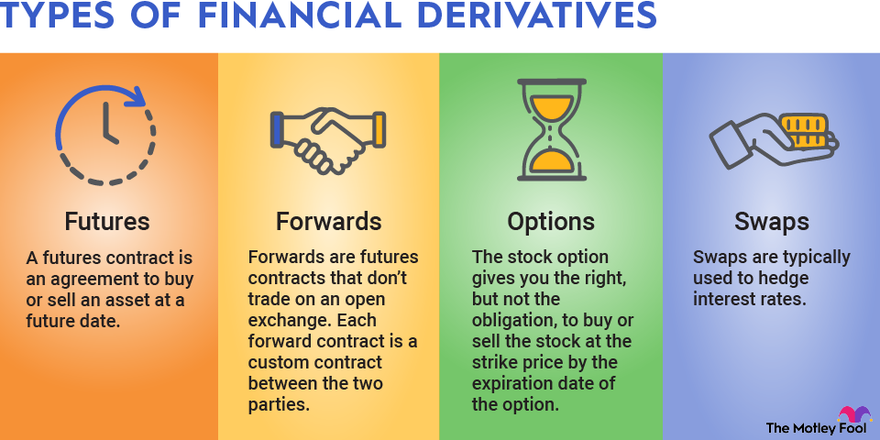

## Table of Contents

## What are financial derivatives?

Financial derivatives are like contracts that get their value from something else, like stocks, bonds, or even things like oil or gold. They are called "derivatives" because their value comes from, or is derived from, these other things. People use derivatives to manage risk or to try to make money by betting on whether the price of the thing they are based on will go up or down.

For example, if you think the price of oil is going to go up, you might buy a derivative that will pay you more if the price of oil does go up. This way, you don't have to buy actual oil, but you can still make money if your guess about the price is right. On the other hand, if you own a company that needs oil and you're worried the price might go up, you can use a derivative to protect yourself by locking in a price now, even if the actual price goes up later.

Derivatives can be very useful, but they can also be risky. Because they are based on predictions about the future, if those predictions are wrong, people can lose a lot of money. That's why it's important to understand them well before using them.

## What are the main types of financial derivatives?

The main types of financial derivatives are futures, options, swaps, and forwards. Futures are contracts to buy or sell an asset at a set price on a specific future date. They are traded on exchanges and are used by people who want to lock in prices for things like commodities or stocks. Options give the buyer the right, but not the obligation, to buy or sell an asset at a set price before a certain date. They are popular because they let people bet on price movements without having to actually buy the asset.

Swaps are agreements between two parties to exchange cash flows or other financial instruments. The most common type is an [interest rate](/wiki/interest-rate-trading-strategies) swap, where one party pays a fixed rate and the other pays a floating rate. Swaps are often used by companies to manage their exposure to changes in interest rates or currency values. Forwards are similar to futures but are private agreements between two parties, not traded on an exchange. They are customized and used to hedge against price changes in currencies, commodities, or other assets.

These derivatives serve different purposes but all help manage risk and speculate on future price movements. They can be complex and [carry](/wiki/carry-trading) risks, so it's important to understand them well before using them.

## How do financial derivatives work?

Financial derivatives are like special agreements that get their value from something else, like stocks, oil, or even interest rates. They work by letting people bet on what will happen to the price of that thing in the future. For example, if you think the price of gold will go up, you can buy a derivative that will pay you more if the price of gold does go up. This way, you don't have to buy actual gold, but you can still make money if your guess about the price is right. On the other hand, if you own a company that needs gold and you're worried the price might go up, you can use a derivative to protect yourself by locking in a price now, even if the actual price goes up later.

There are different types of derivatives, like futures, options, swaps, and forwards. Futures and forwards are agreements to buy or sell something at a set price on a future date. Options give you the right, but not the obligation, to buy or sell something at a set price before a certain date. Swaps are agreements to exchange cash flows or other financial instruments. All these derivatives help people manage risk or try to make money by betting on future price movements. They can be useful but also risky, so it's important to understand them well before using them.

## What are the purposes of using financial derivatives?

Financial derivatives are used mainly for two big reasons: to manage risk and to try to make money. When people or companies use derivatives to manage risk, they are trying to protect themselves from bad things that might happen in the future. For example, a farmer might use a derivative to lock in a price for their crops now, so they don't lose money if the price goes down later. This way, they can plan better and feel safer about the future.

The other big reason people use derivatives is to try to make money by betting on what will happen to prices in the future. If someone thinks the price of something, like oil or a stock, will go up, they can buy a derivative that will pay them more if they are right. This is like gambling, but instead of betting on a game, they are betting on prices. It can be risky because if they guess wrong, they can lose money, but if they guess right, they can make a lot of money.

## What are the risks associated with financial derivatives?

Using financial derivatives can be risky because they are based on guesses about the future. If your guess about what will happen to prices is wrong, you can lose a lot of money. For example, if you buy a derivative betting that the price of oil will go up, but it actually goes down, you will lose the money you spent on the derivative. This kind of risk is called market risk, and it's a big reason why people need to be careful when using derivatives.

Another risk is called counterparty risk. This happens when the person or company you made the derivative agreement with can't pay you what they owe. If they go bankrupt or run into other financial trouble, you might not get the money you were expecting. This can be a big problem, especially with derivatives like swaps and forwards, which are often private agreements between two parties.

There's also the risk that derivatives can be very complex and hard to understand. If you don't fully understand how a derivative works, you might use it in the wrong way and end up losing money. This is called operational risk. Because of all these risks, it's really important to learn about derivatives and think carefully before using them.

## How are financial derivatives priced?

Financial derivatives are priced based on what people think will happen to the price of the thing they are based on, like stocks or oil. The price of a derivative is like a guess about the future. For example, if a lot of people think the price of oil will go up, the price of a derivative that pays more if oil goes up will also go up. This guess about the future is called the "expected value," and it's a big part of how derivatives are priced.

Another important thing in pricing derivatives is how risky they are. If a derivative is very risky, like if it's based on something that can change a lot very quickly, people will want more money to take that risk. This extra money is called a "risk premium." So, the price of a derivative is made up of the expected value of what it will pay in the future, plus the risk premium that people want for taking the risk.

Sometimes, other things can affect the price of derivatives too, like how long you have to wait until the derivative pays out, or how easy it is to buy or sell the derivative. All these things together help decide how much a derivative is worth. It's like a puzzle where you have to think about the future, the risk, and other details to figure out the price.

## What is the role of financial derivatives in the economy?

Financial derivatives play a big role in the economy by helping people and companies manage risk. When businesses use derivatives, they can protect themselves from bad things that might happen, like if the price of something they need goes up a lot. For example, an airline might use derivatives to lock in the price of fuel, so they don't have to worry if fuel prices go up later. This helps companies plan better and makes the economy more stable because fewer businesses will go bankrupt if prices change suddenly.

Derivatives also help the economy by letting people bet on what will happen to prices in the future. This can bring more money into the economy because people are willing to take risks to try to make money. But, this can also make the economy less stable if a lot of people guess wrong and lose money. So, derivatives can be good for the economy by helping manage risk and bringing in money, but they can also be bad if they are used in the wrong way or if people don't understand them well.

## How do financial derivatives affect market stability?

Financial derivatives can help make markets more stable by letting people and companies manage risk. When businesses use derivatives to lock in prices, they protect themselves from big price changes. This means they can plan better and are less likely to go bankrupt if prices go up or down suddenly. For example, a farmer can use a derivative to set a price for their crops now, so they don't lose money if the price drops later. This kind of planning helps keep the economy steady because fewer businesses fail when prices change.

But, derivatives can also make markets less stable if they are used the wrong way. If a lot of people bet on prices and guess wrong, they can lose a lot of money. This can cause big problems in the economy, like what happened during the 2008 financial crisis when many people lost money on derivatives related to housing. So, while derivatives can help manage risk and make the economy more stable, they can also cause instability if people don't understand them well or if they take too many risks.

## What are some common strategies for trading financial derivatives?

People use different strategies when trading financial derivatives, depending on what they want to achieve. One common strategy is called hedging. Hedging is like buying insurance. If you own something and you're worried its price might go down, you can use a derivative to protect yourself. For example, if you own a lot of stocks and you're worried the stock market might crash, you can buy a derivative that will pay you more if the stock market does go down. This way, you won't lose as much money if your stocks go down in value.

Another strategy is called speculation. This is when people use derivatives to try to make money by betting on what will happen to prices in the future. For example, if you think the price of oil will go up, you can buy a derivative that will pay you more if the price of oil does go up. This can be risky because if you guess wrong and the price goes down instead, you can lose money. But if you guess right, you can make a lot of money.

Some people also use a strategy called [arbitrage](/wiki/arbitrage). This is when they find differences in prices between different markets and use derivatives to make money from those differences. For example, if the price of a stock is lower in one market than in another, you can buy the stock in the cheaper market and sell it in the more expensive market at the same time, using derivatives to lock in the price difference. This can be a way to make money with less risk than speculating, but it requires a lot of quick thinking and good information.

## What regulatory frameworks govern financial derivatives?

Financial derivatives are governed by rules and laws to make sure they are used fairly and safely. In the United States, the main law is the Dodd-Frank Act, which was passed after the 2008 financial crisis. This law created new rules to make derivatives markets more transparent and to reduce the risks they can cause. The Commodity Futures Trading Commission (CFTC) and the Securities and Exchange Commission (SEC) are the main agencies that watch over derivatives. They make sure that people trading derivatives follow the rules and that the markets work properly.

In Europe, the main regulation is called the European Market Infrastructure Regulation (EMIR). This law also aims to make derivatives markets safer and more transparent. It requires that certain derivatives be traded on exchanges and reported to trade repositories, so regulators can see what's happening in the market. Other countries have their own rules too, but the basic idea is the same: to keep the derivatives market safe and fair for everyone.

## How have financial derivatives evolved historically?

Financial derivatives have been around for a long time, but they have changed a lot over the years. They started a long time ago, even back in ancient times. For example, in ancient Greece, people used something called "option contracts" to bet on the future price of olive oil. But the big change came in the 1970s and 1980s when computers and new ideas made derivatives much more complex and popular. This was when things like futures, options, and swaps started to be used a lot more by banks and companies.

Since then, derivatives have grown a lot and become a big part of the financial world. They are now used all over the world to manage risk and try to make money. But this growth also brought new problems. The 2008 financial crisis showed that derivatives could be very risky if people didn't understand them well or used them in the wrong way. After that, governments made new rules to make the derivatives market safer and more transparent. Today, derivatives are still evolving, with new types being created and new ways to trade them being developed all the time.

## What are the latest trends and innovations in the financial derivatives market?

The financial derivatives market is always changing, and one of the latest trends is the use of technology like blockchain and smart contracts. Blockchain is like a digital record book that everyone can see but no one can change, and it's being used to make trading derivatives faster and safer. Smart contracts are like computer programs that automatically do things when certain conditions are met, and they can make derivatives work more smoothly without needing people to do everything by hand. These technologies are making it easier for people to trade derivatives and are helping to reduce the risks that come with them.

Another big trend is the growth of environmental, social, and governance ([ESG](/wiki/esg-investing)) derivatives. These are derivatives that are based on things like how much a company is helping the environment or how well it treats its workers. More and more people want to invest in companies that are good for the world, and ESG derivatives let them do that while also managing risk. This is a new way of using derivatives that is becoming more popular as people care more about making a positive impact with their money.

Innovations in the derivatives market also include new types of products, like volatility derivatives and digital asset derivatives. Volatility derivatives let people bet on how much prices will go up and down, not just which way they will go. Digital asset derivatives are based on things like cryptocurrencies, which are a new kind of money that exists only on the internet. These new types of derivatives give people more ways to manage risk and try to make money, but they can also be very risky because they are based on things that can change a lot very quickly.

## What are some investment strategies for risk management?

Investment strategies play a significant role in risk management by effectively balancing potential returns with inherent risks. One of the most fundamental strategies is diversification, which involves distributing investments across a variety of assets to minimize the risk associated with any single asset. For instance, if an investor holds a portfolio consisting of stocks, bonds, commodities, and real estate, a downturn in one sector can be offset by stability or gains in another, thereby reducing overall portfolio risk.

Position sizing is another crucial strategy that determines how much capital is allocated to each investment, helping to manage risk according to an investor's risk tolerance. This involves calculating the appropriate number of shares or contracts to purchase, such that the potential loss is acceptable with respect to the investor's risk appetite. A simple formula for position sizing might be:

$$
\text{Position Size} = \frac{\text{Risk per Trade}}{\text{Stop Loss Distance}}
$$

where "Risk per Trade" represents the dollar amount an investor is willing to risk on a single trade, and "Stop Loss Distance" indicates the difference between the entry price and the stop-loss price.

Stop-loss orders are automatic trading instructions set at a specific price level, designed to limit an investor's loss on a position. By selling a security when its price reaches a predetermined threshold, investors can cap their potential losses and protect their portfolio from significant declines. It's essential to set these orders carefully to strike a balance, avoiding premature exits on routine market fluctuations while protecting against substantial losses.

Regularly reviewing and adjusting these strategies is crucial as market dynamics evolve. Economic indicators, geopolitical events, and financial reports can alter market conditions rapidly, necessitating a flexible approach to investment strategies. Investors should consistently monitor their portfolios and make modifications when necessary to remain aligned with their financial goals and risk tolerance.

Incorporating these well-established investment strategies can provide a solid foundation for managing risks effectively, ensuring that portfolios are better positioned to withstand market [volatility](/wiki/volatility-trading-strategies) and achieve long-term objectives.

## What are Advanced Risk Management Techniques?

Value at Risk (VaR) is a widely used risk management technique employed to estimate the potential loss in the value of a portfolio over a specified period, given a certain confidence interval. VaR helps in identifying the extent of possible losses, thereby facilitating better risk control. The formula for calculating VaR can vary depending on the method chosen—parametric, historical simulation, or Monte Carlo simulation. In its parametric form, VaR is often represented as:

$$
\text{VaR} = \mu - z \sigma
$$

where $\mu$ is the expected return of the portfolio, $z$ is the z-score corresponding to the desired confidence level, and $\sigma$ represents the standard deviation of the portfolio's return.

Monte Carlo simulations are instrumental in stress-testing trading strategies by modeling the behavior of asset prices under various market scenarios. This method employs random sampling and statistical modeling to estimate the potential outcomes of an investment strategy, helping to uncover potential vulnerabilities in risk management frameworks. The process involves simulating a large number of possible future states of the world by generating random price paths for financial assets based on their historical data.

Given the massive volumes of news and social media content generated daily, Natural Language Processing (NLP) has become an essential tool in risk management. NLP techniques can analyze text data to discern market sentiment and uncover underlying risks. By processing vast amounts of unstructured data, NLP algorithms can identify trends, predict shifts in market conditions, and enhance decision-making. This technology allows traders and risk managers to gain insights into public opinion, emerging threats, and potential market-moving events.

Continuous learning and adaptation of algorithms are crucial to maintaining their effectiveness in an ever-changing market environment. Machine learning models can be trained to adapt over time, incorporating new data to refine their predictions and maintain their relevance. Algorithms that employ continuous learning can gradually adjust to changes in market conditions, regulatory landscapes, and economic indicators, ensuring they remain robust against unforeseen risks. This adaptability is especially important in high-frequency trading and other [algorithmic trading](/wiki/algorithmic-trading) applications, where the ability to quickly react to market dynamics is vital for preserving profitability and minimizing risk.

## References & Further Reading

[1]: Jorion, P. (2006). ["Value at Risk: The New Benchmark for Managing Financial Risk,"](https://link.springer.com/article/10.1007/s11408-007-0057-3) McGraw-Hill.

[2]: Tsay, R. S. (2010). ["Analysis of Financial Time Series,"](https://onlinelibrary.wiley.com/doi/book/10.1002/9780470644560) Wiley.

[3]: Glasserman, P. (2003). ["Monte Carlo Methods in Financial Engineering,"](https://link.springer.com/book/10.1007/978-0-387-21617-1) Springer.

[4]: Alexander, C. (2008). ["Market Risk Analysis, Volumes I-IV"](https://www.wiley.com/en-us/Market+Risk+Analysis%2C+Volume+IV%2C+Value+at+Risk+Models-p-9780470997888) Wiley.

[5]: Hull, J. C. (2017). ["Options, Futures, and Other Derivatives,"](https://www.semanticscholar.org/paper/Options%2C-Futures%2C-and-Other-Derivatives-Hull/89bdee500c8623864fc9eb7a471546aa713acc44) Pearson.